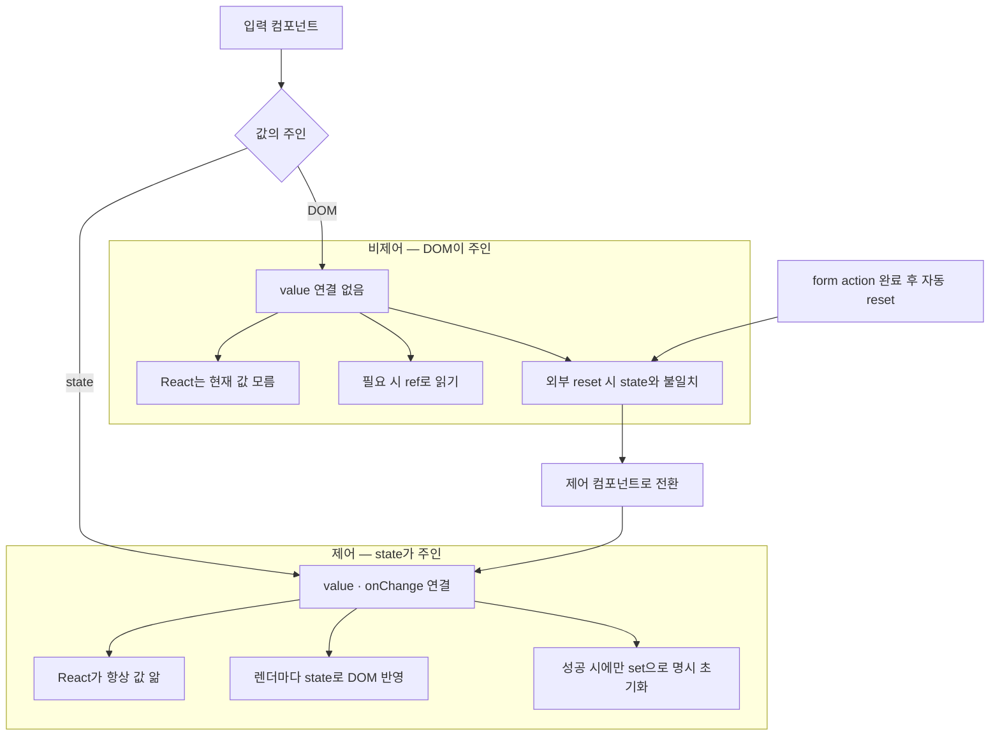

---
aliases:
  - controlled component
  - uncontrolled component
  - value onChange
tags:
  - React
related:
  - "[[00_JS_Ecosystem_HomePage]]"
  - "[[React_useFormStatus]]"
---

# React_ControlledInput — 제어 vs 비제어 컴포넌트

> [!info] 
> "제어(controlled)"는 입력값의 주인이 React state, "비제어(uncontrolled)"는 입력값의 주인이 DOM 자체다. 
> 비제어 인풋은 React가 그 값을 모르기 때문에, 폼이 외부 요인(예: action 완료 후 자동 reset)으로 비워지면 state와 화면이 서로 다른 값을 가리키는 불일치가 생길 수 있다.

---
# 흐름도



```txt
비제어는 DOM 주인 · 제어는 state 주인
action 후 자동 reset이면 비제어에서 화면과 state 불일치 — 제어로 전환
성공 시에만 set으로 state 초기화 · 실패 시 입력값 유지
```

---

# 제어 vs 비제어 — 누가 값의 주인인가 ⭐️⭐️⭐️⭐️

```tsx
// 비제어 — DOM이 값을 들고 있음, React는 모름
<input />

// 제어 — React state가 값을 들고 있음, DOM은 그걸 그대로 반영만 함
<input value={email} onChange={(e) => setEmail(e.target.value)} />
```

|구분|값의 주인|React가 현재 값을 아는가|
|---|---|---|
|비제어(uncontrolled)|DOM 자체|모름 — 필요하면 ref로 그 순간의 값을 읽어와야 함|
|제어(controlled)|React state|항상 안다 — value로 명시적으로 보여주는 값이기 때문|

```txt
둘 다 "틀린" 방식은 아님 — 단순히 값을 한 번만 읽으면 되는 폼(제출 시 ref.current.value만 보면 되는 경우)은
비제어로도 충분함. 문제는 "DOM이 React가 모르는 사이에 바뀌는 다른 이벤트"가 끼어들 때 생김
```

---

# 비제어가 위험해지는 상황 — DOM이 외부 요인으로 바뀔 때 ⭐️⭐️⭐️⭐️

```txt
비제어 인풋 자체는 평범한 폼에서는 별문제 없음
진짜 문제는 "내가 직접 건드린 적 없는데 DOM 값이 바뀌는" 상황이 생길 때임

실전 사례 — <form action={formAction}>(useActionState)이 끝나면 React가 폼을 자동으로 리셋함
  (이 자동 리셋 자체의 동작은 [[React_useFormStatus]] 참고)

  입력칸이 비제어라면:
    리셋 → DOM의 입력값만 비워짐
    그 값을 따로 들고 있던 state(있다면)는 안 비워짐
    → 화면(텅 빈 입력칸)과 state(예전 값)가 서로 다른 걸 가리키는 불일치 발생
```

```txt
제출 → action 실행 → { message: '에러' } return
     → React: "처리 끝" → form reset
     → 비제어 입력칸: DOM 값만 비워짐 (state는 그대로)
     → 화면과 state가 어긋난 상태로 남음
```

---

# 해결 — 제어 컴포넌트로 전환 ⭐️⭐️⭐️⭐️

```tsx
// Before — 비제어
<input name="nickname" />

// After — 제어: value/onChange를 명시적으로 연결
const [nickname, setNickname] = useState('');

<input
  name="nickname"
  value={nickname}
  onChange={(e) => setNickname(e.target.value)}
/>
```

```txt
제어 컴포넌트로 만들면, DOM이 무슨 이유로든(폼 자동 리셋 등) 값을 바꾸려고 해도
다음 렌더에서 React가 항상 value={nickname}(state)로 다시 그려버림
→ 결과적으로 "리셋되지 않는 것"처럼 동작함 — DOM이 아니라 state가 화면의 진짜 출처이기 때문
```

---

# 짝으로 필요한 변경 — 성공할 때만 리셋하기 ⭐️⭐️⭐️

```txt
입력칸을 제어로 바꾸기만 하면, 이제는 실패해도 "리셋이 안 되는" 상태가 됨 —
근데 성공했을 때는 폼을 비워주는 게 맞는 경우가 많음(다음 입력을 위해)

→ "리셋"을 React/DOM의 암묵적 자동 동작에 맡기지 말고,
  성공 분기에서만 setNickname('') 처럼 state를 직접 명시적으로 초기화하는 코드를 둘 것
  실패 분기에서는 아무것도 안 하면 — 입력값이 그대로 남아있어 사용자가 처음부터 다시 안 써도 됨
```

---

# 한눈에

| 개념        | 핵심                                                         |
| --------- | ---------------------------------------------------------- |
| 비제어 컴포넌트  | 값의 주인이 DOM — React는 모름, 필요하면 ref로 읽음                       |
| 제어 컴포넌트   | 값의 주인이 React state — value+onChange로 항상 동기화                |
| 위험해지는 시점  | DOM이 React 모르게 외부 요인으로 바뀔 때 (예: form action 완료 후 자동 reset) |
| 해결        | 입력칸을 제어로 전환 — state가 화면의 진짜 출처가 되게 함                       |
| 짝으로 필요한 것 | reset도 자동 동작에 맡기지 말고, 성공했을 때만 명시적으로 state 초기화              |