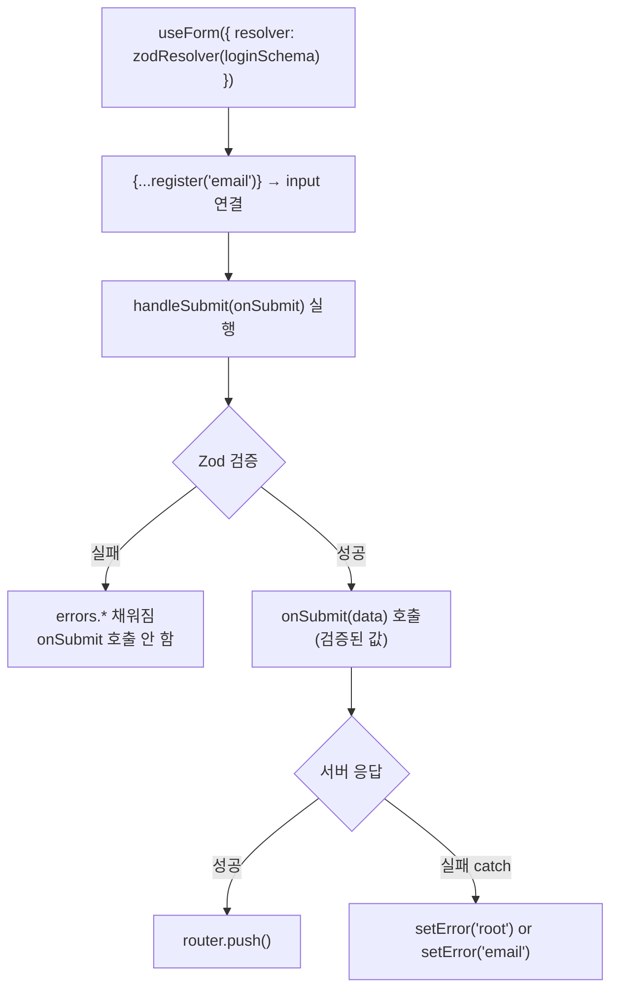

---
aliases:
  - Zod
  - 폼 검증
  - react-hook-form
  - isSubmitting
  - useForm
  - setValue
  - shouldDirty
  - shouldValidate
  - zodResolver
tags:
  - React
  - NextJS
related:
  - "[[00_JS_Ecosystem_HomePage]]"
  - "[[NestJS_DTO]]"
  - "[[JS_FormData]]"
  - "[[JS_Regex]]"
  - "[[React_Component]]"
---
# React_FormValidation — 폼 검증 (Zod + react-hook-form)

>[!info]
> 클라이언트 폼 처리 두 가지 패턴.
> **React 19 action**: 단순한 폼, 라이브러리 없이 가볍게.
> **Zod + react-hook-form**: 복잡한 검증 규칙, 필드별 에러, NestJS DTO 대칭.
> 제어 vs 비제어 컴포넌트 → [[React_Component#제어 vs 비제어 컴포넌트 — 입력값의 주인]]

---

# 설치 ⭐️⭐️⭐️

```bash
# Zod + react-hook-form + resolver 연결
pnpm --filter web add react-hook-form zod @hookform/resolvers

# Zod만 필요할 때 (서버, 유틸 등)
pnpm add zod
```

```txt
react-hook-form  = 폼 상태 관리 (register, errors, isSubmitting 등)
zod              = 스키마 정의 + 타입 추론 + 검증
@hookform/resolvers/zod = 둘을 연결하는 어댑터
```

---

# 패턴 선택 기준 ⭐️⭐️⭐️⭐️

| | React 19 form action | Zod + react-hook-form |
|--|:--------------------:|:---------------------:|
| 검증 복잡도 | 단순 (required, type) | 복잡 (min, email, refine) |
| 필드별 에러 표시 | ❌ 어려움 | ✅ |
| 타입 안전 | 수동 | ✅ z.infer 자동 추론 |
| NestJS DTO 대칭 | ❌ | ✅ |
| 라이브러리 | 없음 | react-hook-form + zod |

```txt
React 19 action + FormData:
  ✅ 검증 규칙이 단순할 때
  ✅ 라이브러리 없이 가볍게
  ❌ 복잡한 에러 메시지, 비번 확인 일치 등

Zod + react-hook-form:
  ✅ 복잡한 검증 + 필드별 즉각 에러
  ✅ NestJS DTO와 규칙 맞출 때
  ✅ isSubmitting, isDirty 등 풍부한 상태 관리
```

---

# React 19 form action 패턴 ⭐️⭐️⭐️⭐️

```txt
React 19부터 <form action={asyncFn}> 에 async 함수 직접 전달 가능
제출 시 FormData 자동으로 인자로 들어옴
e.preventDefault() 불필요
```

```typescript
'use client';
import { useState } from 'react';

export default function LoginPage() {
  const [error, setError] = useState<string | null>(null);

  async function login(formData: FormData) {
    const email    = formData.get('email');
    const password = formData.get('password');

    // formData.get() = string | File | null → 타입 좁히기 필요
    if (typeof email !== 'string' || typeof password !== 'string') {
      setError('입력을 확인해 주세요');
      return;
    }

    try {
      const data = await loginRequest(email, password);
      setSession(data.accessToken, data.user);
      router.push('/');
    } catch (err) {
      setError(err instanceof Error ? err.message : '로그인에 실패했습니다.');
    }
  }

  return (
    <form action={login}>
      <input name="email"    type="email"    required />
      <input name="password" type="password" required />
      {error && <p>{error}</p>}
      <button type="submit">로그인</button>
    </form>
  );
}
```

```txt
name 속성 = FormData의 키
  formData.get('email') → input[name="email"] 의 값

e.preventDefault() 없는 이유:
  form action={fn} 은 React가 제출을 가로채 fn(formData) 직접 호출
  브라우저 기본 동작 자동으로 막힘
```

---

# Zod — 스키마 검증 + 타입 추론 ⭐️⭐️⭐️⭐️

## 기본 타입

```typescript
import { z } from 'zod';

// 문자열
z.string()
z.string().min(1, '필수 항목입니다.')
z.string().min(8, '8자 이상이어야 합니다.')
z.string().max(20, '20자 이하로 입력해주세요.')
z.string().trim()
z.string().url('올바른 URL 형식이 아닙니다.')

// 이메일
z.email({ error: '올바른 이메일을 입력해주세요.' })          // Zod 4 권장
z.string().email('올바른 이메일 형식이 아닙니다.')            // Zod 3 스타일 (구식)

// 빈 값 + 이메일 형식 순서대로 체크
z.string()
  .trim()
  .min(1, '이메일을 입력해주세요.')
  .pipe(z.email({ error: '올바른 이메일을 입력해주세요.' }))
// .pipe() = 앞 스키마 통과 후 다음 스키마로 값 넘김

// 숫자
z.number().min(0).max(100)
z.number().int('정수만 입력 가능합니다.')

// 선택형
z.boolean()
z.enum(['user', 'admin'])
z.literal('active')

// 선택적 필드
z.string().optional()    // string | undefined
z.string().nullable()    // string | null
z.string().nullish()     // string | null | undefined
```

## z.object — 폼 스키마 정의 ⭐️⭐️⭐️⭐️

```typescript
const loginSchema = z.object({
  email:    z.email(),
  password: z.string().min(1, '비밀번호를 입력해주세요.'),
});
```

```txt
z.object({ 키: 스키마, ... }):
  폼의 input name과 키가 반드시 일치해야 함
  register('email') ↔ z.object({ email: ... }) — 이름이 같아야 연결됨

키가 다르면 검증이 적용 안 됨
```

## z.infer — 타입 자동 추론 ⭐️⭐️⭐️⭐️

```typescript
type LoginValues = z.infer<typeof loginSchema>;
// = { email: string; password: string }

// 스키마가 바뀌면 타입도 자동으로 따라 바뀜
// 따로 타입을 손으로 쓸 필요 없음
```

## 실전 스키마 — lib/schemas/auth.ts

```typescript
import { z } from 'zod';

const emailField = z
  .string()
  .trim()
  .min(1, '이메일을 입력해주세요.')
  .pipe(z.email({ error: '올바른 형식의 이메일을 입력해주세요.' }));

const passwordField = z
  .string()
  .min(1, '비밀번호를 입력해주세요.')
  .min(8, '비밀번호는 8자 이상이어야 합니다.');

export const loginSchema = z.object({
  email:    emailField,
  password: z.string().min(1, '비밀번호를 입력해주세요.'),
});

export const registerSchema = z.object({
  email:    emailField,
  password: passwordField,
  nickname: z.string().trim().min(2, '닉네임은 2자 이상이어야 합니다.'),
});

export type LoginValues    = z.infer<typeof loginSchema>;
export type RegisterValues = z.infer<typeof registerSchema>;
```

---

# react-hook-form — 폼 상태 관리 ⭐️⭐️⭐️⭐️

## useForm + zodResolver

```typescript
import { useForm } from 'react-hook-form';
import { zodResolver } from '@hookform/resolvers/zod';

const {
  register,      // input 필드 등록 (name, onChange, onBlur, ref)
  handleSubmit,  // 제출 핸들러 래퍼 — Zod 검증 후 onSubmit 호출
  formState,     // errors, isSubmitting, isDirty, dirtyFields ...
  setError,      // 수동 에러 설정 (API 에러용)
  setValue,      // 코드로 필드 값 직접 설정
  watch,         // 특정 필드 실시간 감시
  reset,         // 폼 초기화
} = useForm<LoginValues>({
  resolver:      zodResolver(loginSchema),
  defaultValues: { email: '', password: '' },
});

const { errors, isSubmitting, isDirty } = formState;
```

## formState — 주요 상태

| 상태 | 타입 | 의미 |
|------|------|------|
| `errors` | `FieldErrors<T>` | 필드별 에러 (Zod 메시지 또는 setError) |
| `isSubmitting` | `boolean` | handleSubmit의 async fn 실행 중 |
| `isDirty` | `boolean` | defaultValues와 하나라도 다른 필드 있으면 true |
| `dirtyFields` | `Partial<Record<keyof T, boolean>>` | 어떤 필드가 변경됐는지 |
| `isValid` | `boolean` | 현재 에러 없으면 true |
| `touchedFields` | `Partial<Record<keyof T, boolean>>` | 한 번이라도 건드린 필드 |

---

# 전체 예시 — 로그인 폼 ⭐️⭐️⭐️⭐️

```typescript
'use client';
import { useForm } from 'react-hook-form';
import { zodResolver } from '@hookform/resolvers/zod';
import { loginSchema, type LoginValues } from '@/lib/schemas/auth';

export default function LoginPage() {
  const router = useRouter();
  const {
    register,
    handleSubmit,
    setError,
    formState: { errors, isSubmitting },
  } = useForm<LoginValues>({
    resolver:      zodResolver(loginSchema),
    defaultValues: { email: '', password: '' },
  });

  const onSubmit = async (data: LoginValues) => {
    // 여기까지 왔으면 Zod 검증 이미 통과한 값
    try {
      const result = await login(data.email, data.password);
      router.push('/');
    } catch (err) {
      const message = err instanceof Error ? err.message : '로그인에 실패했습니다.';
      setError('root', { message });
    }
  };

  return (
    <form onSubmit={handleSubmit(onSubmit)}>
      <div>
        <input {...register('email')} type="email" placeholder="이메일" />
        {errors.email && <p>{errors.email.message}</p>}
      </div>
      <div>
        <input {...register('password')} type="password" placeholder="비밀번호" />
        {errors.password && <p>{errors.password.message}</p>}
      </div>
      {errors.root && <p>{errors.root.message}</p>}
      <button type="submit" disabled={isSubmitting}>
        {isSubmitting ? '로그인 중...' : '로그인'}
      </button>
    </form>
  );
}
```

```txt
{...register('email')}:
  name, onChange, onBlur, ref를 input에 한 번에 전달
  react-hook-form이 이 값을 추적

handleSubmit(onSubmit):
  1. Zod 검증 실행
  2. 실패 → onSubmit 호출 안 함, errors.* 자동으로 채워짐
  3. 성공 → onSubmit(data) 호출 — data는 검증된 값

isSubmitting:
  onSubmit의 async 함수가 끝날 때까지 true
  → 버튼 disabled 처리에 사용 (자동 관리)
```

---

# 내부 동작 흐름 ⭐️⭐️⭐️⭐️



---

# Zod(클라이언트) vs setError(서버) ⭐️⭐️⭐️⭐️⭐️

```txt
Zod / zodResolver = 클라이언트 게이트 (서버에 보내기 전)
  "이메일 형식이 맞는가", "비밀번호가 비어있지 않은가"
  → 실패 시 서버에 요청조차 안 함

setError in catch = 서버가 거절했을 때 UI에 에러 표시
  "이메일 또는 비밀번호가 일치하지 않습니다" (401)
  "이미 사용 중인 이메일입니다" (409)
  → 스키마 밖의 실패 → 수동으로 RHF 에러에 넣음
```

```typescript
const onSubmit = async (data: LoginValues) => {
  // Zod 통과 → 서버 요청
  try {
    await login(data.email, data.password);
  } catch (err) {
    const message = err instanceof Error ? err.message : '오류가 발생했습니다.';

    if (message.includes('이메일')) {
      setError('email', { message });   // errors.email → 필드 바로 아래 표시
    } else {
      setError('root', { message });    // errors.root  → 폼 공통 알림
    }
  }
};
```

| | setError 위치 | 표시 위치 |
|--|:---:|---|
| 특정 필드 에러 | `setError('email', ...)` | `errors.email.message` (input 아래) |
| 폼 전체 에러 | `setError('root', ...)` | `errors.root.message` (폼 공통) |

---

# setValue — 프로그래밍 방식 값 주입 ⭐️⭐️⭐️⭐️

```txt
유저가 직접 타이핑하지 않고
검색 결과 클릭, 외부 선택 등으로 필드 값이 결정될 때 사용
```

```typescript
setValue('tmdbId', movie.id, {
  shouldDirty:    true,  // isDirty = true → "수정됨" 표시
  shouldValidate: true,  // 즉시 Zod 검증 → errors 즉시 반영
});
```

## shouldDirty ⭐️⭐️⭐️⭐️

```txt
shouldDirty: true = "이 필드가 defaultValue와 달라졌다"고 RHF에 알림
→ formState.isDirty = true, dirtyFields 업데이트

유저가 직접 타이핑하면 RHF가 자동으로 dirty 처리
setValue()는 프로그래밍 방식 → 기본값(false)이면 isDirty 안 바뀜
→ 저장 버튼을 isDirty일 때만 활성화하는 패턴에서 필수
```

```typescript
<button type="submit" disabled={!isDirty}>저장</button>
// shouldDirty: false → setValue 후에도 버튼 비활성 유지
// shouldDirty: true  → setValue 후 버튼 활성화
```

## shouldValidate ⭐️⭐️⭐️⭐️

```txt
shouldValidate: true = setValue() 직후 Zod 검증 즉시 실행
→ formState.errors 즉시 업데이트

기본값(false)이면 잘못된 값을 setValue해도 errors에 안 나타남
→ 즉각 피드백이 필요할 때 true로 명시
```

```typescript
// shouldValidate 없음 → 에러 안 보임
setValue('tmdbId', null);

// shouldValidate: true → 즉시 검증
setValue('tmdbId', null, { shouldValidate: true });
// errors.tmdbId.message = 'tmdbId는 필수입니다.'
```

## 세 옵션 비교

| 옵션 | 의미 | 영향받는 상태 | 기본값 |
|------|------|:------------:|:------:|
| `shouldDirty` | "값이 바뀌었다" 표시 | `isDirty`, `dirtyFields` | `false` |
| `shouldValidate` | 즉시 검증 실행 | `errors` | `false` |
| `shouldTouch` | "건드렸다" 표시 | `touchedFields` | `false` |

## 실전 — 검색 결과로 hidden 필드 채우기

```typescript
const { register, setValue, formState: { errors, isDirty } } = useForm<FormValues>({
  resolver: zodResolver(schema),
  defaultValues: { title: '', tmdbId: 0 },
});

// hidden input으로 등록 (UI 없이 RHF가 추적)
<input type="hidden" {...register('tmdbId')} />

// 영화 검색 결과 클릭 시
function onSelectMovie(movie: Movie) {
  setValue('tmdbId', movie.id, {
    shouldDirty:    true,
    shouldValidate: true,
  });
}

{errors.tmdbId && <p>{errors.tmdbId.message}</p>}
<button type="submit" disabled={!isDirty}>저장</button>
```

```txt
register vs setValue:
  register('field')    → input에 spread → 유저 타이핑으로 값 변경
  setValue('field', v) → 코드로 직접 값 주입

  배타적이지 않음 — register로 등록 후 setValue로 덮어쓰기 가능
```

---

# 자주 쓰는 패턴 ⭐️⭐️⭐️

```typescript
// 비밀번호 확인 — refine으로 교차 검증
const registerSchema = z.object({
  password:        z.string().min(8),
  passwordConfirm: z.string(),
}).refine(
  (data) => data.password === data.passwordConfirm,
  { message: '비밀번호가 일치하지 않습니다.', path: ['passwordConfirm'] }
);

// 선택적 필드
const profileSchema = z.object({
  nickname: z.string().min(2),
  bio:      z.string().max(200).optional(),
});

// watch — 특정 필드 실시간 감시
const password = watch('password');
// → 비밀번호 입력하면서 강도 표시, 일치 여부 실시간 확인 등

// reset — 제출 성공 후 폼 초기화
reset({ email: '', password: '' });
// 인자 없으면 defaultValues로 초기화
```

---

# NestJS DTO ↔ Zod 스키마 대응 ⭐️⭐️⭐️

| NestJS DTO | Zod 스키마 |
|------------|-----------|
| `@IsEmail()` | `z.email()` |
| `@IsString()` | `z.string()` |
| `@MinLength(8)` | `z.string().min(8)` |
| `@MaxLength(20)` | `z.string().max(20)` |
| `@IsOptional()` | `.optional()` |
| `@IsEnum(['a','b'])` | `z.enum(['a','b'])` |
| `@IsInt()` | `z.number().int()` |

```txt
NestJS DTO = 서버 입구 검증
Zod 스키마 = 클라이언트 입구 검증
→ 에러 메시지만 맞추면 양쪽이 같은 규칙으로 검증
→ [[NestJS_DTO]]
```
