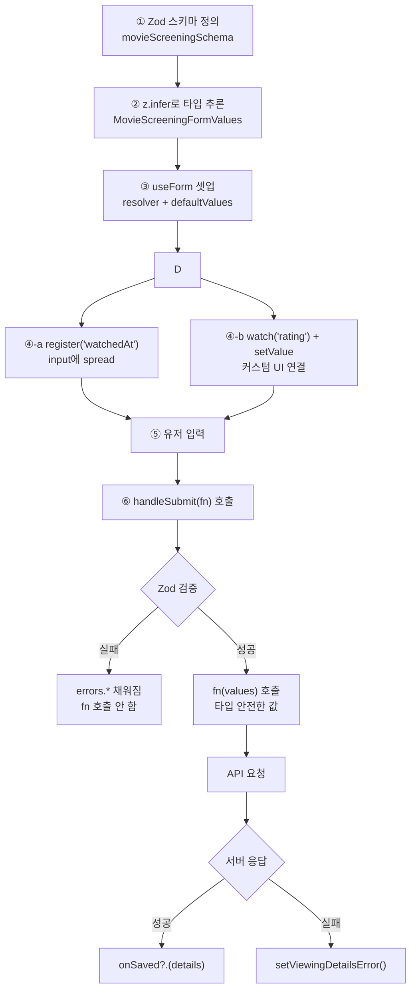

---
aliases:
  - Zod
  - 폼 검증
  - react-hook-form
  - isSubmitting
  - useForm
  - setValue
  - shouldDirty
  - shouldValidate
  - zodResolver
  - register
  - handleSubmit
  - watch
tags:
  - React
  - NextJS
related:
  - "[[00_JS_Ecosystem_HomePage]]"
  - "[[NestJS_DTO]]"
  - "[[JS_FormData]]"
  - "[[JS_Regex]]"
  - "[[React_Component]]"
---
# React_FormValidation — 폼 검증 (Zod + react-hook-form)

---

# 역할 분리 — 왜 두 라이브러리인가 ⭐️⭐️⭐️⭐️⭐️

```txt
Zod             = "이 데이터가 올바른 형태인가" 를 정의하는 스키마 + 검증기
react-hook-form = 폼의 값, 에러, 제출 상태를 추적하는 상태 관리자
zodResolver     = 둘을 연결하는 어댑터
```

| 라이브러리 | 담당 | 없으면 |
|-----------|------|--------|
| `zod` | 검증 규칙 정의, 타입 자동 추론 | 검증 로직을 직접 if문으로 짜야 함 |
| `react-hook-form` | 폼 상태(값, 에러, dirty, submitting) 추적 | 모든 input을 useState로 관리해야 함 |
| `@hookform/resolvers/zod` | zod 검증 결과를 RHF errors로 변환 | 두 라이브러리가 서로 모름 |

```txt
핵심 흐름:
  Zod 스키마 정의
    → useForm에 zodResolver로 연결
      → register로 input 연결
        → 제출 시 handleSubmit이 Zod 검증 실행
          → 통과하면 fn(values) 호출 — 타입 안전한 값
```

---

# 설치 ⭐️⭐️⭐️

```bash
pnpm --filter web add react-hook-form zod @hookform/resolvers
```

---

# 전체 흐름 다이어그램 ⭐️⭐️⭐️⭐️⭐️



---

# Step 1 — Zod 스키마 정의 ⭐️⭐️⭐️⭐️⭐️

```typescript
import { z } from 'zod';

const movieScreeningSchema = z.object({
  // 필수 날짜 문자열
  watchedAt: z.string().min(1, '관람일을 선택하세요.'),

  // 선택적 enum — 빈 문자열 or 특정 값만 허용
  viewingType: z.union([
    z.literal(''),                          // 미선택 허용
    z.enum(['theater', 'home', 'other']),   // 유효한 값
  ]),

  // 공백 자동 제거 + 길이 제한
  viewingPlatform: z.string().trim().max(40, '플랫폼은 40자까지 입력할 수 있어요.'),
  viewingLocation: z.string().trim().max(100, '관람 장소는 100자까지 입력할 수 있어요.'),
  review:          z.string().trim().max(1000, '후기는 1000자까지 입력할 수 있어요.'),

  // 숫자 또는 null (미선택)
  rating: z.number().int().min(1).max(10).nullable(),
});
```

```txt
z.string().trim():
  검증 전에 앞뒤 공백 자동 제거
  → input에서 "  hello  " 입력해도 Zod가 "hello"로 처리

z.union([z.literal(''), z.enum([...])]):
  select에서 "선택 안 함"을 빈 문자열('')로 표현할 때 사용
  z.enum만 쓰면 빈 문자열이 검증 실패

.nullable():
  null 허용 — rating처럼 선택 안 할 수 있는 숫자 필드
  z.number()만 쓰면 null이 타입 에러
```

## z.infer — 타입 자동 추론

```typescript
type MovieScreeningFormValues = z.infer<typeof movieScreeningSchema>;
// = {
//   watchedAt:       string;
//   viewingType:     '' | 'theater' | 'home' | 'other';
//   viewingPlatform: string;
//   viewingLocation: string;
//   review:          string;
//   rating:          number | null;
// }
```

```txt
스키마가 변하면 타입도 자동으로 따라 바뀜
타입을 따로 손으로 쓸 필요 없음 — 항상 스키마에서 추론
```

---

# Step 2 — useForm 셋업 ⭐️⭐️⭐️⭐️⭐️

```typescript
import { useForm } from 'react-hook-form';
import { zodResolver } from '@hookform/resolvers/zod';

const {
  register,      // input 연결 (onChange, onBlur, ref, name 전달)
  handleSubmit,  // 제출 래퍼 — Zod 검증 후 fn 호출
  reset,         // 폼 전체 상태 교체
  setValue,      // 코드로 값 주입 (커스텀 UI)
  watch,         // 특정 필드 실시간 구독
  formState: { errors, isSubmitting },
} = useForm<MovieScreeningFormValues>({
  resolver: zodResolver(movieScreeningSchema),
  defaultValues: {
    watchedAt:       screening?.watchedAt?.slice(0, 10) ?? '',
    viewingType:     screening?.viewingType     ?? '',
    viewingPlatform: screening?.viewingPlatform ?? '',
    viewingLocation: screening?.viewingLocation ?? '',
    review:          screening?.review          ?? '',
    rating:          screening?.rating          ?? null,
  },
});
```

```txt
resolver: zodResolver(schema)
  → 제출 시 RHF가 Zod 검증을 실행하도록 연결
  → 검증 실패 메시지가 errors.필드명.message로 들어옴

defaultValues:
  → 마운트 시 딱 한 번 읽힘
  → 이후 외부 데이터가 변해도 폼은 자동으로 업데이트 안 됨 ← 중요
  → 비동기로 로드되는 데이터는 useEffect + reset 필요 (Step 4 참고)

reset 이름 충돌 방지:
  reset: resetForm  ← as 이름 변경으로 구분
```

## mode — 검증 트리거 시점 ⭐️⭐️⭐️⭐️

```typescript
useForm({
  mode: 'onBlur',   // 포커스 벗어날 때 검증
  resolver: zodResolver(schema),
  defaultValues: { ... },
});
```

| mode | 검증 트리거 | 특징 |
|------|------------|------|
| `'onSubmit'` | 제출 시 (기본값) | 입력 중엔 에러 없음 — 가장 조용함 |
| `'onBlur'` | 포커스 벗어날 때 | 필드 입력 완료 후 즉시 피드백 |
| `'onChange'` | 키 입력마다 | 즉각 반응 — 타이핑 중 에러 표시 |
| `'onTouched'` | 첫 blur 후 → onChange로 전환 | onBlur와 onChange의 중간 |
| `'all'` | blur + change 모두 | 가장 엄격 |

```txt
onSubmit (기본):
  → 제출 버튼 누르기 전까지 에러 없음
  → 단순한 폼, 에러 표시를 최소화하고 싶을 때

onBlur:
  → 필드를 다 입력하고 다음 필드로 넘어갈 때 검증
  → 로그인, 회원가입처럼 각 필드를 순서대로 채우는 폼에 자연스러움
  → 타이핑 중엔 에러 없고, 이탈 후 알려줌

onChange:
  → 타이핑할 때마다 실시간 검증
  → 비밀번호 강도 표시 같이 즉각 피드백이 중요할 때
  → 렌더링이 자주 일어나므로 큰 폼에선 성능 고려
```

### formState 주요 상태

| 상태 | 타입 | 의미 |
|------|------|------|
| `errors` | `FieldErrors<T>` | 필드별 Zod 에러 메시지 |
| `isSubmitting` | `boolean` | handleSubmit async fn 실행 중 |
| `isDirty` | `boolean` | defaultValues와 하나라도 다른 필드 있으면 true |
| `isValid` | `boolean` | 현재 에러 없으면 true |

---

# Step 3 — 필드 연결 ⭐️⭐️⭐️⭐️⭐️

## register — 일반 input/textarea

```tsx
// {...register('필드명')} 으로 input에 spread
<input
  type="date"
  {...register('watchedAt')}
  disabled={savingViewingDetails}
/>
{errors.watchedAt?.message ? (
  <small role="alert">{errors.watchedAt.message}</small>
) : null}

<textarea
  {...register('review')}
  placeholder="이 영화에 대한 짧은 기록을 남겨보세요"
  maxLength={1000}
  rows={4}
  disabled={savingViewingDetails}
/>
{errors.review?.message ? (
  <small role="alert">{errors.review.message}</small>
) : null}
```

```txt
{...register('watchedAt')} 이 전달하는 것:
  name="watchedAt"   → RHF가 어떤 필드인지 식별
  onChange           → 입력할 때마다 RHF 내부 상태 업데이트
  onBlur             → 포커스 벗어날 때 검증 트리거
  ref                → DOM 요소 직접 참조 (포커스 이동 등)

errors.watchedAt?.message:
  ?. 옵셔널 체이닝 — 에러 없으면 undefined → 렌더링 안 됨
  에러 있으면 Zod 스키마에 정의한 메시지 문자열
```

## watch + setValue — 커스텀 UI (register 못 쓸 때)

```typescript
// rating 별점 UI처럼 직접 클릭으로 값 설정하는 경우
const rating = watch('rating');       // 현재 값 실시간 구독

const setRating = (value: number | null) => {
  setValue('rating', value, { shouldValidate: true });
  //                          ↑ 즉시 Zod 검증 → errors 즉시 반영
};
```

```tsx
// 별점 버튼 렌더링
{[1,2,3,4,5,6,7,8,9,10].map((n) => (
  <button
    key={n}
    type="button"
    onClick={() => setRating(rating === n ? null : n)}  // 같은 거 누르면 해제
    aria-pressed={rating === n}
  >
    {n}
  </button>
))}
{errors.rating?.message && <small>{errors.rating.message}</small>}
```

```txt
register vs watch+setValue:

  register   → input 태그에 spread — 텍스트, date, select 등 HTML input
  watch      → 값을 읽어서 커스텀 UI 렌더링에 사용
  setValue   → 커스텀 UI의 이벤트 핸들러에서 값 주입

  배타적이지 않음 — register로 등록 후 setValue로 덮어쓰기도 가능
```

## useWatch — 성능 최적화 구독 ⭐️⭐️⭐️⭐️

```txt
watch() = useForm에서 꺼낸 함수 — 구독하는 필드가 바뀌면 폼 전체 리렌더
useWatch() = 별도 훅 — 구독한 필드가 바뀔 때만 해당 컴포넌트만 리렌더

필드 수가 많거나, 감시 필드가 컴포넌트 안쪽 깊이 있을 때 useWatch 사용
```

```typescript
import { useWatch } from 'react-hook-form';

// control을 useForm에서 꺼내서 전달해야 함
const { control } = useForm<FormValues>({ ... });

// 단일 필드 구독
const viewingPlatformMode = useWatch({
  control,
  name: 'viewingPlatformMode',
});

// 여러 필드 개별 구독
const selectedViewingType    = useWatch({ control, name: 'viewingType' });
const selectedViewingPlatform = useWatch({ control, name: 'viewingPlatform' });
```

```tsx
// 구독한 값으로 조건부 렌더링
{viewingPlatformMode === 'custom' && (
  <input {...register('customViewingPlatform')} placeholder="직접 입력" />
)}
```

| | `watch('field')` | `useWatch({ control, name })` |
|--|--|--|
| 가져오는 곳 | useForm 반환값 | 별도 훅 import |
| 리렌더 범위 | 폼 컴포넌트 전체 | 해당 컴포넌트만 |
| 사용 위치 | 같은 컴포넌트 내 | 하위 컴포넌트에서도 사용 가능 |
| 추천 상황 | 단순한 단일 폼 | 필드 수 많거나 중첩 컴포넌트 |

## useWatch + reset — 조건부 초기값 패턴

```typescript
// isCustomViewingPlatform() 같은 조건 함수로 reset 값 분기
useEffect(() => {
  const isCustom = isCustomViewingPlatform(data?.viewingPlatform);

  resetForm({
    viewingPlatformMode:    isCustom ? 'custom' : 'preset',
    viewingPlatform:        isCustom ? '' : (data?.viewingPlatform ?? ''),
    customViewingPlatform:  isCustom ? (data?.viewingPlatform ?? '') : '',
    // 나머지 필드
    watchedAt: data?.watchedAt?.slice(0, 10) ?? '',
    rating:    data?.rating ?? null,
  });
}, [data, resetForm]);
```

```txt
패턴 설명:
  DB에는 viewingPlatform 하나로 저장
  UI에서는 preset(선택지) / custom(직접입력) 두 모드로 분리 관리

  → reset 시점에 isCustom 여부를 판단해 두 필드로 분배
  → useWatch로 viewingPlatformMode를 구독 → 모드에 따라 UI 분기 렌더링
  → 제출 시 두 필드를 다시 하나로 합쳐서 API 전송
```

## Controller — 커스텀 UI 공식 방법 ⭐️⭐️⭐️⭐️

```txt
watch + setValue의 선언적 대안
RHF가 field 객체를 직접 제공 — value, onChange, onBlur, ref 포함
```

```typescript
import { useForm, Controller } from 'react-hook-form';

const { control, formState: { errors } } = useForm<FormValues>({
  resolver: zodResolver(schema),
  defaultValues: { rating: null },
});
```

```tsx
<Controller
  name="rating"          // 필드명 — schema의 키와 일치
  control={control}      // useForm에서 꺼낸 control 전달
  render={({ field }) => (
    <div>
      <span>{field.value ? `${field.value} / 10` : '선택 안 함'}</span>

      {Array.from({ length: 10 }, (_, i) => {
        const score = i + 1;
        return (
          <button
            key={score}
            type="button"
            className={score <= (field.value ?? 0) ? 'is-filled' : ''}
            onClick={() => field.onChange(score)}  // setValue 역할
            aria-pressed={score === field.value}
          />
        );
      })}
    </div>
  )}
/>
{errors.rating?.message && <small>{errors.rating.message}</small>}
```

```txt
field 객체가 제공하는 것:
  field.value      → 현재 필드 값 (watch 역할)
  field.onChange   → 값 변경 함수 (setValue 역할)
  field.onBlur     → 포커스 이탈 처리 (mode: onBlur와 연동)
  field.name       → 필드명
  field.ref        → DOM ref (포커스 이동, 스크롤 등)
```

| 방법 | 코드 방식 | 추천 상황 |
|------|---------|---------|
| `register` | `{...register('field')}` spread | 네이티브 HTML input, textarea, select |
| `watch + setValue` | 수동으로 읽고 씀 | 단순 커스텀 UI, 기존 코드에 추가할 때 |
| `Controller` | `render={({ field }) => ...}` | 커스텀 컴포넌트, 서드파티 UI 라이브러리 연동 |

---

# Step 4 — 외부 데이터 동기화 (useEffect + reset) ⭐️⭐️⭐️⭐️⭐️

## 왜 필요한가

```txt
시나리오: 편집 모달 — props로 외부 데이터(data)를 받아서 폼에 채움

문제:
  data가 API로 비동기 로드됨
  → 마운트 시점엔 data = undefined
  → defaultValues의 ?? '' 로 폼이 빈 값으로 고정됨

  이후 data 도착 → 리렌더링
  → defaultValues는 이미 고정됨 → 폼은 여전히 빈 값

해결: data가 바뀔 때마다 reset()으로 폼 전체를 새 데이터로 교체
```

## 케이스 1 — data 있을 때만 reset (없으면 현재 폼 유지)

```typescript
// 용도: 목록에서 항목 선택 → 폼 채우기. 선택 해제 시 폼 그대로 유지.
useEffect(() => {
  if (!data) return;           // data 없으면 아무것도 안 함
  resetForm({
    title:  data.title  ?? '',
    rating: data.rating ?? null,
    // ...
  });
}, [data, resetForm]);
```

## 케이스 2 — data 유무 모두 처리 (없으면 빈 폼으로 초기화)

```typescript
// 용도: 편집 모달. data 있으면 채우고, 없으면(새 항목) 빈 폼으로 시작.
useEffect(() => {
  resetForm({
    title:  data?.title  ?? '',   // data 없으면 빈 문자열
    rating: data?.rating ?? null, // data 없으면 null
    // ...
  });
}, [data, resetForm]);
```

```txt
공통 원칙:
  의존성 배열에 data, resetForm 모두 포함
  data가 바뀔 때마다 useEffect 실행 → 폼 재초기화

케이스 선택:
  ✅ 케이스 1: 선택한 항목을 폼에 불러올 때 (선택 없으면 폼 초기 상태 유지)
  ✅ 케이스 2: 편집 모달 (data 있으면 수정, 없으면 새 항목 생성)
```

## reset() 기본

```typescript
reset()        // defaultValues로 완전 초기화
reset({ ... }) // 전달한 값으로 교체 + dirty/errors 클리어

// ✅ 편집 모달 → useEffect + reset으로 외부 데이터 동기화
// ✅ 제출 성공 후 빈 폼으로 돌아가기 → reset()
// ❌ 항상 빈 폼으로 시작하는 생성 폼 → defaultValues만으로 충분
```

## ISO 날짜 → date input 변환 패턴

```typescript
// DB에서 오는 날짜: "2026-09-01T00:00:00.000Z"  (ISO 8601)
// input type="date" 요구 형식: "2026-09-01"  (YYYY-MM-DD)
createdAt: data?.createdAt?.slice(0, 10) ?? '',
//                          ↑ 앞 10자만 잘라냄
//         ?.slice → null/undefined이면 undefined → ?? '' → 빈 문자열
```

---

# Step 5 — handleSubmit 제출 ⭐️⭐️⭐️⭐️⭐️

```txt
handleSubmit(fn) 동작:
  1. Zod 검증 실행
     실패 → errors.* 업데이트, fn 호출 안 함
     성공 → fn(values) 호출 — 검증된 타입 안전한 값
  2. e.preventDefault() 불필요 — handleSubmit이 내부에서 처리
  3. fn이 async → isSubmitting이 fn 종료까지 자동 true
```

## isSubmitting으로 로딩 상태 대체 ⭐️⭐️⭐️⭐️⭐️

```typescript
// ❌ Before — 수동 로딩 state 관리
const [savingViewingDetails, setSavingViewingDetails] = useState(false);

const handleSave = handleSubmit(async (values) => {
  setSavingViewingDetails(true);   // 수동 on
  try {
    await apiCall(values);
  } finally {
    setSavingViewingDetails(false); // 수동 off
  }
});

<button disabled={savingViewingDetails}>저장</button>

// ✅ After — isSubmitting으로 대체 (state 선언 자체가 필요 없음)
const { formState: { isSubmitting } } = useForm();

const handleSave = handleSubmit(async (values) => {
  // isSubmitting = true 자동 시작 (fn 진입 시)
  try {
    await apiCall(values);
  }
  // isSubmitting = false 자동 종료 (fn 완료 시 — 성공/실패 무관)
});

<button disabled={isSubmitting}>저장</button>
```

```txt
isSubmitting이 자동으로 처리하는 것:
  fn 진입 → true
  fn 완료 (resolve) → false
  fn 실패 (reject/catch) → false

→ setSavingViewingDetails(true/false) + useState 선언 전부 제거 가능
→ finally 블록도 로딩 해제 목적이라면 불필요
```

## 실전 패턴 (isSubmitting 기준)

```typescript
const {
  handleSubmit,
  formState: { errors, isSubmitting },
} = useForm<FormValues>({ resolver: zodResolver(schema) });

const handleSave = handleSubmit(
  async (values: FormValues) => {
    // ① 외부 의존성 가드
    if (!data || !accessToken) return;

    // ② 이전 에러 초기화 (로딩 state는 isSubmitting이 담당)
    setError(null);

    try {
      // ③ 폼 값 → API shape 변환
      const payload = {
        title:   values.title.trim() || null,  // 공백 제거 + null
        rating:  values.rating,                // number | null 그대로
        tagLine: values.tagLine || null,        // 빈 문자열 → null
      };

      await updateRequest(accessToken, data.id, payload);
      onSaved?.(payload);                      // 부모 콜백 (옵셔널)
    } catch {
      setError('저장하지 못했습니다.');
    }
    // finally 불필요 — isSubmitting이 자동으로 false로 전환
  },
);
```

| 상황 | 변환 방법 |
|------|---------|
| 빈 text, 미선택 select | `value \|\| null` |
| 앞뒤 공백 가능한 텍스트 | `value.trim() \|\| null` |
| number, boolean | 그대로 |
| `onSaved?.(payload)` | 옵셔널 체이닝 — props 없어도 에러 없음 |

## JSX 연결

```tsx
{/* form submit */}
<form onSubmit={handleSave}>
  <button type="submit" disabled={isSubmitting}>
    {isSubmitting ? '저장 중...' : '저장'}
  </button>
</form>

{/* type="button" + onClick (폼에 버튼이 여러 개일 때) */}
<button type="button" onClick={handleSave} disabled={isSubmitting}>
  {isSubmitting ? '저장 중...' : '저장'}
</button>
```

> [!note]
> `isSubmitting`으로 대체 못 하는 경우: 폼에 **저장 / 삭제** 같이 서로 다른 API를 부르는 버튼이 여럿일 때. 
> 이때는 각각 별도 `useState`로 관리해야 어떤 버튼이 로딩 중인지 구분 가능.

---

# 실전 전체 예시 — MovieDetailModal ⭐️⭐️⭐️⭐️⭐️

```typescript
// 1. 스키마 + 타입 정의
const movieScreeningSchema = z.object({
  watchedAt:       z.string().min(1, '관람일을 선택하세요.'),
  viewingType:     z.union([z.literal(''), z.enum(['theater', 'home', 'other'])]),
  viewingPlatform: z.string().trim().max(40, '플랫폼은 40자까지 입력할 수 있어요.'),
  viewingLocation: z.string().trim().max(100, '관람 장소는 100자까지 입력할 수 있어요.'),
  review:          z.string().trim().max(1000, '후기는 1000자까지 입력할 수 있어요.'),
  rating:          z.number().int().min(1).max(10).nullable(),
});
type MovieScreeningFormValues = z.infer<typeof movieScreeningSchema>;

// 2. Props 타입
type MovieDetailModalProps = {
  movie:      GachaMovie;
  screening?: UserMovieListItem;
  onClose:    () => void;
  onSaved?:   (details: SavedScreeningDetails) => void;
};

// 3. 컴포넌트 내부
function MovieDetailModal({ screening, onSaved }: MovieDetailModalProps) {
  const [savingViewingDetails, setSavingViewingDetails] = useState(false);
  const [viewingDetailsError, setViewingDetailsError] = useState<string | null>(null);

  // 4. useForm 셋업
  const {
    handleSubmit,
    register,
    reset: resetMovieScreeningForm,
    setValue,
    watch,
    formState: { errors },
  } = useForm<MovieScreeningFormValues>({
    resolver: zodResolver(movieScreeningSchema),
    defaultValues: {
      watchedAt:       screening?.watchedAt?.slice(0, 10) ?? '',
      viewingType:     screening?.viewingType     ?? '',
      viewingPlatform: screening?.viewingPlatform ?? '',
      viewingLocation: screening?.viewingLocation ?? '',
      review:          screening?.review          ?? '',
      rating:          screening?.rating          ?? null,
    },
  });

  // 5. 커스텀 UI 연결 (별점)
  const rating = watch('rating');
  const setRating = (value: number | null) => {
    setValue('rating', value, { shouldValidate: true });
  };

  // 6. 외부 데이터 동기화
  useEffect(() => {
    resetMovieScreeningForm({
      watchedAt:       screening?.watchedAt?.slice(0, 10) ?? '',
      viewingType:     screening?.viewingType     ?? '',
      viewingPlatform: screening?.viewingPlatform ?? '',
      viewingLocation: screening?.viewingLocation ?? '',
      review:          screening?.review          ?? '',
      rating:          screening?.rating          ?? null,
    });
  }, [screening, resetMovieScreeningForm]);

  // 7. 제출 핸들러
  const handleSaveViewingDetails = handleSubmit(
    async (values: MovieScreeningFormValues) => {
      if (!screening || !accessToken) return;
      setSavingViewingDetails(true);
      setViewingDetailsError(null);
      try {
        const details: SavedScreeningDetails = {
          watchedAt:       values.watchedAt || null,
          viewingType:     values.viewingType || null,
          viewingPlatform: values.viewingPlatform.trim() || null,
          viewingLocation: values.viewingLocation.trim() || null,
          review:          values.review.trim() || null,
          rating:          values.rating,
        };
        await updateViewingDetailsRequest(accessToken, screening.tmdbId, details);
        onSaved?.(details);
      } catch {
        setViewingDetailsError('관람 정보를 저장하지 못했습니다.');
      } finally {
        setSavingViewingDetails(false);
      }
    },
  );

  // 8. JSX
  return (
    <form>
      <label>
        <span>관람일</span>
        <input type="date" {...register('watchedAt')} disabled={savingViewingDetails} />
        {errors.watchedAt?.message && <small role="alert">{errors.watchedAt.message}</small>}
      </label>

      <label>
        <span>후기</span>
        <textarea {...register('review')} maxLength={1000} rows={4} />
        {errors.review?.message && <small role="alert">{errors.review.message}</small>}
      </label>

      {viewingDetailsError && <p role="alert">{viewingDetailsError}</p>}

      <button type="button" onClick={handleSaveViewingDetails} disabled={savingViewingDetails}>
        {savingViewingDetails ? '저장 중...' : '저장'}
      </button>
    </form>
  );
}
```

---

# Zod 스키마 레퍼런스 ⭐️⭐️⭐️

```typescript
// 문자열
z.string()
z.string().min(1, '필수입니다.')
z.string().min(8).max(20)
z.string().trim()                   // 앞뒤 공백 제거 후 검증
z.string().url('URL 형식 아님')

// 이메일 (Zod v3 → v4)
z.string().email('이메일 형식 아님')               // v3
z.email({ error: '이메일 형식 아님' })             // v4 권장

// 숫자
z.number().int().min(1).max(10)
z.number().nullable()               // number | null

// 열거형
z.enum(['theater', 'home', 'other'])
z.literal('')                       // 정확히 '' 만 허용

// 선택적
z.string().optional()               // string | undefined
z.string().nullable()               // string | null

// 빈 문자열 OR enum 패턴 (미선택 허용 select)
z.union([z.literal(''), z.enum(['a', 'b'])])

// 교차 검증 (비밀번호 확인)
z.object({
  password:        z.string().min(8),
  passwordConfirm: z.string(),
}).refine(
  (data) => data.password === data.passwordConfirm,
  { message: '비밀번호가 일치하지 않습니다.', path: ['passwordConfirm'] }
)

// 타입 추론
type FormValues = z.infer<typeof schema>;
```

## refine — 커스텀 검증 로직 ⭐️⭐️⭐️⭐️

```txt
내장 메서드(min, max, email 등)로 표현할 수 없는 검증 규칙을
직접 함수로 정의하는 것
```

### 단일 필드 refine

```typescript
// 기본 구조
z.string().refine(
  (value) => /* boolean 반환 */ true,
  { message: '검증 실패 메시지' }
)

// 실전: 오늘 이전 날짜만 허용
watchedAt: z
  .string()
  .min(1, '관람일을 선택하세요.')
  .refine(
    (date) => date <= kstDateKey(),  // 현재 날짜와 비교 (YYYY-MM-DD 문자열)
    { message: '관람일은 오늘 또는 이전 날짜만 선택할 수 있어요.' }
  ),
```

```txt
동작 순서:
  .min(1) 검증 → 통과 → .refine() 검증
  앞 검증이 실패하면 refine은 실행 안 됨

refine 함수:
  인자 = 앞 검증까지 통과한 값
  return true  → 통과
  return false → message로 에러
  async 함수도 가능 (서버 중복 확인 등)
```

### 객체 수준 refine — 교차 필드 검증

```typescript
// 여러 필드를 함께 봐야 할 때 → .object().refine()
z.object({
  password:        z.string().min(8),
  passwordConfirm: z.string(),
}).refine(
  (data) => data.password === data.passwordConfirm,
  {
    message: '비밀번호가 일치하지 않습니다.',
    path: ['passwordConfirm'],  // 에러를 어느 필드에 표시할지
  }
)
```

```txt
path: ['passwordConfirm']:
  에러가 errors.passwordConfirm.message로 들어감
  없으면 errors.root에 들어감 (특정 input 아래에 표시 안 됨)

단일 필드 refine vs 객체 refine:
  단일 → 그 필드 값만 보면 될 때 (날짜 범위, 파일 확장자 등)
  객체 → 두 필드 이상 비교할 때 (비밀번호 확인, 시작일 < 종료일 등)
```

---

# Zod(클라이언트) vs setError(서버) ⭐️⭐️⭐️⭐️⭐️

```txt
Zod + zodResolver = 서버 요청 전 검증 게이트
  "이메일 형식 맞는가", "비밀번호 8자 이상인가"
  → 실패 시 서버에 요청 안 함

setError = 서버가 거절했을 때 UI에 에러 주입
  "이미 사용 중인 이메일" (409)
  "이메일 또는 비밀번호 불일치" (401)
```

```typescript
catch (err) {
  const message = err instanceof Error ? err.message : '오류가 발생했습니다.';

  setError('email', { message });   // errors.email.message → 해당 input 아래
  setError('root',  { message });   // errors.root.message  → 폼 공통 알림
}
```

| | 위치 | 표시 |
|--|--|--|
| 필드 에러 | `setError('email', ...)` | `errors.email.message` |
| 폼 공통 에러 | `setError('root', ...)` | `errors.root.message` |

---

# setValue — 프로그래밍 방식 값 주입 ⭐️⭐️⭐️⭐️

```typescript
setValue('rating', value, {
  shouldDirty:    true,  // isDirty = true → "수정됨" 상태
  shouldValidate: true,  // 즉시 Zod 검증 → errors 즉시 반영
});
```

| 옵션 | 의미 | 기본값 |
|------|------|:------:|
| `shouldDirty` | isDirty, dirtyFields 업데이트 | `false` |
| `shouldValidate` | 즉시 검증 → errors 반영 | `false` |
| `shouldTouch` | touchedFields 업데이트 | `false` |

```txt
isDirty로 저장 버튼 활성화 패턴:
  → shouldDirty: true 필수 (안 하면 setValue 후에도 버튼 비활성)

즉각 에러 피드백 패턴:
  → shouldValidate: true 필수
```

---

# 패턴 선택 기준 ⭐️⭐️⭐️⭐️

| | React 19 form action | Zod + react-hook-form |
|--|:--------------------:|:---------------------:|
| 검증 복잡도 | 단순 (required, type) | 복잡 (min, email, refine) |
| 필드별 에러 | ❌ | ✅ |
| 타입 안전 | 수동 | ✅ z.infer 자동 추론 |
| NestJS DTO 대칭 | ❌ | ✅ |
| 라이브러리 | 없음 | react-hook-form + zod |

---

# NestJS DTO ↔ Zod 스키마 대응 ⭐️⭐️⭐️

| NestJS DTO | Zod 스키마 |
|------------|-----------|
| `@IsEmail()` | `z.email()` |
| `@IsString()` | `z.string()` |
| `@MinLength(8)` | `z.string().min(8)` |
| `@MaxLength(20)` | `z.string().max(20)` |
| `@IsOptional()` | `.optional()` |
| `@IsEnum(['a','b'])` | `z.enum(['a','b'])` |
| `@IsInt()` | `z.number().int()` |

```txt
NestJS DTO = 서버 입구 검증
Zod 스키마 = 클라이언트 입구 검증
→ 에러 메시지만 맞추면 양쪽이 같은 규칙으로 검증
→ [[NestJS_DTO]]
```
