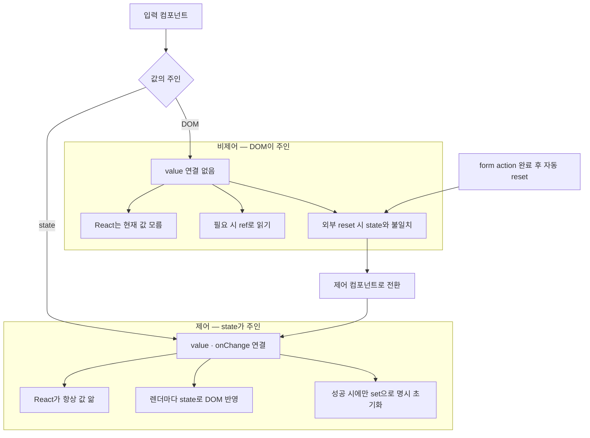

---
aliases:
  - Zod
  - 폼 검증
  - react-hook-form
  - isSubmitting
  - useForm
tags:
  - React
  - NextJS
related:
  - "[[00_JS_Ecosystem_HomePage]]"
  - "[[NestJS_DTO]]"
  - "[[JS_FormData]]"
  - "[[JS_Regex]]"
---
# React_FormValidation — 폼 검증 (Zod + react-hook-form)

>[!info]
>클라이언트 폼 처리 두 가지 패턴. 
>**React 19 action 패턴**: `<form action={asyncFn}>` — 제출 시 `FormData` 자동 전달, `e.preventDefault()` 불필요, 단순한 폼에 적합.
> **Zod + react-hook-form**: 스키마 검증·타입추론·필드별 에러 표시, 복잡한 검증 규칙에 적합. 
> Zod 4에서 이메일은 `z.email()` 권장. 
> NestJS class-validator → [[NestJS_DTO]]

---

# React 19 form action 패턴 ⭐️⭐️⭐️⭐️

```txt
React 19부터 <form action={fn}>에 async 함수를 직접 넘길 수 있음

기존 방식:
  onSubmit + FormEvent + e.preventDefault()

React 19 방식:
  form action={asyncFn} — 제출 시 자동으로 FormData를 인자로 전달
  e.preventDefault() 불필요
  Server Actions와 같은 문법, 단 'use server' 없는 클라이언트 함수
```

## 기본 패턴

```typescript
'use client';
import { useState } from 'react';

export default function LoginPage() {
  const [error, setError] = useState<string | null>(null);

  async function login(formData: FormData) {
    setError(null);

    // FormData에서 값 꺼내기
    const email    = formData.get('email');
    const password = formData.get('password');

    // 타입 좁히기 — formData.get()은 string | File | null 반환
    if (typeof email !== 'string' || typeof password !== 'string') {
      setError('입력을 확인해 주세요');
      return;
    }

    try {
      const data = await loginRequest(email, password);
      setSession(data.accessToken, data.user);
      router.push('/');
    } catch (err) {
      setError(err instanceof Error ? err.message : '로그인에 실패했습니다.');
    }
  }

  return (
    <form action={login}>
      {/* name 속성이 FormData의 키가 됨 */}
      <input name="email"    type="email"    required />
      <input name="password" type="password" required />
      {error && <p>{error}</p>}
      <button type="submit">로그인</button>
    </form>
  );
}
```

```txt
form action={fn} 에서 fn이 받는 것:
  FormData — <form> 안의 name 속성이 있는 모든 input 값
  formData.get('email') → input[name="email"]의 값

formData.get() 반환 타입 = string | File | null:
  string → 텍스트 input
  File   → input[type="file"]
  null   → 해당 name 없음
  → typeof email !== 'string' 체크 필요

e.preventDefault() 가 없는 이유:
  form action={fn} 방식은 React가 제출을 가로채서
  fn(formData)를 직접 호출 — 브라우저 기본 동작이 자동으로 막힘
```

## 언제 어떤 패턴을

```txt
React 19 action + FormData:
  ✅ 검증 규칙이 단순할 때 (required, type="email" 정도)
  ✅ 서드파티 라이브러리 없이 가볍게 만들 때
  ❌ 복잡한 검증 메시지 (비번 8자, 이메일 형식 오류 표시)
  ❌ 여러 필드 의존 검증 (비번 확인 일치 등)

Zod + react-hook-form:
  ✅ 복잡한 검증 규칙 (min, email, refine 등)
  ✅ 필드별 즉각적인 에러 표시
  ✅ NestJS DTO와 검증 규칙을 맞춰야 할 때
  ❌ 설정이 필요 (zodResolver, register, errors 관리)
```

---

# 왜 Zod + react-hook-form 인가 ⭐️⭐️⭐️⭐️

```txt
❌ 수동 검증 객체 (authFormErrors.ts 식):
  프로젝트마다 새로 만들어야 함
  타입·에러 메시지를 직접 유지
  작은 앱엔 괜찮지만 확장하면 비표준

✅ Zod + react-hook-form:
  Zod = 스키마로 검증 규칙 + 타입 자동 추론 (z.infer)
  react-hook-form = 입력 등록·에러 상태·isSubmitting
  @hookform/resolvers/zod = 둘을 연결

NestJS DTO ↔ Web 스키마 대칭:
  NestJS: class-validator @IsEmail() @MinLength(8)
  Web:    Zod z.email() .min(8)
  → "입구 검증"을 양쪽에서 하되 에러 메시지만 맞추면 됨

API 에러 (401·409 등)는 Zod 스키마 밖:
  → setError('root', { message: '...' })
  → 또는 setError('email', { message: '이미 사용 중인 이메일' })
```

---

# Zod — 스키마 검증 + 타입 추론 ⭐️⭐️⭐️⭐️

## 기본 타입

```typescript
import { z } from 'zod';

// 문자열
z.string()
z.string().min(1, '필수 항목입니다.')
z.string().min(8, '8자 이상이어야 합니다.')
z.string().max(20, '20자 이하로 입력해주세요.')
z.string().trim()             // 공백 제거 후 검증
z.string().url('올바른 URL 형식이 아닙니다.')

// ─────────────────────────────────────────────────
// 이메일 — Zod 3 vs Zod 4

// Zod 3 스타일 (아직 동작하지만 구식)
z.string().email('올바른 이메일 형식이 아닙니다.')

// Zod 4 권장 — z.email() (포맷 스키마)
z.email({ error: '올바른 이메일을 입력해주세요.' })

// Zod 4 — 빈 값 · trim 체크까지
z.string()
  .trim()
  .min(1, '이메일을 입력해주세요.')
  .pipe(z.email({ error: '올바른 이메일을 입력해주세요.' }))
// .pipe() = 앞 스키마를 통과한 값을 다음 스키마로 넘김
// trim + 빈 값 체크 → 이메일 형식 체크 순서

// 단순화 (빈 값 에러 메시지 구분 불필요할 때)
z.email({ error: '올바른 이메일을 입력해주세요.' })
// ─────────────────────────────────────────────────

// 숫자
z.number().min(0).max(100)
z.number().int('정수만 입력 가능합니다.')

// 선택형
z.boolean()
z.enum(['user', 'admin'])
z.literal('active')

// 선택적 (optional)
z.string().optional()         // string | undefined
z.string().nullable()         // string | null
z.string().nullish()          // string | null | undefined
```

## z.object — 폼 스키마 정의 ⭐️⭐️⭐️⭐️

```typescript
// z.object() = "이 객체는 이런 모양이어야 한다"는 스키마
const loginSchema = z.object({
  email:    z.email(),          // email 키는 이메일 형식
  password: z.string().min(1),  // password 키는 비어있으면 안 됨
});
```

```txt
z.object({ 키: 스키마, ... }):
  객체의 각 필드(키)에 검증 규칙을 붙이는 것
  폼의 input name과 키가 반드시 일치해야 함

  loginSchema의 키 = 'email', 'password'
  register('email'), register('password')  ← 이름이 같아야 연결됨

  키가 다르면:
  z.object({ emailAddress: z.email() })
  register('email')  ← 불일치 → 검증이 적용 안 됨
```

```typescript
// z.infer — 스키마에서 TypeScript 타입 자동 추론
type LoginValues = z.infer<typeof loginSchema>;
// = { email: string; password: string }

// useForm에 타입으로 전달 → errors.email, data.email 타입 안전
const { register } = useForm<LoginValues>({
  resolver: zodResolver(loginSchema),
});
```

```txt
z.infer<typeof schema>:
  스키마 정의 → TypeScript 타입이 자동으로 따라옴
  스키마를 바꾸면 타입도 자동으로 바뀜
  타입을 따로 손으로 쓸 필요 없음

  z.object({ email: z.email() })
    → type = { email: string }

  z.object({ email: z.email().optional() })
    → type = { email?: string }
```

```typescript
// lib/schemas/auth.ts
import { z } from 'zod';

// 공통 필드 — Zod 4 방식
const emailField = z
  .string()
  .trim()
  .min(1, '이메일을 입력해주세요.')
  .pipe(z.email({ error: '올바른 형식의 이메일을 입력해주세요.' }));
//      ↑ Zod 4 권장: z.email() 포맷 스키마
//        .pipe()로 앞 검증을 통과한 값을 이메일 형식 검증으로 넘김

const passwordField = z
  .string()
  .min(1, '비밀번호를 입력해주세요.')
  .min(8, '비밀번호는 8자 이상이어야 합니다.');

// Nest LoginDto와 맞춤
export const loginSchema = z.object({
  email:    emailField,
  password: z.string().min(1, '비밀번호를 입력해주세요.'),
});

// Nest RegisterDto — password MinLength(8)
export const registerSchema = z.object({
  email:    emailField,
  password: passwordField,
  nickname: z.string().trim().min(2, '닉네임은 2자 이상이어야 합니다.'),
});

// z.infer — 스키마에서 TypeScript 타입 자동 추론
export type LoginValues    = z.infer<typeof loginSchema>;
export type RegisterValues = z.infer<typeof registerSchema>;
```

```txt
z.infer<typeof schema>:
  스키마에서 TypeScript 타입을 자동으로 만들어줌
  스키마가 바뀌면 타입도 자동으로 바뀜
  → 따로 타입을 손으로 쓸 필요 없음

.trim():
  입력값 앞뒤 공백 제거 후 검증
  " a@b.com " → "a@b.com" 으로 처리하고 검증

체이닝 순서:
  .min(1) 먼저 → 빈 문자열 체크
  .email() 나중 → 이메일 형식 체크
  → 빈 칸이면 "입력해주세요." 메시지가 먼저 뜸
```

---

# react-hook-form — 폼 상태 관리 ⭐️⭐️⭐️⭐️

```bash
pnpm --filter web add react-hook-form zod @hookform/resolvers
```

```typescript
import { useForm } from 'react-hook-form';
import { zodResolver } from '@hookform/resolvers/zod';

const {
  register,         // 입력 필드 등록
  handleSubmit,     // 제출 핸들러 래퍼
  formState,        // errors, isSubmitting, isDirty 등
  setError,         // 수동으로 에러 설정 (API 에러용)
  reset,            // 폼 초기화
} = useForm<LoginValues>({
  resolver: zodResolver(loginSchema),  // Zod 스키마 연결
  defaultValues: { email: '', password: '' },
});

const { errors, isSubmitting } = formState;
```

```txt
useForm<LoginValues>:
  <LoginValues> 제네릭으로 타입 안전
  resolver: zodResolver(loginSchema) → 제출 시 Zod로 검증

isSubmitting:
  handleSubmit의 async 함수가 실행 중이면 true
  → 버튼 disabled 처리에 사용 (자동으로 관리됨)
```

---

# 전체 로그인 폼 예시 ⭐️⭐️⭐️⭐️

```typescript
// app/(auth)/login/page.tsx
'use client';

import { useForm } from 'react-hook-form';
import { zodResolver } from '@hookform/resolvers/zod';
import { loginSchema, type LoginValues } from '@/lib/schemas/auth';
import { login } from '@/lib/api';
import { useAuth } from '@/contexts/AuthContext';
import { useRouter } from 'next/navigation';

export default function LoginPage() {
  const { setUser } = useAuth();
  const router      = useRouter();

  const {
    register,
    handleSubmit,
    setError,
    formState: { errors, isSubmitting },
  } = useForm<LoginValues>({
    resolver:      zodResolver(loginSchema),
    defaultValues: { email: '', password: '' },
  });

  const onSubmit = async (data: LoginValues) => {
    // data는 Zod 검증 통과한 값 (타입 보장)
    try {
      const result = await login(data.email, data.password);
      setUser(result.user);
      router.push('/');
    } catch (err) {
      // API 에러 → 폼에 표시
      const message = err instanceof Error ? err.message : '로그인에 실패했습니다.';
      setError('root', { message });
      // 특정 필드에 표시하려면:
      // setError('email', { message: '이미 사용 중인 이메일입니다.' });
    }
  };

  return (
    <form onSubmit={handleSubmit(onSubmit)}>
      <div>
        <input
          {...register('email')}
          type="email"
          placeholder="이메일"
        />
        {errors.email && <p>{errors.email.message}</p>}
      </div>

      <div>
        <input
          {...register('password')}
          type="password"
          placeholder="비밀번호"
        />
        {errors.password && <p>{errors.password.message}</p>}
      </div>

      {/* API 에러 */}
      {errors.root && <p>{errors.root.message}</p>}

      <button type="submit" disabled={isSubmitting}>
        {isSubmitting ? '로그인 중...' : '로그인'}
      </button>
    </form>
  );
}
```

```txt
handleSubmit(onSubmit):
  Zod 검증 먼저 실행
  통과하면 onSubmit(data) 호출 — data는 검증된 값
  실패하면 onSubmit 호출 안 함 → errors에 자동 채워짐

{...register('email')}:
  name, onChange, onBlur, ref를 input에 한 번에 전달
  react-hook-form이 이 값을 추적

setError('root', { message }):
  'root'는 특정 필드가 아닌 폼 전체의 에러
  API 에러처럼 스키마 밖의 에러를 표시할 때
  errors.root.message로 접근
```

---

# react-hook-form + Zod — 내부 흐름 ⭐️⭐️⭐️⭐️

```txt
① useForm({ resolver: zodResolver(loginSchema) })
   RHF가 제출 직전에 loginSchema로 검증을 위임

② {...register('email')}
   input 값을 RHF 상태에 연결
   name이 스키마 키(email)와 같아야 함

③ handleSubmit(onSubmit) 실행 시:
   검증 실패 → onSubmit 호출 안 함, errors.* 에 Zod 메시지 채움
   검증 성공 → onSubmit({ email, password }) 호출
              → 이 values는 Zod를 통과한 값 (빈 이메일로 login() 안 감)

④ errors.email?.message
   Zod가 준 에러 메시지 → UI에 표시

⑤ isSubmitting
   onSubmit의 async 함수가 끝날 때까지 true → 버튼 disabled 처리
```

---

# Zod vs setError — 핵심 구분 ⭐️⭐️⭐️⭐️

```txt
Zod / zodResolver = 클라이언트 게이트 (서버에 보내기 전)
  "이메일 형식이 맞는가", "비밀번호가 비어있지 않은가"
  → 실패 시 서버에 요청조차 안 함

catch + setError = 서버가 거절했을 때 UI에 붙이기
  "이메일 또는 비밀번호가 일치하지 않습니다" (401)
  CORS·네트워크 오류 메시지
  → 스키마가 모르는 실패 → 수동으로 RHF 에러 칸에 넣음
```

```typescript
const onSubmit = async (data: LoginValues) => {
  // ↑ 여기까지 왔으면 Zod 검증 이미 통과
  //   data.email, data.password 는 보장된 값

  try {
    const result = await login(data.email, data.password);
    // ← Nest까지 요청이 감
    setUser(result.user);
    router.push('/');

  } catch (err) {
    // ← Nest가 거절한 경우 (401, 409 등) 또는 네트워크 오류
    const message = err instanceof Error ? err.message : '오류가 발생했습니다.';

    // 특정 필드에 표시 (Nest 에러 메시지로 분기)
    if (message.includes('이메일')) {
      setError('email', { message });
      //        ↑ errors.email 에 표시 (필드 바로 아래)
    } else {
      setError('root', { message });
      //        ↑ errors.root 에 표시 (폼 전체 알림)
    }
  }
};
```

```txt
setError('email', { message })  → errors.email.message (필드 아래)
setError('root',  { message })  → errors.root.message  (폼 공통 알림)

message.includes('...') 분기:
  Nest가 string 메시지를 그대로 돌려줄 때 쓰는 얇은 매핑
  Nest가 에러 코드(JSON)를 주면 코드로 분기하는 게 더 낫지만
  지금처럼 message 문자열이면 이 정도로 충분

한 줄 요약:
  Zod    = 클라이언트 게이트 (형식·필수 검증)
  setError in catch = 서버가 거절했을 때 UI에 에러 붙이기
```

# API 에러 vs 스키마 에러 ⭐️⭐️⭐️⭐️

```txt
1단계 — Zod (클라이언트):
  빈 이메일 → errors.email = '이메일을 입력해주세요.'
  형식 틀림 → errors.email = '올바른 형식의 이메일을 입력해주세요.'
  → handleSubmit이 onSubmit을 호출하지 않음
  → 서버에 요청 안 감

2단계 — catch setError (서버):
  Zod를 통과해서 Nest까지 갔지만 거절된 경우
  401 → '이메일 또는 비밀번호가 일치하지 않습니다'
  409 → '이미 사용 중인 이메일입니다'
  → setError로 수동으로 errors.*에 넣음
  → 화면에 표시
```

```tsx
// UI에 표시하는 법
{errors.email && <p className="text-red-500">{errors.email.message}</p>}
{/* ↑ Zod 에러도, setError('email') 에러도 여기로 다 나옴 */}

{errors.root  && <p className="text-red-500">{errors.root.message}</p>}
{/* ↑ setError('root') — 폼 공통 에러 */}
```

---

# 자주 쓰는 패턴

```typescript
// 비밀번호 확인 (.refine으로 교차 검증)
const registerSchema = z.object({
  password:        z.string().min(8),
  passwordConfirm: z.string(),
}).refine(
  (data) => data.password === data.passwordConfirm,
  { message: '비밀번호가 일치하지 않습니다.', path: ['passwordConfirm'] }
);

// 선택적 필드
const profileSchema = z.object({
  nickname: z.string().min(2),
  bio:      z.string().max(200).optional(),  // 없어도 됨
});

// watch — 특정 필드 실시간 감시
const password = watch('password');

// reset — 성공 후 폼 초기화
reset({ email: '', password: '' });
```

---

# NestJS DTO ↔ Zod 스키마 대응

| NestJS DTO           | Zod 스키마              |
| -------------------- | -------------------- |
| `@IsEmail()`         | `z.string().email()` |
| `@IsString()`        | `z.string()`         |
| `@MinLength(8)`      | `z.string().min(8)`  |
| `@MaxLength(20)`     | `z.string().max(20)` |
| `@IsOptional()`      | `.optional()`        |
| `@IsEnum(['a','b'])` | `z.enum(['a','b'])`  |

---

# 제어 vs 비제어 컴포넌트 — 입력값의 주인

# React_ControlledInput — 제어 vs 비제어 컴포넌트

> [!info] 
> "제어(controlled)"는 입력값의 주인이 React state, "비제어(uncontrolled)"는 입력값의 주인이 DOM 자체다. 
> 비제어 인풋은 React가 그 값을 모르기 때문에, 폼이 외부 요인(예: action 완료 후 자동 reset)으로 비워지면 state와 화면이 서로 다른 값을 가리키는 불일치가 생길 수 있다.

---
# 흐름도



```txt
비제어는 DOM 주인 · 제어는 state 주인
action 후 자동 reset이면 비제어에서 화면과 state 불일치 — 제어로 전환
성공 시에만 set으로 state 초기화 · 실패 시 입력값 유지
```

---

# 제어 vs 비제어 — 누가 값의 주인인가 ⭐️⭐️⭐️⭐️

```tsx
// 비제어 — DOM이 값을 들고 있음, React는 모름
<input />

// 제어 — React state가 값을 들고 있음, DOM은 그걸 그대로 반영만 함
<input value={email} onChange={(e) => setEmail(e.target.value)} />
```

|구분|값의 주인|React가 현재 값을 아는가|
|---|---|---|
|비제어(uncontrolled)|DOM 자체|모름 — 필요하면 ref로 그 순간의 값을 읽어와야 함|
|제어(controlled)|React state|항상 안다 — value로 명시적으로 보여주는 값이기 때문|

```txt
둘 다 "틀린" 방식은 아님 — 단순히 값을 한 번만 읽으면 되는 폼(제출 시 ref.current.value만 보면 되는 경우)은
비제어로도 충분함. 문제는 "DOM이 React가 모르는 사이에 바뀌는 다른 이벤트"가 끼어들 때 생김
```

---

# 비제어가 위험해지는 상황 — DOM이 외부 요인으로 바뀔 때 ⭐️⭐️⭐️⭐️

```txt
비제어 인풋 자체는 평범한 폼에서는 별문제 없음
진짜 문제는 "내가 직접 건드린 적 없는데 DOM 값이 바뀌는" 상황이 생길 때임

실전 사례 — <form action={formAction}>(useActionState)이 끝나면 React가 폼을 자동으로 리셋함
  (이 자동 리셋 자체의 동작은 [[React_useFormStatus]] 참고)

  입력칸이 비제어라면:
    리셋 → DOM의 입력값만 비워짐
    그 값을 따로 들고 있던 state(있다면)는 안 비워짐
    → 화면(텅 빈 입력칸)과 state(예전 값)가 서로 다른 걸 가리키는 불일치 발생
```

```txt
제출 → action 실행 → { message: '에러' } return
     → React: "처리 끝" → form reset
     → 비제어 입력칸: DOM 값만 비워짐 (state는 그대로)
     → 화면과 state가 어긋난 상태로 남음
```

---

# 해결 — 제어 컴포넌트로 전환 ⭐️⭐️⭐️⭐️

```tsx
// Before — 비제어
<input name="nickname" />

// After — 제어: value/onChange를 명시적으로 연결
const [nickname, setNickname] = useState('');

<input
  name="nickname"
  value={nickname}
  onChange={(e) => setNickname(e.target.value)}
/>
```

```txt
제어 컴포넌트로 만들면, DOM이 무슨 이유로든(폼 자동 리셋 등) 값을 바꾸려고 해도
다음 렌더에서 React가 항상 value={nickname}(state)로 다시 그려버림
→ 결과적으로 "리셋되지 않는 것"처럼 동작함 — DOM이 아니라 state가 화면의 진짜 출처이기 때문
```

---

# 짝으로 필요한 변경 — 성공할 때만 리셋하기 ⭐️⭐️⭐️

```txt
입력칸을 제어로 바꾸기만 하면, 이제는 실패해도 "리셋이 안 되는" 상태가 됨 —
근데 성공했을 때는 폼을 비워주는 게 맞는 경우가 많음(다음 입력을 위해)

→ "리셋"을 React/DOM의 암묵적 자동 동작에 맡기지 말고,
  성공 분기에서만 setNickname('') 처럼 state를 직접 명시적으로 초기화하는 코드를 둘 것
  실패 분기에서는 아무것도 안 하면 — 입력값이 그대로 남아있어 사용자가 처음부터 다시 안 써도 됨
```

---

# 한눈에

| 개념        | 핵심                                                         |
| --------- | ---------------------------------------------------------- |
| 비제어 컴포넌트  | 값의 주인이 DOM — React는 모름, 필요하면 ref로 읽음                       |
| 제어 컴포넌트   | 값의 주인이 React state — value+onChange로 항상 동기화                |
| 위험해지는 시점  | DOM이 React 모르게 외부 요인으로 바뀔 때 (예: form action 완료 후 자동 reset) |
| 해결        | 입력칸을 제어로 전환 — state가 화면의 진짜 출처가 되게 함                       |
| 짝으로 필요한 것 | reset도 자동 동작에 맡기지 말고, 성공했을 때만 명시적으로 state 초기화              |

---

# 숫자 입력 — 선행 0 제거 패턴 ⭐️⭐️⭐️⭐️

## 왜 `type="number"` + `onChange`로는 안 되나

```txt
문제:
  type="number"에서 초기값이 0일 때 키보드로 1 입력하면 "01"이 됨
  Number("01") = 1 이지만 브라우저 렌더링은 "01" 그대로 표시

  onChange에서 정규화해도 브라우저가 number input의 DOM value를
  직접 관리하기 때문에 React state가 3이어도 화면은 "03"이 유지됨
  → React의 value={state} re-render가 number input 내부 표시를 강제 덮지 못하는 경우 발생
```

## 해결 — onInput + DOM 직접 패치 ⭐️⭐️⭐️⭐️

```tsx
<input
  type="number"
  min={1}
  max={20}
  value={pages}
  onInput={(event) => {
    const input = event.currentTarget;
    const normalized = input.value.replace(/^0+(?=\d)/, '');

    input.value = normalized;                              // ① DOM 즉시 패치 (브라우저 표시 선행 수정)
    setPages(normalized === '' ? 0 : Number(normalized)); // ② React state 동기화
  }}
/>
```

```txt
핵심:
  input.value = normalized  → 브라우저 DOM을 React re-render 전에 직접 수정
  → "03"이 화면에 잠깐도 보이지 않음
  → 이후 React re-render에서 value={pages}(=3)으로 다시 그려도 이미 "3"이라 충돌 없음

onChange vs onInput (type="number"):
  onChange   React의 합성 이벤트 — 값 확정 후 발생, number input은 타이핑 중간에 안 뜨는 경우 있음
  onInput    네이티브 DOM 이벤트 — 타이핑 매 글자마다 즉시 발생, number input에서 더 안정적
```

## 정규식 해석: `/^0+(?=\d)/`

```txt
→ [[JS_Regex#Lookahead — 선행 0 제거 패턴]] 참조
  Lookahead (?=\d) — 뒤에 숫자가 있을 때만 선행 0 제거
  "03" → "3" / "0" → "0" (단독 0은 보존)
```

## 범용 숫자 입력 패턴 (재사용)

```tsx
function NumberInput({
  value,
  onChange,
  min,
  max,
}: {
  value: number;
  onChange: (v: number) => void;
  min?: number;
  max?: number;
}) {
  return (
    <input
      type="number"
      min={min}
      max={max}
      value={value}
      onInput={(e) => {
        const input = e.currentTarget;
        const normalized = input.value.replace(/^0+(?=\d)/, '');
        input.value = normalized;
        onChange(normalized === '' ? 0 : Number(normalized));
      }}
    />
  );
}
```

```txt
안티패턴:
  onChange에서 Number(e.target.value)만 setState
  → state는 맞아도 브라우저 표시는 "03" 유지될 수 있음 (type="number" 특성)
  → onInput + DOM 직접 패치로 선행 수정해야 깜빡임 없음
```