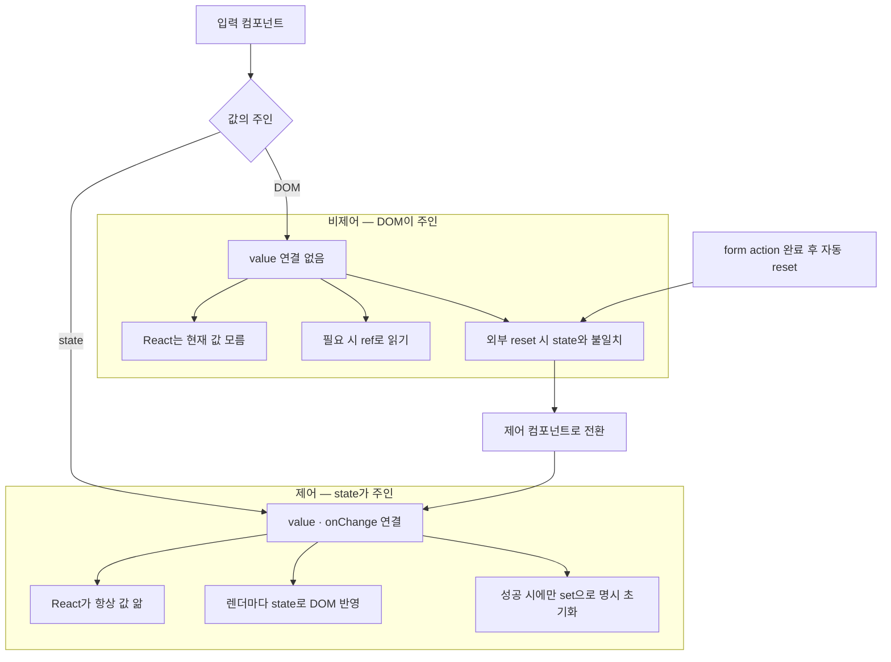

# 제어 vs 비제어 컴포넌트 — 입력값의 주인

> [!info]
> "제어(controlled)"는 입력값의 주인이 React state, "비제어(uncontrolled)"는 입력값의 주인이 DOM 자체다.
> 비제어 인풋은 React가 그 값을 모르기 때문에, 폼이 외부 요인(예: action 완료 후 자동 reset)으로 비워지면 state와 화면이 서로 다른 값을 가리키는 불일치가 생길 수 있다.

## 흐름도


## 한눈에 비교

| 구분                | 값의 주인       | React가 현재 값을 아는가                 |
| ----------------- | ----------- | -------------------------------- |
| 비제어(uncontrolled) | DOM 자체      | 모름 — 필요하면 ref로 그 순간의 값을 읽어와야 함   |
| 제어(controlled)    | React state | 항상 안다 — value로 명시적으로 보여주는 값이기 때문 |

```tsx
// 비제어 — DOM이 값을 들고 있음, React는 모름
<input />

// 제어 — React state가 값을 들고 있음, DOM은 그걸 그대로 반영만 함
<input value={email} onChange={(e) => setEmail(e.target.value)} />
```

## 비제어가 위험해지는 상황

```txt
비제어 인풋 자체는 평범한 폼에서는 별문제 없음
진짜 문제는 "내가 직접 건드린 적 없는데 DOM 값이 바뀌는" 상황이 생길 때임

실전 사례 — <form action={formAction}>(useActionState)이 끝나면 React가 폼을 자동으로 리셋함
  (이 자동 리셋 자체의 동작은 [[React_useFormStatus]] 참고)

  입력칸이 비제어라면:
    리셋 → DOM의 입력값만 비워짐
    그 값을 따로 들고 있던 state(있다면)는 안 비워짐
    → 화면(텅 빈 입력칸)과 state(예전 값)가 서로 다른 걸 가리키는 불일치 발생
```

## 해결 — 제어 컴포넌트로 전환

```tsx
// Before — 비제어
<input name="nickname" />

// After — 제어
const [nickname, setNickname] = useState('');

<input
  name="nickname"
  value={nickname}
  onChange={(e) => setNickname(e.target.value)}
/>
```

```txt
제어 컴포넌트로 만들면, DOM이 무슨 이유로든 값을 바꾸려고 해도
다음 렌더에서 React가 항상 value={nickname}(state)로 다시 그려버림
→ DOM이 아니라 state가 화면의 진짜 출처이기 때문
```

## 짝으로 필요한 변경 — 성공할 때만 리셋하기

```txt
성공 분기에서만 setNickname('') 처럼 state를 직접 명시 초기화
실패 분기에서는 아무것도 안 하면 — 입력값이 그대로 남아있어 사용자가 처음부터 다시 안 써도 됨
```

| 개념 | 핵심 |
|---|---|
| 비제어 컴포넌트 | 값의 주인이 DOM — React는 모름, 필요하면 ref로 읽음 |
| 제어 컴포넌트 | 값의 주인이 state — React가 항상 알고 렌더마다 DOM에 반영 |
| 위험 상황 | form action 완료 후 자동 리셋 → 비제어면 DOM만 비워져 state와 불일치 |
| 해결 | value + onChange 연결해 제어로 전환, 성공 시에만 setState('') 명시 초기화 |

---

# 숫자 입력 — 선행 0 제거 패턴

## 왜 `type="number"` + `onChange`로는 안 되나

```txt
문제:
  type="number"에서 초기값이 0일 때 키보드로 1 입력하면 "01"이 됨
  Number("01") = 1 이지만 브라우저 렌더링은 "01" 그대로 표시

  onChange에서 정규화해도 브라우저가 number input의 DOM value를
  직접 관리하기 때문에 React state가 3이어도 화면은 "03"이 유지됨
  → React의 value={state} re-render가 number input 내부 표시를 강제 덮지 못하는 경우 발생
```

## 해결 — onInput + DOM 직접 패치 ⭐️⭐️⭐️⭐️

```tsx
<input
  type="number"
  min={1}
  max={20}
  value={pages}
  onInput={(event) => {
    const input = event.currentTarget;
    const normalized = input.value.replace(/^0+(?=\d)/, '');

    input.value = normalized;                              // ① DOM 즉시 패치
    setPages(normalized === '' ? 0 : Number(normalized)); // ② React state 동기화
  }}
/>
```

```txt
핵심:
  input.value = normalized  → 브라우저 DOM을 React re-render 전에 직접 수정
  → "03"이 화면에 잠깐도 보이지 않음
  → 이후 React re-render에서 value={pages}(=3)으로 다시 그려도 이미 "3"이라 충돌 없음

onChange vs onInput (type="number"):
  onChange   React의 합성 이벤트 — 값 확정 후 발생, number input은 타이핑 중간에 안 뜨는 경우 있음
  onInput    네이티브 DOM 이벤트 — 타이핑 매 글자마다 즉시 발생, number input에서 더 안정적
```

## 정규식 해석: `/^0+(?=\d)/`

```txt
→ [[JS_Regex#Lookahead — 선행 0 제거 패턴]] 참조
  Lookahead (?=\d) — 뒤에 숫자가 있을 때만 선행 0 제거
  "03" → "3" / "0" → "0" (단독 0은 보존)
```

## 범용 숫자 입력 컴포넌트

```tsx
function NumberInput({
  value,
  onChange,
  min,
  max,
}: {
  value: number;
  onChange: (v: number) => void;
  min?: number;
  max?: number;
}) {
  return (
    <input
      type="number"
      min={min}
      max={max}
      value={value}
      onInput={(e) => {
        const input = e.currentTarget;
        const normalized = input.value.replace(/^0+(?=\d)/, '');
        input.value = normalized;
        onChange(normalized === '' ? 0 : Number(normalized));
      }}
    />
  );
}
```

> [!warning] 안티패턴
> `onChange`에서 `Number(e.target.value)`만 setState
> → state는 맞아도 브라우저 표시는 "03" 유지될 수 있음 (`type="number"` 특성)
> → `onInput` + DOM 직접 패치로 선행 수정해야 깜빡임 없음

| 핵심 | 설명 |
|---|---|
| `onInput` 사용 이유 | `type="number"`에서 타이핑 중간에도 즉시 발생 |
| `input.value = normalized` | DOM을 React re-render 전에 직접 수정 → 깜빡임 없음 |
| 정규식 `/^0+(?=\d)/` | 뒤에 숫자 있을 때만 선행 0 제거, 단독 "0"은 보존 |
