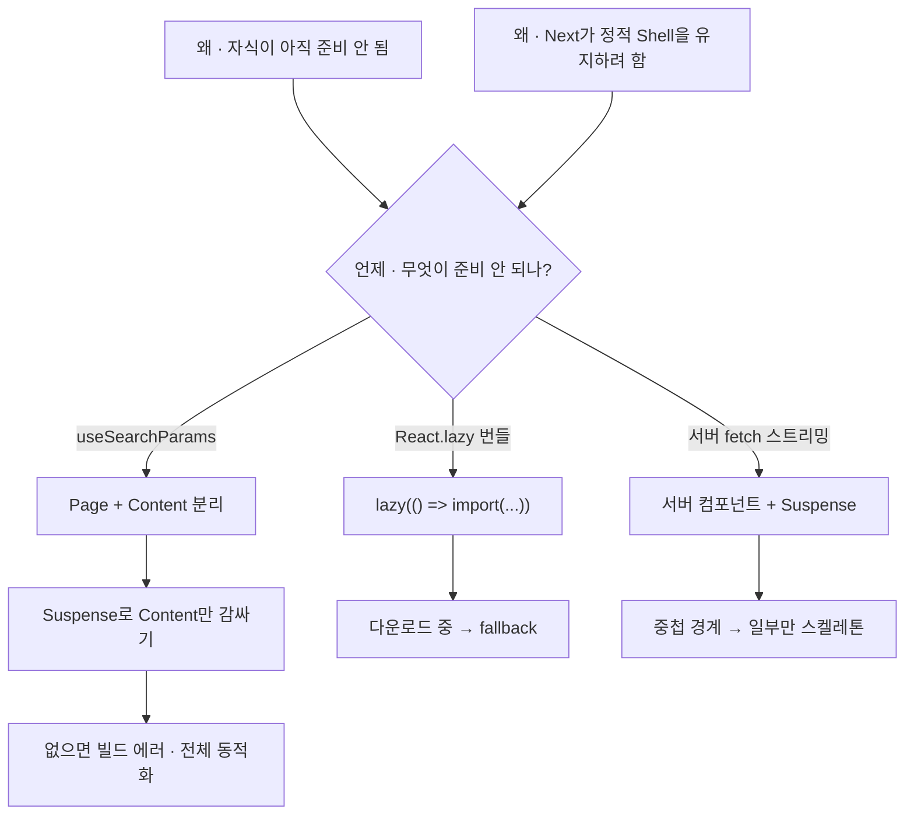

---
aliases:
  - Suspense
  - Loading
  - useSearchParams
tags:
  - React
  - NextJS
related:
  - "[[00_JS_Ecosystem_HomePage]]"
  - "[[React_useMemo_useCallback_useEffect]]"
  - "[[React_AsyncUI]]"
  - "[[NextJS_Concept]]"
---
# React_Suspense — 로딩 중 fallback 표시

> [!info] 
> Suspense = "자식 컴포넌트가 준비되기 전까지 fallback을 대신 보여주는 경계."
>  React.lazy(동적 import)나 Next.js의 useSearchParams처럼 "렌더 시점에 아직 준비 안 된 것"이 있을 때 필요하다.

---
# 흐름도



> fallback — 짧으면 null/텍스트 · 길면 스켈레톤  
> 클릭 후 fetch · localStorage — Suspense 대신 [[React_AsyncUI]]

---

# 기본 형태 ⭐️⭐️⭐️

```tsx
import { Suspense } from 'react';

<Suspense fallback={<p>불러오는 중…</p>}>
  <SlowComponent />
</Suspense>
```

```txt
fallback:
  SlowComponent가 "아직 준비 안 됨"을 신호하는 동안 대신 보여줄 UI
  로딩 스피너, 스켈레톤, 텍스트 모두 가능

Suspense가 감지하는 "준비 안 됨":
  React.lazy() — 코드를 아직 다운로드 중
  use(promise) — 데이터를 아직 받는 중 (React 19+)
  Next.js의 특정 훅 — useSearchParams 등 (아래 참고)
```

---

# Next.js에서 Suspense가 필수인 경우 ⭐️⭐️⭐️⭐️

## useSearchParams() ⭐️⭐️⭐️⭐️

```tsx
// ❌ Suspense 없이 useSearchParams 쓰면 빌드 에러
'use client';
export default function Page() {
  const searchParams = useSearchParams();
  return <div>{searchParams.get('token')}</div>;
}
// Error: useSearchParams() should be wrapped in a suspense boundary

// ✅ 올바른 패턴 — 두 컴포넌트로 분리
'use client';
function OAuthCallbackContent() {
  const searchParams = useSearchParams();
  const token = searchParams.get('accessToken');
  const next  = searchParams.get('next') ?? '/';
  // ...토큰 저장, 라우팅 로직
}

export default function OAuthCallbackPage() {
  return (
    <Suspense fallback={<p className="text-center text-sm text-neutral-500">불러오는 중…</p>}>
      <OAuthCallbackContent />
    </Suspense>
  );
}
```

```txt
왜 useSearchParams에 Suspense가 필요한가:

Next.js는 페이지를 가능하면 서버에서 정적으로 렌더링(Static Shell)하려 함
useSearchParams()는 브라우저 URL의 쿼리스트링을 읽는 것 — 서버에서는 알 수 없음
→ 이 컴포넌트는 클라이언트에서 동적으로 렌더링해야 함

Suspense가 없으면:
  Next.js가 "이 컴포넌트 때문에 페이지 전체를 동적으로 렌더링해야 한다"고 판단
  → 빌드 시 경고, 또는 페이지 전체 성능 저하

Suspense로 감싸면:
  Suspense 경계 안쪽만 동적 렌더링으로 격리
  Suspense 바깥(OAuthCallbackPage 자체)은 정적 Shell로 유지
  → 페이지 로딩이 더 빠름 + 에러 없음

패턴: 항상 두 컴포넌트로 분리
  OAuthCallbackPage    → Suspense 래퍼 (export default, 정적 Shell)
  OAuthCallbackContent → useSearchParams 사용 (Suspense 안)
```

## 그 외 Suspense가 필요한 Next.js 훅

```txt
useSearchParams()   쿼리스트링 읽기
useCookies()        일부 쿠키 관련 훅
usePathname()       → 이건 Suspense 불필요 (서버에서도 알 수 있음)
```

---

# React.lazy — 코드 분할 ⭐️⭐️⭐️

```tsx
import { lazy, Suspense } from 'react';

// 필요할 때만 번들을 다운로드 — 첫 로딩 속도 개선
const HeavyChart = lazy(() => import('./HeavyChart'));

function Dashboard() {
  return (
    <Suspense fallback={<div className="skeleton h-64 w-full" />}>
      <HeavyChart />
    </Suspense>
  );
}
```

```txt
React.lazy + Suspense:
  컴포넌트를 처음 렌더링하는 순간에 JS 번들을 동적으로 다운로드
  다운로드되는 동안 → fallback 표시
  완료되면 → 실제 컴포넌트로 교체

언제 유용한가:
  무거운 차트 라이브러리, 에디터, 지도 컴포넌트
  모달처럼 "열었을 때만 필요한" 컴포넌트
  초기 번들 크기를 줄여 첫 로딩 속도를 높이고 싶을 때
```

---

# 중첩 Suspense ⭐️⭐️

```tsx
<Suspense fallback={<PageSkeleton />}>     {/* 페이지 전체 */}
  <Header />
  <Suspense fallback={<FeedSkeleton />}>   {/* 피드만 */}
    <Feed />
  </Suspense>
  <Sidebar />
</Suspense>
```

```txt
중첩 Suspense의 동작:
  안쪽 Suspense(Feed)가 준비 안 되면 → FeedSkeleton만 표시
  Header, Sidebar는 영향 없이 그대로 표시

  안쪽 Suspense가 없었다면:
  Feed가 준비 안 되면 → 바깥쪽 PageSkeleton 전체가 표시
  Header, Sidebar도 가려짐

→ 경계를 좁게 잡을수록 나머지 UI를 먼저 보여줄 수 있음
```

---

# fallback 설계 ⭐️⭐️

```tsx
// 단순 텍스트
<Suspense fallback={<p>불러오는 중…</p>}>

// 스켈레톤 — 실제 레이아웃과 비슷한 형태
<Suspense fallback={<div className="skeleton h-12 w-full rounded" />}>

// 스피너
<Suspense fallback={<Spinner className="mx-auto" />}>

// null — 아무것도 안 보여줌 (깜빡임이 싫을 때)
<Suspense fallback={null}>
```

```txt
fallback 선택 기준:
  로딩 시간이 짧다(< 200ms) → null 또는 단순 텍스트 (스켈레톤이 오히려 번쩍임)
  로딩 시간이 길다(> 500ms) → 스켈레톤 (레이아웃 안정성)
  사용자가 "뭔가 로딩 중"임을 알아야 할 때 → 스피너 + 텍스트
```

---

# Suspense vs useEffect로 데이터 페칭 ⭐️⭐️⭐️

```txt
Next.js App Router에서는 서버 컴포넌트가 async/await로 직접 데이터 페칭 가능
→ useEffect + loading state 패턴보다 서버 컴포넌트 + Suspense가 더 권장됨

useEffect 방식 (Client Component):
  렌더 → useEffect 실행 → fetch → setState → 리렌더
  사용자는 빈 화면 → 데이터 채워진 화면 순서로 봄

서버 컴포넌트 + Suspense 방식:
  서버에서 fetch 완료 후 HTML 스트리밍
  Suspense fallback 표시 → 데이터 포함된 컴포넌트 교체
  사용자는 스켈레톤 → 완성된 화면 순서로 봄

useEffect 데이터 페칭이 여전히 필요한 경우:
  사용자 인터랙션에 반응하는 fetch (버튼 클릭 후 요청 등)
  클라이언트에서만 알 수 있는 데이터 (localStorage, 브라우저 API)
  → [[React_AsyncUI]] 참고
```

---

# 한눈에

```txt
기본 형태:
  <Suspense fallback={로딩UI}>
    <준비되는데 시간이 걸리는 컴포넌트 />
  </Suspense>

Next.js에서 필수인 경우:
  useSearchParams() 쓰는 컴포넌트
  → 반드시 Suspense로 감싸야 빌드 에러 없음
  → 패턴: Page(Suspense 래퍼) + Content(useSearchParams 사용) 두 컴포넌트 분리

React.lazy:
  const C = lazy(() => import('./C'))
  → 첫 렌더 시 번들 다운로드 → 완료까지 fallback

중첩:
  경계를 좁게 잡을수록 나머지 UI를 먼저 표시 가능

fallback:
  짧은 로딩 → null / 텍스트
  긴 로딩 → 스켈레톤 (레이아웃과 비슷한 형태)
```