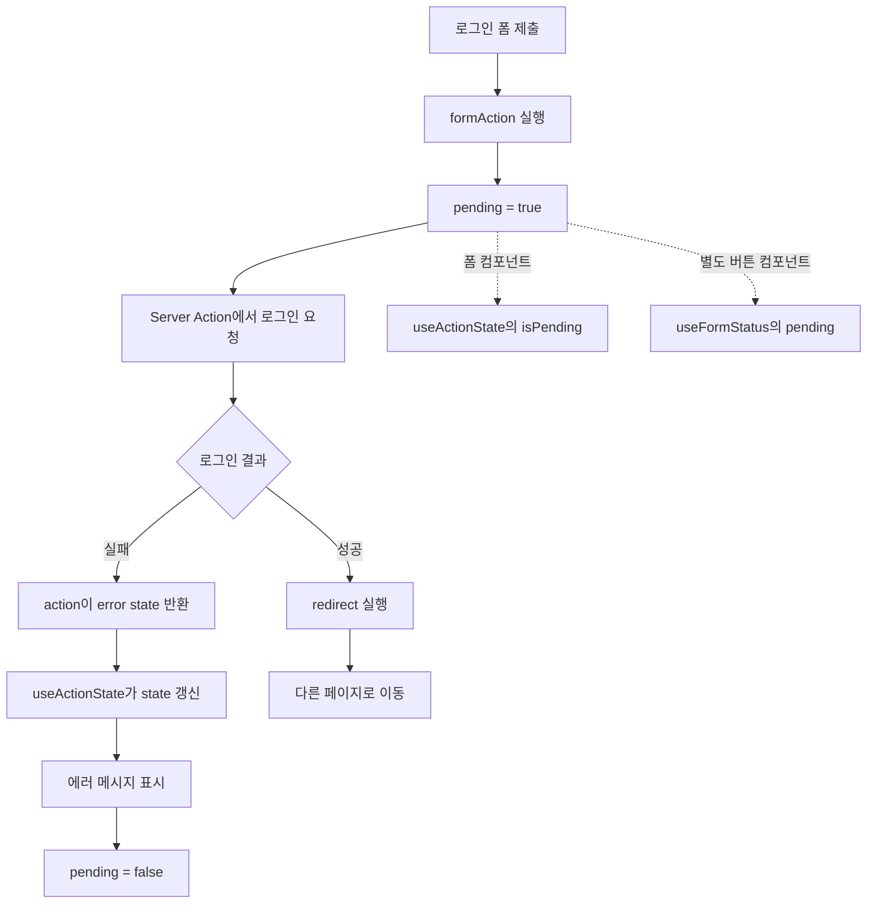

---
aliases:
  - React_useActionState
  - useActionState
  - useFormStatus
tags:
  - React
related:
  - "[[00_JS_Ecosystem_HomePage]]"
  - "[[HTML_FormData]]"
  - "[[NextJS_Server_Actions]]"
---
# React_useFormStatus — useActionState & useFormStatus

> [!info] 
> 한마디로: `useActionState`는 "제출 결과 + 처리중 여부"를 한 번에 들고 있게 해주는 훅(반환값 3개: `[state, formAction, isPending]`)이고, 
> 
> `useFormStatus`는 그 처리중 여부를 더 아래쪽 자식 컴포넌트에서 읽어야 할 때 쓰는 훅이다. 둘 다 React 19부터 정식 기능이고, Next.js 없이 순수 React만으로도 동작한다.

```txt
이 노트에서 가장 자주 막히는 지점은 "왜 액션 함수의 첫 번째 인자가 formData가 아니라
prevState인가" 와 "isPending이 대체 어디서 나오는가" 두 가지임
→ 이 두 가지를 먼저 확실히 잡고 나머지를 보면 훨씬 쉬워짐
```

---

# 왜 필요한가 ⭐️

```txt
평범한 액션 함수는 실패하면 그냥 throw 함
→ throw 한 에러는 (Next.js라면) 에러 오버레이/error.tsx 로 가버려서
  "이 폼 위에 보여줄 메시지" 로 자연스럽게 쓰기 어려움

또한 폼을 제출하고 응답이 올 때까지 "처리 중" 임을 보여주려면
버튼을 눌렀을 때부터 응답이 올 때까지의 상태를 어딘가에서 추적해야 함

→ 이 두 가지(결과 상태 / 처리중 상태)를 위해 React가 제공하는 전용 훅이 각각 있음
```

```txt
⚠️ 둘 다 React 자체 기능임 — Next.js Server Action 전용이 아님
   "use server" 없이, 그냥 클라이언트에서 도는 async 함수만으로도 똑같이 동작함
   실무에서 Server Action과 자주 같이 보이는 건 "둘을 합치면 폼 처리가 깔끔해져서"일 뿐
```

---

# 폼이 액션 함수에 FormData를 자동으로 넘기는 방식

```txt
<form action={어떤함수}> 처럼 함수를 action에 직접 넘기면
제출 시점에 폼 안의 input/select/checkbox 값들이 모여서
브라우저 네이티브 FormData 객체 하나로 만들어지고, 그게 그 함수의 인자로 들어감

→ FormData 자체의 메서드(get/getAll 등)는 [[HTML_FormData]] 참고
   (이 노트는 "그 FormData를 React 훅들이 어떻게 다루는가"에만 집중)
```

---

# 액션 함수 시그니처 — 두 가지 형태 ⭐️⭐️⭐️

```txt
헷갈리는 지점: 같은 "액션 함수"인데 어디에 쓰느냐에 따라 인자 개수가 다름
```

| 어디에 쓰는 액션인가                   | 시그니처                                            | 인자 개수           |
| ----------------------------- | ----------------------------------------------- | --------------- |
| `<form action={fn}>`에 직접 넘김   | `(formData: FormData) => void \| Promise<void>` | 1개              |
| `useActionState(fn, 초기값)`에 넘김 | `(prevState, formData: FormData) => 다음State`    | 2개, state가 앞에 옴 |

```typescript
// 1개 인자 — 그냥 폼에 직접 거는 액션 (결과를 어디 보여줄지 신경 안 쓸 때)
async function plainAction(formData: FormData) {
  // ...
}

// 2개 인자 — useActionState에 넘길 액션 (결과를 state로 들고 있어야 할 때)
async function statefulAction(prevState: FormState, formData: FormData): Promise<FormState> {
  // ...
}
```

## 이 모양이 낯설지 않은 이유 — reduce / useReducer와 같은 구조 ⭐️

```txt
array.reduce((누적값, 현재값) => 다음누적값, 초기값)
useReducer((state, action) => 다음state, 초기값)
useActionState(fn, 초기값)        ← fn: (state, formData) => 다음state

세 군데 모두 "이전 결과 + 새 입력 → 다음 결과" 라는 같은 패턴임
useActionState 는 "폼 제출"을 매번 새 입력으로 보고, 그 결과를 계속 누적해서 들고 있는 것

→ React가 매번 prevState를 다시 넣어주는 이유:
  React는 "지금까지 액션이 마지막으로 반환한 값"을 기억해뒀다가
  다음 제출이 일어날 때 그 값을 첫 번째 인자로 다시 넘겨줌
  (네가 직접 어딘가에 저장하지 않아도 됨 — 그게 이 훅이 대신 해주는 일)
```

## prevState를 안 쓸 때 — `_prev` 밑줄 컨벤션

```txt
액션 안에서 이전 상태를 참고할 필요가 없으면(단순 검증 후 메시지만 반환하는 경우 등)
관습적으로 매개변수 이름 앞에 밑줄을 붙임: _prevState, _prev 등

"시그니처상 자리는 차지해야 하지만 본문에서는 안 쓴다"는 뜻의 표시
ESLint의 no-unused-vars 류 규칙도 보통 밑줄로 시작하는 인자는 경고에서 제외해줌
```

---

# useActionState — 결과 state + 처리중 여부를 한 번에 ⭐️⭐️⭐️

```txt
React 19 정식 훅 (React 18의 실험판 useFormState 와 같은 개념 — 이름만 바뀜)
반환값은 항상 3개: [state, formAction, isPending]
```

```typescript
// action.ts — 범용 형태
type FormState = { message?: string };

async function submitAction(
  _prevState: FormState,
  formData: FormData,
): Promise<FormState> {
  // ... 검증/처리 로직 ...
  if (실패조건) {
    return { message: '에러 메시지' };   // throw 대신 "반환"
  }
  return { message: '성공' };
}
```

```tsx
// 폼 컴포넌트 — 범용 형태
'use client';
import { useActionState } from 'react';

export default function MyForm() {
  const [state, formAction, isPending] = useActionState(submitAction, {});

  return (
    <form action={formAction}>
      {/* ... 입력 필드들 ... */}
      {state.message && <p>{state.message}</p>}
      <button type="submit" disabled={isPending}>
        {isPending ? '처리 중...' : '제출'}
      </button>
    </form>
  );
}
```

|반환값|뜻|
|---|---|
|`state`|액션이 마지막으로 반환한 값 (처음엔 초기값)|
|`formAction`|`<form action={...}>`에 그대로 넣는, React가 감싸놓은 액션 함수|
|`isPending`|지금 이 액션이 처리 중인지 (제출 시작 ~ 응답 도착까지 `true`)|

```txt
throw 대신 return 하는 기준:
  검증 실패처럼 "충분히 예상 가능한 실패" → return { message: ... }
  정말 예외적인 진짜 버그/에러            → 그대로 throw (숨기면 안 됨)

isPending은 따로 useState로 관리하지 않아도 됨 — useActionState가
"액션이 호출된 시점 ~ 결과가 돌아온 시점"을 자동으로 추적해서 주는 값
```

---

# 왜 같은 컴포넌트에 useState와 useActionState가 같이 있나 ⭐️⭐️

```txt
둘은 서로 대체 관계가 아니라 — "제출 전" 과 "제출 후" 를 나눠서 담당함:

  useState         제출 전, 화면에서 사용자가 조작하는 동안의 상태
                    (체크박스 선택값, 입력 중인 텍스트 등 — 조작마다 바뀜)
  useActionState    제출이 실제로 일어난 "이후"의 상태
                    (액션이 반환한 성공/실패 결과, 그리고 지금 처리 중인지)

→ 폼을 제출하는 순간, useState로 들고 있던 값들이 FormData 안에 담겨서
  useActionState에 등록한 액션 함수로 넘어감
  그 다음부터는 useActionState가 "그 제출이 어떻게 됐는지"를 책임짐
```

```typescript
const [selected, setSelected] = useState<string[]>([]);                  // 제출 전: 사용자 조작 상태
const [state, formAction, isPending] = useActionState(submitAction, {}); // 제출 후: 결과 상태
```

```txt
한쪽이 다른 쪽을 없애주지 않음 — 폼에 "사용자가 직접 조작하는 입력"이 있다면
useState는 그대로 필요함. useActionState는 오직 "제출"이라는 이벤트 이후의 흐름만 담당
```

---

# useFormStatus — 더 아래 자식 컴포넌트에서 처리중 여부 읽기 ⭐️⭐️⭐️

```txt
useFormStatus 는 "지금 가장 가까운 부모 <form> 이 처리 중인지" 를 알려주는 훅
주로 제출 버튼에서 "처리 중..." 표시나 중복 클릭 방지에 씀
```

```tsx
'use client';
import { useFormStatus } from 'react-dom';

function SubmitButton() {
  const { pending } = useFormStatus();
  return (
    <button type="submit" disabled={pending}>
      {pending ? '처리 중...' : '제출'}
    </button>
  );
}
```

## ⚠️ 반드시 "폼의 자식 컴포넌트" 안에서만 동작함 ⭐️⭐️

```tsx
// ❌ 폼을 직접 렌더링하는 컴포넌트 안에서 쓰면 동작 안 함 (항상 pending: false)
function MyForm() {
  const { pending } = useFormStatus();   // 여기선 안 됨!
  return <form action={myAction}>...</form>;
}

// ✅ 자식 컴포넌트로 분리해야 정상 동작
function SubmitButton() {
  const { pending } = useFormStatus();   // <form>의 "자식"이라 정상 동작
  return <button disabled={pending}>제출</button>;
}

function MyForm() {
  return (
    <form action={myAction}>
      {/* ... 입력 필드들 ... */}
      <SubmitButton />   {/* form의 자식으로 렌더링됨 */}
    </form>
  );
}
```

```txt
왜 자식 컴포넌트여야 하는가:
  useFormStatus는 "가장 가까운 부모 <form>"의 상태를 구독하는 방식으로 동작함
  그 <form>을 직접 그리고 있는 컴포넌트 자기 자신은 아직 "그 폼의 자식" 위치가 아니라서
  React 내부적으로 그 폼의 상태를 읽어올 수 없음
```

## useActionState의 isPending과 뭐가 다른가 ⭐️

```txt
헷갈리는 지점: useActionState도 isPending을 주는데, useFormStatus도 pending을 줌
→ 같은 정보를 두 군데서 주는 게 아니라, "어디서 읽을 수 있는가"가 다름
```

|기준|useActionState의 `isPending`|useFormStatus의 `pending`|
|---|---|---|
|읽을 수 있는 위치|useActionState를 호출한 그 컴포넌트 안에서만|폼의 자식 컴포넌트 어디서든|
|폼이 Server Component여도 되나|아니요 — useActionState 자체가 훅이라 Client Component 필요|예 — 버튼만 Client Component면 됨|
|여러 폼에서 재사용하는 버튼 컴포넌트에 적합한가|아니요 — 매번 isPending을 prop으로 내려줘야 함|예 — prop 없이 가장 가까운 폼을 자동으로 구독함|

```txt
정리하면, 지금 폼을 렌더링하는 컴포넌트 안에서 바로 처리중 여부가 필요하면
→ useActionState의 isPending으로 충분함 (대부분의 경우 이걸로 끝남)

useFormStatus가 따로 필요한 경우는 보통 둘 중 하나:
  1. 여러 폼에서 공유하는 "제출 버튼" 컴포넌트를 따로 만들어서 쓸 때
     (그 버튼 컴포넌트 입장에서는 자기를 쓰는 폼이 어떤 useActionState를 쓰는지 알 필요가 없어짐)
  2. <form>을 렌더링하는 쪽이 Server Component라서 useActionState 자체를 못 쓸 때
     (제출 버튼만 별도 Client Component로 빼서 useFormStatus로 읽음)
```

```txt
pending으로 할 수 있는 것 (둘 다 공통):
  버튼 비활성화 (중복 제출 방지)
  "처리 중..." 같은 로딩 텍스트로 교체
  스피너 표시 등
```

---

# 둘을 같이 쓰는 흐름 — 로그인 폼 예시 ⭐️⭐️⭐️

```txt
부모 컴포넌트  → useActionState로 state/formAction 관리, <form action={formAction}>
자식(제출 버튼) → useFormStatus로 pending만 따로 구독 (재사용 가능한 버튼으로 분리한 경우)
```



```txt
이 흐름에서 각 훅의 역할:

- `useActionState`
  - 폼의 Server Action을 실행
  - action이 반환한 상태를 `state`에 반영
  - 로그인 실패 시 오류 메시지를 화면에 표시
  - 세 번째 반환값인 `isPending`으로 제출 중 상태 확인 가능

- `useFormStatus`
  - 현재 `<form>`의 제출 상태를 자식 컴포넌트에서 읽음
  - 제출 버튼을 별도 컴포넌트로 분리했을 때 `pending`을 확인하는 용도로 사용

따라서 제출 중 상태는 둘 중 하나를 선택한다.

- 폼을 관리하는 컴포넌트에서 사용 → `useActionState`의 `isPending`
- 폼 내부의 별도 버튼 컴포넌트에서 사용 → `useFormStatus`의 `pending`

`redirect()`, `redirectTo`, `redirect: false`의 차이는  
[[Next_Auth#redirect() vs redirectTo vs redirect: false]] 참고.

이 프로젝트의 실제 로그인 폼 구현은 [[Project_Notes]] 참고.
```

---

# 다중 선택 + 검증 폼 — 전체 흐름 한 번에 ⭐️⭐️

```txt
체크박스 여러 개 중 N~M개를 골라야 하는 폼처럼,
"제출 전 사용자 조작(useState)" + "제출 후 검증/결과(useActionState)"가
한 컴포넌트 안에 같이 들어가는 흔한 패턴
```

```tsx
'use client';
import { useActionState, useState } from 'react';

type FormState = { message?: string };

const MIN_SELECT = 1;
const MAX_SELECT = 3;

async function submitAction(
  _prevState: FormState,
  formData: FormData,
): Promise<FormState> {
  const selected = formData.getAll('options') as string[];   // 체크박스들 — name="options" 로 통일

  if (selected.length < MIN_SELECT || selected.length > MAX_SELECT) {
    return { message: `${MIN_SELECT}~${MAX_SELECT}개를 선택해주세요.` };
  }

  // TODO: 실제 제출 로직 (fetch / Server Action 호출 등)
  return { message: '제출 완료' };
}

export default function SelectableForm() {
  const [state, formAction, isPending] = useActionState(submitAction, {});
  const [selected, setSelected] = useState<string[]>([]);   // 체크박스 선택 상태 — UI 표시용

  return (
    <form action={formAction}>
      {/* 체크박스 목록 — onChange로 selected를 갱신해서 화면에 즉시 반영,
          실제 제출값은 name="options" 가 붙은 input들에서 FormData로 다시 모아짐 */}
      {state.message && <p>{state.message}</p>}
      <button type="submit" disabled={isPending}>
        {isPending ? '처리 중...' : '제출'}
      </button>
    </form>
  );
}
```

```txt
여기서 selected(useState)와 formData.getAll('options')(제출 시점)는
"같은 값을 두 번 들고 있는 것"처럼 보이지만 목적이 다름:
  selected     화면에 "지금 몇 개 골랐는지" 즉시 보여주기 위한 것 (제출 전)
  getAll(...)  실제로 서버/액션에 보낼 값 (제출 시점에 폼에서 다시 모음)

→ 이 둘을 동기화하는 패턴(controlled checkbox)은 체크박스 입력 자체의 주제라
  별도로 다룰 만하면 새 노트([[React_Checkbox]] 등)로 분리 가능 — 필요해지면 알려줄 것
```

---

# 한눈에

```txt
useActionState(action, 초기값) → [state, formAction, isPending]
  state       action이 반환한 마지막 값 (throw 대신 return 해야 잡힘)
  formAction  <form action={formAction}>에 그대로 사용
  isPending   지금 이 액션이 처리 중인지 — 같은 컴포넌트 안에서만 읽을 수 있음

useFormStatus() → { pending, ... }
  반드시 <form>의 자식 컴포넌트 안에서만 호출
  여러 폼에서 재사용하는 버튼, 또는 부모가 Server Component일 때 필요

둘 다 "use client" 컴포넌트에서만 사용 가능 (Server Component에서는 직접 호출 불가)
둘 다 Next.js 전용 기능 아님 — React 19 자체 기능, Server Action 없이도 동작함
```

```txt
액션 함수 시그니처 한 번 더:
  그냥 폼에 직접 거는 액션          → (formData) => ...
  useActionState에 넘기는 액션      → (prevState, formData) => 다음state
                                      (안 쓰는 prevState는 _prev로 표시)

useState ↔ useActionState 역할 한 번 더:
  useState         제출 전 — 사용자가 조작하는 동안의 상태
  useActionState    제출 후 — 액션 결과 + 처리중 여부
```