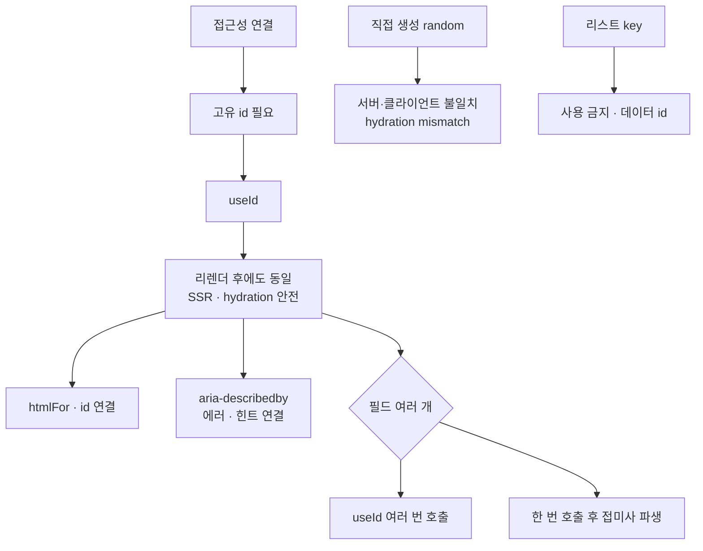

---
aliases:
  - aia-describedby
  - htmlFor
  - useId
tags:
  - React
related:
  - "[[00_JS_Ecosystem_HomePage]]"
  - "[[NextJS_ServerClient]]"
  - "[[React_useMemo_useCallback_useEffect]]"
  - "[[JS_DOM]]"
---
# React_useId — 접근성용 안정적인 고유 ID 생성

> [!info] 
> `useId`는 React 18+에서 제공하는 훅으로, 컴포넌트마다 고유하고 안정적인 ID 문자열을 생성한다. 
> SSR 환경에서 서버/클라이언트 ID가 일치하고, 같은 컴포넌트가 여러 번 렌더링돼도 각자 다른 ID를 가진다.


---
# 흐름도



```txt
random은 SSR에서 서버·클라이언트 id가 달라짐 · useId는 컴포넌트 위치 기준으로 항상 일치
htmlFor·id · aria-describedby 연결용 · 리스트 key에는 데이터 고유 id 사용
```

---

# 왜 필요한가 — 직접 ID를 만들면 안 되는 이유 ⭐️⭐️⭐️⭐️

```tsx
// 직접 만들면 SSR에서 문제가 생길 수 있음
const id = `input-${Math.random()}`;
```

```txt
Math.random()은 호출될 때마다 다른 값을 줌 — 서버가 렌더링할 때 만든 id와
클라이언트가 hydration하면서 다시 계산한 id가 서로 달라짐

→ label의 htmlFor와 input의 id가 서로 안 맞게 돼서 접근성 연결이 깨지거나,
  React가 "서버와 클라이언트 렌더링 결과가 다르다(hydration mismatch)"는 경고를 띄움
  (서버/클라이언트 렌더링 자체의 차이는 [[NextJS_ServerClient]] 참고)

useId는 React 내부적으로 컴포넌트 트리상의 "위치"를 기준으로 id를 생성해서,
같은 컴포넌트라면 서버에서 만든 값과 클라이언트에서 만든 값이 항상 똑같음

왜 Math.random()이나 직접 만든 ID를 쓰면 안 되는가:
  Math.random() → SSR에서 서버/클라이언트 값이 달라져 hydration 오류
  전역 카운터  → 동시성 모드에서 렌더링 순서가 달라지면 ID 불일치
  useId        → React가 렌더트리 구조 기반으로 ID 생성 → SSR에서도 일치
```

---

# 기본 사용법 ⭐️⭐️⭐️⭐️

```tsx
import { useId } from 'react';

function EmailField() {
  const id = useId();   // ':r0:', ':r1:', ... 형태의 고유 문자열

  return (
    <div>
      <label htmlFor={id}>이메일</label>
      <input id={id} type="email" />
    </div>
  );
}
```

```txt
useId()가 반환하는 값:
  ':r0:', ':r1:' 같은 형태의 문자열
  컴포넌트 인스턴스마다 고유 — 같은 컴포넌트를 두 번 쓰면 서로 다른 ID
  렌더링이 반복돼도 동일한 값 유지 (stable)
```

---

# 실전 — label/input 연결 ⭐️⭐️⭐️⭐️

```tsx
const emailId = useId();

return (
  <>
    <label htmlFor={emailId}>이메일</label>
    <input id={emailId} type="email" />
  </>
);
```

```txt
htmlFor와 id가 일치해야:
  label을 클릭하면 연결된 input에 자동으로 포커스가 이동함
  스크린리더가 "이건 이메일 입력칸이다"라고 label 텍스트를 읽어서 알려줄 수 있음
```

---
# 접근성 — aria 속성과 연결 ⭐️⭐️⭐️

```typescript
function PasswordField() {
  const id = useId();
  const descId = `${id}-desc`;   // 하나의 useId에서 여러 ID 파생

  return (
    <div>
      <label htmlFor={id}>비밀번호</label>
      <input
        id={id}
        type="password"
        aria-describedby={descId}   // 설명 요소 연결
      />
      <p id={descId}>8자 이상, 영문+특수문자 포함</p>
    </div>
  );
}
```

```txt
하나의 useId로 여러 관련 ID 만들기:
  `${id}-label`, `${id}-input`, `${id}-desc` 패턴
  useId를 여러 번 호출하는 것보다 하나에서 파생하는 게 일관성 있음

접근성 용도:
  htmlFor / id 연결  →  label 클릭 시 input 포커스
  aria-describedby   →  스크린리더에 설명 요소 연결
  aria-labelledby    →  스크린리더에 레이블 요소 연결
```

---
# 실전 — 입력칸이 여러 개인 컴포넌트 ⭐️⭐️⭐️⭐️


```typescript
export function EmailInput({ error, hint, onEmailChange }: EmailInputProps) {
  const localId       = useId();   // 이메일 아이디 입력칸
  const domainId      = useId();   // 도메인 입력칸
  const customDomainId = useId();  // 직접 입력 도메인
  const feedbackId    = useId();   // 에러/힌트 메시지

  return (
    <>
      <label htmlFor={localId}>이메일 아이디</label>
      <input id={localId} onChange={onEmailChange} />

      <label htmlFor={domainId}>도메인</label>
      <input id={domainId} />

      <input
        aria-describedby={error ? feedbackId : undefined}
        // 에러가 있을 때만 이 입력칸과 피드백 메시지를 연결
      />
      <p id={feedbackId}>{error ?? hint}</p>
    </>
  );
}
```

```txt
입력칸마다(이메일 로컬파트/도메인/커스텀 도메인) 각자의 label과 연결할 고유 id가 필요해서
useId를 필드 개수만큼 호출한 것 — feedbackId는 입력칸이 아니라 에러/힌트 메시지 쪽에 붙임

aria-describedby={error ? feedbackId : undefined}:
  "이 입력칸을 설명하는 추가 텍스트가 feedbackId 위치에 있다"고
  스크린리더에 알려줌 — 에러 메시지가 화면에 보이는 것과 별개로, 음성으로도 같이 읽히게 해줌
  에러가 없을 때는 undefined → aria-describedby 속성 자체가 제거됨
```

---

# 스트로크 ID 생성 패턴 ⭐️⭐️


```typescript
function DrawingBoard() {
  const uid = useId();  // 이 컴포넌트 인스턴스의 고유 prefix

  const startStroke = (e: PointerEvent) => {
    const strokeId = `${uid}-stroke-${Date.now()}`;
    //                ↑ 인스턴스 prefix  ↑ 타임스탬프
    drawing.current = { id: strokeId, points: [...] };
  };
}
```


```txt
같은 페이지에 DrawingBoard가 두 개 있어도
각 인스턴스의 uid가 달라서 stroke ID가 겹치지 않음

Date.now()만 쓰면:
  두 인스턴스가 같은 밀리초에 stroke를 시작하면 ID 충돌 가능
  uid prefix로 인스턴스를 구분하면 안전
```

---

# useState / useRef와 차이


```typescript
// ❌ 렌더마다 새 값 생성 (SSR 불일치)
const id = Math.random().toString();

// ❌ 상태 변경 시 리렌더 (필요 없는 리렌더)
const [id] = useState(() => Math.random().toString());

// ❌ 렌더링 중 접근하면 안 됨
const idRef = useRef(Math.random().toString());

// ✅ SSR 안전, 안정적, 리렌더 없음
const id = useId();
```

---

# ⚠️ useId를 리스트의 key로 쓰면 안 됨 ⭐️⭐️⭐️


```typescript
// ❌ 잘못된 사용
{items.map((item) => <li key={useId()}>{item.name}</li>)}
```


```txt
useId는 "이 컴포넌트 인스턴스"를 위한 안정적인 식별자일 뿐, 데이터 자체의 고유성과는 무관함
리스트의 key는 데이터가 가진 고유 id(서버에서 온 item.id 등)를 써야 함 —
useId를 key로 쓰면 React가 리스트 항목을 제대로 추적 못 해서 불필요한 재마운트/렌더 버그가 생길 수 있음

그리고 애초에 .map 콜백 안에서 훅을 호출하는 것 자체가 React 훅 규칙 위반이기도 함
```

---

# 한눈에

```txt
useId():
  React 18+ 내장 훅
  컴포넌트 인스턴스마다 고유 + 렌더링마다 동일 (stable)
  SSR 환경에서 서버/클라이언트 ID 일치 보장

주요 용도:
  label-input 연결 (htmlFor + id)
  aria-describedby, aria-labelledby 등 접근성 속성
  여러 인스턴스가 있을 때 ID 충돌 방지 prefix

파생 패턴:
  const id = useId()
  `${id}-label` / `${id}-desc` / `${id}-stroke-${Date.now()}`

필드 여러 개:
  useId를 여러 번 호출 (각 필드마다) 또는 하나에서 파생
  aria-describedby={error ? feedbackId : undefined} — 에러 있을 때만 연결

⚠️ 리스트 key로 쓰면 안 됨:
  key는 데이터의 고유 id (item.id 등) 사용
  .map 안에서 훅 호출 = 훅 규칙 위반
```


