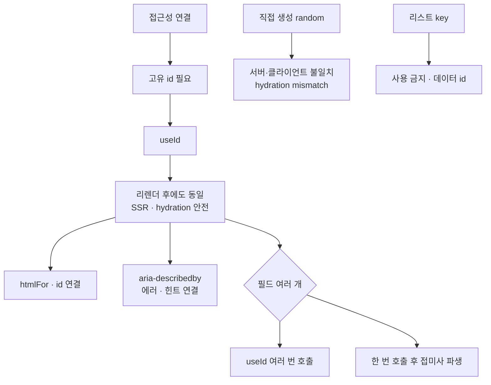

---
aliases:
  - aia-describedby
  - htmlFor
  - useId
tags:
  - React
related:
  - "[[00_JS_Ecosystem_HomePage]]"
  - "[[NextJS_ServerClient]]"
---
# React_useId — 접근성용 안정적인 고유 ID 생성

> [!info] 
> useId는 컴포넌트마다 고유하고, 서버 렌더링과 클라이언트 렌더링 결과가 항상 일치하는 ID 문자열을 만들어주는 훅이다.
>  주로 label의 htmlFor와 input의 id, aria-describedby 같은 접근성 속성을 연결할 때 쓴다.

---
# 흐름도



```txt
random은 SSR에서 서버·클라이언트 id가 달라짐 · useId는 컴포넌트 위치 기준으로 항상 일치
htmlFor·id · aria-describedby 연결용 · 리스트 key에는 데이터 고유 id 사용
```

---

# 왜 필요한가 — 직접 ID를 만들면 안 되는 이유 ⭐️⭐️⭐️⭐️

```tsx
// 직접 만들면 SSR에서 문제가 생길 수 있음
const id = `input-${Math.random()}`;
```

```txt
Math.random()은 호출될 때마다 다른 값을 줌 — 서버가 렌더링할 때 만든 id와
클라이언트가 hydration하면서 다시 계산한 id가 서로 달라짐

→ label의 htmlFor와 input의 id가 서로 안 맞게 돼서 접근성 연결이 깨지거나,
  React가 "서버와 클라이언트 렌더링 결과가 다르다(hydration mismatch)"는 경고를 띄움
  (서버/클라이언트 렌더링 자체의 차이는 [[NextJS_ServerClient]] 참고)

useId는 React 내부적으로 컴포넌트 트리상의 "위치"를 기준으로 id를 생성해서,
같은 컴포넌트라면 서버에서 만든 값과 클라이언트에서 만든 값이 항상 똑같음
```


---

# 기본 사용법 ⭐️⭐️⭐️⭐️

```tsx
import { useId } from 'react';

const id = useId(); // 예: ':r0:' 같은 형식의 문자열
```

```txt
한 번 생성되면 그 컴포넌트가 리렌더돼도 같은 값을 유지함 (useRef처럼 고정)
여러 개의 id가 필요하면 useId()를 그만큼 여러 번 호출하면 됨 — 호출마다 다른 값이 나옴
```

---

# 실전 — label/input 연결 ⭐️⭐️⭐️⭐️

```tsx
const emailId = useId();

return (
  <>
    <label htmlFor={emailId}>이메일</label>
    <input id={emailId} type="email" />
  </>
);
```

```txt
htmlFor와 id가 일치해야:
  label을 클릭하면 연결된 input에 자동으로 포커스가 이동함
  스크린리더가 "이건 이메일 입력칸이다"라고 label 텍스트를 읽어서 알려줄 수 있음
```

---

# 실전 — 입력칸이 여러 개인 컴포넌트 ⭐️⭐️⭐️⭐️

```tsx
export function EmailInput({ error, hint, success, onEmailChange }: EmailInputProps) {
  const localId = useId();
  const domainId = useId();
  const customDomainId = useId();
  const feedbackId = useId();

  return (
    <>
      <label htmlFor={localId}>이메일 아이디</label>
      <input id={localId} onChange={onEmailChange} />

      <label htmlFor={domainId}>도메인</label>
      <input id={domainId} />

      <input
        aria-describedby={error ? feedbackId : undefined}
        // 에러가 있을 때만 이 입력칸과 피드백 메시지를 연결
      />
      <p id={feedbackId}>{error ?? hint}</p>
    </>
  );
}
```

```txt
입력칸마다(이메일 로컬파트/도메인/커스텀 도메인) 각자의 label과 연결할 고유 id가 필요해서
useId를 필드 개수만큼 호출한 것 — feedbackId는 입력칸이 아니라 에러/힌트 메시지 쪽에 붙임

aria-describedby={feedbackId}: "이 입력칸을 설명하는 추가 텍스트가 feedbackId 위치에 있다"고
스크린리더에 알려줌 — 에러 메시지가 화면에 보이는 것과 별개로, 음성으로도 같이 읽히게 해줌
```

---

# 하나의 useId로 접두사만 다르게 — 대안 패턴 ⭐️⭐️

```tsx
const id = useId();
const localId = `${id}-local`;
const domainId = `${id}-domain`;
```

```txt
매번 useId()를 새로 호출하는 대신, 한 번만 호출해서 그 값에 접미사를 붙여 여러 id를 파생시키는 방법
둘 다 유효한 선택 — 필드가 아주 많다면 이 방식이 호출 횟수를 줄여줌
```

---

# useId를 리스트의 key로 쓰면 안 됨 ⭐️⭐️⭐️

```tsx
{items.map((item) => <li key={useId()}>{item.name}</li>)}  // 잘못된 사용
```

```txt
useId는 "이 컴포넌트 인스턴스"를 위한 안정적인 식별자일 뿐, 데이터 자체의 고유성과는 무관함
리스트의 key는 데이터가 가진 고유 id(서버에서 온 item.id 등)를 써야 함 —
useId를 key로 쓰면 React가 리스트 항목을 제대로 추적 못 해서 불필요한 재마운트/렌더 버그가 생길 수 있음

그리고 애초에 .map 콜백 안에서 훅을 호출하는 것 자체가 React 훅 규칙 위반이기도 함
```

---

# 한눈에

| 상황                 | 핵심                                                             |
| ------------------ | -------------------------------------------------------------- |
| `useId()`          | 컴포넌트마다 고유하고 서버/클라이언트 렌더링 결과가 항상 일치하는 id 문자열 생성                 |
| 왜 직접 안 만드나         | `Math.random()` 등은 SSR에서 서버·클라이언트 값이 달라져 hydration mismatch 위험 |
| `htmlFor` / `id`   | label과 input을 연결 — 클릭 시 포커스 이동, 스크린리더 인식                       |
| `aria-describedby` | 입력칸과 에러/힌트 메시지를 연결해 스크린리더가 같이 읽게 함                             |
| 필드 여러 개            | `useId()`를 여러 번 호출 또는 한 번 호출 후 접미사로 파생                         |
| 리스트의 `key`로 사용     | ❌ — 데이터의 고유 id를 써야 함, useId는 그 용도가 아님                          |