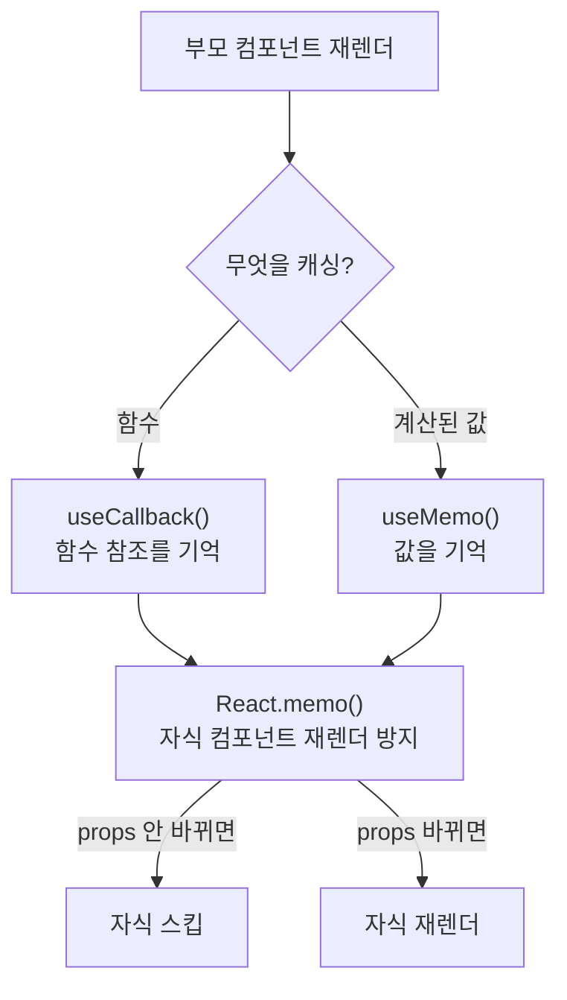
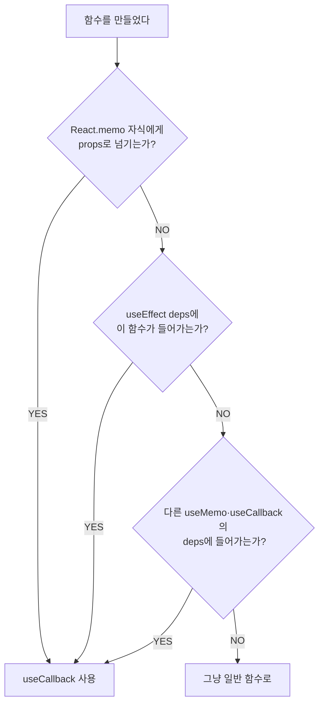

---
aliases:
  - 메모이제이션
  - React.memo
  - useCallback
  - useMemo
  - useState 지연 초기화
tags:
  - React
relations:
  - "[[00_JS_Ecosystem_HomePage]]"
  - "[[JS_Promise]]"
  - "[[React_AsyncUI]]"
  - "[[React_Calendar]]"
  - "[[React_Types]]"
  - "[[TS_Generics]]"
  - "[[React_useState]]"
  - "[[JS_Array_Methods]]"
  - "[[JS_Primitive_Methods]]"
---
# React_useMemo_useCallback — 메모이제이션

> [!info]
> React는 state/props가 바뀌면 컴포넌트 함수 전체를 다시 실행한다.
> 그 과정에서 값 계산, 객체, 배열, 함수가 모두 새로 만들어진다.
> 이게 대부분은 괜찮지만 — 계산이 비싸거나, 자식 컴포넌트에 참조를 넘길 때 문제가 생긴다.
> `useMemo`(값) · `useCallback`(함수) · `React.memo`(컴포넌트) 가 그 해결책이다.

---

# 왜 필요한가 — React 렌더링 동작 ⭐️⭐️⭐️⭐️⭐️

```txt
React 컴포넌트 = 그냥 함수
state 또는 props가 바뀌면 → 함수 전체를 처음부터 다시 실행

function MyComponent({ items }) {
  const sorted = items.sort(...);   // ← 매 렌더마다 새로 계산
  const options = { size: 'lg' };   // ← 매 렌더마다 새 객체 (참조가 바뀜)
  const onClick = () => doSomething();  // ← 매 렌더마다 새 함수 (참조가 바뀜)
  ...
}

문제 ①: 비싼 계산 — items 5000개를 매 렌더마다 정렬
문제 ②: 참조 불일치 — 부모가 렌더되면 options, onClick의 참조가 항상 바뀜
         → 자식 컴포넌트는 props가 바뀌었다고 판단 → 불필요한 재렌더
```

## 3종 세트 — 역할 분담



```txt
useMemo    → 값(계산 결과·객체·배열)을 deps가 바뀔 때만 재계산
useCallback → 함수를 deps가 바뀔 때만 새로 생성 (참조 안정화)
React.memo  → props가 같으면 자식 컴포넌트 재렌더 스킵

세트로 쓰는 이유:
  React.memo만 있어도 함수 props가 매 렌더마다 새 참조면 의미 없음
  useCallback만 있어도 React.memo 없으면 어차피 자식이 재렌더됨
  → React.memo + useCallback은 세트
```

---

# useMemo — 값 메모이제이션 ⭐️⭐️⭐️⭐️

```typescript
const memoizedValue = useMemo(
  () => expensiveCalculation(data),  // 계산 함수
  [data],                            // deps — data가 바뀔 때만 재계산
);
```

```txt
동작:
  첫 렌더  → 계산 실행 → 결과 저장
  이후 렌더 → deps 바뀌었나?
              NO  → 저장된 값 그대로 반환
              YES → 재계산 후 저장
```

## 언제 쓰는가

```typescript
// ✅ 1. 계산 비용이 클 때
const sortedList = useMemo(
  () => [...items].sort((a, b) => b.score - a.score),
  [items],
);

// ✅ 2. 객체/배열을 자식 props로 줄 때 — 참조 안정화
const queryOptions = useMemo(
  () => ({ page: 1, size: 20, q: searchQuery }),
  [searchQuery],
);

// ✅ 3. Map/Set — 비싼 자료구조 생성
const moviesByDate = useMemo(() => {
  const grouped = new Map<string, Item[]>();
  for (const item of data ?? []) {
    const list = grouped.get(item.date) ?? [];
    list.push(item);
    grouped.set(item.date, list);
  }
  return grouped;
}, [data]);

// ❌ 단순 계산 — useMemo 불필요
const double = useMemo(() => count * 2, [count]);  // 오버킬
const double = count * 2;  // ✅ 그냥 이렇게
```

---

# useCallback — 함수 메모이제이션 ⭐️⭐️⭐️⭐️

```typescript
const memoizedFn = useCallback(
  () => doSomething(value),
  [value],   // deps — value가 바뀔 때만 새 함수 생성
);
```

```txt
useMemo(() => fn, deps) === useCallback(fn, deps)
→ 둘은 동일. useCallback은 함수 메모이제이션 전용 단축형 (가독성)
```

## 언제 쓰는가

```typescript
// ✅ 1. React.memo 자식에게 함수 props로 넘길 때
const handleDelete = useCallback((id: string) => {
  setItems(prev => prev.filter(item => item.id !== id));
}, []);
// setItems는 React가 안정적으로 보장 → deps 불필요

// ✅ 2. useEffect 의존성에 함수가 들어갈 때
const fetchData = useCallback(async () => {
  const data = await api.get('/items');
  setItems(data);
}, []);

useEffect(() => {
  void fetchData();
}, [fetchData]);  // fetchData 참조 안정적 → 무한루프 방지

// ❌ 일반 자식에게 넘길 때 — React.memo 없으면 의미 없음
const handleClick = useCallback(() => setCount(c => c + 1), []);  // 불필요
const handleClick = () => setCount(c => c + 1);  // ✅ 이렇게
```

## 필요 여부 판단 플로차트



---

# React.memo — 컴포넌트 재렌더 방지 ⭐️⭐️⭐️

```typescript
// props가 같으면 재렌더 안 하는 컴포넌트
export const ItemList = React.memo(function ItemList({ items, onDelete }) {
  return (
    <ul>
      {items.map(item => (
        <li key={item.id} onClick={() => onDelete(item.id)}>{item.name}</li>
      ))}
    </ul>
  );
});
```

```txt
React.memo 동작:
  부모가 재렌더 → props 비교 (얕은 비교, shallow equal)
    props 같음 → 자식 스킵
    props 다름 → 자식 재렌더

⚠️ 얕은 비교 함정:
  { size: 'lg' }  매 렌더마다 새 객체 → 참조 다름 → "바뀌었다"고 판단
  () => ...       매 렌더마다 새 함수 → 참조 다름 → "바뀌었다"고 판단

  → 객체·함수 props는 useMemo·useCallback으로 참조를 안정화해야 React.memo가 효과 있음
```

---

# Stale Closure — deps 빠뜨리면 ⭐️⭐️⭐️⭐️

```txt
stale closure = 오래된 값을 잡고 있는 클로저
  useCallback / useMemo는 처음 만들어질 때의 스냅샷을 기억함
  deps에 없는 값은 최초 생성 시점 값으로 고정 → 이후 변경 반영 안 됨
```

```typescript
// ❌ stale closure
const handleClick = useCallback(() => {
  console.log(count);  // 항상 초기값 0 — count가 deps에 없어서
}, []);

// ✅ deps에 추가
const handleClick = useCallback(() => {
  console.log(count);  // 최신 count
}, [count]);
```

## useRef로 최신 값 유지 — 함수 참조는 안정적으로

```typescript
// count가 자주 바뀌는데 handleClick 참조도 계속 바뀌면 자식이 재렌더
// → ref로 최신 값 유지 + 함수 참조는 안정적으로 유지
const countRef = useRef(count);
useEffect(() => { countRef.current = count; }, [count]);

const handleClick = useCallback(() => {
  console.log(countRef.current);  // ref로 항상 최신 count 접근
}, []);  // 참조 안정적
```

```txt
언제:
  콜백이 매우 자주 호출되거나 (마우스 이벤트, 애니메이션)
  deps 변경이 잦아 useCallback이 의미 없어질 때

일반 상황에서는 그냥 deps에 넣는 게 더 단순
```

---

# 실무 패턴 — 세트로 쓰기 ⭐️⭐️⭐️⭐️

```typescript
function ParentComponent() {
  const [items, setItems] = useState<Item[]>([]);
  const [query, setQuery] = useState('');

  // ① 비싼 계산 → useMemo
  const filteredItems = useMemo(
    () => items.filter(item => item.name.includes(query)),
    [items, query],
  );

  // ② React.memo 자식에 넘기는 함수 → useCallback
  const handleDelete = useCallback((id: string) => {
    setItems(prev => prev.filter(item => item.id !== id));
  }, []);

  return (
    <ItemList
      items={filteredItems}    // useMemo로 참조 안정화
      onDelete={handleDelete}  // useCallback으로 참조 안정화
    />
  );
}

// React.memo — props 얕은 비교 후 스킵
const ItemList = React.memo(({ items, onDelete }: Props) => {
  return items.map(item => (
    <div key={item.id} onClick={() => onDelete(item.id)}>{item.name}</div>
  ));
});
```
