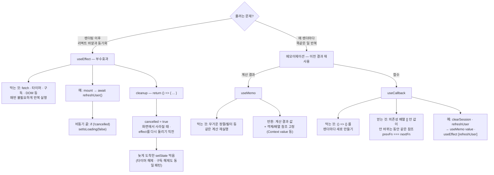

---
aliases:
  - useEffect
  - useMemo
  - useCallback
  - dependendy array
  - cancelled
  - cleanup 함수
  - 의존성배열
tags:
  - React
  - NextJS
related:
  - "[[00_JS_Ecosystem_HomePage]]"
  - "[[React_Context]]"
---
# React_useMemo_useCallback_useEffect — 언제, 무엇을, 왜

> [!info] 
>  셋 다 "매번 다시 하지 않기" 위한 훅이지만, 막는 대상이 다르다.`useEffect`는 렌더링 자체와는 별개인 "리액트 바깥과의 동기화"(부수효과)를 처리하고, `useMemo`는 "계산 결과"를,  `useCallback`은 "함수 자체"를 재사용한다.

---
# Hook이란 무엇인가 — 간단히 ⭐️

```txt
"use"로 시작하는 함수들 — 함수형 컴포넌트 안에서 React의 내부 기능
(상태 저장, 생명주기, 컨텍스트 구독 등)에 접근하게 해주는 통로

  useState     컴포넌트 하나의 지역 상태
  useEffect    렌더링 이후에 실행되는 부수효과(side effect)
  useContext   Context 채널을 구독
  useCallback  함수를 재사용(메모이제이션)
  useMemo      계산 결과를 재사용(메모이제이션)

⚠️ 규칙: 컴포넌트(또는 다른 Hook) 함수의 최상위에서만 호출 — if/for 안에서 호출 금지
   (호출 순서로 내부 상태를 추적하는 구조라서, 조건에 따라 호출 여부가 바뀌면 추적이 깨짐)
```

---

# 셋의 카테고리부터 구분하기 ⭐️⭐️⭐



| 훅             | 막는 것                                    | 반환하는 것                                                          |
| ------------- | --------------------------------------- | --------------------------------------------------------------- |
| `useEffect`   | 렌더링과 무관하게 실행돼야 하는 부수효과가 매번 불필요하게 반복되는 것 | 아무것도 반환 안 함(또는 cleanup 함수)                                      |
| `useMemo`     | 똑같은 계산을 매 렌더마다 다시 하는 것                  | 계산 결과 값                                                         |
| `useCallback` | 똑같은 함수를 매 렌더마다 새로 만드는 것                 | 함수 그 자체(계산 결과가 아니라 **함수 참조 고정** — `deps` 안 바뀌면 `prev === next`) |


```txt
useCallback "반환"이 헷갈리면:
  const fn = () => clearAuth()     // 렌더마다 새 함수 — 내용은 같아도 참조(주소)가 매번 다름
  const fn = useCallback(() => clearAuth(), [])  // [] 안 값이 안 바뀌면 지난 렌더와 같은 fn 재사용
  → 새 함수를 "만드는 게" 아니라, 다른 훅/자식이 === 로 비교할 때 참조가 안 바뀌게 하는 훅
  → 그래서 AuthProvider의 clearSession · refreshUser 처럼 useMemo value · useEffect [refreshUser]에 넣을 때 씀

useEffect "deps"가 헷갈리면 (= 의존성 배열 = 훅 맨 뒤의 []):
  useEffect(() => { init() }, [refreshUser])
                              ^^^^^^^^^^^^^^
  → "refreshUser가 바뀔 때만 effect를 다시 실행"이라는 뜻
  → cleanup은 그때 + 화면에서 사라질 때 호출됨 (그래서 cancelled = true)
```

```txt
useMemo와 useCallback은 같은 부류(메모이제이션 — "이전 결과를 기억해서 재사용")
useEffect는 다른 부류(부수효과 — "렌더링이 끝난 뒤 따로 처리해야 하는 일")
→ 셋이 코드에 같이 보이는 경우가 많아서 묶여 보이지만, 풀어야 하는 문제 자체는 서로 다름
```

---

# useEffect — 렌더링 이후에 실행되는 부수효과 ⭐️⭐️⭐️

```txt
컴포넌트가 "그리는 것"(JSX 반환) 자체와는 별개로, 그 외에 해야 하는 일들을 처리하는 자리
예: 서버에서 데이터 가져오기, 이벤트 리스너 등록, 타이머, 외부 라이브러리 연동, 문서 title 변경
```

```tsx
useEffect(() => {
  document.title = `${count}개의 알림`;
}, [count]); // count가 바뀔 때만 다시 실행
```

## 의존성 배열 3가지 패턴

|배열|실행 시점|
|---|---|
|`useEffect(fn, [])`|컴포넌트가 처음 화면에 나타날 때 딱 1번|
|`useEffect(fn, [a, b])`|처음 1번 + 이후 a 또는 b가 바뀔 때마다|
|`useEffect(fn)` (배열 자체를 생략)|매 렌더마다 — 거의 의도적으로 쓸 일이 없음|

## cleanup 함수 — return으로 정리하기 ⭐️

```tsx
useEffect(() => {
  const id = setInterval(() => console.log('tick'), 1000);
  return () => clearInterval(id); // 다음 effect 실행 전, 또는 컴포넌트가 사라질 때 호출됨
}, []);
```

```txt
구독 해제, 타이머 정리, 이벤트 리스너 제거처럼 "시작한 일을 끝낼 때 정리해야 하는 것"이 있다면
함수를 return — 안 그러면 컴포넌트가 사라져도 타이머/리스너가 계속 살아있는 누수(leak)가 생김
```

## 흔한 실수 ⭐️

|실수|문제|
|---|---|
|의존성 배열에 쓰는 값을 빠뜨림|그 값이 바뀌어도 effect가 옛날 값을 계속 참조(stale closure)|
|렌더 중에 계산 가능한 값을 useEffect+state로 만듦|불필요한 리렌더 한 번 더 발생 — 그냥 렌더 중에 바로 계산하면 됨|
|effect 안에서 비동기 함수가 끝나기 전에 컴포넌트가 사라짐|이미 사라진 컴포넌트의 state를 갱신하려다 경고/누수 — cleanup에서 취소 플래그로 막음|

## cancelled(또는 ignore) 플래그 — 비동기 effect의 결과를 무시하는 패턴 ⭐️⭐️⭐️

```tsx
useEffect(() => {
  let cancelled = false;

  async function load() {
    const data = await fetchUser(userId);
    if (!cancelled) setUser(data); // cancelled면 이 결과는 버림
  }

  load();

  return () => {
    cancelled = true;
  };
}, [userId]);
```

```txt
왜 필요한가:
  useEffect 함수 자체는 async로 선언할 수 없고(반환값이 Promise가 되면 cleanup 처리가 깨짐),
  Promise는 기본적으로 "취소"가 안 됨 — 일단 시작한 비동기 작업은 끝까지 실행됨

  그런데 userId가 빠르게 여러 번 바뀌면(예: 프로필을 빠르게 여러 번 클릭), effect가
  여러 번 실행되면서 여러 개의 load() 호출이 동시에 "떠 있을" 수 있음
  → 먼저 시작된 호출이 나중에 끝나버리면(네트워크 지연 등), 최신 userId의 결과를
    "더 늦게 도착한 옛날 userId의 결과"가 덮어써버리는 경쟁(race condition)이 생김

이 패턴이 하는 일:
  effect가 다시 실행되거나 컴포넌트가 사라질 때, cleanup이 그 effect 인스턴스의
  cancelled만 true로 바꿔둠 → 그 인스턴스의 load()가 나중에 끝나도, 결과를 state에
  반영하는 부분(if (!cancelled) ...)에서 걸러짐 — Promise 자체를 멈추는 게 아니라
  "그 결과를 더 이상 신경 안 쓴다"는 표시만 해두는 것

다른 이름: ignore, stale, isMounted 등으로도 불림 — 전부 같은 발상의 변형
더 정확한 대안: fetch라면 AbortController로 요청 자체를 진짜로 취소할 수도 있음
  (네트워크 요청까지 중단하고 싶다면 더 적합 — cancelled 플래그는 "결과를 무시"만 할 뿐
   요청 자체가 끝까지 실행되는 건 막지 못함)
```


---

# useMemo — 계산 결과를 재사용 ⭐️⭐️⭐️

```tsx
const sorted = useMemo(() => {
  return [...items].sort((a, b) => a.price - b.price); // items가 많으면 비용이 큰 계산
}, [items]);
```

```txt
items가 안 바뀌면 이전에 계산해둔 sorted를 그대로 재사용 — 정렬을 매 렌더마다 다시 안 함
items가 바뀌면 그때만 다시 계산
```

|언제 쓰면 좋은가|언제 안 써도 되는가|
|---|---|
|배열 정렬/필터링 등 데이터가 크고 계산이 무거울 때|`a + b` 같은 가벼운 계산 — 메모이제이션 비용이 계산 비용보다 더 클 수 있음|
|객체/배열을 만들어서 다른 훅의 의존성이나 Context value로 넘길 때(참조 안정화)|단순 화면 표시용 문자열 조합 등|

```txt
useMemo 자체도 공짜가 아님 — 이전 값을 기억해두고 매번 의존성을 비교하는 비용이 있음
"일단 다 useMemo로 감싸기"보다, 실제로 무거운 계산이거나 참조 안정성이 필요한 곳에만 쓰는 게 맞음
```

---

# useCallback — 함수를 재사용 ⭐️⭐️⭐️

```tsx
const handleClick = useCallback(() => {
  console.log(count);
}, [count]);
```

```txt
사실 useCallback(fn, deps)은 useMemo(() => fn, deps)와 정확히 같음
"함수를 메모이제이션하는 것"에 특화된 useMemo의 축약형일 뿐 — 별개의 메커니즘이 아님
```

|언제 필요한가|
|---|
|이 함수를 `React.memo`로 감싼 자식 컴포넌트에 props로 넘길 때 (참조가 매번 바뀌면 memo가 무력화됨)|
|이 함수를 다른 훅(`useEffect`, `useMemo` 등)의 의존성 배열에 넣어야 할 때 — 함수 참조가 안정돼야 그 훅도 안정됨|
|이 함수가 `useMemo`로 감싼 객체(예: Context value) 안에 들어갈 때 — 위와 같은 이유|

```txt
화면의 일반 버튼 onClick처럼, 자식이 memo도 아니고 다른 훅 의존성에도 안 들어간다면
useCallback 없이 그냥 매번 새 함수를 만들어도 실제로는 별 차이 없음 — 위 3가지 상황에서만 의미가 생김
```

---

# 의존성 배열 — 셋이 공유하는 개념 ⭐️⭐️

```txt
useEffect/useMemo/useCallback 모두 두 번째 인자로 배열을 받음 — "이 안의 값이 바뀔 때만 다시 실행/계산"
세 훅이 보이는 모양이 비슷해 보이는 이유가 바로 이 의존성 배열 문법을 공유하기 때문

ESLint의 react-hooks/exhaustive-deps 규칙을 켜두면, 정작 써야 하는데
배열에 빠뜨린 값을 자동으로 경고해줌 — 의존성 배열은 직접 손으로 다 챙기기보다 이 도구에 의존하는 게 안전함
```

---

# 언제 진짜 필요한가 — 과사용 주의 ⭐️⭐️⭐️

```txt
React 공식 권고: 성급한 최적화를 피할 것 — 일단 안 쓰고 작성한 뒤,
실제로 느려지는 게 체감되거나 위에서 언급한 구체적인 상황(memo 자식, 훅 의존성, 참조 안정화)에
해당할 때만 useMemo/useCallback을 추가하는 흐름이 더 안전함

useEffect는 가능하면 줄이는 쪽이 좋음 — "다른 state로부터 계산 가능한 값"은
useEffect+state 조합 대신, 렌더링 중에 바로 계산하는 게 더 간단하고 버그도 적음
useEffect는 "리액트 바깥 세계와 진짜로 동기화해야 하는 것"(네트워크, DOM, 타이머, 구독)에만 쓰는 게 원칙
```

---

# 한눈에

| 훅                       | 카테고리                             | 반환                                           | 언제                                   |
| ----------------------- | -------------------------------- | -------------------------------------------- | ------------------------------------ |
| `useEffect(fn, deps)`   | 부수효과                             | 없음 (또는 cleanup 함수)                           | 렌더링과 무관한 외부 동기화 — fetch, 구독, 타이머 등   |
| `useMemo(fn, deps)`     | 메모이제이션                           | 계산 결과 값                                      | 무거운 계산, 또는 참조 안정화가 필요한 객체/배열         |
| `useCallback(fn, deps)` | 메모이제이션 (useMemo의 함수 전용 축약형)      | **같은 참조**의 함수 (`deps` 안 바뀌면 `prev === next`) | memo 자식에게 넘기는 함수, 다른 훅의 의존성에 들어가는 함수 |
| 의존성 배열 `[]`             | 마운트 시 1회만                        |                                              |                                      |
| 의존성 배열 `[a, b]`         | a 또는 b가 바뀔 때마다                   |                                              |                                      |
| 공통 주의점                  | 셋 다 과사용하면 오히려 손해 — 실제로 필요한 상황에서만 |                                              |                                      |
