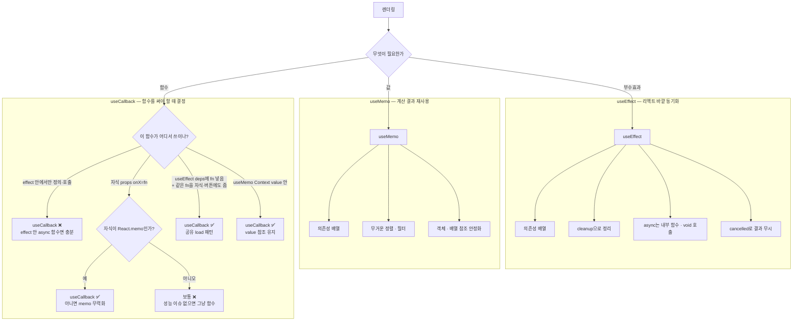
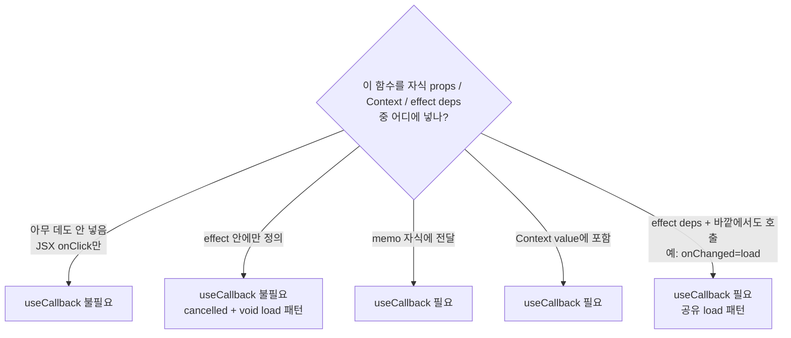

---
aliases:
  - 의존성배열
  - cancelled
  - cleanup 함수
  - dependendy array
  - useCallback
  - useEffect
  - useMemo
tags:
  - React
  - NextJS
related:
  - "[[00_JS_Ecosystem_HomePage]]"
  - "[[React_Context]]"
  - "[[NestJS_Throttle]]"
  - "[[React_useId]]"
---
# React_useMemo_useCallback_useEffect — 언제, 무엇을, 왜

> [!info]
>  셋 다 "매번 다시 하지 않기" 위한 훅이지만, 막는 대상이 다르다. `useEffect`는 렌더링 자체와는 별개인 "리액트 바깥과의 동기화"(부수효과)를 처리하고, `useMemo`는 "계산 결과"를, `useCallback`은 "함수 자체"를 재사용한다.

---
# 흐름도



```txt
useEffect만: cleanup · async void · cancelled — 메모이제이션 훅과 별개
useMemo: 무거운 계산 · Context value 등 참조 안정화
useCallback: "함수를 어딘가에 넘겨서 === 비교"가 일어날 때만
  → memo 자식 · Context value · (effect deps + 바깥에서 같은 fn 재사용)
의존성 배열 문법은 셋이 같지만, 각 훅 아래에만 해당
```

---

|훅|막는 것|반환하는 것|
|---|---|---|
|`useEffect`|렌더링과 무관하게 실행돼야 하는 부수효과가 매번 불필요하게 반복되는 것|아무것도 반환 안 함(또는 cleanup 함수)|
|`useMemo`|똑같은 계산을 매 렌더마다 다시 하는 것|계산 결과 값|
|`useCallback`|똑같은 함수를 매 렌더마다 새로 만드는 것|함수 그 자체(계산 결과가 아니라 **함수 참조 고정** — `deps` 안 바뀌면 `prev === next`)|

```
useCallback "반환"이 헷갈리면:
  const fn = () => clearAuth()     // 렌더마다 새 함수 — 내용은 같아도 참조(주소)가 매번 다름
  const fn = useCallback(() => clearAuth(), [])  // deps 안 바뀌면 지난 렌더와 같은 fn 재사용
  → 새 함수를 "만드는 게" 아니라, 다른 훅/자식이 === 로 비교할 때 참조가 안 바뀌게 하는 훅
  → AuthProvider의 clearSession · refreshUser → useMemo value에 넣을 때 ✅
  → fetch가 effect 안에서만 끝나면 useCallback ❌ (아래 「언제 쓰는가」)
  → fetch를 effect + onChanged에 같이 쓰면 useCallback ✅ (공유 load)
```

```
useMemo와 useCallback은 같은 부류(메모이제이션 — "이전 결과를 기억해서 재사용")
useEffect는 다른 부류(부수효과 — "렌더링이 끝난 뒤 따로 처리해야 하는 일")
→ 셋이 코드에 같이 보이는 경우가 많아서 묶여 보이지만, 풀어야 하는 문제 자체는 서로 다름

  useEffect  = 렌더 끝난 뒤 · 로직은 effect 안 · deps는 바뀌는 값만 (a, b …)
  useMemo    = 계산 결과 / value 객체 참조 고정
  useCallback = 함수 참조 고정 — "같은 함수를 여러 곳이 ===로 보는" 때만
```

---

# useEffect — 렌더링 이후에 실행되는 부수효과 ⭐️⭐️⭐️

```
컴포넌트가 "그리는 것"(JSX 반환) 자체와는 별개로, 그 외에 해야 하는 일들을 처리하는 자리
예: 서버에서 데이터 가져오기, 이벤트 리스너 등록, 타이머, 외부 라이브러리 연동, 문서 title 변경
```

```tsx
useEffect(() => {
  document.title = `${count}개의 알림`;
}, [count]); // count가 바뀔 때만 다시 실행
```

## 의존성 배열 3가지 패턴

|배열|실행 시점|
|---|---|
|`useEffect(fn, [])`|컴포넌트가 처음 화면에 나타날 때 딱 1번|
|`useEffect(fn, [a, b])`|처음 1번 + 이후 a 또는 b가 바뀔 때마다|
|`useEffect(fn)` (배열 자체를 생략)|매 렌더마다 — 거의 의도적으로 쓸 일이 없음|

## cleanup 함수 — return으로 정리하기 ⭐️

```tsx
useEffect(() => {
  const id = setInterval(() => console.log('tick'), 1000);
  return () => clearInterval(id); // 다음 effect 실행 전, 또는 컴포넌트가 사라질 때 호출됨
}, []);
```

```
구독 해제, 타이머 정리, 이벤트 리스너 제거처럼 "시작한 일을 끝낼 때 정리해야 하는 것"이 있다면
함수를 return — 안 그러면 컴포넌트가 사라져도 타이머/리스너가 계속 살아있는 누수(leak)가 생김
```

## 흔한 실수 ⭐️

|실수|문제|
|---|---|
|의존성 배열에 쓰는 값을 빠뜨림|그 값이 바뀌어도 effect가 옛날 값을 계속 참조(stale closure)|
|렌더 중에 계산 가능한 값을 useEffect+state로 만듦|불필요한 리렌더 한 번 더 발생 — 그냥 렌더 중에 바로 계산하면 됨|
|effect 안에서 비동기 함수가 끝나기 전에 컴포넌트가 사라짐|이미 사라진 컴포넌트의 state를 갱신하려다 경고/누수 — cleanup에서 취소 플래그로 막음|

## async 함수를 useEffect 안에서 호출하기 — void 패턴 ⭐️⭐️⭐️⭐

```txt
void 연산자 자체의 역할(Promise 반환을 의도적으로 버리는 것)은 이 섹션에서 다루지만,
NestJS Guard에서 fire-and-forget으로 쓰는 패턴(응답을 막지 않고 DB 업데이트 등을 실행)은
[[NestJS_Throttle]] 참고 — 같은 void 발상이지만 맥락이 다름
```

```tsx
useEffect(() => {
  void load(searchQ);
}, [load, searchQ]);
```

```txt
useEffect의 콜백은 직접 async로 만들 수 없음:
  useEffect(async () => { ... })  // ❌ — async 함수는 항상 Promise를 반환하는데,
                                  //    useEffect의 콜백 반환값은 "cleanup 함수 또는 undefined"여야 함
                                  //    Promise를 반환하면 React가 그걸 cleanup 함수로 착각해서
                                  //    예측하기 어려운 동작이 생길 수 있음

→ async 작업이 필요하면 항상 "내부 함수로 정의하고 호출"하는 형태를 써야 함
```

```txt
void 연산자가 하는 일:
  JS의 void 연산자는 뒤에 오는 표현식을 실행하고, 결과값을 undefined로 바꿔서 반환함
  → void load(searchQ) 는 load(searchQ)를 호출(실행은 됨)하지만,
    그 반환값(Promise)을 undefined로 바꿔서 버리는 것

void가 없으면:
  load(searchQ)를 그냥 호출하면 그 반환값(Promise)이 암묵적으로 콜백에서 반환됨
  → "이 Promise 처리 안 하고 그냥 버리는 거 맞냐?" 는 ESLint의 no-floating-promises 경고가 뜸
    (실수로 await를 빠뜨린 건지, 의도적으로 버리는 건지 코드만 봐선 구분 안 되기 때문)

void를 붙이면:
  "이게 Promise를 반환하는 거 알고, 의도적으로 버리는 것"을 명시적으로 선언 — 경고 없음
  useEffect 콜백도 void(undefined)를 반환하게 돼서 타입도 딱 맞음

→ 요약: void load(...)는 "load를 실행하되, 그 반환값(Promise)은 의도적으로 무시한다"는 선언
```

## 내부 함수 패턴 vs void 패턴 — 언제 뭘 쓰나 ⭐️⭐️⭐️

```tsx
// 방법 1 — 내부에 async 함수를 별도로 정의하고 호출 (cancelled 플래그 같이 쓸 때 더 적합)
useEffect(() => {
  let cancelled = false;
  async function load() {
    const data = await fetchData();
    if (!cancelled) setData(data);
  }
  void load();
  return () => { cancelled = true; };
}, []);

// 방법 2 — void로 직접 호출 (외부에 useCallback으로 안정화된 함수가 있을 때 간단)
useEffect(() => {
  void load(searchQ);
}, [load, searchQ]);
```

```txt
차이는 복잡도:
  void 패턴       load가 이미 useCallback으로 만들어진 안정된 함수, cancelled 불필요한 경우
  내부 함수 패턴  비동기 작업이 끝나기 전에 컴포넌트가 사라질 수 있어서 cancelled 플래그가 필요한 경우
```

## cancelled 플래그 — "이미 떠난 effect의 결과는 무시" ⭐️⭐️⭐️⭐️

```tsx
useEffect(() => {
  let cancelled = false;

  async function load() {
    const data = await fetchUser(userId);
    if (!cancelled) setUser(data); // cancelled면 이 결과는 버림
  }

  void load();

  return () => {
    cancelled = true; // effect 정리 시 — "이 effect 인스턴스는 끝났다"는 표시
  };
}, [userId]);
```

```txt
⚠️ cancelled는 fetch를 멈추는 게 아님 — 자주 하는 오해

  잘못된 해석: "reloadRelation 중이면 cancelled를 true로 바꿔라"
  맞는 해석:  "이 effect가 끝났으면(언마운트/deps 바뀜),
               fetch가 완료돼도 결과를 state에 반영하지 마라"

  fetch 자체는 cleanup이 실행돼도 끝까지 실행됨 — 네트워크 요청을 취소하는 게 아님
  cancelled = true는 "이 effect 인스턴스는 더 이상 유효하지 않다"는 표시일 뿐
  fetch가 완료된 뒤 if (!cancelled) 에서 "나 아직 유효해?" 를 확인해서
    → 유효하면(cancelled = false) setState 실행
    → 유효하지 않으면(cancelled = true) setState 무시
```

```txt
왜 필요한가 — race condition:
  userId가 빠르게 여러 번 바뀌면 effect가 여러 번 실행되고
  여러 개의 fetch가 동시에 "떠 있을" 수 있음

  userId=1 fetch 시작 (느린 네트워크)
  userId=2로 바뀜 → cleanup → cancelled=true (userId=1 effect 인스턴스 무효화)
  userId=2 fetch 시작
  userId=2 fetch 완료 → cancelled=false → setState ✅
  userId=1 fetch 완료 (늦게 도착) → cancelled=true → setState 무시 ✅

  이 체크 없으면: 늦게 도착한 userId=1의 결과가 userId=2의 최신 결과를 덮어씀
```

## reloadRelation(() => !cancelled) — 가드를 콜백으로 넘기는 패턴 ⭐️⭐️⭐️

```typescript
// reloadRelation이 "아직 유효한지 확인하는 함수"를 인자로 받는 경우
useEffect(() => {
  let cancelled = false;

  async function load() {
    await reloadRelation(() => !cancelled);
    //                   ↑ fetch 완료 후 이 함수를 호출해서 결과 반영 여부 결정
  }

  void load();
  return () => { cancelled = true; };
}, [user]);
```

```txt
() => !cancelled 를 넘기는 이유:
  reloadRelation 내부 어딘가에서 fetch 완료 후
  "지금도 이 결과를 반영해야 하는가?" 를 이 함수를 호출해서 확인
  → true (cancelled = false, 아직 유효) → setState 실행
  → false (cancelled = true, 이미 끝난 effect) → setState 무시

reloadRelation 내부에서는 대략 이런 일이 일어남:
  async function reloadRelation(isValid: () => boolean) {
    const data = await fetchRelation();
    if (!isValid()) return; // ← 여기서 가드
    setFriends(data.friends);
    setRequests(data.requests);
  }

runAction 안의 await reloadRelation() 에는 이 가드가 없는 이유:
  버튼을 눌렀다 = 사용자가 그 화면에 그대로 있다는 뜻
  버튼 클릭 → API 호출 → 완료까지 페이지를 이탈할 가능성이 낮음
  → cancelled 체크 없이 그냥 setState해도 안전
  (effect처럼 deps 변화로 인한 중간 교체가 일어나지 않기 때문)
```

## 의존성을 객체 대신 원시값으로 좁히기 ⭐️⭐️⭐️⭐️

```tsx
useEffect(() => {
  // ...
}, [user?.id]);   // user 객체 전체가 아니라 그 안의 id(문자열)만 의존성으로
```

```txt
[user]로 의존성을 두면:
  user 객체가 "내용은 같아도 참조가 바뀌면" 매번 effect가 다시 실행됨
  (예: 닉네임만 바뀌어서 user가 새 객체로 갱신돼도, 로그인한 사람 자체는 그대로인데 effect가 또 돔 —
   객체가 내용이 같아도 참조가 다르면 다른 값으로 취급된다는 것 자체는 [[JS_Operators]] 참고)

[user?.id]처럼 객체 안의 원시값(문자열/숫자)만 꺼내서 의존성에 두면:
  "진짜로 의미 있는 변화"(로그인한 사용자 자체가 바뀜)만 effect를 다시 실행시키고,
  user 객체의 다른 필드(닉네임 등)가 바뀐 것만으로는 effect가 다시 안 돔

→ "이 effect가 진짜로 반응해야 하는 게 객체 전체인가, 그 안의 특정 필드인가"를 먼저 따져보고
  필요하다면 원시값만 뽑아서 의존성에 넣는 게 더 정확함(객체 참조 전체에 의존하는 것보다 좁고 정밀함)
```


---

# useMemo — 계산 결과를 재사용 ⭐️⭐️⭐️

```tsx
const sorted = useMemo(() => {
  return [...items].sort((a, b) => a.price - b.price); // items가 많으면 비용이 큰 계산
}, [items]);
```

```
items가 안 바뀌면 이전에 계산해둔 sorted를 그대로 재사용 — 정렬을 매 렌더마다 다시 안 함
items가 바뀌면 그때만 다시 계산
```

|언제 쓰면 좋은가|언제 안 써도 되는가|
|---|---|
|배열 정렬/필터링 등 데이터가 크고 계산이 무거울 때|`a + b` 같은 가벼운 계산 — 메모이제이션 비용이 계산 비용보다 더 클 수 있음|
|객체/배열을 만들어서 다른 훅의 의존성이나 Context value로 넘길 때(참조 안정화)|단순 화면 표시용 문자열 조합 등|

```
useMemo 자체도 공짜가 아님 — 이전 값을 기억해두고 매번 의존성을 비교하는 비용이 있음
"일단 다 useMemo로 감싸기"보다, 실제로 무거운 계산이거나 참조 안정성이 필요한 곳에만 쓰는 게 맞음
```

---

# useCallback — 함수를 재사용 ⭐️⭐️⭐️

```tsx
const handleClick = useCallback(() => {
  console.log(count);
}, [count]);
```

```
사실 useCallback(fn, deps)은 useMemo(() => fn, deps)와 정확히 같음
"함수를 메모이제이션하는 것"에 특화된 useMemo의 축약형일 뿐 — 별개의 메커니즘이 아님
```

## 한 줄로 — 언제 쓰는가 ⭐️⭐️⭐️⭐️

```txt
useCallback = "이 함수의 참조(주소)가 바뀌면 안 되는 곳"이 있을 때만

  바뀌면 안 되는 이유 예:
  1) React.memo 자식이 props.fn === 이전 fn 인지 비교함
  2) useEffect(..., [load]) 가 load 참조가 바뀔 때마다 다시 돔
  3) useMemo(() => ({ load }), [load]) Context value가 load 때문에 매번 새 객체

  "함수가 있다" ≠ "useCallback이 필요하다"
  버튼 onClick만이면 매 렌더 새 함수여도 보통 문제 없음
```



|상황|useCallback|이유|
|---|---|---|
|버튼 `onClick={() => ...}` 만|❌|참조가 바뀌어도 그냥 다시 그려질 뿐|
|`useEffect` 안에 `async function load`만|❌|effect 밖이 그 함수를 deps로 안 봄|
|`React.memo` 자식에 `onReload={load}`|✅|참조 바뀌면 memo 스킵 실패|
|`useEffect(() => { void load() }, [load])` **이고** `onChanged={load}`|✅|같은 load를 effect·자식이 공유|
|Auth Context `value={{ user, logout }}`의 `logout`|✅|value 안정화용 `useMemo` deps에 들어감|

## 실전 예 — 프로필 `load` (effect + onChanged) ⭐️⭐️⭐️⭐️

```txt
문제:
  1) 화면 들어오면 / 유저·로그인 바뀌면 → 프로필·친구관계 fetch
  2) 「친구 추가」 성공 후 → 같은 fetch로 관계 UI 갱신 (onChanged)

같은 로직을 두 곳에서 씀 → load를 컴포넌트 스코프에 두고 공유해야 함
```

```tsx
// ✅ 공유 load — useCallback
const load = useCallback(async () => {
  if (!id) return;
  setLoading(true);
  try {
    const publicUser = await fetchPublicUser(id);
    setProfile(publicUser);
    if (user) {
      const [friendsList, requestList] = await Promise.all([
        fetchFriends(),
        fetchFriendRequests(),
      ]);
      setFriends(friendsList);
      setRequests(requestList);
    }
  } finally {
    setLoading(false);
  }
}, [id, user]); // load 본문이 읽는 값만

useEffect(() => {
  if (authLoading) return;
  void load();
}, [authLoading, load]);

// 액션 후 재조회 — 같은 참조
<UserProfileActions onChanged={load} ... />
```

```txt
왜 useCallback인가 (이 경우):

  useCallback 없이:
    const load = async () => { ... }  // 렌더마다 새 함수
    useEffect(() => { void load() }, [load])
    → 매 렌더 load 참조 변경 → effect가 매 렌더 재실행 → 불필요 fetch 루프 위험

  useCallback 있으면:
    [id, user]가 안 바뀌면 load 참조 유지
    → effect는 id/user(또는 authLoading)가 바뀔 때만 다시 돎
    → onChanged={load}도 같은 함수를 가리킴

왜 effect 안에만 두면 안 되나:
  onChanged에 넘길 함수가 effect 스코프 밖에 필요함
  → "effect 전용 fetch"가 아니라 "공유 reload" 이므로 useCallback이 맞음
```

```tsx
// ❌ useCallback 없이 load를 deps에 넣으면 — 참조가 매 렌더 바뀜
const load = async () => { /* fetch */ };
useEffect(() => {
  void load();
}, [load]); // load 매번 새것 → effect 폭주

// ✅ fetch가 effect에서만 끝나면 — useCallback 없이 이걸로 충분
useEffect(() => {
  let cancelled = false;
  async function load() { /* ... if (!cancelled) setX */ }
  void load();
  return () => { cancelled = true; };
}, [id, user?.id]);
// 단, 이 load는 onChanged에 못 넘김 — 바깥에 이름이 없음
```

## 정리표 — 필요한가 / 아닌가

|언제 필요한가|
|---|
|이 함수를 `React.memo`로 감싼 자식 컴포넌트에 props로 넘길 때 (참조가 매번 바뀌면 memo가 무력화됨)|
|이 함수를 다른 훅(`useEffect`, `useMemo` 등)의 의존성 배열에 넣어야 할 때 — 함수 참조가 안정돼야 그 훅도 안정됨|
|특히 **effect deps + 자식/버튼에서 같은 함수를 다시 호출**할 때 (공유 `load` / `reloadRelation`)|
|이 함수가 `useMemo`로 감싼 객체(예: Context value) 안에 들어갈 때|

```
화면의 일반 버튼 onClick처럼, 자식이 memo도 아니고 다른 훅 의존성에도 안 들어간다면
useCallback 없이 그냥 매번 새 함수를 만들어도 실제로는 별 차이 없음 — 위 상황에만 의미가 생김

체크리스트:
  1. 이 함수를 변수에 담아 여러 곳에 넘기는가?
  2. 그중 한 곳이 useEffect/useMemo deps 또는 memo props인가?
  → 둘 다 예면 useCallback
  → 아니면 보통 생략
```

## 함수형 업데이트로 useCallback 의존성 줄이기 ⭐️⭐️⭐️⭐️

```tsx
const markSaved = useCallback((id: string) => {
  setSavedIds((prev) => new Set(prev).add(id));
}, []); // savedIds를 함수 본문에서 직접 안 읽었으므로 의존성 배열이 비어있어도 안전함
```

```txt
state를 갱신할 때 "현재 값을 바탕으로 다음 값을 만들어야" 하는 경우, 두 가지 방법이 있음:

방법 1 — state를 직접 참조:
  setSavedIds(new Set(savedIds).add(id))
  → savedIds를 함수 본문에서 직접 읽으므로, useCallback의 의존성 배열에 savedIds를 넣어야 함
  → savedIds가 바뀔 때마다 이 함수도 매번 새로 만들어짐(참조가 안정되지 않음)

방법 2 — 함수형 업데이트:
  setSavedIds((prev) => new Set(prev).add(id))
  → setX에 "새 값"이 아니라 "이전 값을 받아서 다음 값을 반환하는 함수"를 넘김
  → React가 실행 시점에 최신 state를 prev로 직접 넣어주므로, 함수 본문에서 바깥의 savedIds를
    전혀 참조할 필요가 없어짐 → 의존성 배열에 안 넣어도 항상 최신 상태를 정확히 반영함

→ "state를 갱신만 하면 되고 읽지는 않아도 되는" 함수를 만들 때 함수형 업데이트를 쓰면
  useCallback의 의존성에서 그 state를 완전히 뺄 수 있어서 함수 참조가 거의 항상 안정됨(빈 배열 가능)
  (이 패턴이 실제로 쓰이는 Context 예시는 [[React_Context]]의 "Context 합성" 섹션 참고)
```

---

# 의존성 배열 — 셋이 공유하는 개념 ⭐️⭐️

```
useEffect/useMemo/useCallback 모두 두 번째 인자로 배열을 받음 — "이 안의 값이 바뀔 때만 다시 실행/계산"
세 훅이 보이는 모양이 비슷해 보이는 이유가 바로 이 의존성 배열 문법을 공유하기 때문

ESLint의 react-hooks/exhaustive-deps 규칙을 켜두면, 정작 써야 하는데
배열에 빠뜨린 값을 자동으로 경고해줌 — 의존성 배열은 직접 손으로 다 챙기기보다 이 도구에 의존하는 게 안전함
```

---

# 언제 진짜 필요한가 — 과사용 주의 ⭐️⭐️⭐️

```
React 공식 권고: 성급한 최적화를 피할 것 — 일단 안 쓰고 작성한 뒤,
실제로 느려지는 게 체감되거나 위에서 언급한 구체적인 상황(memo 자식, 훅 의존성, 참조 안정화)에
해당할 때만 useMemo/useCallback을 추가하는 흐름이 더 안전함

useEffect는 가능하면 줄이는 쪽이 좋음 — "다른 state로부터 계산 가능한 값"은
useEffect+state 조합 대신, 렌더링 중에 바로 계산하는 게 더 간단하고 버그도 적음
useEffect는 "리액트 바깥 세계와 진짜로 동기화해야 하는 것"(네트워크, DOM, 타이머, 구독)에만 쓰는 게 원칙
```

---

# 한눈에

| 훅                         | 카테고리                                                  | 반환                 | 언제                                   |
| ------------------------- | ----------------------------------------------------- | ------------------ | ------------------------------------ |
| `useEffect(fn, deps)`     | 부수효과                                                  | 없음 (또는 cleanup 함수) | 렌더링과 무관한 외부 동기화 — fetch, 구독, 타이머 등   |
| `useMemo(fn, deps)`       | 메모이제이션                                                | 계산 결과 값            | 무거운 계산, 또는 참조 안정화가 필요한 객체/배열         |
| `useCallback(fn, deps)`   | 메모이제이션 (useMemo의 함수 전용 축약형)                           | 같은 참조의 함수          | memo 자식 · Context · **effect deps + 바깥 공유**(예: `onChanged={load}`) |
| 의존성 배열 `[]`               | 마운트 시 1회만                                             |                    |                                      |
| 의존성 배열 `[a, b]`           | a 또는 b가 바뀔 때마다                                        |                    |                                      |
| `[obj?.field]` vs `[obj]` | 객체 참조 전체 대신 원시값으로 좁혀서 불필요한 재실행 방지                     |                    |                                      |
| `setX(prev => ...)`       | 함수형 업데이트 — state를 의존성 배열에서 빼고 함수 참조를 안정시킴             |                    |                                      |
| cancelled 플래그             | fetch를 멈추는 게 아님 — "이 effect가 끝났으면 결과를 state에 반영하지 마라" |                    |                                      |
| `fn(() => !cancelled)`    | 가드를 콜백으로 넘기는 패턴 — fetch 완료 후 유효성 확인                   |                    |                                      |
