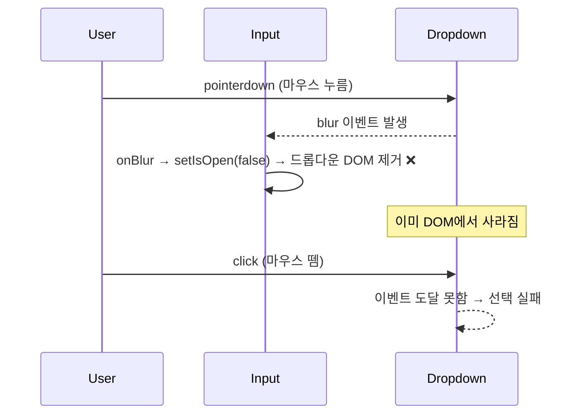

---
aliases:
  - KeyboardEvent
  - MouseEvent
  - preventDefault vs stopPropagation
  - SyntheticEvent
  - target vs currentTarget
  - onBlur
tags:
  - TypeScript
  - React
relations:
  - "[[00_JS_Ecosystem_HomePage]]"
  - "[[JS_DOM]]"
  - "[[React_useRef]]"
---
# TS_DOM_Events — DOM 이벤트 타입과 실전 패턴

> [!info]
> JSX의 `onClick`에서 받는 이벤트와 `addEventListener`로 직접 등록한 이벤트는 **타입이 다르다** — 전자는 `React.MouseEvent<T>`, 후자는 `MouseEvent`.

---

# 언제 이 파일이 필요한가

```txt
아래 상황 중 하나라도 생기면 이 파일을 읽을 것:

타입 에러:
  "Argument of type 'MouseEvent' is not assignable to 'React.MouseEvent'"
  → 네이티브 / React 합성 이벤트를 혼용했을 때

  "Property 'contains' does not exist on type 'EventTarget'"
  → e.target을 그대로 쓰려 했을 때 — Node로 단언 필요

  "Property 'value' does not exist on type 'EventTarget'"
  → e.target 대신 e.currentTarget 또는 as HTMLInputElement 필요

동작 버그:
  드롭다운 항목을 클릭해도 선택이 안 됨
  → blur가 click보다 먼저 실행돼 드롭다운이 먼저 사라지는 race condition
  → onPointerDown + e.preventDefault() 패턴 필요

  버튼 클릭했더니 바깥 div의 핸들러까지 실행됨
  → 이벤트 버블링 때문 — stopPropagation() 필요

  <a> 클릭했더니 페이지 이동됨 / 폼 submit했더니 새로고침됨
  → preventDefault() 필요
```

---

# 네이티브 DOM 이벤트 vs React 합성 이벤트 ⭐️⭐️⭐️⭐️

| |네이티브 DOM 이벤트|React 합성 이벤트|
|---|---|---|
|등록 방법|`addEventListener('click', fn)`|JSX `onClick={fn}`|
|타입 출처|`lib.dom.d.ts` (브라우저 표준)|`react` 패키지가 자체 정의|
|타입 예시|`MouseEvent`, `KeyboardEvent`|`React.MouseEvent<T>`, `React.KeyboardEvent<T>`|

```txt
왜 둘이 다른가:
  React는 브라우저마다 이벤트 동작이 미묘하게 다른 것을 감추기 위해
  자기만의 합성 이벤트(SyntheticEvent)로 한번 감싸서 컴포넌트에 전달함

  document.addEventListener처럼 React를 거치지 않고 직접 등록한 리스너는
  이 합성 이벤트 레이어를 안 지나감 — 브라우저가 원래 주는 네이티브 이벤트 객체를 그대로 받음
  → 타입도 React가 감싸기 전의 원본 타입(MouseEvent 등)을 그대로 써야 함

헷갈리는 지점: 이름이 겹침
  React.MouseEvent도 줄여서 그냥 "MouseEvent"라고 부르는 경우가 많음
  → import 없이 자동완성으로 MouseEvent가 잡혔다면
    lib.dom.d.ts의 것인지 React 것인지 반드시 확인할 것
```

## Event 타입 vs EventHandler 타입

```tsx
// 이벤트 객체 자체의 타입을 직접 쓰는 방식
function handleSubmit(e: React.SubmitEvent<HTMLFormElement>) { e.preventDefault(); }

// "함수 전체"의 타입을 변수에 미리 선언하는 방식 — *EventHandler 계열
const handleSubmit: React.SubmitEventHandler<HTMLFormElement> = (e) => { e.preventDefault(); };
```

```txt
React.SubmitEvent<T>          이벤트 객체 하나의 타입 (매개변수 자리에 직접 쓸 때)
React.SubmitEventHandler<T>   "이 타입의 이벤트를 받는 함수" 전체의 타입
                               (= (e: React.SubmitEvent<T>) => void 를 미리 정의해둔 축약형)

재사용 가능한 핸들러를 변수로 먼저 선언해두고 나중에 onSubmit={handleSubmit}로 연결할 때는
*EventHandler 쪽이 더 짧고 의도가 분명함
```

---

# 자주 쓰는 이벤트 타입 ⭐️⭐️⭐️

|상황|네이티브 타입|React 타입|
|---|---|---|
|마우스 클릭/누름|`MouseEvent`|`React.MouseEvent<T>`|
|포인터(마우스+터치+펜 통합)|`PointerEvent`|`React.PointerEvent<T>`|
|키보드|`KeyboardEvent`|`React.KeyboardEvent<T>`|
|포커스 이동|`FocusEvent`|`React.FocusEvent<T>`|
|터치(모바일)|`TouchEvent`|`React.TouchEvent<T>`|
|마우스 휠|`WheelEvent`|`React.WheelEvent<T>`|
|`<input>` 값 변경|(없음)|`React.ChangeEvent<HTMLInputElement>`|
|`<form>` 제출|`SubmitEvent`|`React.SubmitEvent<HTMLFormElement>` ⚠️|

```txt
⚠️ React 19.2.10+: React.FormEvent / React.FormEventHandler → deprecated
   대체: React.SubmitEvent<T> / React.SubmitEventHandler<T>

<T> 자리에는 그 이벤트가 발생하는 엘리먼트 타입을 넣음:
  버튼 클릭   → React.MouseEvent<HTMLButtonElement>
  입력창 변경 → React.ChangeEvent<HTMLInputElement>
  폼 제출     → React.SubmitEvent<HTMLFormElement>

PointerEvent vs MouseEvent:
  MouseEvent    마우스만 감지
  PointerEvent  마우스 + 터치 + 펜 통합 처리 — 모바일 지원 필요하거나
                드래그·드롭 등 정밀한 포인터 추적이 필요하면 PointerEvent 선호
```

---

# e.target vs e.currentTarget ⭐️⭐️⭐️

```tsx
<div onClick={(e) => {
  console.log(e.target);        // 실제로 클릭이 시작된 가장 안쪽 요소 (자식의 자식일 수도 있음)
  console.log(e.currentTarget); // 이 핸들러가 등록된 요소 (여기서는 이 div)
}}>
  <button>클릭</button>
</div>
```

```txt
target        이벤트가 실제로 발생한 지점 — 버블링을 타고 올라오는 시작점
              버튼을 클릭했다면 target은 <button>, 바깥 div가 아님

currentTarget 지금 이 핸들러가 달려있는 요소 — 핸들러 입장에서 "나 자신"
              div에 onClick을 달았으면 currentTarget은 항상 div

→ "클릭된 게 정확히 이 요소인가"를 알고 싶으면 currentTarget
  "이벤트가 어디서 시작됐는가"를 알고 싶으면 target
```

## e.target as Node — 타입 단언이 필요한 이유 ⭐️⭐️⭐️

```txt
e.target의 선언 타입은 EventTarget — 이벤트를 주고받을 수 있다는 것만 보장하는 아주 넓은 타입
.contains(), .closest() 같은 실제 DOM 메서드는 EventTarget에는 없고 Node(또는 Element)에 있음

→ "이건 실제로 Node일 거야"라고 직접 알려줘야(as Node) 그 메서드를 호출할 수 있음
```

```tsx
if (!rootRef.current?.contains(e.target as Node)) setOpen(false);
//                              ^^^^^^^^^^^^^^^^
//                              EventTarget → Node로 단언
```

```txt
⚠️ as는 검증이 아니라 단언 — 런타임에 진짜 Node인지 확인해주지 않음
   클릭 이벤트의 target은 실제로 항상 Node이라 이 경우는 안전하지만,
   "타입을 우긴다"는 점에서 다른 as 단언들과 동일한 주의가 필요함

자주 만나는 타입 에러와 단언:
  "Property 'contains' does not exist on type 'EventTarget'" → as Node
  "Property 'value' does not exist on type 'EventTarget'"   → as HTMLInputElement
  "Property 'checked' does not exist on type 'EventTarget'" → as HTMLInputElement
```

---

# preventDefault vs stopPropagation ⭐️⭐️⭐️⭐️

```txt
이름이 비슷해 보여도 막는 대상이 완전히 다름:

  preventDefault()    브라우저가 그 이벤트에 대해 "원래 하려던 동작"을 막음
  stopPropagation()   이벤트가 부모 요소로 계속 전파(버블링)되는 것을 막음

  서로 완전히 독립적 — 하나만 호출하거나, 둘 다 호출하거나 모두 가능
```

## preventDefault — 브라우저 기본 동작 막기

```tsx
const handleSubmit: React.SubmitEventHandler<HTMLFormElement> = (e) => {
  e.preventDefault(); // 폼 제출 시 페이지 새로고침 기본 동작을 막음
  // ... 직접 fetch로 제출 처리
};
```

|이벤트|기본 동작|`preventDefault()`로 막는 것|
|---|---|---|
|`<form>` 제출|페이지 새로고침(또는 이동)|새로고침 막고 JS로 제출 처리|
|`<a>` 클릭|그 링크로 페이지 이동|이동 막고 직접 라우팅 처리|
|`<input type="checkbox">` 클릭|체크 상태 토글|토글 자체를 막음|
|마우스 우클릭(`contextmenu`)|브라우저 기본 컨텍스트 메뉴|커스텀 메뉴 직접 표시 시 차단|
|`pointerdown`|클릭한 요소로 포커스 이동|포커스 이동 차단 → blur 방지|

```txt
⚠️ 모든 이벤트에 "기본 동작"이 있는 건 아님
   일반 <div>의 onClick에는 막을 기본 동작 자체가 없어서 호출해도 아무 효과 없음
   → 폼 제출, 링크 클릭, pointerdown처럼 "브라우저가 원래 뭔가를 한다"는 이벤트에서만 의미 있음
```

## stopPropagation — 버블링 차단

```txt
버블링(bubbling): 자식 요소에서 발생한 이벤트가 부모 → 부모의 부모 순으로
계속 위로 전파되는 기본 동작 — 버튼을 클릭하면 그 클릭 이벤트가 바깥 div에도 또 전달됨
```

```tsx
// Click Outside 패턴에서 흔히 같이 보이는 코드 — [[React_useRef]] 참고
<div onClick={() => setOpen(false)}>
  <button onClick={(e) => {
    e.stopPropagation(); // 이 클릭이 바깥 div의 onClick까지 전파되는 걸 막음
    doSomething();
  }}>
    버튼
  </button>
</div>
```

```txt
stopPropagation() 안 부르면:
  버튼 누름 → button의 onClick(doSomething) 실행
           → 이벤트가 div까지 버블링
           → div의 onClick(setOpen(false))까지 같이 실행됨 (의도치 않은 동작)

stopPropagation()으로는 blur를 막지 못하는 이유:
  stopPropagation()은 이벤트 버블링만 차단
  blur는 "포커스가 이동하는 동작" 자체에서 발생하는 것이지 버블링이 아님
  → blur를 막으려면 포커스 이동 자체를 차단해야 → pointerdown의 preventDefault()
```

---

# 브라우저 이벤트 발생 순서 ⭐️⭐️⭐️⭐️

```txt
포인터(클릭) → 포커스 이동 → 클릭 완성 순서:
  pointerdown → mousedown → [blur (이전 포커스 해제)] → pointerup → mouseup → click

핵심: blur는 click보다 먼저 발생
  사용자가 A에 포커스된 상태에서 B를 클릭할 때:
    ① pointerdown on B  (마우스 누름)
    ② blur on A         (포커스가 A에서 빠짐) ← click 전에 발생!
    ③ pointerup on B
    ④ click on B        (마우스 누름 + 뗌 완성)
```

## onBlur — 포커스 해제 이벤트

```txt
onBlur: 요소에서 포커스가 빠져나갈 때 발생하는 이벤트
네이티브 이벤트 타입: FocusEvent / React 타입: React.FocusEvent<T>

발생 시점:
  input에 커서가 있다가 → 다른 곳을 클릭하거나 Tab으로 다음 요소로 이동할 때
  드롭다운 목록 밖을 클릭할 때
  브라우저의 다른 탭으로 전환할 때 (window 포커스 이탈)

가장 흔한 사용처:
  input 포커스 이탈 시 유효성 검사 실행 ("touched" 상태 → 에러 메시지 표시)
  드롭다운 / 팝오버 닫기
```

```tsx
<input
  onFocus={() => setIsOpen(true)}
  onBlur={(e: React.FocusEvent<HTMLInputElement>) => {
    // e.target         포커스를 잃은 요소 (이 input)
    // e.relatedTarget  포커스를 가져간 요소 (null이면 페이지 바깥으로 나간 것)
    if (!e.target.value) setError('필수 입력 항목입니다');
  }}
/>
```

```txt
onFocus vs onBlur:
  onFocus   요소가 포커스를 받을 때 (클릭하거나 Tab으로 도달했을 때)
  onBlur    요소가 포커스를 잃을 때 (다른 곳 클릭하거나 Tab으로 이탈할 때)

e.relatedTarget:
  포커스가 이동해 간 대상 요소
  null → 페이지 바깥(다른 탭, 주소창 등)으로 이탈
  드롭다운 내부 요소로 포커스가 이동하는 경우를 구분할 때 씀
  → relatedTarget이 드롭다운 내부이면 setIsOpen(false) 안 해도 되는 식으로 분기 가능
```

## onBlur race condition — 드롭다운 클릭 무시 버그 ⭐️⭐️⭐️⭐️



```tsx
// ❌ 안티 패턴 — onClick 쓰면 blur가 click보다 먼저 실행됨
<input onBlur={() => setIsOpen(false)} />
<div onClick={() => handleSelect(item)}>{item.name}</div>
// blur → 드롭다운 사라짐 → div click 도달 못함

// ✅ 해결 — onPointerDown + e.preventDefault()로 blur 자체를 차단
<input onBlur={() => setIsOpen(false)} />
<div
  onPointerDown={(e: React.PointerEvent<HTMLDivElement>) => {
    e.preventDefault();  // pointerdown 기본 동작(포커스 이동) 차단 → blur 발생 안 함
    handleSelect(item);  // blur 전에 선택 처리 완료
  }}
>
  {item.name}
</div>
```

```txt
e.preventDefault()의 효과:
  pointerdown 기본 동작 = 클릭한 요소로 포커스 이동
  이걸 막으면 → 포커스 이동 없음 → blur 없음 → 드롭다운 유지 → handleSelect 정상 실행

왜 stopPropagation()으로는 안 되는가:
  stopPropagation()은 이벤트 버블링 차단 — blur 발생 자체를 막지 못함
  blur는 이미 pointerdown 단계에서 포커스 이동으로 발생 → stopPropagation()은 너무 늦음

왜 onClick 대신 onPointerDown인가:
  이미 "blur → 드롭다운 제거 → click 도달 못함" 순서이므로
  click 전에 실행되는 pointerdown 시점에서 처리해야 함
```
