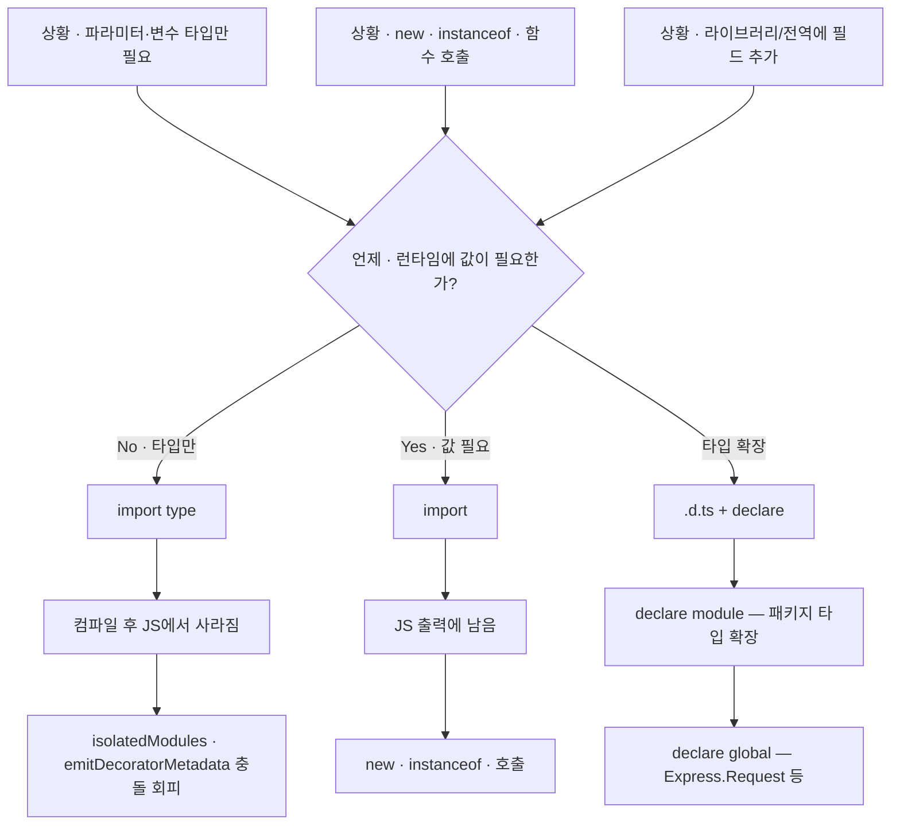

---
aliases:
  - import
  - import type
  - declare module
  - declare global
  - 타입 확장
  - .d.ts
  - TypeScript Declaration File
tags:
  - TypeScript
related:
  - "[[00_JS_Ecosystem_HomePage]]"
  - "[[NestJS_Auth]]"
  - "[[NestJS_Controller]]"
  - "[[TS_Generics]]"
  - "[[TS_TsConfig]]"
---
# TS_ImportType — `import type` vs `import`

> [!info]
>  `import type`은 타입 정보만 가져오는 import — 컴파일 후 JS 출력에서 완전히 사라진다. 
>  `import`는 값(클래스, 함수, 객체)을 가져오는 import — JS 출력에 남는다.
>   `isolatedModules`가 켜진 프로젝트에서 타입만 필요한 걸 `import`로 쓰면 에러가 난다.

---
# 흐름도



> Nest 예 — `import type { Request } from 'express'`  
> `export {}` — declare global이 동작하려면 파일을 모듈로 만들기

---
## @types/* 자동 인식 안 될 때 ⭐️⭐️⭐️

```txt
Next.js + moduleResolution: "bundler" 환경에서
@types/* 패키지가 자동으로 인식 안 되는 경우가 있음

증상:
  YT, google, kakao 같은 전역 ambient 타입이 갑자기 빨간 줄
  또는 타입 에러가 난 뒤 연쇄적으로 멀쩡한 코드도 빨간 줄이 퍼짐
```

**원인 1 — 다른 타입 에러가 파일 전체를 "깨짐"으로 만들 때:**

```typescript
// e: any 에러가 나면 IDE가 파일을 "타입 깨짐"으로 다시 그림
// → 원래 잘 되던 YT, google 같은 전역 타입도 못 찾는 것처럼 보임
// → 먼저 e: any 에러를 고치면 빨간 줄이 같이 사라지는 경우가 많음
```

**원인 2 — tsconfig include 범위 밖:**

```json
// tsconfig.json
{
  "include": [
    "next-env.d.ts",
    "**/*.ts",
    "**/*.tsx",
    ".next/types/**/*.ts"
  ]
}
```

```txt
@types/youtube 같은 ambient 타입은 타입스크립트가 자동으로 로드함
하지만 types 또는 typeRoots 옵션이 명시되면 그것만 로드함

// tsconfig.json에 아래처럼 특정 패키지만 명시하면
"compilerOptions": {
  "types": ["node"]  // node만 로드 → youtube, google 등 누락
}

→ 해결: 필요한 @types 패키지를 추가하거나 types 옵션 제거
```

**원인 3 — 설치 자체가 안 된 경우:**

```bash
pnpm add -D @types/youtube
pnpm add -D @types/google.maps
```

```txt
@types/* 패키지가 아예 설치 안 됐으면 당연히 인식 안 됨
→ node_modules/@types 폴더에 해당 패키지 있는지 확인
```

**원인 4 — IDE 캐시 문제:**

```txt
패키지를 설치했는데 여전히 빨간 줄이면:
  VSCode: Cmd+Shift+P → "TypeScript: Restart TS Server"
  또는 VSCode 재시작
  → TS 서버가 캐시된 타입 정보를 다시 읽음
```
---
# 경로 별칭 (Path Alias) — `@/lib/redirect` ⭐️⭐️⭐️⭐️

```typescript
// 상대 경로 — 파일 위치마다 depth가 달라짐
import { sanitizeRedirectPath } from '../../lib/redirect';

// @/ 별칭 — 어디서든 동일
import { sanitizeRedirectPath } from '@/lib/redirect';
```

```txt
@/ = 프로젝트 루트(또는 src/)를 가리키는 별칭
tsconfig.json의 paths 옵션으로 설정

// apps/web/tsconfig.json (Next.js)
"paths": { "@/*": ["./*"] }

Next.js는 Turbopack이 paths를 읽어서 번들 시 자동 치환 → 추가 설정 불필요
NestJS는 빌드 후 dist/에 @가 그대로 남아서 Node.js가 못 찾음 → 상대 경로 권장

tsconfig 옵션 전체 설명 → [[TS_TsConfig]]

```

---
# d.ts 파일이란 ⭐️⭐️⭐️⭐️

```txt
.d.ts = TypeScript Declaration File (선언 파일)
런타임 코드가 전혀 없음 — 타입 정보만 담는 파일
컴파일 후 JS 출력에 포함되지 않음 — TS 컴파일러가 타입 체크에만 사용
```

## 세 가지 역할

|역할|예시 파일|용도|
|---|---|---|
|라이브러리 타입 제공|`node_modules/@types/express/index.d.ts`|JS 라이브러리에 타입을 붙여주는 `@types/*` 패키지|
|외부 모듈 타입 확장|`src/types/express.d.ts`|기존 라이브러리 타입에 필드 추가|
|전역 타입 선언|`src/types/global.d.ts`|`window`, `process.env`, `Express.Request` 등 전역 확장|

## @types/* 패키지 — 자동으로 설치되는 .d.ts

```bash
pnpm add -D @types/express
# node_modules/@types/express/index.d.ts 가 설치됨
# → import { Request } from 'express' 에 타입이 붙는 이유
```

```txt
JS로 만들어진 라이브러리(express, lodash 등)는 자체적으로 타입이 없음
@types/xxx 패키지가 "이 라이브러리의 모양은 이렇다"는 .d.ts를 제공
→ devDependency — 런타임에 불필요, 개발 중 타입 체크에만 사용

라이브러리가 TypeScript로 작성됐거나 타입을 내장하면(@nestjs/* 등)
@types 없이도 타입이 자동으로 제공됨
```

## express.d.ts — 직접 만드는 .d.ts ⭐️⭐️⭐️⭐️

```txt
@types/express가 정의한 Request 타입에는 user, session이 없음
"이런 필드도 있다"고 TS에게 알려주는 파일을 직접 만들어 추가
```

```typescript
// src/types/express.d.ts
import type { JwtPayload }    from '../auth/jwt-payload';
import type { OAuthProfile }  from '../auth/oauth-profile';
import type { Session }       from 'express-session';

// express-session 라이브러리 타입 확장
declare module 'express-session' {
  interface SessionData {
    oauthNext?: string;  // OAuth next 파라미터 임시 저장
  }
}

// Express.Request 전역 확장
declare global {
  namespace Express {
    interface Request {
      user?:   JwtPayload | OAuthProfile;  // JwtStrategy 또는 OAuth Strategy가 담아줌
      session: Session;                    // express-session이 담아줌
    }
  }
}

export {};  // ← 반드시 필요 (아래 설명)
```

## 스크립트 vs 모듈 .d.ts — export {}가 왜 필요한가 ⭐️⭐️⭐️

```txt
TypeScript가 .d.ts 파일을 두 가지로 구분:

  스크립트 .d.ts (export/import 없음):
    선언이 자동으로 전역에 추가됨
    declare const x: string  → 어디서나 x에 접근 가능

  모듈 .d.ts (export/import 있음):
    선언이 전역에 추가되지 않음 — 명시적 import 필요
    전역 확장이 필요하면 declare global { } 로 감싸야 함

express.d.ts가 모듈인 이유:
  import type { JwtPayload } ... 가 있으므로 자동으로 "모듈"로 분류됨
  → declare global 없이 선언하면 전역에 추가 안 됨
  → declare global로 감싸야 전역 확장이 적용됨

export {}:
  아무것도 export 안 해도 "이 파일은 모듈이다"를 선언하는 역할
  import가 있으면 이미 모듈이라 사실 불필요하지만
  명시적으로 남겨두면 나중에 import가 없어져도 모듈 동작을 유지
  → 관례적으로 항상 붙임
```

## tsconfig에서 포함 확인

```json
// tsconfig.json
{
  "include": ["src/**/*"]
  // src/types/express.d.ts가 이 glob에 포함되어야 함
  // 포함 안 되면 선언이 적용 안 됨
}
```

```txt
.d.ts 확장이 적용 안 될 때 체크리스트:
  ① tsconfig의 include/files에 포함됐는지
  ② export {}가 있는지 (모듈이어야 declare global이 동작)
  ③ IDE를 재시작했는지 (캐시 문제)
  ④ 파일 경로가 실제 타입 경로와 맞는지 (import 경로 오타)
```

---

# 차이 — 컴파일 후 뭐가 남는가 ⭐️⭐️⭐️⭐️

```typescript
// 값 import — JS 출력에 남음 (런타임에 실제로 필요한 것)
import { Request, Response } from 'express';

// 타입 import — JS 출력에서 완전히 사라짐 (컴파일 타임에만 필요한 것)
import type { Request, Response } from 'express';
```

```txt
컴파일 전 (TypeScript):
  import type { Request, Response } from 'express';
  function handler(@Req() req: Request, @Res() res: Response) { ... }

컴파일 후 (JavaScript):
  // import가 사라짐 — Request, Response는 타입이었으므로 JS에 흔적 없음
  function handler(req, res) { ... }
```

---

# isolatedModules — 왜 충돌이 생기는가 ⭐️⭐️⭐️⭐️

```txt
isolatedModules: true (tsconfig.json)
  각 파일을 독립적으로(isolated) 컴파일 가능하게 강제하는 옵션
  Vite, esbuild, SWC 같은 빠른 번들러가 TS를 변환할 때 사용
  → 파일 하나만 보고 변환할 수 있어야 함

문제:
  import { Request } from 'express'; 로 가져온 Request가
  "타입으로만 쓰이는지" vs "값으로도 쓰이는지"를
  그 파일만 봐서는 판단할 수 없음

  → isolatedModules는 "혹시 값처럼 쓰일 수도 있으니 이 import를 지워도 되는지 모르겠다"
    → 에러로 막음

해결:
  import type을 쓰면 "이건 타입으로만 씀" 이라고 명시
  → isolatedModules가 "이건 지워도 됨"을 확실히 알 수 있음
```

```json
// tsconfig.json
{
  "compilerOptions": {
    "isolatedModules": true,   // Vite/SWC/esbuild를 쓰면 대부분 true
    "emitDecoratorMetadata": true  // NestJS 데코레이터에 필요
  }
}
```

---

# emitDecoratorMetadata — NestJS에서 충돌이 생기는 이유 ⭐️⭐️⭐️⭐️

```txt
emitDecoratorMetadata: true
  데코레이터(@Get, @Post, @Req 등)가 파라미터 타입 정보를 런타임에 유지하게 함
  NestJS의 DI(의존성 주입)가 이 메타데이터를 보고 어떤 타입을 주입할지 결정함

문제가 생기는 상황:
  import { Request } from 'express';    ← 값 import
  handler(@Req() req: Request) { }

  emitDecoratorMetadata가 "@Req() 파라미터의 타입은 Request" 라는 메타데이터를 생성
  이 메타데이터가 런타임에 Request를 참조 → Request가 값으로 필요해짐
  하지만 isolatedModules 입장에서는 Request가 타입인지 값인지 불명확 → 충돌

해결:
  import type { Request } from 'express';  ← 타입 import
  → "Request는 타입으로만 쓴다"고 명시
  → emitDecoratorMetadata도, isolatedModules도 둘 다 만족
```

---

# NestJS에서 자주 보이는 패턴 ⭐️⭐️⭐️⭐️

```typescript
// ❌ 값 import — isolatedModules와 충돌 가능
import { Request, Response, NextFunction } from 'express';

// ✅ 타입 import — 타입으로만 쓰므로 type import가 맞음
import type { Request, Response, NextFunction } from 'express';
```

```typescript
// NestJS 컨트롤러에서 올바른 사용
import type { Request, Response } from 'express';

@Controller('auth')
export class AuthController {
  @Get('google/callback')
  googleCallback(
    @Req() req: Request,          // 파라미터 타입으로만 사용 → import type
    @Res() res: Response,
  ) {
    res.redirect('/');
  }
}
```

---

# 언제 `import type`을 써야 하는가 ⭐️⭐️⭐️

|상황|`import type`|일반 `import`|
|---|---|---|
|함수/메서드 파라미터 타입으로만 사용|✅|—|
|변수 타입 선언으로만 사용|✅|—|
|제네릭 타입 인자로만 사용|✅|—|
|`instanceof` 검사 (런타임에 값 필요)|❌|✅|
|`new 클래스()` 로 인스턴스 생성|❌|✅|
|함수·상수 등 값으로 직접 사용|❌|✅|

```typescript
// ✅ 타입으로만 — import type
import type { JwtPayload } from './types';
const payload: JwtPayload = ...;

// ❌ 값으로 사용 — 일반 import 필요
import { PrismaClient } from '@prisma/client';
const prisma = new PrismaClient();  // new → 값이 필요 → import type 불가

// ❌ instanceof → 런타임에 값 필요 — 일반 import 필요
import { HttpException } from '@nestjs/common';
if (err instanceof HttpException) { ... }  // instanceof → import type 불가
```

---

# 인라인 타입 import ⭐️⭐️

```typescript
// 파일 전체가 아니라 특정 항목만 type import — 섞어 쓸 때 유용
import { Injectable } from '@nestjs/common';                     // 값
import type { Request } from 'express';                           // 타입만

// 또는 한 줄에서 섞어 쓰기
import { Injectable, type NestMiddleware } from '@nestjs/common';
//                   ↑ 이 항목만 type import
```

---
# declare module / declare global — 타입 확장 ⭐️⭐️⭐️⭐️

```txt
외부 라이브러리나 전역 타입에 "내가 직접 필드를 추가"하는 패턴
설치만 해서는 타입이 안 붙는 경우, 직접 .d.ts 파일을 만들어 확장
```

## declare module — 라이브러리 타입 확장

```typescript
// express-session의 SessionData에 커스텀 필드 추가
declare module 'express-session' {
  interface SessionData {
    oauthNext?: string;
  }
}
```

```txt
선언 병합(Declaration Merging):
  TypeScript는 같은 이름의 interface를 여러 곳에서 선언하면 자동으로 합쳐줌
  → 라이브러리의 SessionData에 우리가 필드를 "추가"하는 것처럼 동작
  → 기존 SessionData의 내용은 그대로 유지됨
```

## declare global — 전역 네임스페이스 확장

```typescript
declare global {
  namespace Express {
    interface Request {
      user?:   JwtPayload;  // req.user 타입 추가
      session: Session;     // req.session 타입 추가
    }
  }
}

export {}; // ← 반드시 필요 — 이 파일을 모듈로 만들어야 declare global 동작
```

```txt
declare global은 파일이 "모듈"일 때만 동작함
  모듈 = import 또는 export 문이 하나라도 있는 파일
  export {}로 아무것도 export 안 해도 "나는 모듈"이라고 선언 가능

NestJS에서 자주 쓰는 패턴:
  apps/api/src/types/express.d.ts 파일에 Request 확장
  → @Req() req: Request에서 req.user 자동완성 동작
  → 상세 구현은 [[NestJS_Auth]] 참고

declare module vs declare global:
  declare module '라이브러리'  외부 패키지 타입 확장
  declare global { ... }       전역 타입(Express, Window, NodeJS 등) 확장
```

---

# IDE 자동 수정 ⭐️

```txt
VSCode + TypeScript Language Server:
  import를 추가할 때 타입인지 값인지 자동으로 판단해서
  import type으로 제안해주는 경우가 많음

ESLint 규칙:
  @typescript-eslint/consistent-type-imports
  → 타입으로만 쓰이는 import를 import type으로 자동 교체 제안
  → 프로젝트 전체에서 일관되게 적용 가능

자동 수정:
  VSCode에서 노란 줄 뜬 import에 커서 올리고
  "Convert to type-only import" 클릭 → 자동으로 바꿔줌
```

---

# 한눈에

```txt
import type { X } from '...'
  컴파일 후 JS에서 완전히 사라짐
  타입으로만 쓰이는 것 (파라미터 타입, 변수 타입, 제네릭 인자)

import { X } from '...'
  JS에 남음 — 런타임에도 실제로 필요한 것
  new X(), instanceof X, X() 같이 값으로 쓸 때

NestJS에서 자주 나오는 import type:
  import type { Request, Response, NextFunction } from 'express'
  → 파라미터 타입으로만 쓰이므로 type import가 맞음

충돌이 생기는 이유:
  isolatedModules: true    파일 하나만 보고 "이 import 지워도 되나?" 판단해야 함
  emitDecoratorMetadata    데코레이터 파라미터 타입을 런타임에 참조
  → 값 import로 된 타입을 지워야 하는지 알 수 없음 → 에러

instanceof, new 는 런타임에 값이 필요 → 일반 import 유지
```