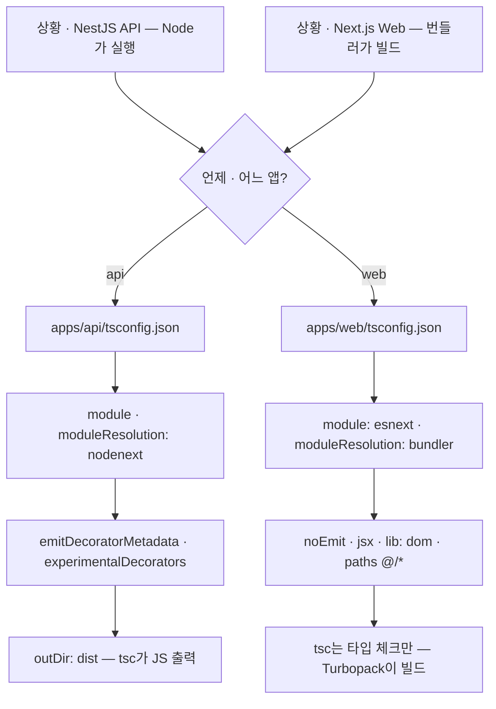

---
aliases:
  - Monorepo
  - tsconfig.json
tags:
  - TypeScript
related:
  - "[[00_JS_Ecosystem_HomePage]]"
  - "[[TS_ImportType]]"
  - "[[NestJS_Concept]]"
  - "[[NestJS_Prisma_Monorepo]]"
  - "[[Monorepo_PNPM]]"
---
# TS_TsConfig — tsconfig.json

> [!info] 
> tsconfig.json = TypeScript 컴파일러에게 "이 프로젝트를 어떻게 컴파일할지" 알려주는 설정 파일.
>  NestJS(API)와 Next.js(Web)는 실행 환경이 달라서 tsconfig가 다르다.

---
# 흐름도



> 공통 — `isolatedModules` · `skipLibCheck` · `incremental`  
> API에 `@/*` 안 쓰는 이유 — dist 빌드 후 경로 치환 문제

---

# 모노레포 tsconfig 구조

```txt
apps/
  api/tsconfig.json   NestJS — Node.js 서버 환경
  web/tsconfig.json   Next.js — 번들러(Turbopack/Webpack) 환경
```

```txt
같은 TypeScript지만 실행 환경이 달라서 별도 설정:
  API  → Node.js가 직접 실행 (또는 dist/ 빌드 후 실행)
  Web  → Turbopack/Webpack이 번들링 후 브라우저/SSR 실행
  → 모듈 시스템, 해석 방식, 빌드 방식이 전부 다름
```

---

# 두 파일 비교 ⭐️⭐️⭐️⭐️

|옵션|API (NestJS)|Web (Next.js)|이유|
|---|---|---|---|
|`module`|`nodenext`|`esnext`|API는 Node.js CJS/ESM 호환, Web은 번들러가 처리|
|`moduleResolution`|`nodenext`|`bundler`|API는 Node.js 해석 규칙, Web은 번들러 규칙|
|`target`|`ES2023`|`ES2017`|API는 최신 Node.js, Web은 구형 브라우저 대응|
|`noEmit`|없음 (dist/ 생성)|`true`|Web은 번들러가 빌드 담당, tsc는 타입 체크만|
|`outDir`|`./dist`|없음|API는 컴파일된 JS를 dist/에 저장|
|`jsx`|없음|`react-jsx`|Web만 JSX가 필요|
|`emitDecoratorMetadata`|`true`|없음|NestJS DI에 필요, [[TS_ImportType]] 참고|
|`experimentalDecorators`|`true`|없음|NestJS 데코레이터에 필요|
|`paths (@/*)`|없음|`"@/*": ["./*"]`|API는 빌드 후 경로 치환 문제로 비권장|
|`lib`|없음 (기본)|`["dom", "esnext", ...]`|Web은 브라우저 DOM API 타입 필요|
|`strict`|없음 (개별 설정)|`true`|모든 strict 규칙을 한 번에|
|`isolatedModules`|`true`|`true`|둘 다 — 파일 단위 변환 가능하게|
|`skipLibCheck`|`true`|`true`|둘 다 — node_modules 타입 검사 스킵|

---

# apps/api/tsconfig.json — NestJS ⭐️⭐️⭐️

```jsonc
{
  "compilerOptions": {
    "module":                    "nodenext",   // Node.js ESM/CJS 호환 모듈 시스템
    "moduleResolution":          "nodenext",   // Node.js 방식으로 모듈 경로 해석
    "resolvePackageJsonExports": true,         // package.json exports 필드 존중
    "esModuleInterop":           true,         // CommonJS를 ES Module처럼 import 가능
    "isolatedModules":           true,         // 파일 단위 변환 가능 (SWC 등 사용 시 필요)
    "declaration":               true,         // .d.ts 타입 선언 파일 생성
    "removeComments":            true,         // 빌드 출력에서 주석 제거
    "emitDecoratorMetadata":     true,         // NestJS DI용 데코레이터 메타데이터 생성
    "experimentalDecorators":    true,         // @Injectable(), @Get() 등 데코레이터 활성화
    "allowSyntheticDefaultImports": true,      // default export 없어도 import 가능
    "target":                    "ES2023",     // 출력 JS 문법 버전
    "sourceMap":                 true,         // 디버깅용 소스맵 생성
    "outDir":                    "./dist",     // 컴파일 결과 출력 위치
    "baseUrl":                   "./",         // 경로 계산 기준 (src/ 아니라 루트)
    "incremental":               true,         // 변경된 파일만 재컴파일 (빌드 속도)
    "skipLibCheck":              true,         // node_modules 타입 검사 스킵
    "strictNullChecks":          true,         // null/undefined를 타입으로 엄격히 구분
    "noImplicitAny":             false,        // any 타입 암묵적 허용 (레거시 코드 대응)
    "forceConsistentCasingInFileNames": true   // 파일명 대소문자 일관성 강제
  }
}
```

## API 핵심 옵션 설명

```txt
module: "nodenext"
  Node.js 18+의 ESM/CJS 혼합 환경을 지원하는 모듈 시스템
  .mts/.cts 확장자 구분, package.json type 필드 존중
  import { X } from './file' 대신 import { X } from './file.js' 처럼 확장자 명시 필요

emitDecoratorMetadata: true
  @Injectable(), @Get()처럼 데코레이터가 파라미터 타입 정보를 런타임에 유지하게 함
  NestJS DI가 이 메타데이터로 "어떤 타입을 주입할지" 결정
  → isolatedModules와 충돌 가능 → import type 사용 권장 ([[TS_ImportType]])

outDir: "./dist"
  tsc가 .ts → .js 변환 결과를 dist/에 저장
  배포 시 node dist/main.js 로 실행
  (Next.js는 noEmit: true라서 dist/가 없음)

paths 없음:
  @/* 경로 별칭을 dist/ 빌드 후에도 유지하려면 추가 도구 필요
  → 그냥 상대 경로 또는 src/ 직접 참조 사용
```

---

# apps/web/tsconfig.json — Next.js ⭐️⭐️⭐️

```jsonc
{
  "compilerOptions": {
    "target":             "ES2017",     // 브라우저 호환 — 구형 브라우저 지원
    "lib":                ["dom", "dom.iterable", "esnext"], // 브라우저 DOM API 타입
    "allowJs":            true,         // .js 파일도 타입 체크 대상
    "skipLibCheck":       true,
    "strict":             true,         // 모든 strict 규칙 한 번에 (권장)
    "noEmit":             true,         // tsc는 타입 체크만, JS 출력은 Turbopack이 담당
    "esModuleInterop":    true,
    "module":             "esnext",     // 번들러가 처리할 ESM 모듈 문법
    "moduleResolution":   "bundler",    // 번들러(Webpack/Turbopack) 방식으로 모듈 해석
    "resolveJsonModule":  true,         // .json 파일 import 가능
    "isolatedModules":    true,
    "jsx":                "react-jsx",  // <div /> → React.createElement 변환
    "incremental":        true,
    "plugins":            [{ "name": "next" }], // Next.js 언어 서버 플러그인
    "paths": {
      "@/*": ["./*"]    // @/lib/xxx → 프로젝트 루트 기준 경로 별칭
    }
  },
  "include": [
    "next-env.d.ts",            // Next.js 자동 생성 타입 선언
    "**/*.ts",
    "**/*.tsx",
    ".next/types/**/*.ts",      // Next.js 빌드 생성 타입
    ".next/dev/types/**/*.ts",
    "**/*.mts"
  ],
  "exclude": ["node_modules"]
}
```

## Web 핵심 옵션 설명

```txt
noEmit: true
  tsc가 JS 파일을 출력하지 않음
  Next.js의 Turbopack/Webpack이 번들링 담당
  tsc는 타입 체크 역할만 — 타입 에러가 있으면 빌드 실패

moduleResolution: "bundler"
  번들러(Webpack/Turbopack)가 모듈을 어떻게 찾는지 따름
  package.json의 exports/imports 필드를 번들러 방식으로 해석
  nodenext처럼 .js 확장자를 명시하지 않아도 됨 (번들러가 알아서 찾음)

paths: { "@/*": ["./*"] }
  @/lib/redirect → 프로젝트 루트의 lib/redirect
  Next.js(Turbopack/Webpack)가 tsconfig의 paths를 읽어서 번들 시 경로 치환
  → API와 달리 추가 설정 없이 동작

plugins: [{ "name": "next" }]
  VSCode에서 Next.js 전용 타입 오류/경고를 더 정확하게 표시
  Server Component / Client Component 경계 위반 감지 등

target: "ES2017"
  브라우저 호환을 위해 낮춤 — 최신 문법이 구형 브라우저에서도 실행되도록 변환
  API(ES2023)보다 낮은 이유: 사용자 브라우저 환경이 다양함
```

---

# 자주 보이는 옵션 한눈에

|옵션|역할|
|---|---|
|`strict`|`strictNullChecks` + `noImplicitAny` 등 모든 엄격 규칙 한 번에|
|`strictNullChecks`|`null`/`undefined`를 별도 타입으로 — 없으면 모든 타입에 null이 허용됨|
|`noImplicitAny`|타입 추론 불가 시 any 허용(false) vs 에러(true)|
|`esModuleInterop`|`import fs from 'fs'` 처럼 CJS를 default import로 쓸 수 있게|
|`isolatedModules`|파일 단위 변환 가능하게 — import type 필요성과 연결 ([[TS_ImportType]])|
|`skipLibCheck`|node_modules의 .d.ts 타입 오류 무시 — 빌드 속도 향상|
|`incremental`|이전 빌드 정보 캐시 → 변경분만 재컴파일|
|`sourceMap`|디버거에서 TS 원본 코드로 매핑|
|`declaration`|라이브러리 배포용 .d.ts 생성|
|`noEmit`|JS 파일 출력 안 함 — 타입 체크만|

---

# 한눈에

```txt
API(NestJS):
  module: nodenext         Node.js 호환 모듈
  emitDecoratorMetadata    NestJS DI 필수 → import type 조심
  outDir: ./dist           빌드 결과물 생성
  경로 별칭(@/*) 없음     빌드 후 경로 치환 문제로 상대 경로 사용

Web(Next.js):
  module: esnext           번들러가 처리
  moduleResolution: bundler 번들러 방식으로 모듈 해석
  noEmit: true             tsc는 타입 체크만, 빌드는 Turbopack이
  paths: { "@/*": ["./*"] } 경로 별칭 — Turbopack이 알아서 처리
  jsx: react-jsx           JSX 변환
  lib: ["dom", ...]        브라우저 API 타입
```