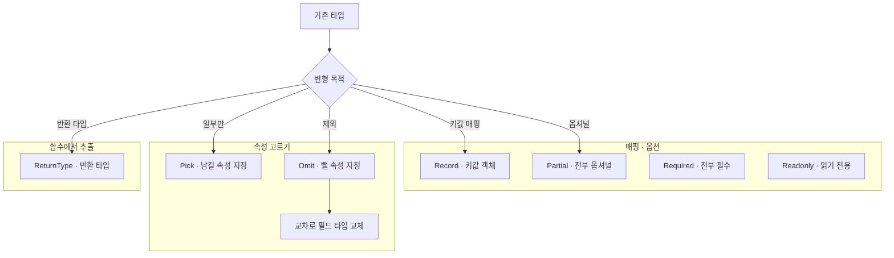

---
aliases:
  - Omit
  - Partial
  - Pick
  - Record
  - ReturnType
  - utility types
  - Required
  - NonNullable
tags:
  - TypeScript
related:
  - "[[00_JS_Ecosystem_HomePage]]"
  - "[[NestJS_Controller]]"
  - "[[NestJS_DTO]]"
  - "[[React_useRef]]"
  - "[[TS_Generics]]"
  - "[[TS_PartialUpdate]]"
---
# TS_Utility_Types — Record, Partial, Pick, Omit 등

> [!info] 
> TS가 기본 제공하는 "타입을 변형해서 새 타입을 만드는" 도구들이다. 객체 모양을 처음부터 다시 적지 않고, 기존 타입에서 일부를 빼거나(Omit) 고르거나(Pick) 선택적으로 만들거나(Partial) 하는 식으로 재사용한다.

---
# 흐름도



```txt
기존 타입을 처음부터 다시 안 적고 변형 — Record · Partial · Pick · Omit · ReturnType
Pick은 남기기 · Omit은 빼기 — Omit 후 교차로 서드파티 필드 교체
NestJS PartialType 등은 이름 같지만 타입만이 아니라 클래스와 데코레이터를 만드는 별개
```

---

# Record<K, V> — 키-값 객체 타입 ⭐️⭐️⭐️⭐️

```typescript
const messages: Record<string, string> = {
  isEmail:    '올바른 이메일을 입력해주세요.',
  isNotEmpty: '필수 항목입니다.',
};
```

```txt
Record<K, V> = "키는 K 타입, 값은 V 타입"인 객체
  { [key: string]: string } 처럼 직접 인덱스 시그니처를 적는 것과 거의 같은 의미지만,
  Record가 더 짧고 "이건 키-값 매핑 객체다"라는 의도를 한눈에 드러냄
```

---

# `Partial<T>` — 모든 속성을 옵셔널로 ⭐️⭐️⭐️⭐️

```typescript
interface User { name: string; age: number; }

type PartialUser = Partial<User>;
// { name?: string; age?: number; } 와 동일 — 둘 다 있어도, 하나만 있어도, 아예 없어도 됨
```

```txt
서드파티 라이브러리도 이 발상을 그대로 가져다 쓰는 경우가 많음 — 예를 들어 차트 라이브러리의
PartialTheme류 타입은 "테마 전체가 아니라 일부만 덮어쓰기" 위한 것으로, [[React_Charts]] 참고
```

## 중첩된 형태 — Record<string, Partial<Record<string, string>>> 분해 ⭐️⭐️⭐️⭐️

```typescript
const FIELD_MESSAGES: Record<string, Partial<Record<string, string>>> = {
  email:    { isEmail:   '올바른 이메일을 입력해주세요.' },
  password: { minLength: '비밀번호는 8자 이상이어야 합니다.' },
};
```

```txt
안에서 바깥으로 풀면:
  Record<string, string>
    → "제약 이름 → 메시지" 객체 (예: { isEmail: '...' })
  Partial<Record<string, string>>
    → 그 객체의 모든 키가 옵셔널 — 모든 제약이 다 있을 필요는 없음
  Record<string, Partial<Record<string, string>>>
    → "필드 이름 → (제약별 메시지, 일부만 있을 수 있음)" 객체

전체 의미: "필드 이름으로 들어가면, 그 필드가 가질 수 있는 제약들의 메시지 묶음이 나오는데,
           그 메시지들이 전부 다 있는 건 아닐 수도 있다"
```

## Partial이 왜 필요한가 — 없으면 생기는 문제 ⭐️⭐️⭐️⭐️

```typescript
// Partial 없이 Record<string, Record<string, string>> 라면
FIELD_MESSAGES['email']['isEmail'];  // TS가 "이건 항상 string"이라고 믿어버림

// Partial이 있으면
FIELD_MESSAGES['email']?.['isEmail'];  // TS가 "string | undefined"로 정확히 봄 → ?.가 타입상으로도 강제됨
```

```txt
Record<string, V>는 "이 객체의 어떤 키로 접근해도 항상 V 타입의 값이 있다"고 TS에게 약속하는 것
실제로는 email/password 같은 일부 키만 있고 나머지 무수히 많은 문자열 키는 없는데,
Record<string, V>만 쓰면 TS는 그 차이를 모름 — Partial을 씌워야 "없을 수도 있다"는 게 타입에 반영됨

→ FIELD_MESSAGES[property]?.[constraint] 처럼 ?.(옵셔널 체이닝)를 쓰는 게 의미 있어지는 것도
  바로 이 Partial 덕분 — Partial이 없었다면 TS 입장에서 그 ?.는 "불필요한 안전장치"로 보였을 것
  (?. 자체의 동작은 [[JS_OptionalChaining]] 참고)
```

---

# Pick<T, K> / Omit<T, K> — 일부만 고르거나 빼기 ⭐️⭐️⭐️⭐️

```typescript
interface User { id: number; email: string; password: string; }

type PublicUser  = Omit<User, 'password'>;        // { id: number; email: string; }
type LoginInput  = Pick<User, 'email' | 'password'>; // { email: string; password: string; }
```

|유틸리티|역할|
|---|---|
|`Pick<T, K>`|T에서 K로 지정한 속성들만 골라서 새 타입을 만듦|
|`Omit<T, K>`|T에서 K로 지정한 속성들을 제외한 나머지로 새 타입을 만듦|

```txt
Pick과 Omit은 정확히 반대 방향에서 같은 일을 함 — "남길 것"을 지정하느냐, "뺄 것"을 지정하느냐
필드가 적으면 Pick, 필드가 많고 빼는 게 적으면 Omit이 더 짧아짐
```

---

# Omit + 교차(&) — 서드파티 타입의 필드를 재정의하는 패턴 ⭐️⭐️⭐️⭐️

```typescript
// 이미 user 필드가 다른 타입으로 존재하는 third-party 타입이 있다고 가정
type RequestWithUser = Omit<Request, 'user'> & { user: JwtPayload };
```

```txt
왜 Omit이 먼저 필요한가:
  그냥 Request & { user: JwtPayload } 라고만 하면, 원래 Request에 user 필드가
  전혀 없을 때는 문제없이 "추가"가 되지만, 원래도 user 필드가 있었다면(타입이 다르면)
  교차 타입 안에서 같은 키에 대해 서로 호환 안 되는 두 타입이 충돌하게 됨

  → 먼저 Omit으로 기존 user 필드를 제거한 뒤, 새 모양의 user를 교차(&)로 추가하면
    "필드를 추가하는 것"이 아니라 "필드를 다른 타입으로 교체하는 것"이 안전하게 표현됨

[[NestJS_Controller]]에서 본 Request & { user?: JwtPayload }는 원래 Request에 user 필드가
전혀 없는 경우라 Omit 없이 그냥 교차만 한 것 — 둘 다 같은 발상이고, 원래 필드가 있었는지 여부로
Omit 필요성이 갈림
```

---

# Required<Pick<>> & {} — 조합 패턴 ⭐️⭐️⭐️⭐️

```typescript
function normalizeDecor(
  value: ApiLyricCardCustomization,
): Required<
  Pick<ApiLyricCardCustomization, 'display' | 'stickers' | 'strokes'>
> & { tint?: string } {
```

```txt
안에서 밖으로 읽기:
  ① Pick<T, 'display' | 'stickers' | 'strokes'>
     → T에서 세 필드만 뽑음 (원본에서 optional이었어도)

  ② Required<①>
     → 세 필드에서 ? 제거 → 전부 required

  ③ & { tint?: string }
     → 교차 타입으로 tint 필드 추가 (optional)

왜 이렇게 쓰는가:
  normalizeDecor()를 통과한 값은 display, stickers, strokes가 반드시 있음을 보장
  → 사용하는 쪽에서 ?. 없이 안전하게 접근 가능

  & { tint?: string }:
  Pick에 없는 필드를 반환 타입에 추가할 때 교차 타입으로 덧붙임
```

---

# ` ReturnType<T> `— 함수의 반환 타입 추출 ⭐️⭐️⭐️

```typescript
const timerRef = useRef<ReturnType<typeof setTimeout> | null>(null);
```

```txt
typeof setTimeout
  → setTimeout이라는 "함수 자체"의 타입을 얻음
ReturnType<typeof setTimeout>
  → 그 함수를 호출했을 때 "반환되는 값"의 타입만 뽑아냄

setTimeout이 환경(브라우저/Node)에 따라 반환 타입이 다를 수 있어서(number vs NodeJS.Timeout 등),
그 타입을 직접 알아내 적기보다 ReturnType으로 "지금 이 환경에서 setTimeout이 실제로 반환하는 타입"을
자동으로 가져오는 것 — useRef로 타이머 id를 저장하는 패턴 자체는 [[React_useRef]] 참고
```

```typescript
// Awaited — Promise 벗기기
async function fetchUser(id: string): Promise<User> { ... }

type FetchResult = Awaited<ReturnType<typeof fetchUser>>;
// → User  (Promise 벗겨낸 결과)

// Parameters — 함수 파라미터 타입 튜플
type FetchParams = Parameters<typeof fetchUser>;
// → [id: string]
```
---
# `Awaited<T>` — Promise 벗기기 ⭐️⭐️⭐️

```typescript
type A = Awaited<Promise<string>>;          // string
type B = Awaited<Promise<Promise<number>>>; // number  (중첩 Promise도 전부 벗김)
type C = Awaited<string>;                   // string  (Promise 아니면 그대로)
```

```txt
Awaited<T> 가 하는 일:
  Promise<T>에서 T를 꺼냄
  중첩된 Promise도 전부 벗김 → Promise<Promise<User>> → User

왜 필요한가:
  async 함수의 반환 타입은 항상 Promise<T>
  ReturnType<typeof fetchUser> = Promise<User>

  그런데 "실제로 await 했을 때 나오는 타입"이 필요할 때
  → Awaited<ReturnType<typeof fetchUser>> = User
```

## 실전 — API 응답 타입 추출

```typescript
async function fetchUser(id: string): Promise<User> { ... }

// 방법 1: ReturnType → Awaited 조합
type UserResponse = Awaited<ReturnType<typeof fetchUser>>;
// → User

// 방법 2: 직접 명시 (더 단순할 때)
type UserResponse = User;
```

```txt
조합이 유용한 경우:
  함수 반환 타입을 직접 보기 어렵거나, 함수 타입이 바뀔 때 자동으로 따라와야 할 때
  서드파티 라이브러리의 함수 반환 타입을 추출할 때

  const result = await fetchUser('123');  // result: User
  type Result = Awaited<ReturnType<typeof fetchUser>>;  // User — result와 같은 타입
```

---

# `Parameters<F>`— 함수 파라미터 타입 튜플 ⭐️⭐️⭐️

```typescript
async function fetchUser(id: string, options?: { cache: boolean }): Promise<User> { ... }

type Params = Parameters<typeof fetchUser>;
// → [id: string, options?: { cache: boolean }]
//    ↑ 튜플 — 파라미터 순서와 타입이 그대로 배열로 나옴

type FirstParam  = Parameters<typeof fetchUser>[0]; // string
type SecondParam = Parameters<typeof fetchUser>[1]; // { cache: boolean } | undefined
```

```txt
Parameters<F>:
  함수 F의 파라미터 타입들을 튜플로 반환
  typeof 함수이름 으로 함수 자체의 타입을 넘겨야 함
  [0], [1] 로 각 파라미터 타입에 접근 가능

왜 튜플인가:
  파라미터는 순서가 있음 → 순서를 보존하는 튜플로 표현
  [string, number]는 첫 번째가 string, 두 번째가 number인 배열 타입
```

## 실전 — 래퍼 함수에서 파라미터 그대로 전달

```typescript
// 원본 함수를 감싸되, 파라미터는 그대로 넘기고 싶을 때
function withLogging<T extends (...args: any[]) => any>(
  fn: T,
): (...args: Parameters<T>) => ReturnType<T> {
  return (...args) => {
    console.log('호출:', fn.name, args);
    return fn(...args);
  };
}

const loggedFetch = withLogging(fetchUser);
// loggedFetch(id: string, options?: ...) — fetchUser와 동일한 파라미터 타입
```


```txt
Parameters<T>가 없었다면:
  래퍼 함수의 파라미터를 any로 선언하거나 직접 다 적어야 함
  원본 함수 파라미터가 바뀌면 래퍼도 수동으로 바꿔야 함

Parameters<T>가 있으면:
  원본 함수가 바뀌면 자동으로 따라옴
  타입 안전성 유지
```

---
# `NonNullable<T>` — null / undefined 제거 ⭐️⭐️⭐️⭐️


```typescript
type A = NonNullable<string | null | undefined>;  // string
type B = NonNullable<number | null>;              // number
type C = NonNullable<null | undefined>;           // never (전부 제거하면 남는 게 없음)
```

```typescript
// 실전 — 배열 요소의 특정 필드에서 null 제거
const [previewJacket, setPreviewJacket] = useState<
  NonNullable<typeof messages[number]['savedCard']> | null
>(null);
```

```txt
분해해서 읽기:

① typeof messages
   messages 변수의 타입을 추출
   예: { id: string; savedCard: ApiCard | null }[]

② typeof messages[number]
   배열을 number 인덱스로 접근했을 때의 타입 = 배열 요소 타입
   → { id: string; savedCard: ApiCard | null }
   [number] = "숫자로 인덱싱하면 나오는 타입" (배열 요소 타입 추출 관용구)

③ typeof messages[number]['savedCard']
   배열 요소에서 savedCard 필드의 타입
   → ApiCard | null

④ NonNullable<typeof messages[number]['savedCard']>
   ApiCard | null 에서 null 제거
   → ApiCard

⑤ 전체: NonNullable<...> | null
   useState 초기값(null)을 허용하면서
   set할 때는 반드시 ApiCard 타입이어야 함
   → "null(미선택) 또는 ApiCard(선택됨)"
```

---

# `T[number] `— 배열 요소 타입 추출 ⭐️⭐️⭐️⭐️

```typescript
type Items = { id: string; name: string }[];

type Item = Items[number];
// → { id: string; name: string }

// typeof와 조합
const messages = [{ id: '1', savedCard: null as ApiCard | null }];

type Message    = typeof messages[number];
// → { id: string; savedCard: ApiCard | null }

type SavedCard  = typeof messages[number]['savedCard'];
// → ApiCard | null

type SafeCard   = NonNullable<typeof messages[number]['savedCard']>;
// → ApiCard
```

```txt
T[K] — 인덱스 접근 타입 (Indexed Access Type):
  T['key']     → 객체 타입 T에서 'key' 필드의 타입
  T[number]    → 배열 타입 T에서 요소 타입 (number 인덱스로 접근)
  T[keyof T]   → T의 모든 값 타입의 유니온

  typeof와 조합:
  typeof arr[number]           → 배열 변수의 요소 타입
  typeof obj['field']          → 객체 변수의 필드 타입
  typeof arr[number]['field']  → 배열 요소의 특정 필드 타입

왜 유용한가:
  타입을 직접 import하지 않아도 변수에서 타입을 추출 가능
  API 응답 타입처럼 깊이 중첩된 타입을 꺼낼 때 간결함
```

## 자주 쓰는 조합

```typescript
// 배열 요소 타입
type Item = typeof list[number];

// 객체의 values 타입 (유니온)
type Status = typeof STATUS_MAP[keyof typeof STATUS_MAP];

// null/undefined 제거
type SafeItem = NonNullable<typeof list[number]['optionalField']>;

// 함수 반환값의 배열 요소 타입
type ResultItem = Awaited<ReturnType<typeof fetchList>>[number];
```
---

# `Required<T>` / `Readonly<T>` — 짧게 ⭐️

```typescript
interface Config { url?: string; }

type FullConfig   = Required<Config>;   // { url: string; }  — Partial의 반대, 전부 필수로
type FrozenUser   = Readonly<User>;     // 모든 필드가 readonly — 재할당 불가
```

---

# ⚠️ NestJS의 PartialType/OmitType/PickType과 혼동 주의 ⭐️⭐️⭐️⭐️

```txt
이름이 거의 같아서 헷갈리기 쉬운 다른 것:
  TS 내장            Partial<T> / Omit<T,K> / Pick<T,K>       — 순수 타입 변형, 런타임에 아무 일도 안 함
  @nestjs/mapped-types  PartialType() / OmitType() / PickType()  — 실제 클래스를 만들어서 반환하는 함수

NestJS 버전이 따로 필요한 이유:
  DTO는 클래스이고, class-validator 데코레이터(@IsString() 등)가 그 필드에 붙어있음
  TS의 Partial<CreateDto>는 "타입"만 옵셔널로 바꿀 뿐, 데코레이터(런타임 검증 로직)까지는 안 따라옴
  → NestJS의 PartialType(CreateDto)는 필드를 옵셔널로 바꾸면서 데코레이터도 그대로 복사해서
    "진짜 동작하는 DTO 클래스"를 새로 만들어줌 — 그래서 UpdateDto에는 항상 이 NestJS 버전을 씀
    (DTO에 적용하는 실전 예시는 [[NestJS_DTO]]의 "Mapped Types" 참고)

→ 일반 interface/type에는 TS 내장 버전, class-validator가 붙은 DTO 클래스에는 NestJS 버전
```

---

# 한눈에

|유틸리티|역할|
|---|---|
|`Record<K, V>`|키-값 객체 타입|
|`Partial<T>`|모든 속성을 옵셔널로|
|`Required<T>`|모든 속성을 필수로 (Partial의 반대)|
|`Readonly<T>`|모든 속성을 재할당 불가로|
|`Pick<T, K>`|지정한 속성만 골라서 새 타입|
|`Omit<T, K>`|지정한 속성만 제외하고 새 타입|
|`Omit<T,K> & {...}`|서드파티 타입의 필드를 다른 타입으로 안전하게 교체|
|`Required<Pick<T,K>> & {}`|일부 필드만 뽑아서 required로 + 추가 필드|
|`ReturnType<typeof fn>`|함수가 반환하는 값의 타입 추출|
|`Awaited<T>`|Promise<T>에서 T를 꺼냄|
|`Parameters<typeof fn>`|함수 파라미터 타입 튜플|
|NestJS `PartialType()` 등|TS 내장과 이름은 같지만 실제 클래스+데코레이터까지 만드는 런타임 함수|