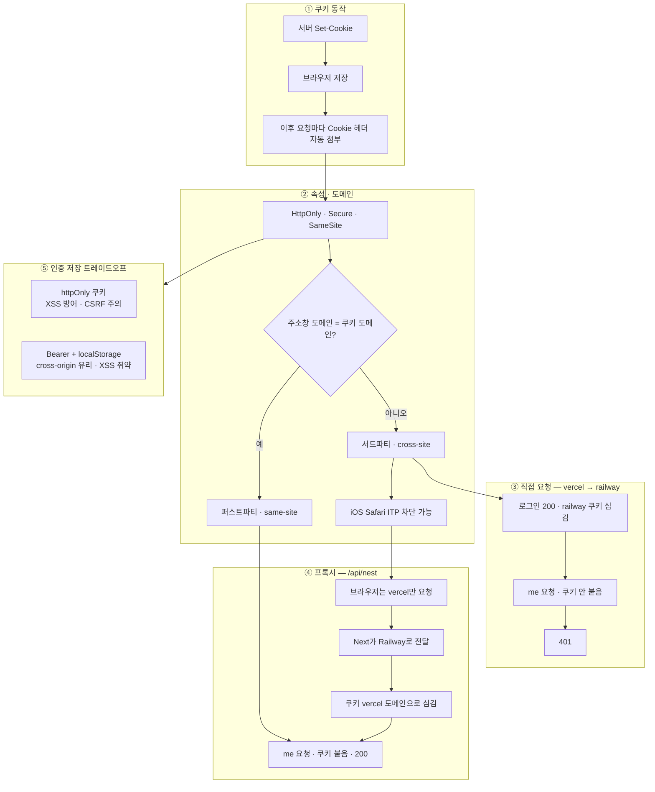

---
aliases:
  - Web
  - Cookie
  - Security
  - HTTP
  - Auth
tags:
  - NextJS
related:
  - "[[00_JS_Ecosystem_HomePage]]"
  - "[[NestJS_CORS]]"
  - "[[NextJS_TokenStorage]]"
  - "[[Web_XSS_CSRF]]"
---
# Web_Cookie — 쿠키

> [!info] 
> 쿠키 = 서버가 브라우저에 심어두는 작은 데이터 조각
>  브라우저가 같은 서버에 요청할 때마다 자동으로 함께 전송
>   속성(HttpOnly, SameSite, Secure)으로 보안·전송 범위를 제어한다.

---
# 흐름도



```txt
Set-Cookie → 자동 전송이 기본 · 도메인이 다르면 서드파티 → Safari 차단
직접 cross-site는 401 · /api/nest 프록시로 퍼스트파티 전환
httpOnly vs Bearer는 XSS·CSRF·cross-origin 트레이드오프 → [[NextJS_TokenStorage]] [[Web_XSS_CSRF]]
```

---
# 쿠키란 — 동작 원리 ⭐️⭐️⭐️⭐️

```txt
HTTP는 기본적으로 "무상태(stateless)" 프로토콜
→ 서버는 요청이 올 때마다 "이게 누구인지" 모름

쿠키는 그 문제를 해결하는 방법 중 하나:
  ① 서버가 응답 헤더에 Set-Cookie를 담아 보냄
  ② 브라우저가 그 쿠키를 저장
  ③ 이후 같은 서버에 요청할 때마다 Cookie 헤더에 자동으로 담아 보냄
  ④ 서버는 그 쿠키를 보고 "아, 이 사람이구나" 식별
```

```http
# 서버 응답 헤더 — 쿠키 심기
Set-Cookie: auth-token=eyJhb...; HttpOnly; Secure; SameSite=Lax; Path=/; Max-Age=3600

# 브라우저 요청 헤더 — 자동으로 첨부
Cookie: auth-token=eyJhb...
```

---

# 쿠키 주요 속성 ⭐️⭐️⭐️⭐️

## HttpOnly ⭐️⭐️⭐️⭐️

```txt
HttpOnly가 있으면:
  → JS에서 document.cookie로 접근 불가
  → HTTP 요청/응답으로만 서버가 읽고 쓸 수 있음

왜 중요한가:
  XSS(Cross-Site Scripting) 공격 시 악성 JS 스크립트가 실행되어도
  HttpOnly 쿠키는 document.cookie로 훔쳐갈 수 없음
  → 인증 토큰은 HttpOnly 쿠키에 저장하는 것이 표준 보안 패턴

localStorage vs HttpOnly 쿠키:
  localStorage    JS로 직접 접근 가능 → XSS에 취약
  HttpOnly 쿠키   JS 접근 불가 → XSS로 탈취 불가
```

## Secure

```txt
Secure가 있으면:
  → HTTPS 연결에서만 전송
  → HTTP(평문) 연결에서는 전송 안 됨

주의: localhost는 예외적으로 HTTP에서도 Secure 쿠키 허용 (개발 편의)
```

## SameSite ⭐️⭐️⭐️⭐️

```txt
SameSite = "이 쿠키를 어느 범위의 요청에서 전송할 것인가"를 제어하는 속성
→ CSRF 공격 방어 + 서드파티 쿠키 차단에 핵심 역할
```

|값|동작|설명|
|---|---|---|
|`Strict`|완전 동일 사이트만|다른 사이트에서 온 요청(링크 클릭 포함)에는 쿠키 미전송|
|`Lax`|대부분의 요청에서 차단, GET + 최상위 내비게이션만 허용|링크 클릭 등 이동은 허용, 외부 사이트 내 img/iframe 등은 차단. 현재 브라우저 기본값|
|`None`|모든 cross-site 요청에서 전송|Secure 속성 필수, 서드파티 쿠키 허용 시 사용|


```txt
SameSite=None; Secure 조합이 필요한 상황:
  vercel.app(프론트)에서 railway.app(API)로 쿠키를 직접 보내야 할 때
  → 서로 다른 도메인이니 cross-site → SameSite=None 필요
  → 하지만 iOS Safari의 ITP가 이를 차단함 (아래 참고)
```

## Domain / Path

```txt
Domain: 쿠키를 전송할 도메인 범위
  Set-Cookie: token=abc; Domain=example.com
  → example.com과 모든 서브도메인(api.example.com 등)에 전송

Path: 쿠키를 전송할 경로 범위
  Set-Cookie: token=abc; Path=/api
  → /api 이하 경로에만 전송 (/page에는 전송 안 됨)
```

## Expires / Max-Age

```txt
Expires: 만료 날짜 (절대값)
  Set-Cookie: token=abc; Expires=Wed, 09 Jun 2025 10:18:14 GMT

Max-Age: 만료까지 남은 시간(초) (상대값, Expires보다 우선)
  Set-Cookie: token=abc; Max-Age=3600   → 1시간 후 만료

둘 다 없으면: 세션 쿠키 (브라우저 탭 닫으면 삭제)
```

---

# 퍼스트파티 vs 서드파티 쿠키 ⭐️⭐️⭐️⭐️

```txt
퍼스트파티(First-party) 쿠키:
  현재 보고 있는 사이트(주소창의 도메인)와 같은 도메인의 쿠키
  예: vercel.app에 접속 중 → vercel.app 도메인 쿠키

서드파티(Third-party) 쿠키:
  현재 보고 있는 사이트와 다른 도메인의 쿠키
  예: vercel.app에 접속 중 → railway.app 도메인 쿠키
```

```txt
왜 서드파티 쿠키가 문제인가:
  원래는 광고 추적에 많이 쓰였음
  사용자가 A 사이트를 방문하든 B 사이트를 방문하든
  광고 서버(c.com)가 쿠키로 같은 사용자임을 추적할 수 있었음

  → 프라이버시 침해 우려 → 브라우저들이 서드파티 쿠키를 점진적으로 차단
    Chrome: 단계적 폐지 진행 중
    Safari(iOS 포함): ITP로 이미 강하게 차단
    Firefox: Enhanced Tracking Protection

우리 프로젝트에서 서드파티 쿠키가 문제가 되는 상황:
  vercel.app(프론트)에서 railway.app(API)로 직접 요청
  → railway.app 쿠키는 서드파티 쿠키로 인식
  → iOS Safari가 차단 → 로그인은 됐는데 이후 인증 요청이 401
```

---

# 교차 사이트(Cross-Site) 쿠키 ⭐️⭐️⭐️

```txt
cross-site = "현재 보고 있는 사이트와 다른 사이트로의 요청"

same-site vs cross-site:
  브라우저 주소창: https://my-app.vercel.app
  요청 대상:       https://my-api.railway.app
  → 도메인이 다름 → cross-site → railway.app의 쿠키는 서드파티 쿠키

이 요청에서 쿠키가 전송되려면:
  SameSite=None; Secure 쿠키여야 하고
  브라우저가 서드파티 쿠키를 허용해야 함 (iOS Safari는 거부)
```

```txt
same-site 판단 기준:
  eTLD+1(유효 최상위 도메인 + 1레벨)이 같으면 same-site
  vercel.app ↔ vercel.app   → same-site ✅ (같은 eTLD+1)
  vercel.app ↔ railway.app  → cross-site ❌ (다른 eTLD+1)

  참고: localhost는 항상 same-site로 취급 (그래서 로컬에서는 문제가 안 나타남)
```

---

# iOS Safari와 ITP(Intelligent Tracking Prevention) ⭐️⭐️⭐️⭐️


```txt
ITP = Apple이 Safari에 적용한 추적 방지 기술
  서드파티 쿠키를 기본적으로 차단
  SameSite=None; Secure 쿠키도 cross-site 요청에서는 차단
  PC Safari도 ITP가 있지만 iOS Safari가 더 엄격함

실제로 겪은 버그:
  API 절대 URL(https://my-api.railway.app)로 직접 요청
  → 로그인 성공 → Set-Cookie로 railway.app 도메인에 쿠키 심음
  → 이후 /auth/me 요청 → railway.app 쿠키가 서드파티로 인식되어 안 붙음
  → 서버는 인증 정보 없음 → 401

  PC 크롬에서는 멀쩡히 되고 아이폰에서만 안 되는 이유가 바로 ITP
```

---

# 프록시로 해결하는 원리 ⭐️⭐️⭐️⭐️

```txt
프록시(Proxy) = "대신 전달해주는 중간 서버"

문제의 본질:
  브라우저가 railway.app에 직접 요청하면
  railway.app의 쿠키 = 서드파티 쿠키 → iOS Safari 차단

해결 아이디어:
  브라우저가 Vercel(Next.js)에 요청 → Vercel이 Railway로 대신 전달
  브라우저 입장: "나는 vercel.app에만 요청했어" → 퍼스트파티 쿠키
  → iOS Safari도 차단 안 함
```

```txt
구체적 동작:

  브라우저 → Vercel /api/nest/auth/login (same-origin)
    ↓
  Vercel이 Railway https://my-api.railway.app/auth/login 으로 대신 요청 (서버끼리)
    ↓
  Railway 응답: Set-Cookie: auth-token=...; HttpOnly; Secure
    ↓
  Vercel이 응답을 브라우저에 전달, 쿠키는 vercel.app 도메인으로 심음
    ↓
  브라우저: vercel.app 쿠키 저장 (퍼스트파티!) → 이후 요청에 자동 첨부

→ 이 구조를 리버스 프록시(Reverse Proxy)라고 함
  클라이언트가 보기엔 Vercel 하나만 있는 것처럼 보임
```

```txt
Vercel에서 구현:
  NEXT_PUBLIC_API_URL = /api/nest  (절대 URL이 아닌 상대 경로)

  vercel.json:
  {
    "rewrites": [
      { "source": "/api/nest/:path*", "destination": "https://my-api.railway.app/:path*" }
    ]
  }

  Next.js Server Component처럼 서버에서 직접 Railway를 호출할 때는:
    API_INTERNAL_URL = https://my-api.railway.app  (서버끼리 통신 → 브라우저 제약 없음)

자세한 CORS + iOS Safari 버그 전체 맥락 → [[NestJS_CORS]]
```

---

# 쿠키 vs localStorage ⭐️⭐️⭐️

| |쿠키|localStorage|
|---|---|---|
|저장 위치|브라우저 (서버가 심어줌)|브라우저 (JS로 직접 저장)|
|서버 자동 전송|✅ 요청마다 Cookie 헤더에 자동 첨부|❌ 직접 꺼내서 헤더에 넣어야 함|
|JS 접근|✅ (HttpOnly 없을 때) / ❌ (HttpOnly)|✅ 항상 가능|
|XSS 취약 여부|HttpOnly면 안전|항상 취약 (JS가 읽을 수 있어서)|
|만료 설정|Expires / Max-Age|직접 구현해야 함|
|용량|약 4KB|약 5~10MB|
|인증 토큰 저장 권장|✅ HttpOnly 쿠키|❌ XSS 위험|


```txt
인증 토큰 저장 위치 결정:

  httpOnly 쿠키 (권장):
    서버가 심어주고, JS가 접근 못 함 → XSS로 탈취 불가
    하지만 cross-site 요청에서 쿠키 차단 문제 → 프록시로 해결하거나 SameSite 관리 필요
    CSRF 공격에 노출될 수 있음 → SameSite + CSRF 토큰으로 방어

  localStorage (비권장):
    JS로 직접 Authorization 헤더에 담아 보냄 → CSRF 공격 안 받음
    하지만 XSS 공격 시 토큰 탈취 가능

토큰 저장 위치별 보안 트레이드오프 상세 → [[NextJS_TokenStorage]]
CSRF / XSS 개념 → [[Web_XSS_CSRF]]
```

---

# 한눈에

```txt
쿠키 핵심 속성:
  HttpOnly   JS 접근 차단 → XSS 방어 (인증 쿠키에 필수)
  Secure     HTTPS에서만 전송
  SameSite   cross-site 요청 제어
    Strict   완전 차단
    Lax      GET + 최상위 이동만 허용 (브라우저 기본값)
    None     전체 허용 (Secure 필수, 서드파티 쿠키)

퍼스트파티 vs 서드파티:
  현재 방문 사이트 도메인 = 퍼스트파티
  다른 도메인 = 서드파티 → Safari/ITP가 차단

cross-site 쿠키 차단이 일어나는 경우:
  vercel.app(프론트)에서 railway.app(API)로 직접 요청
  → railway.app 쿠키는 서드파티 → iOS Safari ITP 차단 → 401

프록시(Vercel rewrites)로 해결:
  브라우저 → Vercel /api/nest → Railway (서버끼리)
  쿠키가 vercel.app 도메인(퍼스트파티)에 귀속 → 차단 안 됨
  → [[NestJS_CORS]] 트러블슈팅 섹션 참고
```