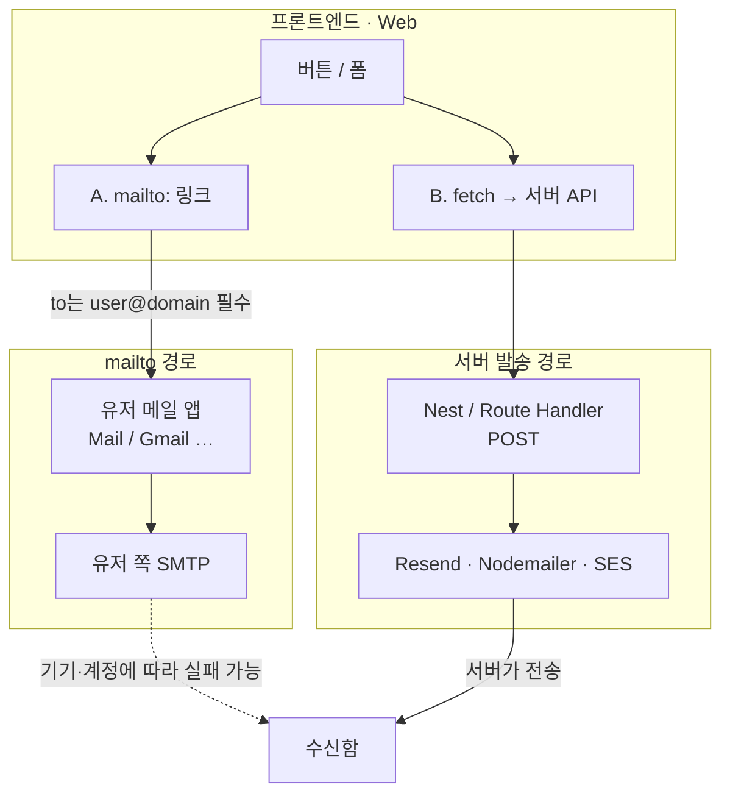

---
aliases:
  - Email
  - Web
  - subject
  - body
tags:
  - NextJS
  - JavaScript
related:
  - "[[00_JS_Ecosystem_HomePage]]"
  - "[[JS_URL_Encoding]]"
  - "[[JS_Fetch_API]]"
  - "[[NextJS_API_Client]]"
  - "[[NestJS_Email]]"
---
# Web_Email — 프론트엔드 이메일 패턴

> [!info] 
> 프론트엔드에서 이메일을 다루는 방법은 두 가지.
>  `mailto:` 링크로 기본 이메일 앱을 열거나, API를 호출해서 서버가 직접 보내는 것.

---
# 흐름도



> **핵심:** Web은 메일을 **직접 못 보냄**. `mailto` = 앱만 열기 · `fetch` = 서버가 SMTP/API로 발송. 상세 서버 쪽 → [[NestJS_Email]]

---

# mailto: — 이메일 앱 열기 ⭐️⭐️⭐️

```tsx
// 기본
<a href="mailto:support@example.com">이메일 보내기</a>

// 제목 포함 — 한글/특수문자는 encodeURIComponent 필수
<a href={`mailto:${email}?subject=${encodeURIComponent('문의합니다')}`}>
  문의하기
</a>

// 제목 + 본문
<a href={`mailto:${email}?subject=${encodeURIComponent('제목')}&body=${encodeURIComponent('본문')}`}>
  문의하기
</a>
```

## 파라미터

|파라미터|의미|
|---|---|
|`subject`|제목|
|`body`|본문|
|`cc`|참조|
|`bcc`|숨은 참조|

```typescript
// URLSearchParams로 깔끔하게 조립
function buildMailtoLink(options: {
  to:       string;
  subject?: string;
  body?:    string;
}) {
  const params = new URLSearchParams();
  if (options.subject) params.set('subject', options.subject);
  if (options.body)    params.set('body',    options.body);
  const q = params.toString();
  return `mailto:${options.to}${q ? `?${q}` : ''}`;
}
```

```txt
encodeURIComponent가 필요한 이유:
  한글, 공백, & = 같은 문자가 URL에 그대로 들어가면 파라미터 구분자와 충돌
  URLSearchParams.set()은 자동 인코딩 처리

주의:
  기기에 이메일 앱이 설정돼 있어야 열림
  Gmail 웹 사용자에게는 안 열릴 수 있음
  → 이메일 주소를 텍스트로도 같이 표시하는 것이 더 안전

encodeURIComponent 상세 → [[JS_URL_Encoding]]
```

---

# 서버리스 이메일 API — Resend ⭐️⭐️⭐️⭐️

```txt
프론트에서 직접 이메일을 보낼 수는 없음 (SMTP는 서버 전용)
→ Resend, Formspree 같은 외부 서비스 API를 통해 이메일 전송

Resend:
  React로 이메일 템플릿을 작성 가능 (react-email)
  Next.js Route Handler와 잘 어울림
  무료 플랜: 월 3,000통
```

## Next.js Route Handler + Resend

```bash
pnpm add resend
```

```typescript
// app/api/contact/route.ts
import { Resend } from 'resend';
import { NextResponse } from 'next/server';

const resend = new Resend(process.env.RESEND_API_KEY);

export async function POST(req: Request) {
  const { name, email, message } = await req.json();

  try {
    await resend.emails.send({
      from:    'no-reply@example.com',  // Resend에 등록된 도메인
      to:      'admin@example.com',
      subject: `[문의] ${name}님의 메시지`,
      html:    `<p><b>${name}</b> (${email})</p><p>${message}</p>`,
    });
    return NextResponse.json({ ok: true });
  } catch (err) {
    return NextResponse.json({ ok: false }, { status: 500 });
  }
}
```

## 문의 폼 컴포넌트

```tsx
'use client';
import { useState } from 'react';

function ContactForm() {
  const [status, setStatus] = useState<'idle' | 'sending' | 'done' | 'error'>('idle');

  async function handleSubmit(e: React.FormEvent<HTMLFormElement>) {
    e.preventDefault();
    setStatus('sending');

    const form = e.currentTarget;
    const data = {
      name:    (form.elements.namedItem('name')    as HTMLInputElement).value,
      email:   (form.elements.namedItem('email')   as HTMLInputElement).value,
      message: (form.elements.namedItem('message') as HTMLTextAreaElement).value,
    };

    const res = await fetch('/api/contact', {
      method:  'POST',
      headers: { 'Content-Type': 'application/json' },
      body:    JSON.stringify(data),
    });

    setStatus(res.ok ? 'done' : 'error');
  }

  return (
    <form onSubmit={handleSubmit}>
      <input name="name"    required placeholder="이름" />
      <input name="email"   required type="email" placeholder="이메일" />
      <textarea name="message" required placeholder="문의 내용" />
      <button type="submit" disabled={status === 'sending'}>
        {status === 'sending' ? '전송 중…' : '보내기'}
      </button>
      {status === 'done'  && <p>전송됐어요!</p>}
      {status === 'error' && <p>전송 실패. 다시 시도해주세요.</p>}
    </form>
  );
}
```

---

# Formspree — 백엔드 없이 폼 제출 ⭐️⭐️

```tsx
// Formspree — 무료 플랜으로 폼 제출 → 이메일 수신
// https://formspree.io 에서 폼 생성 후 고유 ID 발급

<form action="https://formspree.io/f/{FORM_ID}" method="POST">
  <input type="email" name="email" required />
  <textarea name="message" required />
  <button type="submit">보내기</button>
</form>
```

```txt
Formspree:
  서버 없이 HTML form만으로 이메일 수신 가능
  무료: 월 50건
  스팸 방지 자동 처리

Resend vs Formspree:
  Resend  서버(Route Handler)를 통해 이메일 전송 — 내용 가공·로직 추가 가능
  Formspree  HTML form 그대로 제출 — 설정 최소화, 서버 불필요

백엔드에서 이메일 보내기 → [[NestJS_Email]]
```

---

# 한눈에

```txt
mailto:
  <a href="mailto:to?subject=...&body=...">
  encodeURIComponent 또는 URLSearchParams로 파라미터 인코딩
  이메일 앱이 없는 환경에서는 안 열릴 수 있음

Resend (Next.js Route Handler):
  pnpm add resend
  Route Handler에서 resend.emails.send()
  from은 Resend에 등록된 도메인 필요

Formspree:
  HTML form + action="https://formspree.io/f/{id}"
  서버 없이 이메일 수신 가능

백엔드 이메일 → [[NestJS_Email]]
```