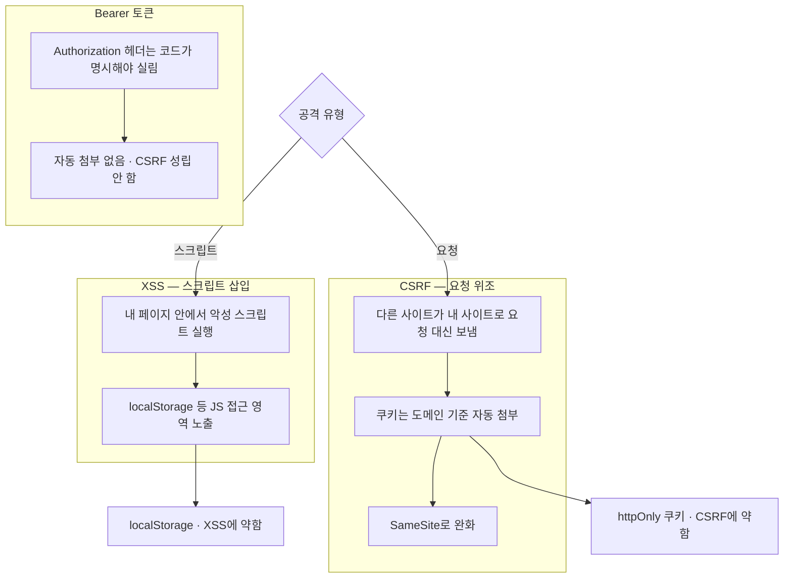

---
aliases:
  - XSS
  - CSRF
  - SameSite
tags:
  - Web
related:
  - "[[00_JS_Ecosystem_HomePage]]"
  - "[[NextJS_TokenStorage]]"
  - "[[NextJS_AuthCache]]"
  - "[[NestJS_CORS]]"
---

# Web_XSS_CSRF — 두 공격이 정확히 뭔지

> [!info] 
> XSS는 "내 사이트에 남의 악성 스크립트가 끼어들어 실행되는 것"이고, CSRF는 "내가 로그인해둔 사이트에 다른 사이트가 내 의지와 무관하게 요청을 대신 보내는 것"이다. 토큰을 어디에 저장할지(localStorage vs httpOnly 쿠키) 고를 때, 이 둘 중 어느 쪽 위험을 줄일지의 트레이드오프가 생긴다.

---
# 흐름도



```txt
XSS는 페이지 안 실행 · CSRF는 다른 사이트가 내 사이트로 요청을 대신 보냄
쿠키는 브라우저가 자동 첨부 · Bearer 헤더는 명시 설정만 — CSRF에 안전
저장 위치는 XSS vs CSRF 중 어느 쪽을 줄일지의 트레이드오프
```

---

# XSS(Cross-Site Scripting) — 내 사이트에 악성 스크립트가 끼어듦 ⭐️⭐️⭐️⭐️

```txt
정의: 공격자가 어떤 경로로든(취약한 입력창, 댓글, URL 파라미터 등) 자신의 JS 코드를
내 사이트 페이지 안에서 실행되게 만드는 것

예시 시나리오:
  댓글창에 적은 내용을 검증/이스케이프 없이 그대로 화면에 표시하는 사이트라면,
  댓글에 <script>...</script> 같은 코드를 끼워넣었을 때 다른 사용자가 그 댓글을 보는 순간
  그 스크립트가 "그 사용자의 브라우저에서" 그대로 실행돼버림
```

```txt
왜 위험한가:
  그 스크립트는 "지금 이 페이지 안에서" 실행되는 것이라, 페이지가 JS로 접근 가능한
  모든 것(localStorage, httpOnly가 아닌 쿠키, DOM 등)에 똑같이 접근할 수 있음
  → localStorage.getItem('access_token')을 그대로 읽어서 공격자 서버로 몰래 전송하는 것도 가능함

  → 토큰을 localStorage에 두면 "XSS에 노출된다"고 말하는 게 정확히 이 시나리오를 가리키는 것
```

---

# CSRF(Cross-Site Request Forgery) — 다른 사이트가 내 대신 요청을 보냄 ⭐️⭐️⭐️⭐️

```txt
정의: 사용자가 공격자가 만든 "다른 사이트"에 접속했을 때, 그 사이트가
(사용자의 동의나 인지 없이) 내가 이미 로그인해둔 "진짜 사이트"로 요청을 자동으로 쏘는 것
```

```txt
핵심 메커니즘 — 쿠키는 "도메인 기준"으로 자동 첨부됨:
  브라우저는 쿠키를, "그 쿠키를 발급한 도메인으로 가는 요청"이라면
  그 요청이 어디서 시작됐든(다른 탭, 다른 사이트의 폼 자동 제출, 이미지 태그 등)
  자동으로 같이 실어서 보냄 — 사용자가 그 요청을 직접 누른 게 아니어도 똑같이 실림

실전 예시:
  사용자가 bank.example에 로그인해서 쿠키를 받은 상태에서, evil.example에 접속함
  evil.example 페이지 안에 처럼
  GET 요청을 자동으로 일으키는 태그가 숨어있다면, 브라우저는 bank.example의 쿠키를
  자동으로 같이 보내버림 → 서버는 마치 사용자가 직접 요청한 것처럼 처리해버릴 위험이 있음
```

---

# 왜 Bearer 헤더는 CSRF에 안전한가 ⭐️⭐️⭐️⭐️

```txt
쿠키와 Authorization 헤더는 "누가 자동으로 실어주는가"가 다름:
  쿠키                  브라우저가 도메인 기준으로 자동 첨부 (코드가 따로 안 시켜도 실림)
  Authorization 헤더    코드가 명시적으로 설정해야만 실림 (자동으로 안 붙음)

evil.example의 페이지는 bank.example로 보낼 요청에 Authorization 헤더를 직접 설정할 권한이 없음
(다른 출처라서 bank.example의 토큰 값 자체를 모름 — localStorage도 도메인별로 격리돼있어서 못 읽음)
→ 그래서 Bearer 토큰 방식은 CSRF라는 공격 자체가 원천적으로 성립하지 않음
```

|방식|요청에 자동으로 실리는가|CSRF 가능한가|
|---|---|---|
|쿠키|브라우저가 그 도메인으로 가는 요청마다 자동 첨부|가능 — 사용자 의지와 무관하게 자동 전송됨|
|`Authorization: Bearer` 헤더|코드가 명시적으로 설정해야만 실림|불가능 — 다른 출처는 그 토큰 값 자체를 모름|

```txt
"Bearer 토큰은 CSRF 노출 없음"이라는 말이 정확히 이 표를 가리키는 것 —
자동으로 안 실리니, 공격자 사이트가 그 헤더를 흉내 낼 방법이 없는 것
```

---

# SameSite — 쿠키의 CSRF 완화 장치 ⭐️⭐️⭐️

```txt
SameSite=Strict 또는 Lax: "이 쿠키는 같은 사이트에서 시작된 요청에만 보낸다"는 제약을 거는 속성
→ evil.example처럼 다른 사이트에서 시작된 요청에는 그 쿠키가 자동으로 안 실리게 됨
→ 위 CSRF 시나리오의 핵심 전제(쿠키가 자동으로 따라간다)를 상당 부분 막아줌

다만 100% 막는 건 아님:
  레거시 브라우저는 SameSite를 아예 무시할 수 있음
  Lax는 일부 GET 요청 등에는 예외를 둠
→ 그래서 SameSite만으로 끝내지 않고, 별도의 CSRF 토큰을 요청 본문에 같이 보내는
  방식을 병행하는 경우도 많음(쿠키 기반 인증을 쓰는 백엔드 프레임워크들이 흔히 제공하는 기능)
```

---

# 한눈에

| 개념                      | 핵심                                                                                      |
| ----------------------- | --------------------------------------------------------------------------------------- |
| XSS                     | 악성 스크립트가 내 페이지 "안에서" 실행됨 — 그 페이지가 접근 가능한 모든 것(localStorage 등)이 노출 위험                    |
| CSRF                    | 다른 사이트가 사용자 모르게 "진짜 사이트"로 요청을 대신 보냄 — 쿠키가 자동으로 같이 실려서 가능해짐                              |
| 쿠키가 CSRF에 약한 이유         | 브라우저가 도메인 기준으로 자동 첨부하기 때문                                                               |
| Bearer 헤더가 CSRF에 안전한 이유 | 자동으로 안 실림 — 다른 출처가 그 값을 흉내 낼 방법이 없음                                                     |
| `SameSite`              | 쿠키를 "같은 사이트 요청에만" 보내도록 제한 — CSRF 완화(완전 차단은 아님)                                          |
| 토큰 저장 위치와의 관계           | localStorage는 XSS에 약함, httpOnly 쿠키는 CSRF에 약함(SameSite로 보완) — [[NextJS_TokenStorage]] 참고 |