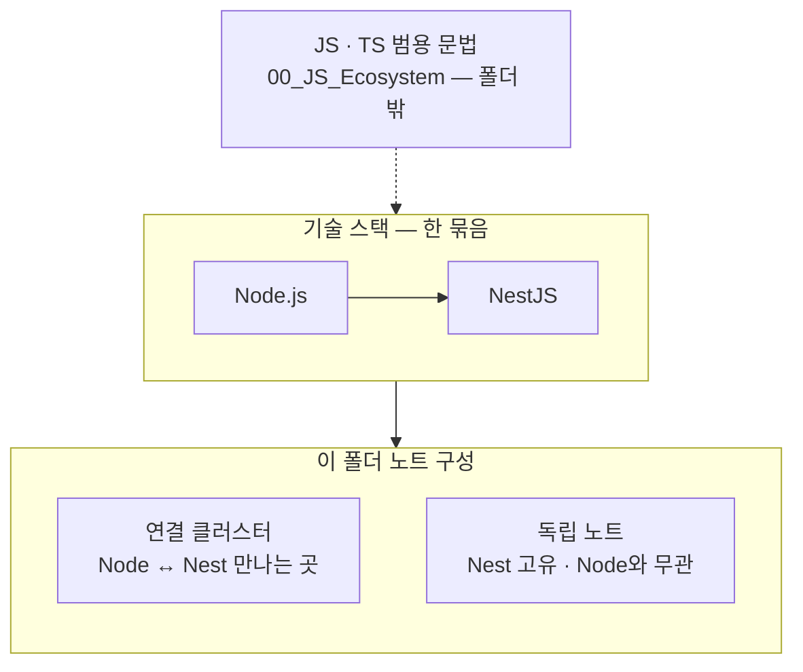

# 00_NestJS_Ecosystem_HomePage — NestJS · NodeJS

>[!info]
> NestJS는 NodeJS 위에 얹힌 프레임워크. 
> NodeJS와 만나는 지점은 주로 인증(Passport)과 HTTP 요청 레이어. JS/TS 범용 문법은 → [[00_JS_Ecosystem_HomePage]]




```txt
큰 틀: 범용 문법은 JS 홈 → Node 위에 Nest → 아래 표는 연결 묶음 · 독립 노트 두 층
```

---

# 빠른 찾기

| 찾을 때 | 섹션 |
| --- | --- |
| 인증 / JWT / Guard | [[#🔐 인증 · JWT]] |
| HTTP 요청 / 응답 | [[#🌐 HTTP 요청 · 응답]] |
| 데이터베이스 / Prisma | [[#🗄️ 데이터베이스]] |
| 모듈 / DI | [[#🧩 모듈 · DI]] |
| DTO / 유효성 검사 | [[#📋 요청 · 응답 처리]] |
| 이메일 / 스케줄링 | [[#⚙️ 패턴 · 기법]] |
| WebSocket | [[#📡 실시간 · WebSocket]] |
| Swagger / 문서화 | [[#📄 API 문서화]] |
| 환경변수 / 배포 | [[#🚀 설정 · 보안 · 배포]] |
| 기초 개념 | [[#📦 기초 개념]] |

---

## 🔐 인증 · JWT

| |노트|
|---|---|
|**NodeJS**|[[NodeJS_Passport]] · [[NodeJS_Buffer]]|
|**NestJS**|[[NestJS_Auth]] · [[NestJS_JwtGuard]] · [[NestJS_Bcrypt]] · [[Auth_Concept]]|


```txt
NodeJS_Passport  Passport.js 동작 원리 — Strategy · validate · req.user
NodeJS_Buffer    JWT base64 인코딩 원리 · Basic Auth 인코딩
NestJS_Auth      소셜 로그인 (Google · Kakao · Naver · Apple) · Passport 연동
NestJS_JwtGuard  JWT 검증 · SetMetadata · Reflector · @Public · @Roles · @AllowWithdrawing
NestJS_Bcrypt    hash · compare · 조건부 해싱 · 응답에서 제거
Auth_Concept     OAuth 흐름 · JWT vs 세션 (→ JS_Ecosystem 폴더에 있음)
```

---

## 🌐 HTTP 요청 · 응답

| |노트|
|---|---|
|**NodeJS**|[[NodeJS_HTTP_Request]] · [[NodeJS_Buffer]]|
|**NestJS**|[[NestJS_Controller]] · [[NestJS_Response]]|


```txt
NestJS_Controller의 @Req() = NodeJS_HTTP_Request의 Express Request 객체
```

---

## 📡 실시간 · WebSocket

|             | 노트                                       |
| ----------- | ---------------------------------------- |
| **NestJS**  | [[NestJS_WebSocket]]                     |
| **Next.js** | [[NextJS_WebSocket]] (→ JS_Ecosystem 폴더) |

```txt
NestJS_WebSocket   Gateway · 룸 · 인증 · REST+WS 브로드캐스트 · sockets.values() 순회
NextJS_WebSocket   socket.io-client · 싱글턴 · Promise 래핑 · 클린업 함수
```

---

## 🗄️ 데이터베이스

| |노트|
|---|---|
|**Prisma**|[[NestJS_Prisma]] · [[NestJS_Prisma_Monorepo]]|
|**PostgreSQL**|[[NestJS_PostgreSQL]]|
|**통계**|[[NestJS_StatsBucket]]|
|**마이그레이션**|[[NestJS_Migration]]|
|**DB 전체**|[[00_DB_HomePage]]|


```txt
NestJS_Prisma     CRUD · 관계 필터(some/every/none) · 원자적 업데이트(increment) · $transaction
NestJS_StatsBucket 통계 집계 → [[React_Charts]]와 연결
00_DB_HomePage    순수 SQL · MySQL · Redis
```

---

## 🧩 모듈 · DI

| |노트|
|---|---|
|**NestJS**|[[NestJS_Module]] · [[NestJS_Service_Provider]]|
|**이벤트**|[[NodeJS_EventEmitter]]|

---

## 📋 요청 · 응답 처리

| |노트|
|---|---|
|**DTO · 유효성**|[[NestJS_DTO]]|
|**Swagger**|[[NestJS_Swagger]]|
|**Pipe**|[[NestJS_Pipe]]|


```txt
NestJS_DTO      class-validator · @Type · @ValidateIf · PartialType · 커스텀 메시지
NestJS_Swagger  @ApiProperty · type:[String] 배열 · nullable · 응답 타입
→ 프론트 타입 자동 생성으로 [[NextJS_API_Client]] · [[NextJS_ApiTypes_Mapper]]와 연결
```

---

## ⚙️ 패턴 · 기법

| |노트|
|---|---|
|**이메일**|[[NestJS_Email]]|
|**스케줄링**|[[NestJS_Scheduling]]|
|**스로틀링**|[[NestJS_Throttle]]|
|**로깅**|[[NestJS_Logger]]|
|**페이지네이션**|[[NestJS_Pagination]]|
|**멱등성**|[[NestJS_Idempotency]]|


```txt
NestJS_Email       Resend · Nodemailer · Amazon SES · SMTP 설정 · MailService 패턴
NestJS_Scheduling  @Cron · CronExpression · @Interval · @Timeout · 타임존 · SchedulerRegistry
NestJS_Throttle    스로틀링 · 서비스 레벨 force 패턴
NestJS_Idempotency 중복 요청 방어 · 멱등키 · 낙관적/비관적 잠금
```

---

## 📄 API 문서화

| |노트|
|---|---|
|**NestJS**|[[NestJS_Swagger]] · [[NestJS_Versioning]]|

---

## 🚀 설정 · 보안 · 배포

| |노트|
|---|---|
|**환경변수**|[[NestJS_Env_Config]]|
|**CORS**|[[NestJS_CORS]]|
|**모노레포**|[[Monorepo_PNPM]]|
|**배포**|[[00_Deployment_HomePage]]|

---

## 📦 기초 개념

| |노트|
|---|---|
|**NestJS**|[[NestJS_Concept]]|

---


```txt
폴더 합친 이유:
  NestJS와 NodeJS가 실제로 얽히는 지점은 인증(Passport)과 HTTP 요청 레이어
  분류는 접두사(NestJS_ / NodeJS_)가 이미 하고 있어서 폴더 합쳐도 안 헷갈림
```