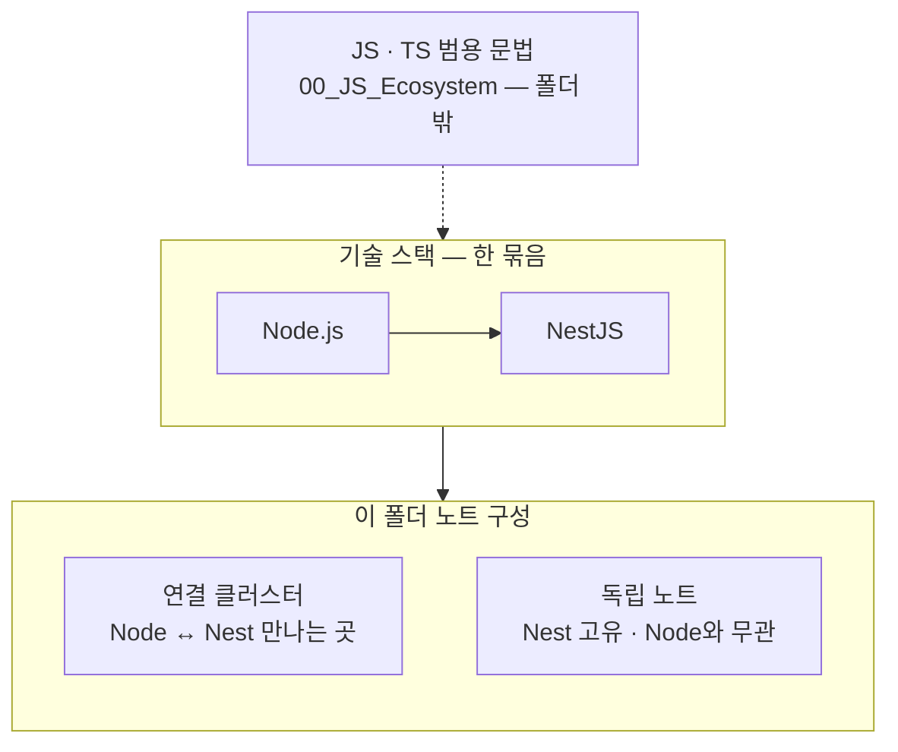

# 00_NestJS_Ecosystem_HomePage — NestJS · NodeJS

> [!info] 
> NestJS는 NodeJS 위에 얹힌 프레임워크고, 둘이 실제로 만나는 지점은 주로 HTTP 요청/인증 레이어(Passport, Request 객체, 헤더)
> DTO/Pipe/Guard/Swagger 같은 NestJS 고유 영역은 NodeJS와 안 얽힌다 
> 그래도 폴더를 합치는 게 맞는 이유는 그 "안 얽힌 부분"도 결국 같은 런타임 위에서 동작하기 때문.

```txt
JS/TS 범용 문법(JS_Array_Methods, TS_Generics, JS_OptionalChaining 등)은
프론트든 백엔드든 똑같이 쓰여서 [[00_JS_Ecosystem_HomePage]]에 따로 모여있음 — 거기 참고
```



```txt
큰 틀: 범용 문법은 JS 홈 → Node 위에 Nest → 아래 표는 연결 묶음 · 독립 노트 두 층
```

---

# 연결 클러스터 — 묶음별로 옆에서 같이 보기 ⭐️⭐️⭐️⭐️

|클러스터|NodeJS|NestJS|
|---|---|---|
|인증 · JWT|[[NodeJS_Passport]] · [[NodeJS_Buffer]] (JWT의 base64 인코딩 원리)|[[NestJS_JwtGuard]] · [[Auth_Concept]](실제로는 [[00_JS_Ecosystem_HomePage]] 폴더에 있는 노트) · [[NestJS_Bcrypt]]|
|HTTP 요청 · 응답|[[NodeJS_HTTP_Request]] · [[NodeJS_Buffer]] (Basic Auth 인코딩)|[[NestJS_Controller]] · [[NestJS_Response]]|
|이벤트 발행/구독|[[NodeJS_EventEmitter]]|(@nestjs/event-emitter — NodeJS_EventEmitter 참고)|

```txt
같은 행에 있는 노트들은 서로 [[위키링크]]로 실제로 연결돼 있음
  예: NodeJS_Passport의 "NestJS에서는 어떻게 보이는가" 섹션이 NestJS_JwtGuard의 코드를 그대로 매핑함
      NestJS_Controller의 @Req()가 사실 NodeJS_HTTP_Request에서 설명한 Express Request 객체 그 자체
```

---

# 클러스터에 안 들어가는 독립 노트 — NestJS 고유 영역 ⭐️

```txt
NodeJS "기초" 개념이 아니라 NestJS 프레임워크 자체가 만든 영역 — 다른 트랙과 안 얽힘
```

| 영역        | 노트                                                                                                                                                                                                                                                                                                                                                                                                 |
| --------- | -------------------------------------------------------------------------------------------------------------------------------------------------------------------------------------------------------------------------------------------------------------------------------------------------------------------------------------------------------------------------------------------------- |
| 요청 데이터 검증 | [[NestJS_DTO]] (→ 프론트 타입 자동 생성으로 [[NextJS_API_Client]] · [[NextJS_API_Mapper]]와 연결, [[00_JS_Ecosystem_HomePage]] 참고)                                                                                                                                                                                                                                                                               |
| 데이터베이스    | [[NestJS_Prisma]] · [[NestJS_PostgreSQL]] · [[NestJS_Prisma_Monorepo]] · [[NestJS_StatsBucket]] (통계 집계 → [[React_Charts]]와 연결) · [[NestJS_Migration]] · [[00_DB_HomePage]] (DB 전체 홈 — 순수 SQL · MySQL · Redis)                                                                                                                                                                                      |
| 모듈/DI 구조  | [[NestJS_Module]] · [[NestJS_Service_Provider]]                                                                                                                                                                                                                                                                                                                                                    |
| 패턴/기법     | [[NestJS_DTO]] (class-validator · @Type · PartialType) · [[NestJS_Swagger]] (@ApiProperty · type:[String] · 응답 타입) · [[NestJS_Throttle]] (스로틀링 · 서비스 레벨 force) · [[NestJS_Email]] (Resend · Nodemailer · SES · 인증메일) · [[NestJS_Scheduling]] (@Cron · CronExpression · @Interval · 타임존) · [[NestJS_Logger]] (내장 로거) · [[NestJS_Pagination]] · [[NestJS_Idempotency]] (중복 요청 방어 · 멱등키 · 낙관적/비관적 잠금) |
| 인증/보안     | [[NestJS_CORS]] · [[NestJS_Env_Config]] · [[NestJS_Auth]] (Passport · 로컬 · Google · Kakao · Naver · Apple) · [[Auth_Concept]] (OAuth 흐름 · JWT vs 세션) · [[NestJS_JwtGuard]] (SetMetadata · Reflector · @Public · @Roles · @AllowWithdrawing) · [[NestJS_WebSocket]] (Gateway · 룸 · 실시간 통신) · [[Monorepo_PNPM]] · [[00_Deployment_HomePage]] (배포 인프라)                                                |
| API 문서화   | [[NestJS_Swagger]] · [[NestJS_Versioning]]                                                                                                                                                                                                                                                                                                                                                         |
| 기초 개념     | [[NestJS_Concept]]                                                                                                                                                                                                                                                                                                                                                                                 |


```txt
이 목록은 폴더 안에 있다고 알고 있는 노트 이름만 적어둔 것 — 실제 내용을 아직 안 봤으니
혹시 위 클러스터 표에 들어가야 하는 게 있다면 표로 옮기면 됨
```

---

# Toolbox · Project

```txt
Wiki(23)는 Nest 개념 · Toolbox(10)는 복붙 패턴 · Project(30)는 프로젝트별 ER
```

| 하고 싶은 일 | 먼저 볼 노트 |
|---|---|
| 공유 URL → embed URL (올리기 API) | [[Snippet_normalize-embed-url]] |
| music-community ER · 스키마 헷갈림 | [[MusicCommunity_DB]] |

---

# 폴더 합친 이유 — 짧게 기록

```txt
NestJS와 NodeJS가 실제로 얽히는 지점은 인증(Passport)과 HTTP 요청 레이어(Request 객체) —
JS/React/Next.js 케이스처럼 전체가 얽힌 건 아니지만, 그 얽힌 부분이 분명히 있고
나머지(DTO/Module/Swagger 등)도 결국 같은 Node 런타임 위라 폴더를 나눌 이유가 약함
→ 분류는 접두사(NestJS_/NodeJS_)가 이미 하고 있어서 폴더 합쳐도 안 헷갈림
```