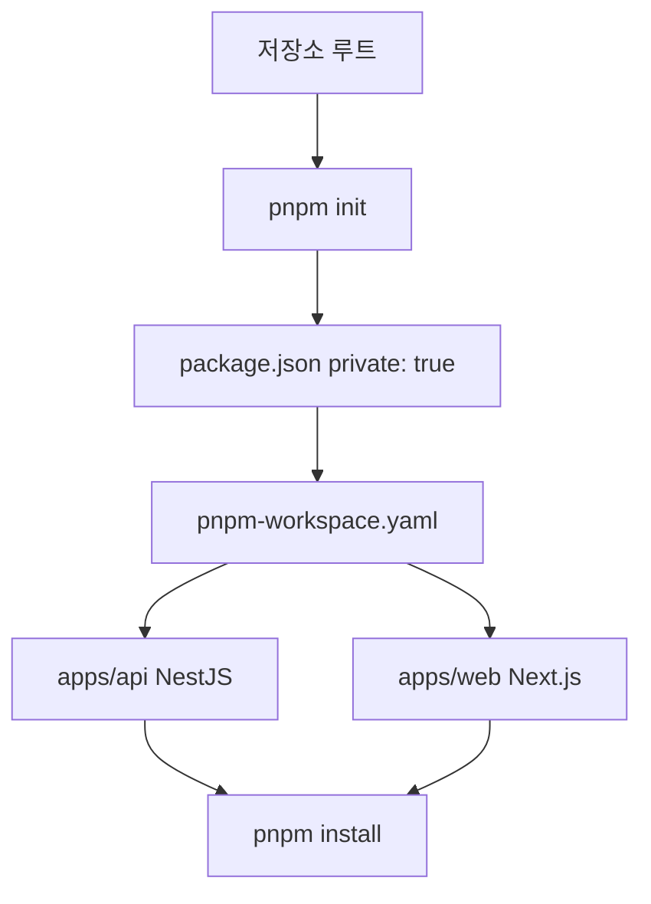

---
aliases:
  - 모노레포
  - allowBuilds
  - monorepo
  - pnpm workspace
  - 멀티레포
tags:
  - 모노레포
  - pnpm
related:
  - "[[00_JS_Ecosystem_HomePage]]"
  - "[[00_NestJS_Ecosystem_HomePage]]"
  - "[[NestJS_Migration]]"
  - "[[NestJS_Swagger]]"
  - "[[OpenAPI_Codegen]]"
  - "[[TS_TsConfig]]"
  - "[[NestJS_Concept]]"
  - "[[NestJS_Env_Config]]"
---
# Monorepo_PNPM — pnpm 워크스페이스로 모노레포 구성하기

>[!info]
>모노레포 = 여러 패키지(앱/라이브러리)를 하나의 Git 저장소에서 관리하는 방식. pnpm workspace = 그 여러 패키지를 하나의 의존성 트리(lockfile 1개)로 묶어 관리하는 기능.

---

# 모노레포 vs 멀티레포 ⭐️⭐️⭐️

|구분|멀티레포 (저장소 여러 개)|모노레포 (저장소 하나)|
|---|---|---|
|코드 공유|패키지 publish 해서 import|로컬 폴더 참조 — 즉시 반영|
|타입/스키마 공유|버전 맞춰 배포해야 반영됨|수정 즉시 다른 패키지에서 바로 보임|
|PR/리뷰|프론트·백엔드 변경이 따로 흩어짐|관련 변경을 한 PR로 같이 리뷰 가능|
|설정 관리 (eslint, tsconfig)|각 저장소마다 따로|루트에서 한 번 관리|
|저장소 크기/빌드 시간|작음|커질수록 CI 시간 관리 필요|

```txt
apps/web(Next.js) + apps/api(NestJS)처럼 프론트와 백엔드가 같은 Prisma 스키마/타입을
공유해야 하는 구조라면, 모노레포가 "타입을 항상 최신으로 동기화"하는 데 특히 유리함
```

---

# 기본 디렉토리 구조

```txt
my-project/
├── apps/
│   ├── web/                  Next.js
│   └── api/                  NestJS
├── packages/                 (선택) 여러 앱이 같이 쓰는 공유 라이브러리/타입
├── pnpm-workspace.yaml       워크스페이스 멤버 정의 + pnpm 설정
├── pnpm-lock.yaml            단 하나의 lockfile — 모든 패키지 의존성 통합
└── package.json              루트 — 공통 스크립트만 (보통 private: true)
```

---

# 초기 설정 순서 ⭐️⭐️⭐️⭐️



```txt
반드시 루트 워크스페이스를 먼저 잡고, 그 다음에 각 앱을 추가해야 함
순서를 지키지 않으면 lockfile이 분리되거나 .git이 중첩되는 문제 발생
```

## 1단계 — 루트 초기화

```bash
# 이미 git이 있으면 git init 하지 않는다 — 중첩 .git만 생긴다
# git init은 처음 한 번만

pnpm init         # 루트 package.json 생성
```

루트 `package.json`에 `"private": true` 추가:

```json
{
  "name": "my-project",
  "private": true,    // ← 반드시 추가
  "version": "1.0.0"
}
```

```txt
"private": true가 필요한 이유:
  루트 패키지는 앱이 아니라 "여러 앱을 묶는 컨테이너"
  npm에 실수로 publish되는 것을 방지
  이게 없으면 pnpm이 워크스페이스 루트임을 인식 못할 수 있음
```

## 2단계 — pnpm-workspace.yaml 생성 (순서 중요!)

```yaml
# pnpm-workspace.yaml (루트에 생성)
packages:
  - 'apps/*'
  - 'packages/*'
```

```txt
이 파일이 있어야:
  pnpm이 "이 프로젝트는 모노레포구나" 인식
  apps/* 아래 폴더들을 워크스페이스 멤버로 등록
  루트 node_modules에서 의존성을 공유

이 파일 없이 apps/api 에서 먼저 pnpm install 하면:
  그 폴더가 독립 프로젝트로 취급 → 별도 lockfile 생성 → 문제
```

## 2.5단계 — .npmrc에 store-dir 고정 ⭐️⭐️⭐️⭐️

```bash
# .npmrc (루트에 생성)
store-dir=.pnpm-store
```

```txt
store-dir=.pnpm-store:
  pnpm이 사용하는 패키지 저장소 위치를 프로젝트 내부로 고정
  기본값은 OS 전역 스토어 (~/.pnpm-store)

고정하는 이유:
  팀원마다 전역 스토어 위치가 다를 수 있음
  CI/CD 환경에서 전역 스토어가 없을 수 있음
  → 프로젝트 안에 고정하면 어디서나 일관된 동작

이걸 안 하면 생기는 문제:
  node_modules가 .pnpm-store에 링크된 상태인데
  다른 store를 참조하면 → ERR_PNPM_UNEXPECTED_STORE 에러
  pnpm add 시 --store-dir 옵션을 쓰면 충돌 발생 (위 에러 섹션 참고)

.gitignore에 추가:
  .pnpm-store/    # 스토어 자체는 git에 올리지 않음
```

## 3단계 — NestJS 앱 생성

```bash
cd apps
nest new api      # apps/api 생성
```

```txt
생성 후 확인할 것:
  apps/api/.git  → 반드시 삭제 (루트 git과 중첩)
  apps/api/src/main.ts → 없으면 서버가 안 뜸 (Nest CLI가 가끔 누락)
  package.json의 "name": "api" → --filter api 명령에서 이 이름을 사용
```

```bash
rm -rf apps/api/.git
```

## ⚠️ "type" 필드 — NestJS는 CommonJS ⭐️⭐️⭐️⭐️

```json
// ❌ 루트 package.json에 "type": "module" 넣으면 안 됨
{
  "private": true,
  "type": "module"   // ← NestJS(CJS)와 충돌
}

// ✅ 루트 package.json — "type" 없음
{
  "private": true
}

// ✅ apps/api/package.json — CJS 명시
{
  "name": "api",
  "type": "commonjs"   // NestJS는 CommonJS
}
```

```txt
"type": "module" vs "type": "commonjs":
  "module"    → .js 파일을 ESM(import/export) 방식으로 해석
  "commonjs"  → .js 파일을 CJS(require) 방식으로 해석
  없으면      → "commonjs"가 기본값

NestJS가 CJS인 이유:
  NestJS의 tsconfig에서 module: "nodenext"나 "commonjs"를 사용
  빌드 결과물(.js)이 require() 방식
  루트에 "type": "module"이 있으면 → CJS 파일을 ESM으로 해석 → 충돌

스토어/링크 깨짐 증상과 함께 나타날 때:
  타입은 있는데 IDE·모듈 해석이 꼬여있다면
  1. 루트 package.json에서 "type": "module" 제거
  2. apps/api/package.json에 "type": "commonjs" 추가
  3. .npmrc에 store-dir=.pnpm-store 확인
  4. node_modules 삭제 후 루트에서 pnpm install 재실행
```

## 4단계 — Next.js 앱 생성

```bash
# 방법 1 — apps 폴더 안에서 생성
cd apps
pnpm create next-app@latest web

# 방법 2 — 루트에서 경로 지정
pnpm create next-app@latest apps/web
```

```txt
⚠️ 생성 위치 주의:
  루트에서 pnpm create next-app@latest web 하면
  루트에 web 폴더가 생김 → apps/web이 아님

  반드시 apps 폴더 안에서 실행하거나
  루트에서 apps/web 경로를 명시해야 apps/web이 됨
```

## 4단계 — 정리 후 루트에서 설치

```bash
# apps/api의 중복 .git, lockfile 정리
rm -rf apps/api/.git
rm -f apps/api/package-lock.json
rm -f apps/api/pnpm-lock.yaml

# 루트로 돌아와서 한 번에 설치
cd ..   # 또는 프로젝트 루트로
pnpm install
```

```txt
루트에서 pnpm install을 실행하면:
  pnpm-workspace.yaml을 읽어서 apps/web, apps/api를 인식
  모든 앱의 의존성을 루트 node_modules에 통합 설치
  각 앱 폴더의 node_modules는 심볼릭 링크로 연결

정상 인식 확인:
  "Scope: all 2 workspace projects" 메시지가 나오면 성공
```

## ⚠️ 워크스페이스 인식 전 설치 주의 ⭐️⭐️⭐️

|증상|원인|해결|
|---|---|---|
|`apps/api`에 `pnpm-lock.yaml`이 따로 생김|워크스페이스 인식 전에 그 폴더에서 설치|해당 lockfile 삭제 후 루트에서 재설치|
|`apps/api`에 `.git` 폴더가 따로 있음|`nest new`를 루트 git init 전에 실행|`rm -rf apps/api/.git`|
|`pnpm install` 해도 앱이 인식 안 됨|`pnpm-workspace.yaml`이 없거나 경로 오류|파일 내용과 폴더 구조 확인|

```txt
결론:
  pnpm-workspace.yaml이 루트에 있고
  루트에서 pnpm install이 성공했다면
  이후 설치/명령 실행은 cd든 --filter든 자유롭게 선택 가능
```

## ✅ 중요 포인트 요약 ⭐️⭐️⭐️⭐️

|포인트|내용|
|---|---|
|모노레포 = 루트|`01-monorepo` 안에 Nest/Next를 넣는 게 아님. 루트가 곧 모노레포|
|`pnpm-workspace.yaml` 필수|이 파일 없으면 `apps/*`가 별개 프로젝트|
|`private: true` 필수|루트 `package.json`에 반드시 추가|
|`"type": "module"` 금지|루트에 넣으면 NestJS(CJS)와 충돌. `apps/api`에 `"type": "commonjs"` 명시|
|`.npmrc` store-dir 고정|`store-dir=.pnpm-store` 추가 → store 위치 일관성 유지|
|`git init` 한 번만|이미 루트에 `.git`이 있으면 앱 생성 시 git init 안 함|
|중첩 `.git` 금지|`nest new`·`create-next-app`이 만든 `apps/*/.git` 삭제|
|Next.js 생성 위치|`apps` 폴더 안에서 생성 또는 `apps/web` 경로 명시|
|`src/main.ts` 확인|NestJS 생성 후 `src/main.ts`가 없으면 서버 안 뜸|
|`outDir + rootDir`|NestJS tsconfig에 둘 다 필요 (TS 6) → [[TS_TsConfig]]|

---

# pnpm-workspace.yaml

## packages — 워크스페이스 멤버 정의 ⭐️⭐️⭐️

```yaml
packages:
  - 'apps/*'
  - 'packages/*'
```

```txt
packages:에 적힌 glob 패턴에 해당하는 폴더들을 "워크스페이스 멤버"로 인식
각 멤버는 자기만의 package.json을 가지지만, 루트의 pnpm-lock.yaml 하나로 의존성을 통합 관리
→ 이게 "진짜" 모노레포 설정 — 워크스페이스가 어디에 있는지를 정의하는 부분
```

## allowBuilds — 빌드 스크립트 허용 목록 ⭐️⭐️⭐️

```yaml
allowBuilds:
  '@prisma/client': true
  '@prisma/engines': true
  prisma: true
```

```txt
pnpm-workspace.yaml은 워크스페이스 구성(packages) 뿐 아니라,
pnpm 자체의 일반 설정도 같이 들어가는 파일
(pnpm 11부터 .npmrc의 비인증 설정들이 전부 이 파일로 옮겨졌기 때문)

→ allowBuilds는 모노레포 여부와 무관 — 단일 패키지 프로젝트에서도 동일하게 필요한 설정
  같은 파일에 있다 보니 모노레포 설정으로 착각하기 쉬운 지점
```

### 왜 필요한가 — 공급망 공격(supply chain attack) 방어

```txt
pnpm 10부터 의존성의 postinstall/preinstall 같은 빌드 스크립트를 기본 전부 차단
이전엔 패키지를 설치하는 순간 그 패키지의 스크립트가 자동 실행됐음
  → 패키지가 해킹당하면 설치만으로 악성 코드가 그대로 실행되는 위험

→ allowBuilds에 명시된 패키지만 빌드 스크립트 실행을 허용
```

```txt
Prisma(@prisma/client · @prisma/engines · prisma)가 여기 들어가는 이유:
  설치 시 자신의 바이너리(엔진)를 내려받는 postinstall 스크립트를 실제로 사용함
  → 허용 안 해두면 스크립트가 막혀서 Prisma 자체가 정상 동작하지 않음
```

### 자주 쓰는 패키지별 이유 ⭐️⭐️⭐️

```yaml
allowBuilds:
  '@prisma/client': true    # Prisma 클라이언트 — 엔진 바이너리 다운로드
  '@prisma/engines': true   # Prisma 엔진 — 쿼리 실행 바이너리
  prisma:           true    # Prisma CLI — migrate 등 실행 바이너리
  bcrypt:           true    # 비밀번호 해시 — C++ 네이티브 모듈 빌드 필요
  sharp:            true    # 이미지 처리 — C++ 네이티브 모듈 빌드 필요
  '@scarf/scarf':   true    # 패키지 사용 통계 수집 — postinstall 스크립트
  unrs-resolver:    true    # 모듈 경로 해석 — Rust 네이티브 바이너리
```

```txt
왜 이 패키지들이 빌드 스크립트가 필요한가:

  네이티브 모듈 (C++·Rust로 작성된 것):
    bcrypt, sharp, unrs-resolver
    → JavaScript만으로는 만들 수 없는 저수준 기능이 필요 (암호화, 이미지 처리)
    → 설치 시 현재 OS·아키텍처에 맞게 컴파일 또는 바이너리 다운로드
    → 빌드 스크립트가 막히면 → "Cannot find module" 에러

  바이너리 다운로드가 필요한 것:
    @prisma/client, @prisma/engines, prisma
    → Prisma는 쿼리 실행을 위한 자체 엔진(binary)을 가져야 함
    → 빌드 스크립트가 막히면 → Prisma가 실행은 되지만 query engine 없어서 에러

  통계/analytics 스크립트:
    @scarf/scarf
    → 일부 패키지(파인더, figma 플러그인 등)가 포함하는 사용 통계 수집
    → 차단해도 동작은 됨 — 단지 "이 패키지가 사용됐음"을 수집 못할 뿐

allowBuilds에 없는데 뭔가 안 된다면:
  pnpm install 출력에서 "ignored build scripts" 또는 "skipped" 경고 확인
  해당 패키지를 allowBuilds에 추가하거나:
  pnpm approve-builds 로 대화형으로 승인
```

---

# 명령 실행 — cd vs --filter ⭐️⭐️⭐️

|방법|예시|
|---|---|
|cd 후 직접|`cd apps/api && pnpm prisma migrate dev --name x`|
|`--filter` (루트에서)|`pnpm --filter api exec prisma migrate dev --name x`|
|패키지 설치|`pnpm --filter api add @nestjs/swagger`|

```txt
둘 다 결과 동일 — pnpm이 그 워크스페이스의 로컬 바이너리를 찾아 실행하는 것은 같음
선택 기준은 "지금 어디 있는가" 뿐:
  이미 apps/api 안에 있다 → cd 후 그냥 실행
  루트에서 그대로 (스크립트 / CI 등) → --filter exec 가 편리
```

## 특정 앱에 패키지 설치 ⭐️⭐️⭐️⭐️

```bash
# api에만 설치
pnpm --filter api add @nestjs/swagger

# web에만 설치
pnpm --filter web add some-package

# 루트(공통)에 설치
pnpm add -w some-package   # -w = workspace root
```

## ⚠️ ERR_PNPM_UNEXPECTED_STORE — store 충돌 에러

```bash
# ❌ --store-dir 옵션을 함께 쓰면 에러 발생
pnpm --filter api add @nestjs/swagger --store-dir .pnpm-store
# [ERR_PNPM_UNEXPECTED_STORE] Unexpected store location
# The dependencies at "/...node_modules" are currently linked
# from the store at "/.../.pnpm-store/v11"
```

```txt
원인:
  프로젝트의 node_modules가 이미 .pnpm-store에 연결되어 있는 상태
  --store-dir 로 다른 store 위치를 지정하면 → 기존 연결과 충돌

  pnpm은 모든 의존성을 중앙 store에 저장하고
  node_modules는 그 store에 하드링크/심볼릭 링크로 연결
  → store 위치가 바뀌면 기존 링크가 깨짐

해결:
  --store-dir 옵션 제거 — 이미 프로젝트에 store가 설정된 상태라면 그냥 쓰면 됨
```

```bash
# ✅ 올바른 방법
pnpm --filter api add @nestjs/swagger
```

## 루트 package.json에 공통 스크립트 등록

```json
{
  "private": true,
  "scripts": {
    "dev:api": "pnpm --filter api dev",
    "dev:web": "pnpm --filter web dev",
    "build:api": "pnpm --filter api build",
    "migrate": "pnpm --filter api exec prisma migrate dev"
  }
}
```

```txt
private: true — 루트 패키지 자체가 npm에 publish되는 걸 방지
각 앱의 스크립트를 루트에서 실행할 수 있게 등록해두면 CI/배포에서 편리함
```

---

# 패키지 간 코드 공유

## 로컬 패키지 참조 ⭐️⭐️

```json
// apps/web/package.json
{
  "dependencies": {
    "@my-project/shared": "workspace:*"
  }
}
```

```txt
workspace:* — 로컬 패키지를 npm 레지스트리가 아닌 로컬 폴더에서 직접 참조
  * = 버전 무관, 현재 워크스페이스에 있는 것을 그대로 씀
  수정 즉시 반영 (publish/버전 업 불필요)

packages/ 폴더에 공유 타입이나 유틸을 두고 싶을 때 이 방식으로 참조
```

## Prisma Client — Web에서 API 것 재사용 ⭐️⭐️

```txt
Web(Next.js)과 API(NestJS)가 같은 모노레포에 있고 같은 DB를 쓴다면
Web 쪽에 Prisma Client를 새로 만들지 않고, API가 generate한 결과물을 그대로 import 가능
```

```typescript
// apps/web/lib/prisma.ts
import { PrismaClient } from '../../api/src/generated/prisma/client';

const globalForPrisma = globalThis as unknown as { prisma: PrismaClient };

export const prisma =
  globalForPrisma.prisma ?? new PrismaClient();

if (process.env.NODE_ENV !== 'production') {
  globalForPrisma.prisma = prisma;
}
```

```txt
경로는 실제 폴더 구조(apps/web, apps/api)에 맞춰야 함
output 경로를 바꾸면 이 import도 같이 변경 필요

schema.prisma 자체는 API 쪽에만 두고,
Web은 생성된 Client 코드만 가져다 씀 (schema 직접 소유 안 함)

globalThis 패턴을 쓰는 이유:
  Next.js 개발 모드에서는 파일 변경 시 모듈을 재평가(hot reload)함
  그때마다 new PrismaClient()가 호출되면 connection이 계속 생성됨
  → globalThis에 저장해두고 재사용하면 개발 중 connection 과다 생성 방지
```

---

# 자주 만나는 에러

| 증상                                  | 원인                                        | 해결                                                                                                            |
| ----------------------------------- | ----------------------------------------- | ------------------------------------------------------------------------------------------------------------- |
| `apps/api`에 `pnpm-lock.yaml`이 따로 생김 | 워크스페이스 인식 전에 그 폴더에서 설치                    | 중복 lockfile 삭제 후 루트에서 `pnpm install`                                                                          |
| `pnpm install` 후 워크스페이스 인식 안 됨      | `pnpm-workspace.yaml`이 없거나 잘못된 위치         | 루트에 파일 생성 후 재설치                                                                                               |
| Prisma 설치 후 바이너리 없음                 | `allowBuilds`에 Prisma 누락                  | `pnpm-workspace.yaml`에 allowBuilds 추가 후 재설치                                                                   |
| `pnpm --filter api` 가 패키지를 못 찾음     | `package.json`의 `name` 필드가 다름             | `apps/api/package.json`의 `"name": "api"` 확인                                                                   |
| `ERR_PNPM_UNEXPECTED_STORE`         | `--store-dir`로 다른 store 위치 지정 → 기존 링크와 충돌 | `--store-dir` 옵션 제거 후 `pnpm --filter api add 패키지명`                                                            |
| 타입은 있는데 IDE·모듈 해석이 꼬임               | pnpm 스토어/링크 깨짐 + `"type": "module"` 충돌    | 루트 `"type": "module"` 제거, `apps/api`에 `"type": "commonjs"` 추가, `.npmrc` store-dir 확인, `node_modules` 삭제 후 재설치 |