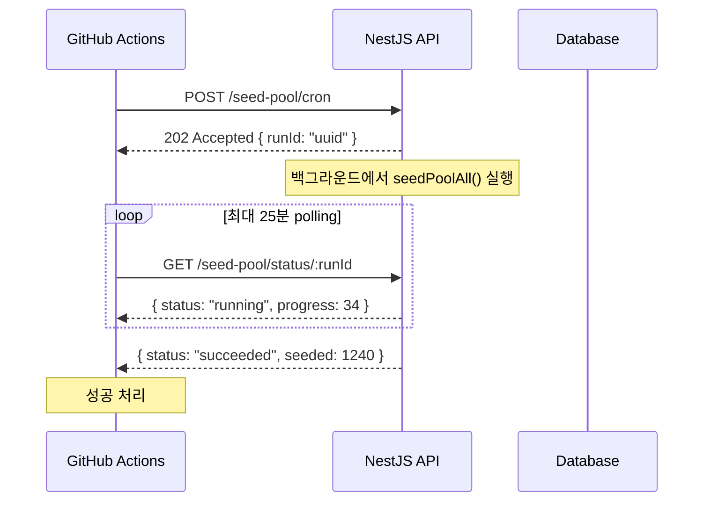

---
aliases:
  - 202 Accepted
  - fire and forget
  - polling
  - background job
  - 백그라운드 작업
  - runId
  - 502 upstream
tags:
  - NestJS
  - Backend
  - Architecture
related:
  - "[[00_NestJS_Ecosystem_HomePage]]"
  - "[[NestJS_Prisma]]"
  - "[[HTTP_Concept]]"
---
# NestJS_AsyncJob — 장시간 작업 비동기 처리 패턴

> [!info]
> 오래 걸리는 작업(시드, 배치, 대용량 처리)을 HTTP로 기다리면 Edge/Proxy 타임아웃으로 502 발생.
> 해결: **즉시 202 반환 → 백그라운드 실행 → runId로 polling**

---

# 문제 — 장시간 HTTP 요청의 한계 ⭐️⭐️⭐️⭐️

```txt
GitHub Actions
  ↓ POST /v1/tmdb/seed-pool/cron
Railway Edge Proxy
  ↓
NestJS API 서버
  ↓ seedPoolAll() 실행 (17개 장르 × 3페이지 × TMDB 상세 요청 × DB 저장)
  ↓ ← 수 분 걸림
  완료 후 200 OK 반환

문제:
  Railway Edge Proxy가 일정 시간 응답 없으면 → 502 upstream error
  curl: (22) The requested URL returned error: 502
  Error: Process completed with exit code 22
```

```txt
502 Bad Gateway 발생 원인:
  Edge Proxy(CDN, Nginx, Railway 등)가 Origin 서버에서 응답을 못 받을 때
  → 서버가 과부하 상태이거나
  → 응답 시간이 Proxy의 timeout을 초과했을 때
  → 서버가 요청 처리 중 연결을 끊었을 때

HTTP 요청은 "빠른 응답"을 전제로 설계됨
→ 수 분이 걸리는 작업은 HTTP 응답으로 기다리면 안 됨
```

---

# 해결 — 202 Accepted + 백그라운드 실행 + Polling ⭐️⭐️⭐️⭐️⭐️

## 전체 흐름



## 핵심 HTTP 상태 코드

```txt
200 OK        → 작업이 완료된 결과를 반환 (동기 응답)
202 Accepted  → 요청을 받았고 처리 중이지만 아직 완료 안 됨 (비동기 시작)
               "나중에 확인하세요" 의미

polling:
  클라이언트가 주기적으로 상태를 물어보는 방식
  완료 여부를 서버가 push하지 않고 클라이언트가 pull
```

---

# NestJS 구현 ⭐️⭐️⭐️⭐️

## Controller — 즉시 202 반환

```typescript
@Post('seed-pool/cron')
async seedPoolCron(): Promise<{ runId: string }> {
  const runId = randomUUID();

  // void: 응답을 기다리지 않고 백그라운드에서 실행
  void this.seedRunService.execute(runId);

  // 즉시 반환 — Railway가 502를 낼 틈이 없음
  return { runId };
  // HTTP 202 Accepted (HttpCode 데코레이터로 명시 가능)
}

@Get('seed-pool/status/:runId')
async getSeedStatus(
  @Param('runId') runId: string,
): Promise<SeedRunStatus> {
  return this.seedRunService.getStatus(runId);
}
```

```typescript
// HTTP 202 명시
@Post('seed-pool/cron')
@HttpCode(202)
async seedPoolCron() { ... }
```

## Service — 상태를 DB에 기록

```typescript
@Injectable()
export class SeedRunService {
  constructor(private readonly prisma: PrismaClient) {}

  async execute(runId: string): Promise<void> {
    // 1. DB에 실행 기록 시작
    await this.prisma.seedRun.create({
      data: { id: runId, status: 'running', startedAt: new Date() },
    });

    try {
      const result = await this.seedPoolAll(); // 실제 시드 작업

      // 2. 성공 기록
      await this.prisma.seedRun.update({
        where: { id: runId },
        data: {
          status: 'succeeded',
          seededCount: result.count,
          finishedAt: new Date(),
        },
      });
    } catch (err) {
      // 3. 실패 기록
      await this.prisma.seedRun.update({
        where: { id: runId },
        data: {
          status: 'failed',
          error: err instanceof Error ? err.message : String(err),
          finishedAt: new Date(),
        },
      });
    }
  }

  async getStatus(runId: string) {
    return this.prisma.seedRun.findUniqueOrThrow({ where: { id: runId } });
  }
}
```

## Prisma Schema

```prisma
model SeedRun {
  id          String    @id @default(uuid())
  status      String    // "running" | "succeeded" | "partial" | "failed"
  seededCount Int?
  error       String?
  startedAt   DateTime  @default(now())
  finishedAt  DateTime?
}
```

---

# GitHub Actions — Polling 구현 ⭐️⭐️⭐️⭐️

```yaml
- name: Trigger seed
  id: trigger
  run: |
    RESPONSE=$(curl --fail-with-body --silent --show-error \
      -X POST "${{ secrets.API_URL }}/v1/tmdb/seed-pool/cron" \
      -H "Authorization: Bearer ${{ secrets.CRON_SECRET }}")
    echo "run_id=$(echo $RESPONSE | jq -r '.runId')" >> $GITHUB_OUTPUT

- name: Poll until done (max 25min)
  run: |
    RUN_ID="${{ steps.trigger.outputs.run_id }}"
    for i in $(seq 1 50); do
      sleep 30
      STATUS=$(curl --silent \
        "${{ secrets.API_URL }}/v1/tmdb/seed-pool/status/$RUN_ID" \
        -H "Authorization: Bearer ${{ secrets.CRON_SECRET }}" \
        | jq -r '.status')

      echo "Attempt $i: $STATUS"

      if [ "$STATUS" = "succeeded" ]; then
        echo "✅ Seed completed"
        exit 0
      elif [ "$STATUS" = "failed" ]; then
        echo "❌ Seed failed"
        exit 1
      fi
    done

    echo "⏰ Timeout after 25 minutes"
    exit 1
```

```txt
50회 × 30초 = 최대 25분 polling
succeeded → exit 0 (Actions 성공)
failed    → exit 1 (Actions 실패)
timeout   → exit 1 (Actions 실패)
```

---

# 패턴 선택 기준 ⭐️⭐️⭐️⭐️

```txt
작업 시간이 짧다 (< 10초)
  → 동기 응답 (200 OK) — 단순하게 유지

작업 시간이 길다 (> 30초)
  → 202 Accepted + 백그라운드 + polling

완료 알림이 필요하다
  → WebSocket / SSE (Server-Sent Events) push
  → 또는 webhook (완료 시 클라이언트 URL 호출)

반복 스케줄 작업
  → NestJS @Cron 데코레이터 (내부 스케줄러)
  → GitHub Actions cron (외부에서 트리거)
  → 두 방식의 차이: 내부 스케줄러는 서버 재시작 시 누락 가능
                    외부 트리거는 실패 기록·알림 관리가 쉬움
```

```txt
void vs await — 백그라운드 실행의 핵심:
  await this.seedRunService.execute(runId)
  → HTTP 응답이 execute() 완료를 기다림 → 타임아웃 위험

  void this.seedRunService.execute(runId)
  → execute()를 시작만 하고 즉시 return → 202 반환
  → execute()는 별도로 계속 실행됨

  → [[JS_Operators]] void 섹션 참고
  → [[JS_Promise]] fire-and-forget 참고
```
