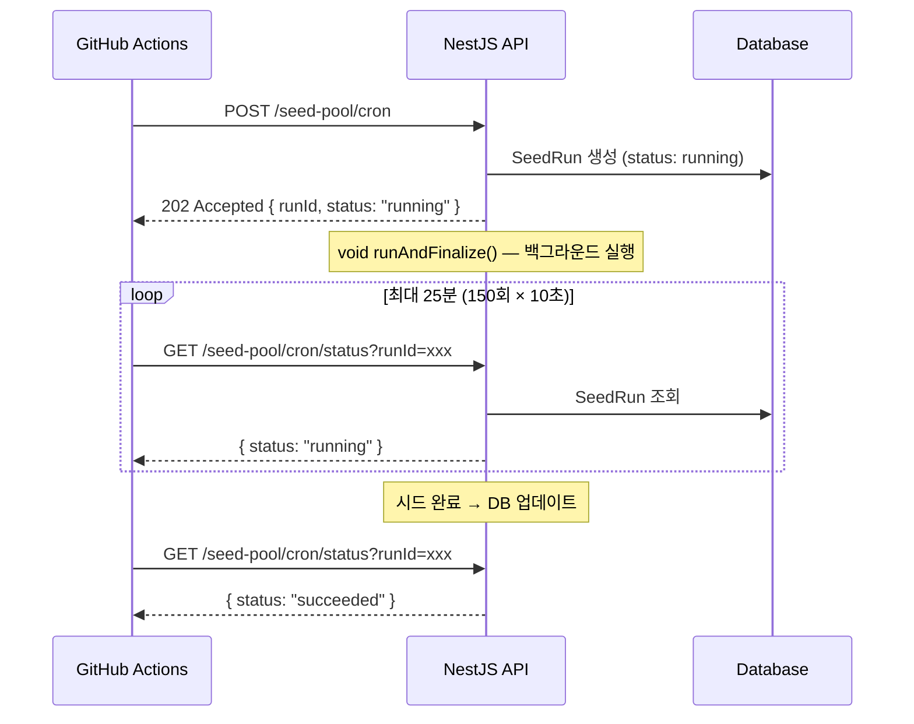

---
aliases:
  - 202 Accepted
  - fire and forget
  - polling
  - background job
  - 백그라운드 작업
  - runId
  - 502 upstream
  - executeBackground
tags:
  - NestJS
  - Backend
  - Architecture
related:
  - "[[00_NestJS_Ecosystem_HomePage]]"
  - "[[NestJS_Prisma]]"
  - "[[HTTP_Concept]]"
  - "[[JS_Operators]]"
---
# NestJS_AsyncJob — 장시간 작업 비동기 처리 패턴

> [!info]
> 오래 걸리는 작업(시드, 배치, 대용량 처리)을 HTTP 응답으로 기다리면 Edge/Proxy 타임아웃 → 502 발생.
> 해결: **즉시 202 Accepted 반환 → 백그라운드 실행 → runId로 polling**

---

# 문제 — 502 upstream error ⭐️⭐️⭐️⭐️

```txt
curl: (22) The requested URL returned error: 502
Error: Process completed with exit code 22.
```

```txt
원인 흐름:
  GitHub Actions
    ↓ POST /seed-pool/cron
  Railway Edge Proxy
    ↓
  NestJS API
    ↓ seedPoolAll() — 17 장르 × 3페이지 × TMDB 요청 × DB 저장 → 수 분 소요
    ← 완료 후 200 OK ... 이 응답이 너무 늦게 옴

  Railway Edge가 일정 시간 응답 없음 → 502 upstream error

502 Bad Gateway 발생 조건:
  Proxy(Railway, Nginx, CDN)가 Origin 서버에서 응답을 못 받을 때
  → 서버 처리 시간 > Proxy timeout
  HTTP 요청은 빠른 응답 전제로 설계 — 수 분짜리 작업은 HTTP로 기다리면 안 됨
```

---

# 해결 패턴 — 202 + 백그라운드 + Polling ⭐️⭐️⭐️⭐️⭐️



```txt
HTTP 상태 코드 의미:
  200 OK        → 작업 완료된 결과 반환 (동기)
  202 Accepted  → 요청 수락, 처리 중 (비동기 시작)
                  "나중에 runId로 확인하세요"
```

---

# NestJS 구현 ⭐️⭐️⭐️⭐️

## Service — 동기 / 비동기 두 가지 모드

```typescript
@Injectable()
export class SeedRunService {

  // ① 동기 실행 — 완료될 때까지 기다렸다가 결과 반환
  async execute<T extends Record<string, SeedRunResult>>(
    trigger: SeedRunTrigger,
    pages: number,
    machineCount: number,
    task: () => Promise<T>,
  ): Promise<T> {
    const run = await this.start(trigger, pages, machineCount);
    return this.runAndFinalize(run.id, task);
    // 호출자가 await하면 작업 완료까지 기다림
  }

  // ② 비동기 실행 — 즉시 runId 반환, 백그라운드에서 실행
  async executeBackground<T extends Record<string, SeedRunResult>>(
    trigger: SeedRunTrigger,
    pages: number,
    machineCount: number,
    task: () => Promise<T>,
  ) {
    const run = await this.start(trigger, pages, machineCount);

    // void + .catch(() => undefined) = 완전한 fire-and-forget
    //   → 에러가 나도 unhandled rejection 없음
    //   → HTTP 응답을 기다리지 않고 바로 아래 return 실행
    void this.runAndFinalize(run.id, task).catch(() => undefined);

    return {
      accepted: true,
      runId: run.id,
      status: 'running' as const,
    };
    // 이 return이 즉시 실행됨 — runAndFinalize() 완료를 기다리지 않음
  }

  // 공통: SeedRun DB 레코드 생성
  private async start(
    trigger: SeedRunTrigger,
    pages: number,
    machineCount: number,
  ) {
    return this.prisma.seedRun.create({
      data: { trigger, pages, machineCount, status: 'running' },
    });
  }

  // 공통: 실제 실행 + 성공/실패 DB 기록
  private async runAndFinalize<T extends Record<string, SeedRunResult>>(
    runId: string,
    task: () => Promise<T>,
  ): Promise<T> {
    try {
      const result = await task();                // 실제 시드 작업
      const values = Object.values(result);

      await this.prisma.seedRun.update({
        where: { id: runId },
        data: {
          status: 'succeeded',
          seededCount: values.reduce((s, v) => s + v.seeded, 0),
          finishedAt: new Date(),
        },
      });
      return result;
    } catch (err) {
      await this.prisma.seedRun.update({
        where: { id: runId },
        data: {
          status: 'failed',
          error: err instanceof Error ? err.message : String(err),
          finishedAt: new Date(),
        },
      });
      throw err;
    }
  }

  async getById(runId: string) {
    return this.prisma.seedRun.findUniqueOrThrow({ where: { id: runId } });
  }
}
```

## Controller — 202 반환 + 상태 조회

```typescript
@Controller('tmdb')
export class TmdbController {

  // Cron 트리거 — 즉시 202 + runId 반환
  @Public()                          // JWT 인증 우회
  @Post('seed-pool/cron')
  @HttpCode(HttpStatus.ACCEPTED)     // 202 (기본값 200 대신)
  seedPoolCron(
    @Headers('x-cron-secret') secret: string | undefined,
    @Query('pages') pages = '3',
  ) {
    if (!process.env.CRON_SECRET || secret !== process.env.CRON_SECRET) {
      throw new UnauthorizedException('잘못된 cron secret입니다.');
    }

    return this.seedRunService.executeBackground(
      'cron',
      Number(pages),
      17,
      () => this.tmdbService.seedPoolAll(Number(pages)),
    );
    // { accepted: true, runId: "uuid", status: "running" } 즉시 반환
  }

  // Polling — 상태 조회
  @Public()
  @Get('seed-pool/cron/status')
  getSeedPoolCronStatus(
    @Headers('x-cron-secret') secret: string | undefined,
    @Query('runId') runId: string | undefined,
  ) {
    if (!process.env.CRON_SECRET || secret !== process.env.CRON_SECRET) {
      throw new UnauthorizedException('잘못된 cron secret입니다.');
    }
    if (!runId) {
      throw new BadRequestException('runId가 필요합니다.');
    }

    return this.seedRunService.getById(runId);
    // { id, status, seededCount, error, finishedAt, ... }
  }
}
```

```txt
@Public() — JWT Guard를 전역 적용했을 때 특정 엔드포인트를 제외하는 데코레이터
x-cron-secret — GitHub Actions만 호출하는 내부 엔드포인트 인증
  JWT 토큰 발급 없이 환경변수 시크릿 값을 헤더로 직접 비교

@HttpCode(HttpStatus.ACCEPTED)
  = @HttpCode(202)
  기본값은 200이므로 명시적으로 202로 지정
```

---

# GitHub Actions — Polling 구현 ⭐️⭐️⭐️⭐️

```yaml
name: MoviePool Seed

on:
  schedule:
    - cron: "5 17 * * *"   # KST 02:05 = UTC 17:05
  workflow_dispatch:         # 수동 실행

jobs:
  seed:
    runs-on: ubuntu-latest
    timeout-minutes: 30

    steps:
      - name: Trigger MoviePool seed Cron
        env:
          API_URL: ${{ secrets.CINEMO_API_URL }}
          CRON_SECRET: ${{ secrets.CINEMO_CRON_SECRET }}
        run: |
          set -euo pipefail
          # set -e: 에러 시 즉시 종료
          # set -u: 미정의 변수 참조 시 에러
          # set -o pipefail: 파이프 중간 실패도 감지

          # 1. 시드 시작 요청 → runId 받기
          response="$(curl --fail-with-body --silent --show-error \
            --request POST \
            --url "${API_URL}/v1/tmdb/seed-pool/cron?pages=3" \
            --header "x-cron-secret: ${CRON_SECRET}")"

          run_id="$(printf '%s' "$response" | jq -r '.runId')"
          test -n "$run_id"       # 빈 문자열 체크
          test "$run_id" != "null" # JSON null 체크

          echo "MoviePool 시드 시작: $run_id"

          # 2. 상태 polling — 최대 150회 × 10초 = 25분
          for attempt in $(seq 1 150); do
            status_response="$(curl --fail-with-body --silent --show-error \
              --url "${API_URL}/v1/tmdb/seed-pool/cron/status?runId=${run_id}" \
              --header "x-cron-secret: ${CRON_SECRET}")"

            status="$(printf '%s' "$status_response" | jq -r '.status')"
            echo "시드 상태 (${attempt}/150): ${status}"

            case "$status" in
              succeeded)
                echo "MoviePool 시드 성공"
                exit 0            # Actions 성공
                ;;
              partial|failed)
                printf '%s\n' "$status_response"
                exit 1            # Actions 실패
                ;;
              running)
                sleep 10          # 10초 대기 후 재시도
                ;;
              *)
                echo "알 수 없는 시드 상태: ${status}"
                printf '%s\n' "$status_response"
                exit 1
                ;;
            esac
          done

          echo "MoviePool 시드 상태 확인 시간 초과"
          exit 1
```

```txt
printf '%s' "$response" 를 쓰는 이유:
  echo "$response"는 일부 특수문자를 변환할 수 있음
  printf '%s'는 값을 그대로 출력 — JSON 파싱 안전

case "$status" in ... esac — bash switch문
  succeeded → 성공 종료
  partial|failed → 실패 종료 (| = OR)
  running → 10초 대기 후 루프 계속
  * → 예상 밖의 값 → 실패 종료

timeout-minutes: 30 — job 전체 최대 시간
polling 최대 25분 + 여유 5분
```

---

# 패턴 선택 기준 ⭐️⭐️⭐️⭐️

```txt
작업 시간 < 10초     → 동기 (200 OK) — execute() 사용
작업 시간 > 30초     → 비동기 (202 Accepted) — executeBackground() 사용
완료 알림 필요       → WebSocket / SSE / Webhook
반복 스케줄         → @Cron (내부) 또는 GitHub Actions cron (외부)

내부 @Cron vs 외부 GitHub Actions cron:
  내부 @Cron    → 서버 재시작 시 누락 가능, 실패 알림 어려움
  외부 GA cron  → 실패 시 Actions 로그·알림, 수동 재실행 가능

void + .catch(() => undefined) — 핵심 패턴:
  → [[JS_Operators]] void 섹션
  → [[JS_Patterns]] fire-and-forget 섹션
```
