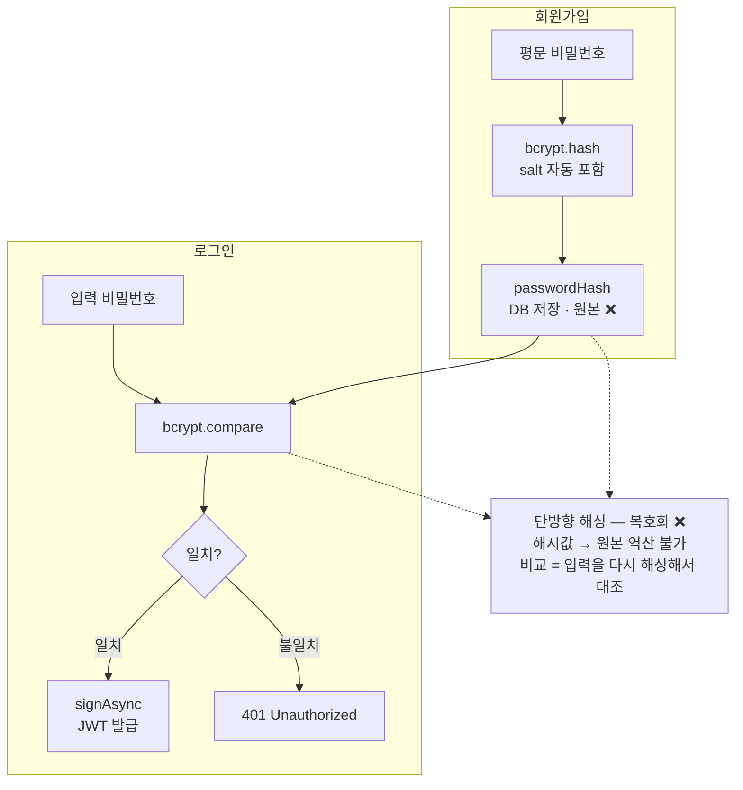

# NestJS_Bcrypt — 비밀번호 해싱

> [!info]
> 원본 비밀번호는 절대 저장하지 않는다.
>  bcrypt로 해싱해서 DB에 해시값만 저장하고, 로그인 시에는 입력값을 다시 해싱해서 저장된 해시와 비교한다(복호화가 아니다). 
>  로그인 성공 직후 보통 JWT 발급(`signAsync`)까지 한 메서드 안에서 이어진다.


---

# 복호화란?

```txt
암호화 = 원본 → 암호문
복호화 = 암호문 → 원본  (역방향)

bcrypt 는 단방향 해싱:
  원본 → 해시값  (가능)
  해시값 → 원본  (불가능) ← 복호화 안 됨

즉, 저장된 비밀번호는 어떤 방법으로도 원본을 알 수 없음
→ 서버가 해킹당해도 원본 비밀번호 유출 없음

비교할 때:
  입력값을 다시 해싱 → 저장된 해시와 비교
  (복호화해서 비교하는 것이 아님)
```

---

# 비밀번호 보안 기본 원칙 ⭐️

```txt
❌ 절대 하면 안 되는 것:
  원본 비밀번호 저장
  복호화 가능한 방식으로 암호화

✅ 올바른 방법:
  단방향 해싱 (복호화 불가)
  같은 값 → 항상 같은 해시
  다른 값 → 완전히 다른 해시

왜 복호화 안 되게 하나:
  서버 해킹 당해도 원본 비밀번호 알 수 없음
  DB 유출 시 비밀번호 보호
```

---

# SHA256 vs bcrypt ⭐️

| |SHA256|bcrypt|
|---|---|---|
|해싱 속도|빠름|느림 (의도적)|
|Salt|필요 없음|필요|
|보안|약함|강함|
|용도|파일 무결성 등|비밀번호 저장 ⭐️|

```txt
bcrypt 가 느린 이유:
  빠르면 해커가 수백만 번 시도 (무차별 대입) 쉬움
  느리게 만들어서 공격 비용을 높임
  → 비밀번호 해싱엔 의도적으로 느린 알고리즘 사용
```

---

# Salt ⭐️

```txt
Dictionary Attack (사전 공격):
  해커가 흔한 비밀번호 → 해시값 테이블 미리 만들어둠
  DB 해시값과 대조해서 원본 비밀번호 추론

Salt 란:
  해싱 전 비밀번호에 랜덤 값(salt)을 덧붙임
  같은 비밀번호도 salt 가 다르면 완전히 다른 해시
  → 사전 공격 무력화

  "1234" + salt1 → 해시A
  "1234" + salt2 → 해시B  (완전히 다름)
```

```txt
bcrypt 는 자동으로 salt 생성 + 해시값에 포함
→ 별도로 salt 저장 불필요
```

---

# ⚠️ bcrypt vs bcryptjs — 설치 패키지 차이 ⭐️⭐️⭐️

```bash
# 방법 1 — 네이티브 bcrypt
pnpm install bcrypt
pnpm install -D @types/bcrypt

# 방법 2 — 순수 JS bcryptjs
pnpm add bcryptjs
pnpm add -D @types/bcryptjs
```

```txt
이름이 비슷해서 같은 건 줄 알기 쉬운데, 완전히 별개의 두 패키지임
둘 다 "bcrypt 알고리즘" 자체는 같지만, 구현 방식이 다름
```

|항목|`bcrypt`|`bcryptjs`|
|---|---|---|
|구현 방식|네이티브(C++) — 컴파일 필요|순수 JavaScript|
|속도|빠름|`bcrypt` 보다 약간 느림|
|동작 환경|Node.js (네이티브 모듈 빌드 가능한 곳)만|Node.js / 브라우저 / Edge Runtime 등 JS 가 도는 곳 어디서나|
|설치 시 이슈|플랫폼별 빌드 실패 가능성 있음(node-gyp 등)|빌드 단계 없음, 설치만 하면 바로 동작|

```txt
왜 두 가지가 다 존재하는가:
  bcrypt(네이티브) 는 C++ 로 구현된 부분이 있어서 더 빠름
  → 항상 평범한 Node.js 서버로만 돌아가는 NestJS 같은 백엔드에 적합

  bcryptjs(순수 JS) 는 네이티브 빌드가 필요 없어서 어디서든 동작함
  → Next.js 의 일부 코드(예: Auth.js 의 Credentials provider, 자세한 건 [[NextJS_Auth]] 참고)는
    Edge Runtime 처럼 네이티브 모듈을 못 쓰는 환경에서 실행될 가능성이 있어서
    안전하게 어디서나 동작하는 bcryptjs 를 선택하는 경우가 많음

어떤 걸 골라야 하나:
  NestJS(항상 일반 Node.js 서버로 동작)            → bcrypt(네이티브) 무난
  Next.js 쪽 코드(Edge Runtime 가능성이 있는 곳)    → bcryptjs(순수 JS) 가 더 안전한 선택
  둘 다 결과(해시값 형식)는 호환됨 — 같은 bcrypt 알고리즘이라
  한쪽에서 bcrypt 로 해싱한 값을 다른 쪽에서 bcryptjs 로 비교해도 정상 동작함
```

---

# NestJS 에서 bcrypt 사용 (네이티브 bcrypt 기준)

```typescript
import * as bcrypt from 'bcrypt';

// 회원가입 — 비밀번호 해싱
const saltRounds = 10;   // salt 복잡도 (높을수록 느림 / 10~12 권장)
const hashedPassword = await bcrypt.hash(password, saltRounds);
// → DB 에 hashedPassword 저장 (원본 저장 안 함)

// 로그인 — 비밀번호 검증
const isMatch = await bcrypt.compare(inputPassword, hashedPassword);
// inputPassword 를 다시 해싱해서 저장된 해시와 비교
// true = 일치 / false = 불일치
```

```txt
bcrypt.hash(비밀번호, saltRounds)
  → 해시값 반환 (salt 자동 포함)

bcrypt.compare(입력값, 저장된해시)
  → true / false 반환
  복호화가 아님! 입력값을 같은 방식으로 해싱해서 비교

bcryptjs 도 API 가 완전히 동일함:
  import bcrypt from 'bcryptjs';
  bcrypt.hash(...) / bcrypt.compare(...) — 함수 이름·인자·반환값 다 똑같음
  → 패키지 이름만 바꿔서 import 하면 코드는 그대로 재사용 가능
```

## saltRounds를 상수로 빼는 게 관용적인가 ⭐️⭐️

```txt
네 — 흔한 패턴임 (BCRYPT_ROUNDS, SALT_ROUNDS 등 이름은 자유)

JWT_SECRET과 다루는 방식이 다른 이유:
  JWT_SECRET   진짜 "비밀값" — 노출되면 토큰을 위조당함 → 반드시 env/ConfigService로 숨김
  saltRounds   "얼마나 느리게 계산할지"를 정하는 비용 계수일 뿐 — 노출돼도 보안에 문제 없음
  → 그래서 saltRounds는 코드에 상수로 그냥 박아두는 게 일반적
    (환경마다 다르게 쓰고 싶다면 env로 빼는 것도 가능 — 흔하지 않을 뿐 틀린 방법은 아님)
```

## bcrypt.compare() 결과 변수명 ⭐️

```txt
compare()는 bcrypt API 자체의 고정된 메서드 이름임 (바꿀 수 없음)
그 결과를 받는 변수명은 정해진 규칙이 없음 — 아래 다 흔하게 보임
```

|변수명|비고|
|---|---|
|`isMatch`|이 노트 전반에서 쓰는 이름|
|`ok`|짧고 간단하게 쓰고 싶을 때|
|`isValid`|"유효한 비밀번호인가" 관점|
|`passwordMatches`|더 명시적으로 쓰고 싶을 때|

---

# 회원가입 + 로그인 — 전체 흐름 (bcrypt + JWT 발급까지) ⭐️⭐️⭐️

```txt
실무에서는 bcrypt만 단독으로 안 쓰고, 보통 한 메서드 흐름 안에서
"비밀번호 확인 → 통과하면 JWT 발급"까지 이어짐 — 그 전체 흐름을 범용 형태로 정리
```

```typescript
// auth.service.ts — 범용 형태
const BCRYPT_ROUNDS = 12;

@Injectable()
export class AuthService {
  constructor(
    private readonly prisma: PrismaService,
    private readonly jwtService: JwtService,
  ) {}

  async register(dto: RegisterDto) {
    const existing = await this.prisma.user.findUnique({ where: { email: dto.email } });
    if (existing) throw new ConflictException('이미 사용 중인 이메일입니다.');
    // ↑ 중복 체크를 해싱보다 먼저 하는 이유:
    //   bcrypt.hash()는 의도적으로 느린 연산이라, 어차피 실패할 요청에
    //   그 비용을 먼저 쓰지 않기 위함 (실패할 거면 싸게 빨리 실패시키기)

    const passwordHash = await bcrypt.hash(dto.password, BCRYPT_ROUNDS);
    const user = await this.prisma.user.create({
      data: { email: dto.email, passwordHash },
    });

    return this.issueToken(user);
  }

  async login(dto: LoginDto) {
    const user = await this.prisma.user.findUnique({ where: { email: dto.email } });

    // user가 있어도 passwordHash가 없을 수 있음 — 예: OAuth로만 가입한 계정
    if (!user?.passwordHash) {
      throw new UnauthorizedException('이메일 또는 비밀번호가 올바르지 않습니다.');
    }

    const isMatch = await bcrypt.compare(dto.password, user.passwordHash);
    if (!isMatch) {
      throw new UnauthorizedException('이메일 또는 비밀번호가 올바르지 않습니다.');
    }

    return this.issueToken(user);
  }

  private async issueToken(user: { id: string; role: string }) {
    const payload = { sub: user.id, role: user.role }; // JwtPayload — 자세한 건 [[NestJS_JwtGuard]] 참고
    const accessToken = await this.jwtService.signAsync(payload);
    return { accessToken }; // ⚠️ user를 같이 내려줄 거면 passwordHash는 반드시 빼고 내려줄 것
  }
}
```

```txt
이 코드에서 일반화할 수 있는 포인트 정리:

  1. register/login이 "겹치는 마지막 단계(토큰 발급)"를 issueToken으로 뽑아낸 것
     → 회원가입도 로그인도 결국 "이 user로 토큰을 만들어준다"는 같은 끝맺음이라 중복 제거

  2. user?.passwordHash 체크
     → 비밀번호 로그인을 시도했는데, 그 계정이 OAuth로만 가입돼서
       passwordHash 자체가 없는(null) 경우를 구분해서 막아주는 방어 코드

  3. signAsync(payload)
     → bcrypt 검증이 끝난 "이후"의 일 — payload 안에 뭘 넣을지, sub/role이 뭔지는
       이 노트의 주제가 아니라 [[NestJS_JwtGuard]] 쪽 내용
       (bcrypt 노트는 "신원 확인"까지, JWT 노트는 "확인된 신원으로 토큰 만들기"부터)

  4. issueToken의 반환값에 passwordHash가 안 들어가는 것
     → 해시값이라 복호화는 안 되지만, 그래도 응답에 내려줄 이유가 없음
       (불필요한 정보를 클라이언트로 보내지 않는다는 일반적인 보안 원칙)
```

```txt
이메일/비밀번호 에러 메시지를 굳이 똑같이 하는 이유:
  "이메일이 없습니다" 와 "비밀번호가 틀렸습니다" 를 따로 알려주면
  공격자가 "이 이메일은 가입돼 있구나" 를 알아낼 수 있음 (계정 존재 여부 추측 방지)
  → 둘 다 같은 메시지로 통일하는 게 보안상 더 안전함
```

---

# Next.js(Auth.js)에서 쓸 때 — bcryptjs ⭐️

```txt
NextAuth 의 Credentials provider(이메일/비밀번호 로그인)에서도 똑같은 해싱 비교가 필요함
이때는 bcrypt(네이티브) 대신 bcryptjs 를 쓰는 게 일반적
(Edge Runtime 등 네이티브 모듈을 못 쓰는 환경 대비, 위 "bcrypt vs bcryptjs" 표 참고)

→ Credentials provider 의 authorize() 함수 안에서 bcryptjs.compare() 를 쓰는
  실제 코드와 자세한 흐름은 [[NextJS_Auth]] 참고
```

---

# 한눈에

```txt
hash(비밀번호, saltRounds)   → 해시값 생성 (회원가입 시)
compare(입력값, 저장된해시)   → true/false (로그인 시) — 복호화 아님

bcrypt    네이티브(C++) / 빠름 / Node.js 전용 → NestJS 등 백엔드
bcryptjs  순수 JS / 약간 느림 / 어디서나 동작 → Next.js(Edge 가능성 있는 곳)
→ API 는 동일해서 import 만 바꾸면 코드 그대로 재사용 가능

saltRounds(BCRYPT_ROUNDS 등) 는 비밀값이 아니라 비용 계수라 코드 상수로 두는 게 일반적
  — JWT_SECRET처럼 env로 숨길 필요 없음
compare() 결과 변수명은 isMatch/ok/isValid 등 자유 — compare라는 메서드명만 고정

비밀번호 확인(bcrypt.compare) 통과 → 토큰 발급(signAsync) 으로 이어지는 게 일반적인 흐름
  payload 설계/검증 자세한 내용은 [[NestJS_JwtGuard]] 참고

이메일/비밀번호 에러 메시지는 항상 통일 (계정 존재 여부 추측 방지)
응답에 passwordHash 같은 해시값은 절대 포함시키지 않음

지금/나중 판단: "API 가 평문 비밀번호를 직접 받는 코드 경로가 있는가"
  없음(현재) → Web 에 bcryptjs 만으로 충분
  생김(모바일 직접 API 호출 / API 로만 비번 재설정 등) → 그때 NestJS 에 bcrypt 추가
```