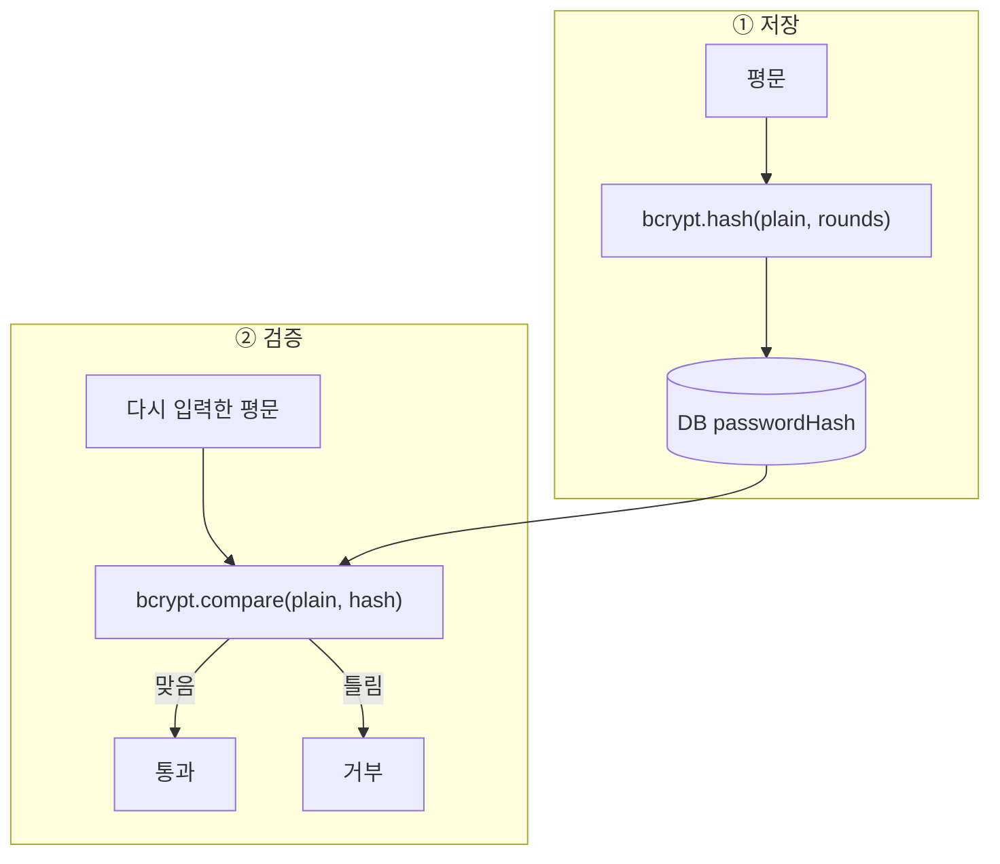

# NestJS_Bcrypt — 비밀번호 해싱

> [!info] 
> bcrypt = 비밀번호를 단방향 해시로 저장하는 라이브러리. 
> 원본을 복원할 수 없고, salt가 포함돼 같은 비밀번호도 매번 다른 해시가 나온다. 
> 개념 → [[Auth_Concept]] / NestJS 인증 전체 → [[NestJS_Auth]]

---
# 흐름도

> **평문 → `hash`로만 저장 · `compare`로만 검증 · hash는 밖으로 안 냄** · 복호화 없음



---

# 암호화 vs 해싱 — 복호화란 ⭐️⭐️⭐️⭐️

```txt
암호화 (Encryption):
  원본 → 암호문  (암호화)
  암호문 → 원본  (복호화 — 역방향 가능)
  키(key)가 있으면 원본으로 되돌릴 수 있음
  예: AES, RSA

해싱 (Hashing):
  원본 → 해시값  (단방향)
  해시값 → 원본  ❌ 불가능  ← 복호화가 없음
  예: bcrypt, SHA-256

bcrypt = 단방향 해싱:
  저장된 해시에서 원본 비밀번호를 꺼낼 수 없음
  → 서버가 해킹당해서 DB가 통째로 유출돼도 원본 비밀번호는 알 수 없음

비교할 때도 복호화가 아님:
  입력값을 다시 해싱 → 저장된 해시와 비교
  bcrypt.compare()가 하는 일 = 재해싱 후 비교 (복호화 아님)
```

---

# 비밀번호 보안 기본 원칙 ⭐️⭐️⭐️⭐️

```txt
❌ 절대 하면 안 되는 것:

  1. 평문 저장
     DB에 'password123'을 그대로 저장
     → DB 유출 시 모든 비밀번호 즉시 노출

  2. 단순 MD5 / SHA-1 해싱
     레인보우 테이블(미리 계산된 해시 → 원본 대응표)로 빠르게 역추적 가능
     salt 없이 해싱하면 같은 비밀번호 = 같은 해시 → 통계 분석 취약

  3. 대칭키 암호화로 저장
     서버가 해킹당하면 키도 유출 → 복호화 가능 → 원본 노출

✅ 올바른 방법:
  bcrypt (또는 Argon2, scrypt) 사용
  → salt가 자동 포함 (같은 비밀번호도 매번 다른 해시)
  → 반복 횟수(rounds)로 연산 비용 조절 가능 → 무차별 대입 방어
  → 단방향 → 해킹당해도 원본 복구 불가
```

---

# SHA-256 vs bcrypt ⭐️⭐️⭐️⭐️

| |SHA-256|bcrypt|
|---|---|---|
|속도|매우 빠름 (수백만/초)|느림 (의도적, 수백ms)|
|salt|직접 추가해야 함|자동 포함|
|비밀번호 보안|부적합|적합|
|주요 용도|파일 무결성, 디지털 서명, JWT|비밀번호 저장|

```txt
SHA-256이 비밀번호에 부적합한 이유:
  너무 빠름 → 공격자가 초당 수십억 번 시도 가능
  salt 없이 쓰면 같은 비밀번호 = 같은 해시 → 레인보우 테이블 취약
  (salt를 직접 추가해서 쓸 수는 있지만 bcrypt가 이 모든 걸 자동으로 해줌)

bcrypt가 "느린" 이유:
  의도적으로 느리게 설계 → 정상 로그인(1번)은 괜찮지만
  무차별 대입(수백만 번)은 수백년이 걸려서 사실상 불가능
  rounds를 올리면 더 느려짐 → 하드웨어가 빨라져도 rounds를 올려서 대응 가능
```

---

# ⚠️ bcrypt vs bcryptjs — 설치 패키지 주의 ⭐️⭐️⭐️⭐️

```bash
# ✅ 이것을 설치
pnpm add bcrypt
pnpm add -D @types/bcrypt

# ❌ 이것은 다른 패키지
pnpm add bcryptjs
```

| |`bcrypt`|`bcryptjs`|
|---|---|---|
|구현 방식|C++ 네이티브 바인딩|순수 JavaScript|
|성능|빠름|느림 (JS 특성상)|
|설치|네이티브 컴파일 필요|컴파일 불필요|
|Node.js 환경|✅ 권장|브라우저/특수 환경에서|
|`@types`|`@types/bcrypt`|내장 타입 포함|

```typescript
// bcrypt 사용 시
import * as bcrypt from 'bcrypt';

// bcryptjs 사용 시 (import 방식 다름)
import bcrypt from 'bcryptjs';
// 또는
import * as bcrypt from 'bcryptjs';
```

```txt
왜 이름이 헷갈리는가:
  bcrypt    → Node.js 네이티브 바인딩 (C++ 기반, 더 빠름) — 서버에 권장
  bcryptjs  → 순수 JS 구현 — 브라우저에서도 동작, 빌드 환경에 따라 선택

  NestJS(서버)에서는 bcrypt 사용
  bcryptjs를 설치하면 @types/bcrypt가 타입 불일치를 일으킬 수 있음
  → 항상 bcrypt + @types/bcrypt 세트로 설치
```

---

# 설치

```bash
pnpm add bcrypt
pnpm add -D @types/bcrypt
```

---

# import 방식 ⭐️⭐️⭐️

```typescript
import * as bcrypt from 'bcrypt';
```

```txt
왜 { hash, compare } 구조분해가 아니라 * as bcrypt 인가:
  bcrypt 패키지는 CommonJS 모듈 (module.exports = { hash, compare, ... })
  NestJS(Node.js)의 tsconfig에서 esModuleInterop: true 가 있어도
  네임드 export가 없는 CJS 패키지는 기본 import가 불안정할 수 있음
  → import * as bcrypt 로 네임스페이스 전체를 가져오는 게 안전

  bcrypt.hash() / bcrypt.compare() 처럼 접두사로 쓰면
  어디서 온 함수인지 코드에서 명확하게 보임
```

---

# 핵심 상수 ⭐️⭐️⭐️

```typescript
const BCRYPT_ROUNDS = 12;  // 또는 10
```

```txt
BCRYPT_ROUNDS (salt rounds):
  해시를 몇 번 반복할지 결정하는 값 (2^N 번 반복)
  숫자가 클수록 안전하지만 처리 시간 증가

  10 → 약 100ms  (일반적인 웹 서비스)
  12 → 약 400ms  (보안을 더 중요시할 때)
  14 → 약 1.5s   (너무 느림 — 로그인 UX 저하)

  무차별 대입(brute force) 공격:
  공격자가 초당 수백만 번 시도해도
  bcrypt는 하나를 검증하는 데 수백ms 걸려서 사실상 불가능하게 만듦

  상수로 분리하는 이유:
  여러 곳(회원가입, 비밀번호 변경)에서 같은 값을 쓰므로
  파일 상단 상수로 두면 일관성 유지 + 변경 시 한 곳만 수정
```

---

# bcrypt.hash — 비밀번호 저장 ⭐️⭐️⭐️⭐️

```typescript
const passwordHash = await bcrypt.hash(plainPassword, BCRYPT_ROUNDS);
// DB에는 passwordHash 저장 — 원본은 어디에도 저장 안 함
```

```txt
bcrypt.hash(plain, rounds):
  plain   → 원본 비밀번호 (사용자가 입력한 것)
  rounds  → salt rounds 상수
  반환값  → '$2b$12$...' 형태의 해시 문자열 (약 60자)

  같은 비밀번호도 매번 다른 해시:
  bcrypt.hash('1234', 12) → '$2b$12$abc...'
  bcrypt.hash('1234', 12) → '$2b$12$xyz...' (다른 값)
  → salt가 랜덤으로 생성되어 해시에 포함되기 때문
  → 레인보우 테이블 공격 방어
```

## 회원가입 패턴

```typescript
async register(email: string, plain: string) {
  const existing = await this.prisma.user.findUnique({ where: { email } });
  if (existing) throw new ConflictException('이미 사용 중인 이메일입니다.');

  const passwordHash = await bcrypt.hash(plain, BCRYPT_ROUNDS);

  return this.prisma.user.create({
    data: { email, passwordHash },
  });
}
```

---

# bcrypt.compare — 비밀번호 검증 ⭐️⭐️⭐️⭐️

```typescript
const ok = await bcrypt.compare(plainPassword, hashedFromDB);
// ok === true  → 일치 (로그인 허용)
// ok === false → 불일치 (로그인 거부)
```

```txt
bcrypt.compare(plain, hash):
  plain → 사용자가 입력한 비밀번호
  hash  → DB에 저장된 해시
  반환  → Promise<boolean>

  원리:
  hash 안에 salt가 포함돼 있음
  compare는 그 salt로 plain을 다시 해시해서 hash와 비교
  → 매번 다른 해시가 생성돼도 올바른 비밀번호면 항상 true

  ⚠️ plain === hash 로 직접 비교 절대 금지
     DB의 해시와 입력값은 같은 문자열이 절대 안 됨
```

## 로그인 패턴

```typescript
async validateUser(email: string, plain: string) {
  const user = await this.prisma.user.findUnique({ where: { email } });
  if (!user || !user.passwordHash) return null;

  const ok = await bcrypt.compare(plain, user.passwordHash);
  if (!ok) return null;

  return user;
}
```

---

# 조건부 해싱 — PATCH 업데이트 패턴 ⭐️⭐️⭐️⭐️

```typescript
// 비밀번호가 바뀔 때만 해시, 안 바뀌면 그대로
let passwordHash: string | null | undefined;

if (dto.password !== undefined) {
  // undefined = 필드 자체가 요청에 없음 (변경 의사 없음)
  const plain = dto.password.trim();
  if (plain) {
    // 빈 문자열이 아닐 때만 해시
    passwordHash = await bcrypt.hash(plain, BCRYPT_ROUNDS);
  }
  // dto.password가 '' 이면 passwordHash는 undefined → DB 업데이트 안 함
}

// Prisma update에서 undefined면 그 필드를 아예 안 씀
await this.prisma.user.update({
  where: { id },
  data: {
    ...(passwordHash !== undefined ? { passwordHash } : {}),
  },
});
```

```txt
undefined vs null 구분:
  undefined → "이 필드를 요청에 보내지 않음" (변경 의사 없음, DB 건드리지 말 것)
  null      → "명시적으로 비운다" (DB에 NULL 저장)
  string    → "이 값으로 바꾼다"

  dto.password !== undefined 체크:
  PATCH 요청에서 password 키 자체가 없으면 → undefined (해싱 안 함)
  password: '' 로 왔으면 → 빈 문자열, hash 안 함
  password: 'newpass' 로 왔으면 → 해싱

Prisma update에서 조건부 스프레드:
  ...(value !== undefined ? { field: value } : {})
  value가 undefined면 빈 객체 {} → 그 필드는 업데이트 안 됨
```

---

# 응답에서 passwordHash 제거 — 보안 ⭐️⭐️⭐️⭐️

```typescript
// ❌ 응답에 passwordHash가 포함되면 보안 위험
return this.prisma.user.findUnique({ where: { id } });
// → { id, email, nickname, passwordHash: '$2b$12$...' }

// ✅ 방법 1 — select로 애초에 조회 안 함 (권장)
return this.prisma.user.findUnique({
  where:  { id },
  select: { id: true, email: true, nickname: true, createdAt: true },
  // passwordHash 선택 안 함 → 반환 안 됨
});

// ✅ 방법 2 — 구조분해로 분리
const { passwordHash, ...safeUser } = user;
return safeUser;

// ✅ 방법 3 — Response DTO + class-transformer @Exclude()
export class UserResponseDto {
  id: string;
  email: string;
  // passwordHash 선언 안 함 → Swagger에도 안 보임
}
```

```txt
왜 중요한가:
  GET /users/:id 응답에 passwordHash가 포함되면
  공격자가 그 해시로 오프라인 무차별 대입 공격 가능
  해시라도 외부에 노출되면 안 됨

  가장 안전한 방법:
  → Prisma select에서 처음부터 조회 안 함
  → 실수로 포함될 가능성 자체를 없앰

Response DTO → [[NestJS_DTO]]
```

---

# passwordHash nullable 처리 ⭐️⭐️⭐️

```typescript
// Prisma 스키마에서 passwordHash는 optional
model User {
  passwordHash String?  // 소셜 로그인 유저는 비밀번호 없음
}

// 서비스에서
if (!user.passwordHash) {
  throw new ForbiddenException('비밀번호로 로그인할 수 없는 계정입니다.');
}
const ok = await bcrypt.compare(plain, user.passwordHash);
```

```txt
passwordHash가 null인 경우:
  소셜 로그인(Google, Kakao 등)으로 가입한 사용자
  비밀번호를 설정하지 않은 경우

  compare(plain, null) 을 하면 에러가 나므로
  반드시 null 체크 후 compare 호출
```

---

# 한눈에

```txt
import:
  import * as bcrypt from 'bcrypt'  — * as 방식 (CJS 안전)

상수:
  const BCRYPT_ROUNDS = 12  — 파일 상단에 한 번만

hash:
  bcrypt.hash(plain, BCRYPT_ROUNDS)  — 저장 전 해싱
  같은 입력도 매번 다른 해시 (salt 포함)

compare:
  bcrypt.compare(plain, hash)        — 로그인 시 검증
  직접 문자열 비교(===) 절대 금지

조건부 해싱 (PATCH):
  dto.password !== undefined 일 때만 해시
  undefined면 DB 업데이트 안 함 (스프레드 패턴)

응답에서 제거:
  Prisma select에서 처음부터 제외 (가장 안전)
  또는 구조분해 { passwordHash, ...rest }

nullable:
  소셜 로그인 유저는 passwordHash 없음
  compare 전 null 체크 필수
```