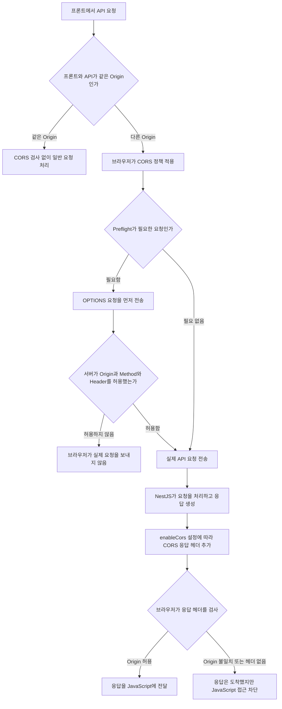

---
aliases:
  - CORS
  - enableCors
  - Cross-Origin
tags:
  - NestJS
related:
  - "[[00_NestJS_Ecosystem_HomePage]]"
  - "[[JS_Fetch_API]]"
---
# NestJS_CORS — CORS 설정

# 한 줄 요약

```
CORS = Cross-Origin Resource Sharing
브라우저가 다른 출처(Origin) 의 서버에 요청을 보낼 때 적용되는 보안 정책
app.enableCors() = 서버가 "이 출처는 허용한다" 는 응답 헤더를 붙여주는 설정
```

---

---

# 들어가기 전 흐름도



---

---

# CORS 란 — 누가, 무엇을 막는가 ⭐️

```
Origin = 프로토콜 + 도메인 + 포트
  http://localhost:3000  ← 이게 하나의 Origin

같은 Origin: http://localhost:3000 → http://localhost:3000/api  ✅ 허용
다른 Origin: http://localhost:3001(프론트) → http://localhost:3000(API)  ❌ 브라우저가 차단
  포트만 달라도 다른 Origin → CORS 설정 없으면 브라우저에서 요청 실패
```

```
CORS 에러 = 서버 문제가 아님
  서버는 응답을 보냄 — 그런데 브라우저가 그 응답을 JS 코드에게 "안 보여주고" 차단하는 것
  (왜 그런지는 바로 아래 동작 순서에서 설명)
```

---

---

# 실제로 무슨 일이 일어나는가 — enableCors() 의 동작 ⭐️⭐️

```
1. 브라우저가 cross-origin 요청을 보낼 때, 요청 헤더에 Origin 을 자동으로 붙임
   Origin: http://localhost:3001

2. 서버(NestJS)가 응답을 만들 때, enableCors() 설정에 따라
   응답 헤더에 Access-Control-Allow-Origin: http://localhost:3001 같은 걸 추가해줌
   (이 헤더를 붙여주는 게 enableCors() 가 실제로 하는 일의 전부 — 별다른 마법은 없음)

3. 브라우저가 응답을 받고, 응답 헤더의 Access-Control-Allow-Origin 값을 확인
   - 요청을 보낼 때의 Origin 과 일치하면 → JS 코드(fetch 의 .then/await)에 응답을 그대로 넘겨줌
   - 없거나 안 맞으면 → 응답 자체는 이미 와 있지만 브라우저가 JS 코드에 전달을 막음
     (개발자도구 Network 탭에는 응답이 200으로 보이는데 콘솔에는 CORS 에러가 뜨는 이유)
```

```
즉 enableCors() 는 "허용 로직을 서버에 추가하는 것" 이 아니라
"브라우저가 확인할 응답 헤더를 붙여주는 것" 임 → 진짜 차단/허용 판단은 항상 브라우저 쪽에서 이루어짐
```

## Preflight — OPTIONS 요청이 먼저 가는 경우 ⭐️

```
PATCH/DELETE 메서드, JSON body, 커스텀 헤더(Authorization 등)를 쓰는 요청은 "단순 요청"이 아니라서,
브라우저가 실제 요청 전에 먼저 OPTIONS 요청을 살짝 보내서 "이런 요청 보내도 되는지" 미리 물어봄(preflight)

서버가 OPTIONS 에 Access-Control-Allow-Methods / Access-Control-Allow-Headers 로 "된다" 고
응답해야 → 그 다음에야 브라우저가 진짜 요청(PATCH 등)을 보냄

app.enableCors() 를 쓰면 이 OPTIONS 응답도 자동으로 처리해줌 — 직접 핸들러를 만들 필요 없음
```

---

---

# NestJS 에서 CORS 활성화

```typescript
// main.ts — 간단하게 전체 허용
app.enableCors();   // 모든 Origin 허용 — 개발 초기에만, 실무에서는 비권장
```

```typescript
// 특정 Origin 만 허용 (실무 기본형) ⭐️
app.enableCors({
  origin: 'http://localhost:3001',
  methods: ['GET', 'POST', 'PATCH', 'DELETE', 'OPTIONS'],
  credentials: true,   // 쿠키 / 인증 헤더 허용
});
```

```typescript
// 여러 Origin 허용
app.enableCors({
  origin: ['http://localhost:3001', 'http://localhost:5173', 'https://my-service.com'],
  credentials: true,
});
```

```typescript
// 환경변수 기반 — 로컬 고정 주소 + 배포 환경 주소를 함께 허용 ⭐️
app.enableCors({
  origin: ['http://localhost:3001', process.env.FRONTEND_URL].filter(Boolean),
  credentials: true,
});
```

```
[a, process.env.FRONTEND_URL].filter(Boolean) 이 하는 일:
  FRONTEND_URL 을 안 설정한 로컬 환경에서는 undefined 가 그대로 배열에 들어가 검증 로직이 이상해질 수 있음
  → filter(Boolean) 으로 undefined/null/'' 같은 falsy 값만 제거
  → 배포 환경에서 FRONTEND_URL 을 설정해두면 그때는 자동으로 배열에 포함됨
  (filter(Boolean) 원리는 [[JS_Array]] 참고)
```

>참고 : [[JS_Array]]

---

---

# credentials — 양쪽이 같이 맞춰야 하는 이유 ⭐️⭐️

```
credentials 는 "쿠키를 주고받을지" 를 결정하는 옵션인데
서버와 클라이언트(fetch) 양쪽에 따로 존재하고, 둘 다 켜져 있어야 실제로 동작함 → 양방향 핸드셰이크
```

|쪽|옵션|의미|
|---|---|---|
|서버 (NestJS)|`app.enableCors({ credentials: true })`|쿠키를 동반한 요청의 응답도 읽게 허락(`Access-Control-Allow-Credentials: true`)|
|클라이언트 (fetch)|`fetch(url, { credentials: 'include' })`|이 요청에 내 쿠키를 실어서 보내겠다는 선언 (기본값은 same-origin 일 때만 전송)|

|서버|클라이언트|결과|
|---|---|---|
|`credentials: true`|`'include'`|✅ 쿠키 정상 전송 + 응답 읽기 가능|
|`credentials: true`|기본값(생략)|❌ 클라가 쿠키를 안 보냄 — 서버 허락은 의미 없음|
|`credentials` 없음|`'include'`|❌ 쿠키는 보내지지만 브라우저가 응답을 막음|

```
→ "프론트 fetch 에도 credentials: 'include' 가 맞아야 한다" 는 말의 의미가 바로 이것
   서버만 credentials: true 해두고 끝내면 안 되고, fetch 호출하는 쪽도 같이 맞춰야 함
   (자세한 fetch 옵션은 [[JS_Fetch_API]] 참고)
```

## ⚠️ `credentials: true + origin: '*'` 는 금지

```
서버가 "credentials: true(쿠키 허용) + origin: '*'(누구나 허용)" 을 동시에 하면
→ 아무 웹사이트나 사용자의 로그인 쿠키를 실어서 우리 API 를 호출할 수 있게 됨 (CSRF 위험)
→ 이건 스펙 자체에서 막혀 있음: credentials 를 쓰려면 origin 을 정확한 주소로 명시해야 함
```

---

---

# Next.js 에서 CORS 가 다르게 적용되는 지점 ⭐️⭐️⭐️

```
CORS 는 "브라우저" 가 강제하는 정책임 — Node.js 서버끼리의 통신(server-to-server)에는 적용 안 됨
Next.js 는 같은 코드가 서버에서도, 브라우저에서도 둘 다 실행될 수 있어서 이 구분이 특히 중요함
```

|실행 위치|CORS 적용?|이유|
|---|---|---|
|Server Component / Server Action / Route Handler|❌ 적용 안 됨|Next.js 의 Node 서버가 NestJS 서버를 호출 — 서버↔서버 통신|
|Client Component (`'use client'`)|✅ 적용됨|실제 브라우저가 호출 — 진짜 cross-origin 요청|

```
이게 바로 [[NextJS_API_Integration]] 의 getApiBaseUrl() 이 "서버/브라우저를 다르게" 분기하는 이유 중 하나:
  서버 쪽 분기 → CORS 신경 안 쓰고 내부 주소로 바로 호출 가능
  브라우저 쪽 분기 → 진짜 CORS 가 적용되므로, enableCors 설정을 정확히 맞추거나
                     아예 같은 출처처럼 보이게 프록시를 거치게 함(아래)
```

## CORS 를 설정하는 대신, 안 걸리게 우회하기 — 프록시

```
브라우저가 NestJS 를 직접 부르지 않고, 항상 Next.js 자신(같은 출처)만 호출하게 만들면
브라우저 입장에서는 cross-origin 요청 자체가 없으므로 CORS 검사도 일어나지 않음
→ enableCors 설정을 정교하게 맞추는 것의 대안
```

|방법|위치|
|---|---|
|`next.config.js` 의 `rewrites()`|코드 없이 설정만 — [[NextJS_API_Integration]] 의 "더 간단한 대안" 참고|
|Route Handler 프록시(`/api/proxy/...`)|요청/응답을 가공해야 할 때 — 같은 노트의 "3단계" 참고|

```
⚠️ 그렇다고 NestJS 쪽 enableCors 설정이 완전히 필요 없어지는 건 아님
  Server Component 가 아니라 브라우저가 NestJS 를 직접 호출하는 경로가 하나라도 남아있다면
  그 경로엔 여전히 CORS 설정이 필요함 — 프록시는 "그 경로를 없애는" 선택일 뿐
```

---

---

# 주요 옵션 ⭐️

|옵션|값|
|---|---|
|`origin`|`string`(단일) / `string[]`(여러 개) / `true`(모든 출처 허용) / `false`(모든 출처 차단)|
|`methods`|허용할 HTTP 메서드, 기본값: GET, HEAD, PUT, PATCH, POST, DELETE|
|`credentials`|`true` 쿠키/Authorization 헤더 전송 허용 / `false` 불가|
|`allowedHeaders`|허용할 요청 헤더, 기본값: Content-Type, Authorization 등|

---

---

# 자주 만나는 에러

|증상|원인|해결|
|---|---|---|
|`...has been blocked by CORS policy`|서버에서 CORS 설정 안 함, 또는 허용 Origin 목록에 없음|`app.enableCors({ origin: '프론트주소' })`|
|`'Access-Control-Allow-Origin' header must not be '*' when credentials mode is 'include'`|`credentials: true` 인데 `origin: '*'`|`origin` 에 정확한 주소 명시|
|curl/Postman 으로는 되는데 브라우저에서만 막힘|당연한 현상 — CORS 는 브라우저만 검사함|브라우저에서 직접 재현해서 확인 (아래 헬스체크 참고)|

---

---

# 헬스체크 엔드포인트 — CORS·배포 확인용 공통 패턴 ⭐️⭐️

```typescript
// apps/api/src/health/health.controller.ts
import { Controller, Get } from '@nestjs/common';

@Controller()
export class HealthController {
  @Get('health')
  healthCheck() {
    return { ok: true };
  }
}
```

```
이 엔드포인트를 만드는 이유 — 한 번에 3가지를 해결함:
  1. API 가 떠 있는지 가장 빠르게 확인 (DB/인증 같은 복잡한 로직이 없어서 실패 원인이 좁혀짐)
  2. CORS 설정이 맞는지 최소 단위로 확인 (실제 기능으로 테스트하면 "CORS 문제 vs 로직 문제" 구분 안 됨)
  3. 배포 후 모니터링용 URL 로 그대로 사용 (Uptime 체크 서비스 등에 등록)
```

```bash
curl http://localhost:3000/health   # → {"ok":true}
# ⚠️ curl 이 잘 된다고 CORS 가 맞는다는 뜻은 아님 — CORS 는 브라우저만 검사함 (위 표 참고)
```

```tsx
// 확인용 임시 페이지 — Next.js Client Component (실제 브라우저 cross-origin 상황 재현)
'use client';
import { useEffect, useState } from 'react';

export default function HealthCheck() {
  const [health, setHealth] = useState('loading...');
  useEffect(() => {
    fetch(`${process.env.NEXT_PUBLIC_API_URL}/health`, { credentials: 'include' })
      .then((r) => r.json())
      .then((data) => setHealth(JSON.stringify(data)))
      .catch((e) => setHealth(`error: ${e.message}`));
  }, []);
  return <pre>{health}</pre>;
}
```

|결과|의미|
|---|---|
|`{"ok":true}`|CORS 정상, API 정상|
|`error: Failed to fetch`|CORS 차단 (브라우저 콘솔에 구체적 메시지)|
|`loading...` 에서 안 바뀜|네트워크 자체 문제 — 서버 안 떠 있거나 주소/포트 오류|

```
curl 과 본질적으로 다른 점: 이건 진짜 브라우저에서 Origin 헤더가 자동 붙는 cross-origin 요청이라
enableCors 설정이 하나라도 잘못돼 있으면 여기서 바로 드러남 (curl 로는 절대 못 잡음)

실무에서 health 엔드포인트는 프로젝트마다 거의 똑같이 만듦 — 새 프로젝트 시작할 때
"제일 먼저 만드는 엔드포인트" 로 습관화해두면 좋음
```

---

---

# 한눈에

```
흐름: 브라우저가 Origin 헤더 자동 첨부 → enableCors 가 응답에 Access-Control-Allow-Origin 등 첨부
     → 브라우저가 그 헤더로 JS 전달 여부 결정 → 복잡한 요청은 그 전에 OPTIONS(preflight) 자동 처리

credentials 는 서버/클라이언트 둘 다 켜야 동작(핸드셰이크), credentials:true 면 origin:'*' 금지

Next.js: Server Component/Action → CORS 적용 안 됨(서버↔서버) / Client Component → CORS 적용됨(진짜 브라우저)
  → CORS 설정 대신 프록시(next.config.js rewrites 등)로 우회하는 선택지도 있음 ([[NextJS_API_Integration]])

새 프로젝트 체크리스트: ① enableCors 설정 ② health 엔드포인트 ③ 브라우저에서 fetch 로 직접 재현 확인
```