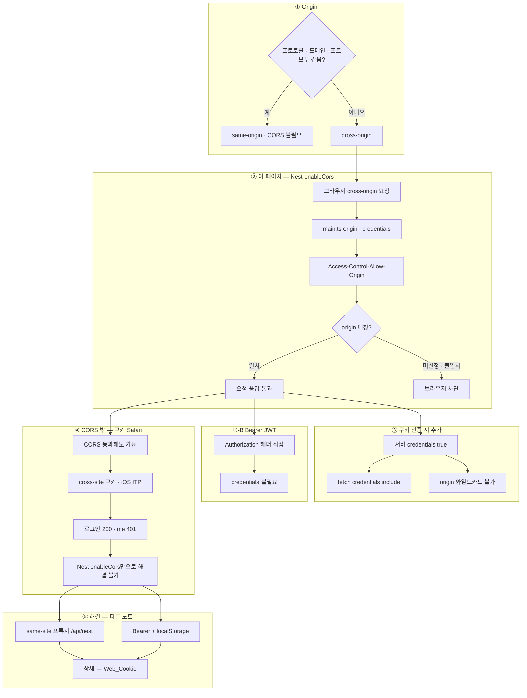

---
aliases:
  - CORS
  - HTTP
  - Security
tags:
  - NestJS
related:
  - "[[00_NestJS_Ecosystem_HomePage]]"
  - "[[Deploy_CloudMVP]]"
  - "[[JS_Fetch_API]]"
  - "[[NextJS_TokenStorage]]"
  - "[[Web_XSS_CSRF]]"
  - "[[Web_Cookie]]"
---
# NestJS_CORS — Cross-Origin 요청 허용

> [!info] 
> CORS = 브라우저가 다른 도메인(origin)으로 요청 보낼 때 서버가 명시적으로 허용해야 하는 보안 정책
>  Vercel(프론트) + Railway(API)처럼 도메인이 다른 구조에서 로그인·쿠키가 안 되는 이유가 대부분 여기에 있다.

---

# 흐름도



```txt
이 노트 범위: cross-origin이면 enableCors + origin 명시 · 쿠키는 credentials 양쪽 · origin * 와 credentials 동시 불가
CORS 통과 ≠ 인증 성공 — Safari 401은 쿠키·서드파티 문제 → Nest CORS 설정만으로는 안 됨
프록시·ITP·쿠키 도메인 → [[Web_Cookie]] · Bearer는 [[JS_Fetch_API]] [[NextJS_TokenStorage]]
```

---

# CORS가 필요한 이유 ⭐️⭐️⭐️

```txt
same-origin = 프로토콜 + 도메인 + 포트가 모두 같음
cross-origin = 셋 중 하나라도 다름

  프론트: https://my-app.vercel.app
  API:    https://my-api.railway.app  ← 도메인이 다름 → cross-origin

브라우저는 보안상 cross-origin 요청을 기본적으로 차단함
→ 서버가 "이 출처는 허용한다"고 응답 헤더로 알려줘야 브라우저가 통과시킴

로컬에서도:
  프론트: http://localhost:3000
  API:    http://localhost:3001  ← 포트가 다름 → cross-origin → CORS 설정 필요
```

---

# NestJS enableCors() ⭐️⭐️⭐️⭐️

## main.ts 설정

```typescript
// apps/api/src/main.ts
async function bootstrap() {
  const app = await NestFactory.create(AppModule);

  const configService  = app.get(ConfigService);
  const frontendUrl    = configService.get<string>('FRONTEND_URL');
  const frontendOrigin = frontendUrl
    ? new URL(frontendUrl).origin   // URL에서 origin(프로토콜+도메인)만 추출
    : undefined;

  app.enableCors({
    origin: frontendOrigin
      ? [
          'http://localhost:3000',    // 로컬 개발 (프론트)
          'http://127.0.0.1:3000',   // 일부 브라우저는 127.0.0.1을 localhost와 다르게 봄
          frontendOrigin,             // 운영 프론트엔드 도메인
        ]
      : undefined,                   // FRONTEND_URL 없으면 CORS 제한 없음 (로컬 전용)
    credentials: true,
  });

  await app.listen(3000);
}
```

## new URL(frontendUrl).origin — 왜 origin만 추출하는가

```txt
FRONTEND_URL 환경변수에는 경로까지 포함될 수 있음:
  https://my-app.vercel.app/recommendations  ← /recommendations 경로가 붙어있음

CORS의 origin 비교는 경로를 포함하지 않음 → 경로 포함된 URL을 그대로 쓰면 매칭 실패
→ new URL(frontendUrl).origin으로 경로를 제거한 도메인만 사용

  new URL('https://my-app.vercel.app/path').origin
  // → 'https://my-app.vercel.app'
```

---

# 환경변수로 분리 ⭐️⭐️⭐️

```typescript
// ❌ 하드코딩 — Git에 도메인 노출 + 환경마다 코드 수정 필요
app.enableCors({
  origin: ['https://my-app.vercel.app'],
  credentials: true,
});

// ✅ 환경변수로 분리
app.enableCors({
  origin: [
    'http://localhost:3000',
    'http://127.0.0.1:3000',
    process.env.FRONTEND_URL,
  ].filter(Boolean),   // FRONTEND_URL 없을 때 undefined 제거
  credentials: true,
});
```

```txt
filter(Boolean)이 필요한 이유:
  process.env.FRONTEND_URL이 없으면 undefined
  origin 배열에 undefined가 들어가면 예기치 않은 동작 발생
  → filter(Boolean)으로 falsy 값(undefined, null, '') 전부 제거

127.0.0.1을 따로 추가하는 이유:
  브라우저에 따라 localhost와 127.0.0.1을 다른 origin으로 취급하는 경우가 있음
```

---

# credentials: true — 양쪽 모두 설정 ⭐️⭐️⭐️⭐️

```txt
쿠키나 Authorization 헤더를 cross-origin 요청에서 주고받으려면
서버(NestJS)와 클라이언트(fetch) 양쪽 모두 설정이 필요함 — 한쪽만 하면 동작 안 함
```

|위치|설정|
|---|---|
|서버 (NestJS)|`app.enableCors({ credentials: true })`|
|클라이언트 (fetch)|`fetch(url, { credentials: 'include' })`|

```txt
⚠️ credentials: true 와 origin: '*' 는 같이 쓸 수 없음
  → 와일드카드 허용 + credentials 허용은 보안상 브라우저가 차단
  → credentials를 쓰려면 origin을 구체적인 주소로 명시해야 함

fetch에서 credentials: 'include'가 언제 필요한지 → [[JS_Fetch_API]] 참고
JWT(Bearer 헤더) 방식이면 credentials 설정 불필요 — 헤더에 직접 담기 때문
```

---

# 트러블슈팅 — 모바일(iOS Safari) 로그인·인증 안 됨 ⭐️⭐️⭐️⭐️

```txt
증상: 로그인 200 성공인데 이후 /auth/me 등이 전부 401 — PC는 멀쩡, 아이폰만 안 됨
원인: API 절대 URL → 쿠키가 API 도메인에 귀속 → iOS ITP가 서드파티 쿠키로 인식해 차단
해결: NEXT_PUBLIC_API_URL을 /api/nest 상대 경로로 + Vercel rewrites로 프록시
```

>쿠키가 서드파티로 인식되는 원리, ITP란 무엇인지, 프록시가 이를 해결하는 과정 
>→ [[Web_Cookie]] "iOS Safari와 ITP" / "프록시로 해결하는 원리" 섹션 참고

---

# 주요 enableCors 옵션

|옵션|설명|
|---|---|
|`origin`|허용할 출처 — 문자열 / 문자열 배열 / 정규식 / `true`(전체)|
|`credentials`|`true` = 쿠키/Authorization 헤더 허용 (origin이 구체적 주소일 때만)|
|`methods`|허용할 HTTP 메서드 — 기본값: `GET,HEAD,PUT,PATCH,POST,DELETE`|
|`allowedHeaders`|허용할 요청 헤더 — 기본값: `Content-Type, Authorization`|
|`exposedHeaders`|브라우저가 읽을 수 있게 노출할 응답 헤더|
|`maxAge`|preflight 결과 캐시 시간(초)|

```typescript
app.enableCors({
  origin:         ['http://localhost:3000', frontendOrigin].filter(Boolean),
  credentials:    true,
  methods:        ['GET', 'POST', 'PATCH', 'DELETE'],
  allowedHeaders: ['Content-Type', 'Authorization'],
  maxAge:         86400,  // preflight 24시간 캐싱
});
```

---

# 한눈에

```txt
CORS가 필요한 상황:
  프론트와 API의 도메인/포트가 다를 때 → cross-origin → enableCors() 필수

enableCors() 설정:
  origin: [로컬주소, 127.0.0.1주소, frontendOrigin].filter(Boolean)
  credentials: true (쿠키 허용 — origin이 *이면 사용 불가)
  FRONTEND_URL에서 new URL(url).origin으로 경로 제거 후 사용

양쪽 모두 설정:
  서버: credentials: true
  클라이언트: fetch의 credentials: 'include' ([[JS_Fetch_API]] 참고)

모바일(iOS Safari) 401 버그:
  원인: API 절대 URL → 쿠키가 API 도메인에 귀속 → iOS ITP가 서드파티로 인식해 차단
  해결: NEXT_PUBLIC_API_URL을 /api/nest 상대 경로로 + Vercel rewrites로 프록시
  → 쿠키가 프론트 도메인에 귀속 → same-site → iOS 차단 안 함

프록시가 CORS 노트에 있는 이유:
  문제의 원인이 CORS + 쿠키 cross-origin 차단이고
  프록시는 그 해결책 — "왜 필요한가"와 "어떻게 해결하는가"가 같은 맥락
```