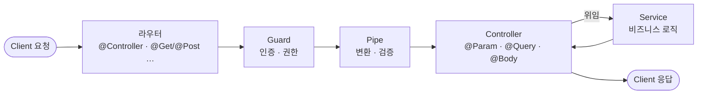

# NestJS_Controller — 컨트롤러

> [!info] 
> URL 경로와 HTTP 메서드를 연결하는 라우터
>  요청을 받아서 Service로 넘기고 응답을 반환한다. 비즈니스 로직은 직접 처리하지 않는다.

---
# 흐름도 



---

# 기본 구조

```typescript
@Controller('movie')       // 기본 경로 = /movie
export class MovieController {
  @Get()                   // GET /movie
  getMovies() { }

  @Get(':id')              // GET /movie/:id
  getMovie() { }

  @Post()                  // POST /movie
  postMovie() { }

  @Patch(':id')            // PATCH /movie/:id
  patchMovie() { }

  @Delete(':id')           // DELETE /movie/:id
  deleteMovie() { }
}
```

```txt
REST API 경로 패턴:
  GET    /movie        목록 조회
  GET    /movie/:id    단건 조회
  POST   /movie        생성
  PATCH  /movie/:id    수정
  DELETE /movie/:id    삭제
```

---

# 경로 조합 규칙 ⭐️

```txt
@Controller('prefix') + @Get('suffix') → GET /prefix/suffix

예시:
  @Controller('auth') + @Post('register') → POST /auth/register
  @Controller('auth') + @Post('login')    → POST /auth/login
  @Controller('movie') + @Get(':id')      → GET /movie/:id
  @Controller()        + @Get()           → GET / (루트)
```

## 정적 vs 동적 경로 순서 ⭐️

```typescript
// ✅ 정적 경로를 동적 경로 앞에 선언
@Get('popular')         // GET /movie/popular  ← 정적 먼저
getPopular() { }

@Get(':id')             // GET /movie/:id      ← 동적 나중
getMovie() { }
```

```txt
❌ :id가 먼저 선언되면:
  GET /movie/popular → popular가 :id로 잡혀버림
  popular라는 id로 DB 조회 → NotFoundException

반드시 정적 경로를 동적 경로보다 위에 선언
```

---

# @Param — Path Variable ⭐️

```typescript
@Get(':id')
getMovie(@Param('id') id: string) {
  const movie = this.movies.find(m => m.id === +id);
  if (!movie) throw new NotFoundException(`${id} 영화 없음`);
  return movie;
}
```

```txt
URL에서 받은 값은 항상 string — 숫자와 비교 시 변환 필요:
  +id           숫자 변환 (단축형)
  parseInt(id)  정수 변환
  Number(id)    숫자 변환

  movie.id === +id  ✅
  movie.id === id   ❌ (string vs number 비교 실패)
```

---

# Pipe — 자동 변환 / 검증 ⭐️⭐️

```txt
Pipe는 컨트롤러 메서드가 실행되기 "직전"에 끼어들어 파라미터 값을
① 변환(Transformation) 하거나 ② 검증(Validation) 하는 역할

변환 실패 / 검증 실패 시 → 핸들러는 실행되지 않고 자동으로 400 Bad Request 던짐
→ 컨트롤러 코드 안에 if(!isNumber(id)) 같은 검사를 직접 안 써도 됨
```

```typescript
// @Param에 Pipe 연결 → 자동으로 string → number 변환
@Get(':id')
getMovie(@Param('id', ParseIntPipe) id: number) {
  const movie = this.movies.find(m => m.id === id);  // +id 없이 바로 사용
}
```

## 내장 Pipe 종류 ⭐️⭐️⭐️

|Pipe|역할|변환 후 타입|실패 시|
|---|---|---|---|
|`ParseIntPipe`|문자열 → 정수|`number`|400|
|`ParseFloatPipe`|문자열 → 소수|`number`|400|
|`ParseBoolPipe`|`'true'/'false'/'1'/'0'` → 불린|`boolean`|400|
|`ParseArrayPipe`|구분자로 나눠 배열로 변환|`array`|400|
|`ParseEnumPipe`|TS enum에 정의된 값인지 검증|enum 타입|400|
|`ParseUUIDPipe`|UUID 형식인지 검증만 (값은 그대로 string)|`string`|400|
|`ParseDatePipe`|문자열 → `Date` 객체|`Date`|400|
|`DefaultValuePipe`|값이 없을 때(undefined) 기본값 주입|지정한 타입|—|
|`ValidationPipe`|DTO + class-validator 기반 전체 검증|DTO 타입|400 + 필드별 에러|

## ParseIntPipe vs ParseUUIDPipe ⭐️⭐️

```txt
PK가 auto-increment 정수면      → ParseIntPipe,  id: number로 변환
PK가 UUID (@default(uuid()))면  → ParseUUIDPipe, id: string 그대로 유지

ParseUUIDPipe는 "변환"을 하지 않음 — UUID는 숫자가 아니므로
원래도 string인 값을 "올바른 UUID 형식인가"만 검증하고 그대로 통과시킴
```

```typescript
// PK가 UUID인 경우
@Get(':id')
getMovie(@Param('id', ParseUUIDPipe) id: string) {
  return this.movieService.findOne(id);
}

// 특정 UUID 버전만 허용
@Get(':id')
getMovie(@Param('id', new ParseUUIDPipe({ version: '4' })) id: string) { }
```

## Parse* + DefaultValuePipe 조합 ⭐️

```txt
⚠️ Parse* 계열은 값이 null/undefined로 들어오면 즉시 예외를 던짐
   선택적 query parameter에 ParseIntPipe만 단독으로 쓰면
   값을 안 보냈을 때 400 에러가 나버림

→ DefaultValuePipe를 Parse* 보다 앞에 둬서 "기본값을 먼저 채운 다음 변환"
```

```typescript
@Get()
getMovies(
  @Query('page', new DefaultValuePipe(0), ParseIntPipe) page: number,
  @Query('activeOnly', new DefaultValuePipe(false), ParseBoolPipe) activeOnly: boolean,
) {
  // page를 안 보내면 0 → ParseIntPipe가 그대로 0(number) 통과
}
```

## { optional: true } — 기본값 없이 선택적으로 ⭐️⭐️⭐️

```typescript
@Get()
getUsers(
  @Query('inactiveDays', new ParseIntPipe({ optional: true }))
  inactiveDays?: number,
) {
  // 안 보내면 → undefined (에러 없음)
  // 보내면 → number로 변환 (잘못된 값이면 400)
}
```

|방법|값 없을 때|값 있을 때|결과 타입|
|---|---|---|---|
|`ParseIntPipe` 단독|400 에러|변환 성공|`number`|
|`DefaultValuePipe(0), ParseIntPipe`|0으로 치환 후 변환|변환 성공|`number`|
|`new ParseIntPipe({ optional: true })`|`undefined` 통과|변환 성공|`number \| undefined`|

## Pipe 적용 위치 ⭐️

|적용 범위|문법|언제|
|---|---|---|
|파라미터 레벨|`@Param('id', ParseIntPipe)`|특정 파라미터 하나에만 (가장 흔함)|
|메서드 레벨|`@UsePipes(ValidationPipe)` 를 메서드 위에|그 메서드의 모든 파라미터에|
|클래스 레벨|`@UsePipes(ValidationPipe)` 를 클래스 위에|이 컨트롤러의 모든 메서드에|
|전역|`app.useGlobalPipes(new ValidationPipe())` (main.ts)|앱 전체|

```txt
ValidationPipe는 대부분 main.ts에서 전역으로 한 번만 등록해두고,
@Body()로 받는 DTO 클래스에 class-validator 데코레이터(@IsString(), @IsInt() 등)를
붙이는 방식으로 사용 — 컨트롤러 메서드마다 반복 선언하지 않음
```

## main.ts — ValidationPipe 옵션 (실전 표준 3종) ⭐️⭐️⭐️

```typescript
app.useGlobalPipes(
  new ValidationPipe({
    transform:             true,
    whitelist:             true,
    forbidNonWhitelisted:  true,
  }),
);
```

|옵션|역할|
|---|---|
|`transform: true`|들어온 JSON을 DTO 클래스의 인스턴스로 변환 — DTO에 선언된 타입대로 string→number 자동 적용|
|`whitelist: true`|DTO에 선언되지 않은 필드 자동 제거|
|`forbidNonWhitelisted: true`|선언 안 된 필드가 오면 400 에러로 막음 (`whitelist: true`와 함께 써야 동작)|

```txt
⚠️ whitelist가 막아주는 보안 시나리오:
  DTO에 role 필드가 없는데 클라이언트가 body에 role: 'admin'을 끼워 보냈다면
  whitelist 없이는 그 값이 서비스까지 전달될 위험이 있음
  whitelist: true 하나로 이런 필드는 검증 단계에서 이미 걸러짐
```

---

# @Query — Query Parameter ⭐️

```typescript
@Get()
getMovies(@Query('title') title: string) {
  if (!title) return this.movies;
  return this.movies.filter(m => m.title.startsWith(title));
}
// GET /movie?title=마이클
```

```txt
Path Variable vs Query Parameter:
  /movie/:id    특정 리소스 식별 (필수값)
  /movie?title= 필터링 / 검색 (선택값)

값 없으면 undefined → !title로 체크
```

---

# @Body — 요청 Body ⭐️

```typescript
@Post()
postMovie(@Body('title') title: string) { }   // 특정 필드만

@Post()
postMovie(@Body() body: CreateMovieDto) { }   // 전체를 DTO로
```

```txt
JSON Body (Postman):
  { "title": "겨울왕국" }  ✅ 큰따옴표 필수
  { 'title': '겨울왕국' }  ❌ JSON 파싱 에러
```

---

# @Headers — 헤더 읽기 ⭐️

```typescript
@Get()
getMovies(@Headers('authorization') auth: string) {
  console.log(auth);  // 'Bearer eyJhb...'
}
```

## ⚠️ 헤더 키는 반드시 소문자

```txt
Node.js (Express / NestJS)는 수신 헤더 키를 전부 소문자로 변환

  @Headers('Authorization')  ❌ undefined 반환
  @Headers('authorization')  ✅
```

## 토큰 꺼내기 패턴

```typescript
@Post()
postMovie(@Headers('authorization') auth: string) {
  if (!auth) throw new UnauthorizedException('토큰 없음');

  const [type, token] = auth.split(' ');
  // 'Bearer eyJhb...' → ['Bearer', 'eyJhb...']

  if (type !== 'Bearer' || !token) {
    throw new UnauthorizedException('토큰 형식 오류');
  }
}
```

```txt
⚠️ 실제 인증 로직은 Guard로 분리하는 것이 원칙
   Controller에서 직접 파싱하는 건 Guard 작성 전 단계
   → [[NestJS_Guard]] 참고
```

---

# @Req / @Res — 라이브러리 Request·Response 객체 ⭐️⭐️

```txt
@Req()는 NestJS가 감싸기 전의 "원본" Request 객체를 그대로 꺼내주는 데코레이터
@Param/@Query/@Body/@Headers는 사실 내부적으로 req.params/req.query/req.body/req.headers를
대신 읽어서 꺼내주는 편의 래퍼일 뿐
```

```typescript
import { Request } from 'express';

@Get()
getMovies(@Req() req: Request) {
  console.log(req.headers['authorization']);
  console.log(req.method);  // 'GET'
  console.log(req.url);     // '/movie'
}
```

## Request 객체 주요 속성 ⭐️⭐️

|속성|설명|전용 데코레이터|
|---|---|---|
|`req.params`|path variable 객체|`@Param('id')`|
|`req.query`|query string 객체|`@Query('title')`|
|`req.body`|요청 바디|`@Body()`|
|`req.headers`|요청 헤더 객체 (키는 소문자)|`@Headers('authorization')`|
|`req.method`|HTTP 메서드 문자열|대응 데코레이터 없음 — `@Req()` 필요|
|`req.url` / `req.originalUrl`|요청 경로(+query string)|대응 데코레이터 없음|
|`req.ip`|클라이언트 IP|대응 데코레이터 없음|
|`req.cookies`|쿠키 객체 (`cookie-parser` 필요)|대응 데코레이터 없음|
|`req.user`|Guard가 인증 후 끼워넣은 값|커스텀 Param 데코레이터로 대체 권장|

## @Res() — Response 객체 직접 제어 ⭐️⭐️⭐️

```txt
⚠️ @Res()를 한 번이라도 쓰면 NestJS의 "표준 응답 처리"가 그 라우트에서 자동으로 꺼짐
  → return 한 값을 자동으로 JSON 직렬화 X
  → @HttpCode() 데코레이터 무시
  → 인터셉터 response mapping도 동작 안 함
→ 표준 방식과 같이 쓰고 싶다면 반드시 { passthrough: true } 옵션 필요
```

```typescript
// ❌ passthrough 없이 — 표준 처리 꺼짐
@Get()
getMovies(@Res() res: Response) {
  res.status(200).json(this.movies);  // 직접 응답을 끝내야 함
}

// ✅ passthrough: true — 헤더/상태코드만 직접 건드리고 나머지는 NestJS 표준 방식 유지
@Get()
getMovies(@Res({ passthrough: true }) res: Response) {
  res.status(HttpStatus.OK);
  return this.movies;  // 이 return 값은 자동 직렬화됨
}
```

## 언제 @Req() / @Res()를 직접 쓰는가 ⭐️

|상황|추천|
|---|---|
|id, title 같은 값 하나만 필요|`@Param`/`@Query`/`@Body`/`@Headers`|
|method/url/ip/cookies처럼 전용 데코레이터가 없는 정보|`@Req()`|
|같은 추출 로직이 여러 컨트롤러에서 반복|커스텀 Param 데코레이터|
|커스텀 헤더, 스트리밍, 쿠키 설정 등 응답 직접 제어|`@Res({ passthrough: true })`|

## req.user — Guard가 끼워넣은 값에 접근하기 ⭐️⭐️⭐️

```typescript
@UseGuards(JwtAuthGuard)
@Post()
create(
  @Body() dto: CreateRecommendationDto,
  @Req() req: Request & { user?: JwtPayload },
) {
  return this.recommendationsService.create(dto, req.user!.sub);
}
```

```txt
Request & { user?: JwtPayload } 교차 타입이 필요한 이유:
  Express의 기본 Request 타입에는 user 속성이 없음
  JwtAuthGuard가 검증 통과 후 request.user = payload로 런타임에 직접 추가한 것
  → TS는 이걸 알 길이 없어서 직접 타입으로 알려줘야 함

req.user!의 !이 붙는 이유:
  타입 선언은 user?: JwtPayload (있을 수도 없을 수도)인데
  @UseGuards(JwtAuthGuard)를 거쳐야 도달하므로 "여기 왔다면 무조건 있다"는 보장
  → 그 보장을 !로 단언하는 것
  ⚠️ Guard를 안 거치는 라우트에서 이렇게 쓰면 실제로 undefined일 수 있어 위험
```

---

# 커스텀 데코레이터 — 범용 패턴 ⭐️⭐️⭐️

```txt
커스텀 데코레이터는 목적에 따라 두 종류:
  ① Param 데코레이터   요청에서 값을 "추출"해서 메서드 인자로 주입  → createParamDecorator
  ② 메타데이터 데코레이터  클래스/메서드에 "표시(꼬리표)"만 붙여둠   → SetMetadata + Reflector
```

## 종류 비교 ⭐️⭐️

|구분|① Param 데코레이터|② 메타데이터 데코레이터|
|---|---|---|
|만드는 함수|`createParamDecorator`|`SetMetadata(key, value)`|
|붙이는 위치|메서드의 **파라미터**|**클래스** 또는 **메서드** 위|
|동작 시점|요청이 들어올 때마다 실행되어 값을 바로 반환|값을 "부착"만 해두고, 나중에 Guard/Interceptor가 Reflector로 읽음|
|반환하는 것|컨트롤러 메서드에 주입될 값 그 자체|아무것도 반환 안 함 (메타데이터만 저장)|
|대표 예시|`@UserId()`, `@CurrentUser()`|`@Roles('admin')`, `@Public()`|

---

## ① Param 데코레이터 — createParamDecorator

```typescript
// src/common/decorator/current-user.decorator.ts
export const CurrentUser = createParamDecorator(
  (data: string | undefined, ctx: ExecutionContext) => {
    const request = ctx.switchToHttp().getRequest();
    const user    = request.user;

    // data 안 넘기면 user 객체 전체, 넘기면 그 필드만 반환
    return data ? user?.[data] : user;
  },
);
```

```typescript
// 사용
@Get('me')
getProfile(@CurrentUser() user: User) { return user; }           // 객체 전체

@Get('me/email')
getEmail(@CurrentUser('email') email: string) { return email; }  // 'email' 필드만
```

```txt
data 파라미터의 역할:
  @CurrentUser()         → data = undefined
  @CurrentUser('email')  → data = 'email'
  즉, 데코레이터 호출 시 () 안에 넣은 값이 콜백의 첫 번째 인자로 전달됨
```

## ExecutionContext — 컨텍스트별 접근 메서드 ⭐️

|메서드|언제 쓰는가|
|---|---|
|`switchToHttp()`|REST API — `.getRequest()` / `.getResponse()`|
|`switchToWs()`|WebSocket|
|`switchToRpc()`|마이크로서비스(RPC)|
|`getClass()`|클래스 레벨 메타데이터 조회용|
|`getHandler()`|메서드 레벨 메타데이터 조회용|

---

## ② 메타데이터 데코레이터 — SetMetadata + Reflector ⭐️⭐️⭐️

```txt
"이 라우트는 admin만 접근 가능" 같은 정보를 Guard 코드 안에 if문으로 박아넣지 않고
데코레이터 한 줄로 라우트 위에 "표시"해두는 패턴

데코레이터 자체는 판단을 하지 않음 — 그냥 꼬리표를 붙일 뿐
실제 판단은 Guard나 Interceptor가 그 꼬리표를 읽어서 함
```


```typescript
// roles.decorator.ts
export const ROLES_KEY = 'roles';
export const Roles = (...roles: string[]) => SetMetadata(ROLES_KEY, roles);

// roles.guard.ts
@Injectable()
export class RolesGuard implements CanActivate {
  constructor(private reflector: Reflector) {}

  canActivate(context: ExecutionContext): boolean {
    const roles = this.reflector.get<string[]>(ROLES_KEY, context.getHandler());
    if (!roles) return true;

    const { user } = context.switchToHttp().getRequest();
    return roles.some((role) => user?.roles?.includes(role));
  }
}
```

```typescript
// 사용
@UseGuards(JwtAuthGuard, RolesGuard)
@Roles('admin')
@Delete(':id')
deleteMovie(@Param('id', ParseIntPipe) id: number) { }
```

### 자주 쓰는 메타데이터 데코레이터 예시

|이름|용도|읽는 쪽|
|---|---|---|
|`@Roles('admin', 'editor')`|역할 기반 접근 제어|`RolesGuard`|
|`@Public()`|인증 자체를 건너뛰는 라우트 표시|`JwtAuthGuard`|
|`@CacheTTL(60)`|응답 캐싱 시간(초) 표시|`CacheInterceptor`|

---

## 데코레이터 합치기 — applyDecorators ⭐️

```typescript
export function Auth(...roles: string[]) {
  return applyDecorators(
    Roles(...roles),
    UseGuards(JwtAuthGuard, RolesGuard),
    ApiBearerAuth(),
    ApiUnauthorizedResponse({ description: 'Unauthorized' }),
  );
}

// 사용 — 4줄이 1줄로
@Auth('admin')
@Delete(':id')
deleteMovie(@Param('id', ParseIntPipe) id: number) { }
```

---

## 언제 무엇을 만드는가 ⭐️⭐️

|상황|선택|
|---|---|
|요청에서 값을 꺼내서 컨트롤러 인자로 쓰고 싶다|① `createParamDecorator`|
|특정 필드만 골라서 받고 싶다 (재사용 가능하게)|① + `data` 파라미터 활용|
|라우트에 "이건 admin만" 같은 표시만 해두고 싶다|② `SetMetadata` + Guard의 `Reflector`|
|여러 데코레이터를 매번 같이 쓰는 게 반복된다|`applyDecorators`로 하나로 묶기|

---

# Guard / Pipe / Interceptor — 클래스 레벨 적용 ⭐️⭐️⭐️

```txt
같은 데코레이터를 컨트롤러 "클래스 위"에 붙이면 그 컨트롤러의 모든 메서드에 자동 적용됨
Guard/Pipe/Interceptor/Filter 전부 이 규칙이 동일하게 적용됨
```

```typescript
@UseGuards(JwtAuthGuard)   // 클래스 위 — 모든 라우트에 적용
@Controller('movie')
export class MovieController {
  @Get() findAll() { }    // JwtAuthGuard 적용됨
  @Post() create() { }    // 마찬가지
}
```

|적용 범위|예시|
|---|---|
|메서드만|`@UseGuards(...)`를 그 메서드 위에만|
|컨트롤러 전체|`@UseGuards(...)`를 클래스 위에|
|앱 전체|`app.useGlobalGuards(...)` 또는 `APP_GUARD` provider|

---

# Controller 메서드가 꼭 async여야 하는가 ⭐️⭐️

```txt
NestJS는 핸들러가 반환하는 값이 일반 값이든 Promise든 상관없이 전부 알아서 처리함
→ Service가 반환한 Promise를 그대로 return하면, await 없이도 NestJS가 대신 resolve해서 응답으로 보냄
```

```typescript
// 둘 다 동일하게 동작
getMovies() {
  return this.movieService.findAll();         // Promise를 그대로 return
}

async getMovies() {
  return await this.movieService.findAll();   // 직접 await
}
```

|상황|async 필요?|
|---|---|
|Service 호출 결과를 그대로 return|불필요 (있어도 동작은 같음)|
|결과를 가공하거나 여러 호출을 조합|필요 — `await`로 값을 먼저 받아야 가공 가능|
|try/catch로 에러를 직접 잡아야 함|필요 — `await` 없이는 reject를 catch로 못 잡음|

```txt
실무에서는 결과를 가공하거나 여러 호출을 조합하는 경우가 많아서
관례적으로 거의 항상 async를 붙임
```

---

# 상태코드·응답·예외 처리 → [[NestJS_Response]]

---

# 실전 CRUD 전체 코드 (인증 포함)

```typescript
@Controller('movie')
export class MovieController {
  constructor(private readonly movieService: MovieService) {}

  @Get()
  getMovies(@Query('title') title?: string) {
    return this.movieService.findAll(title);
  }

  @Get('popular')                                    // 정적 경로 먼저 ⭐️
  getPopular() {
    return this.movieService.findPopular();
  }

  @Get(':id')                                        // 동적 경로 나중
  getMovie(@Param('id', ParseIntPipe) id: number) {
    return this.movieService.findOne(id);
  }

  @UseGuards(JwtAuthGuard)
  @Post()
  postMovie(
    @Body() body: CreateMovieDto,
    @UserId() userId: number,
  ) {
    return this.movieService.create(body, userId);
  }

  @Patch(':id')
  patchMovie(
    @Param('id', ParseIntPipe) id: number,
    @Body() body: UpdateMovieDto,
  ) {
    return this.movieService.update(id, body);
  }

  @Auth('admin')
  @HttpCode(204)
  @Delete(':id')
  async deleteMovie(@Param('id', ParseIntPipe) id: number) {
    await this.movieService.remove(id);
  }
}
```

---

# 한눈에

|데코레이터 / 함수|역할|
|---|---|
|`@Controller('경로')`|기본 경로|
|`@Get()` / `@Post()` / `@Patch(':id')` / `@Delete(':id')`|HTTP 메서드 라우팅|
|`@Param('id')`|Path Variable|
|`@Param('id', ParseIntPipe)`|Path Variable 숫자 변환|
|`@Query('title')`|Query Parameter|
|`@Body()`|Body 전체를 DTO로|
|`@Headers('authorization')`|헤더 — 소문자 필수 ⭐️|
|`@Req()`|원본 Request 객체 (method/url/ip/cookies 등)|
|`@Res({ passthrough: true })`|원본 Response 객체, 표준 응답과 공존|
|`ParseIntPipe` / `ParseUUIDPipe` 등|변환 또는 검증|
|`new ParseIntPipe({ optional: true })`|값 없으면 undefined, 있으면 변환|
|`createParamDecorator`|① Param 데코레이터 — 요청에서 값 추출|
|`SetMetadata(key, value)`|② 메타데이터 부착 — 꼬리표만 붙임|
|`Reflector.get(key, target)`|② 메타데이터 읽기 — Guard/Interceptor 안에서|
|`applyDecorators(...)`|여러 데코레이터 합치기|

```txt
createParamDecorator: "값을 즉시 추출"
SetMetadata:          "표시만 부착 후 나중에 읽음"
→ 이름은 둘 다 "커스텀 데코레이터"지만 동작 시점이 다름

Guard/Pipe/Interceptor: 메서드 위 vs 클래스 위 어디 붙이느냐로 적용 범위 결정
상태코드/응답/예외 처리 → [[NestJS_Response]]
```

---

# 자주 하는 실수

| 실수                                              | 원인                                       | 해결                                                 |
| ----------------------------------------------- | ---------------------------------------- | -------------------------------------------------- |
| `movie.id === id` 비교 오류                         | string vs number                         | `+id` 또는 `ParseIntPipe`                            |
| UUID PK인데 `ParseIntPipe` 사용                     | UUID는 숫자로 변환 불가                          | `ParseUUIDPipe` 사용                                 |
| optional query에 `ParseIntPipe` 단독 → 값 안 보내면 400 | Parse*는 undefined 즉시 예외                  | `DefaultValuePipe`를 앞에 둬서 조합                       |
| JSON Body 파싱 에러                                 | 작은따옴표 사용                                 | `"key"` 반드시 큰따옴표                                   |
| GET /popular → :id로 잡힘                          | 정적 경로가 동적 경로 아래 선언                       | popular를 :id 위로 이동 ⭐️                              |
| 헤더 undefined                                    | `'Authorization'` 대문자                    | `'authorization'` 소문자 ⭐️                           |
| `req.user`에 TS 에러                               | 기본 Request 타입엔 user 없음                   | `Request & { user?: ... }`로 교차, 또는 Param 데코레이터로 회피 |
| `@Res()` 썼더니 return 한 값이 응답에 안 나감               | 표준 응답 처리 자동으로 꺼짐                         | `@Res({ passthrough: true })`                      |
| `Reflector.get`이 항상 undefined                   | `getHandler()`만 보고 클래스 레벨은 못 읽음          | 둘 다 필요하면 `getHandler()`와 `getClass()` 둘 다 조회       |
| DTO에 없는 필드를 보냈는데 에러도 안 나고 사라짐                   | `forbidNonWhitelisted` 없이 `whitelist`만 켬 | `forbidNonWhitelisted: true`도 같이                   |