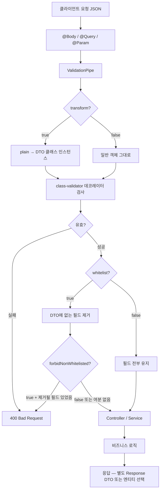

---
aliases:
  - class-validator
  - DTO
  - ValidationPipe
tags:
  - NestJS
related:
  - "[[00_NestJS_Ecosystem_HomePage]]"
  - "[[NestJS_Swagger]]"
  - "[[NextJS_API_Client]]"
  - "[[NextJS_ApiTypes_Mapper]]"
  - "[[TS_PartialUpdate]]"
---
# NestJS_DTO — 데이터 전송 객체 & 유효성 검사

> [!info]  
> DTO = 요청/응답의 데이터 구조를 클래스로 정의하는 것. 
> class-validator로 유효성 검사, class-transformer로 타입 변환을 처리한다. 
> Swagger 문서화는 → [[NestJS_Swagger]] 참고.

---
# 흐름도 



```txt
한 줄:
  요청 → ValidationPipe(변환·검사·화이트리스트) → 통과한 DTO만 핸들러로
  DTO = “이게 들어올 수 있는 모양”을 클래스 + 데코레이터로 적어 둔 계약
```

---

# 설치

```bash
pnpm add class-validator class-transformer
```

---

# ValidationPipe 전역 등록 ⭐️⭐️⭐️⭐️

```typescript
// main.ts
app.useGlobalPipes(
  new ValidationPipe({
    transform:            true,   // 요청 데이터를 DTO 클래스 인스턴스로 변환
    whitelist:            true,   // DTO에 없는 필드 자동 제거
    forbidNonWhitelisted: true,   // 없는 필드 오면 400 에러
  }),
);
```

|옵션|없을 때|있을 때|
|---|---|---|
|`transform`|`@Body()` 값이 순수 객체, 클래스 인스턴스 아님|DTO 클래스 인스턴스로 변환됨|
|`whitelist`|선언 안 된 필드도 그대로 전달|선언 안 된 필드 자동 제거|
|`forbidNonWhitelisted`|선언 안 된 필드 조용히 제거|선언 안 된 필드 오면 400 에러|

```txt
transform: true 가 필요한 이유:
  transform 없이 @Body() body: CreateUserDto 로 받으면
  body는 일반 객체({...}) — class-validator 데코레이터는 동작하지만
  클래스 메서드나 @Type()이 적용된 변환이 일어나지 않음

whitelist + forbidNonWhitelisted 세트:
  선언 안 된 필드를 보내면 → 제거만(whitelist) vs 에러로 막기(+forbidNonWhitelisted)
  보안 관점에서 forbidNonWhitelisted가 더 명시적
```

---

# Request DTO — 요청 Body 정의 ⭐️⭐️⭐️⭐️

```typescript
import {
  IsEmail, IsString, IsOptional,
  MinLength, MaxLength, IsInt, Min, Max,
  IsArray, IsUUID, IsEnum,
} from 'class-validator';

export class CreateUserDto {
  @IsEmail()
  email: string;

  @IsString()
  @MinLength(2)
  @MaxLength(20)
  nickname: string;

  @IsString()
  @MinLength(8)
  password: string;

  @IsOptional()
  @IsString()
  @MaxLength(200)
  bio?: string;
}
```

```txt
데코레이터 순서 관행:
  @IsOptional() → 선택적임을 먼저 선언
  @IsXxx() → 타입/형식 검사
  @MinLength/@MaxLength → 세부 제약

@IsOptional() 이 없으면:
  값이 undefined로 와도 아래 데코레이터들이 실행됨
  → undefined가 @IsString() 검사를 통과하지 못해서 400 에러
  → 선택적 필드는 반드시 @IsOptional() 필요

에러 커스텀:
  @IsEmail({}, { message: '올바른 이메일 형식을 입력해주세요.' })
```

## 자주 쓰는 class-validator 데코레이터

|데코레이터|역할|
|---|---|
|`@IsString()`|문자열|
|`@IsEmail()`|이메일 형식|
|`@IsInt()`|정수|
|`@IsNumber()`|숫자|
|`@IsBoolean()`|불리언|
|`@IsUUID()`|UUID 형식|
|`@IsArray()`|배열|
|`@IsEnum(Enum)`|enum 값 중 하나|
|`@IsOptional()`|undefined/null 허용|
|`@IsNotEmpty()`|빈 문자열 불허|
|`@MinLength(n)` / `@MaxLength(n)`|문자열 길이|
|`@Min(n)` / `@Max(n)`|숫자 범위|
|`@Matches(regex)`|정규식 일치|
|`@ValidateNested()`|중첩 객체 검증|
|`@IsString({ each: true })`|배열 각 요소가 string인지|

---
# 커스텀 유효성 메시지 ⭐️⭐️⭐️⭐️

```txt
class-validator의 기본 에러 메시지:
  "email must be an email" → 사용자에게 보여주기 부적합

커스터마이징 방법 두 가지:
  ① 데코레이터에 직접 message 넣기  → 필드 수가 많으면 반복이 많아짐
  ② ValidationError를 변환하는 유틸  → 한 파일에서 모든 메시지를 관리
```

## 방법 ① — 데코레이터에 직접 (간단)

```typescript
@IsEmail({}, { message: '올바른 이메일을 입력해주세요.' })
email: string;

@MinLength(8, { message: '비밀번호는 8자 이상이어야 합니다.' })
password: string;
```

## 방법 ② — 메시지 테이블 + ValidationPipe 훅 (중앙 관리) ⭐️⭐️⭐️⭐️

```typescript
// common/validation-messages.ts

import { ValidationError } from 'class-validator';

// 우선순위 1: 필드 + 제약 조합 (가장 구체적)
const FIELD_MESSAGES: Record<string, Partial<Record<string, string>>> = {
  email:    { isEmail:    '올바른 이메일을 입력해주세요.' },
  password: { minLength:  '비밀번호는 8자 이상이어야 합니다.',
              matches:    '영문 + 특수문자(!@#$%^&*)를 포함해야 합니다.' },
  nickname: { isNotEmpty: '닉네임을 입력해주세요.' },
  embedUrl: { isUrl:      'http(s):// 를 포함한 전체 주소를 입력해주세요.',
              isNotEmpty:  '재생 URL을 입력해주세요.' },
  subject:  { isNotEmpty: '제목을 입력해주세요.',
              maxLength:   '제목은 120자 이하여야 합니다.' },
  body:     { isNotEmpty: '문의 내용을 입력해주세요.',
              maxLength:   '문의 내용은 2000자 이하여야 합니다.' },
};

// 우선순위 2: 제약 공통 fallback
const CONSTRAINT_MESSAGES: Record<string, string> = {
  isEmail:            '올바른 이메일을 입력해주세요.',
  isNotEmpty:         '필수 항목입니다.',
  isString:           '문자열로 입력해주세요.',
  minLength:          '입력 길이가 부족합니다.',
  maxLength:          '입력 길이가 초과되었습니다.',
  isUrl:              'http(s):// 를 포함한 전체 주소를 입력해주세요.',
  isArray:            '배열 형식이 올바르지 않습니다.',
  arrayMinSize:       '선택 개수가 부족합니다.',
  arrayMaxSize:       '선택 개수가 초과되었습니다.',
  isIn:               '허용되지 않은 값입니다.',
  matches:            '형식이 올바르지 않습니다.',
  isInt:              '정수로 입력해주세요.',
  isUUID:             '올바른 ID 형식이 아닙니다.',
  isEnum:             '허용되지 않은 값입니다.',
  min:                '최소값보다 작습니다.',
  whitelistValidation:'허용되지 않은 필드가 포함되어 있습니다.',
};

// 우선순위: FIELD_MESSAGES → CONSTRAINT_MESSAGES → 기본값
export function getValidationMessage(property: string, constraint: string): string {
  return (
    FIELD_MESSAGES[property]?.[constraint] ??
    CONSTRAINT_MESSAGES[constraint] ??
    '입력값을 확인해주세요.'
  );
}

// ValidationError 배열을 재귀 순회해서 메시지 수집
function collectMessages(errors: ValidationError[]): string[] {
  const messages: string[] = [];
  for (const error of errors) {
    if (error.constraints) {
      for (const key of Object.keys(error.constraints)) {
        messages.push(getValidationMessage(error.property, key));
      }
    }
    if (error.children?.length) {
      // @ValidateNested() 중첩 객체도 재귀 처리
      messages.push(...collectMessages(error.children));
    }
  }
  return messages;
}

export function formatValidationMessages(errors: ValidationError[]): string[] {
  return collectMessages(errors);
}
```

## ValidationPipe에 연결 (main.ts) ⭐️⭐️⭐️

```typescript
// main.ts
import { formatValidationMessages } from './common/validation-messages';
import { BadRequestException } from '@nestjs/common';

app.useGlobalPipes(
  new ValidationPipe({
    transform:            true,
    whitelist:            true,
    forbidNonWhitelisted: true,
    exceptionFactory: (errors) => {
      // 기본 에러 대신 커스텀 메시지 배열로 교체
      const messages = formatValidationMessages(errors);
      return new BadRequestException(messages);
    },
  }),
);
```

```txt
exceptionFactory:
  ValidationPipe가 에러를 던지기 직전에 호출되는 함수
  ValidationError[] 를 받아서 원하는 형태의 예외로 변환
  → 응답 형태: { statusCode: 400, message: ['올바른 이메일을 입력해주세요.', ...] }

ValidationError 구조:
  error.property    필드 이름 ('email', 'password' 등)
  error.constraints 제약 이름 → 기본 메시지 맵 ({ isEmail: 'email must be an email' })
  error.children    중첩 객체의 에러 (@ValidateNested 사용 시)

우선순위 체인:
  FIELD_MESSAGES[property][constraint]  → 가장 구체적 (필드 + 제약)
  CONSTRAINT_MESSAGES[constraint]       → 제약 공통 fallback
  '입력값을 확인해주세요.'               → 최후 fallback

새 DTO에 필드를 추가할 때:
  데코레이터에 message를 붙일 필요 없음
  FIELD_MESSAGES에 해당 필드 + 제약 메시지를 추가하거나
  CONSTRAINT_MESSAGES에 이미 있으면 자동으로 적용됨
```
----
# @ValidateIf — 조건부 유효성 검사 ⭐️⭐️⭐️⭐️

```typescript
import { ValidateIf } from 'class-validator';

export class CreateRoomMessageDto {
  @IsEnum(RoomMessageType)
  type: RoomMessageType;   // 'text' | 'image' | 'file'

  // type이 'text'일 때만 content를 검사
  @ValidateIf((o: CreateRoomMessageDto) => o.type === RoomMessageType.text)
  @IsString()
  @IsNotEmpty()
  content?: string;

  // type이 'image'일 때만 imageUrl을 검사
  @ValidateIf((o: CreateRoomMessageDto) => o.type === RoomMessageType.image)
  @IsUrl()
  imageUrl?: string;
}
```

```txt
@ValidateIf(condition):
  condition 함수가 true를 반환할 때만 그 아래 데코레이터들이 실행됨
  false를 반환하면 값이 undefined여도 검사를 건너뜀

o 파라미터:
  전체 DTO 객체가 들어옴 (o = object)
  다른 필드 값을 조건으로 참조할 수 있음

왜 필요한가:
  type에 따라 필요한 필드가 다른 "차별 유니온" DTO 상황
  type: 'text' → content 필수 / imageUrl 없어도 됨
  type: 'image' → imageUrl 필수 / content 없어도 됨
  → @IsOptional()로는 이 분기를 표현할 수 없음
    (@IsOptional()은 타입 무관하게 항상 optional)
```

## @ValidateIf vs @IsOptional 차이 ⭐️⭐️⭐️

```typescript
// @IsOptional() — 조건 없이 항상 optional
@IsOptional()
@IsString()
content?: string;
// type이 뭐든 content가 없으면 검사 건너뜀

// @ValidateIf() — 조건부 optional
@ValidateIf((o) => o.type === 'text')
@IsString()
content?: string;
// type이 'text'이면 content는 필수(없으면 에러)
// type이 'image'이면 content 없어도 됨
```

## 실전 — 다양한 조건 표현

```typescript
// 다른 필드가 존재할 때만
@ValidateIf((o) => o.hasDiscount === true)
@IsNumber()
discountRate?: number;

// null이 아닐 때만
@ValidateIf((o) => o.targetId !== null)
@IsUUID()
targetId?: string | null;

// 여러 타입 중 하나일 때
@ValidateIf((o) => [RoomMessageType.image, RoomMessageType.video].includes(o.type))
@IsUrl()
mediaUrl?: string;
```

---

# Query DTO — @Type() 변환 ⭐️⭐️⭐️⭐️

```typescript
import { Type } from 'class-transformer';

export class GetListDto {
  @IsOptional()
  @IsInt()
  @Min(1)
  @Type(() => Number)   // 쿼리스트링 string '1' → number 1
  page?: number = 1;

  @IsOptional()
  @IsInt()
  @Min(1)
  @Max(100)
  @Type(() => Number)
  limit?: number = 20;

  @IsOptional()
  @IsString()
  keyword?: string;
}
```

```typescript
// 컨트롤러
@Get()
getList(@Query() dto: GetListDto) {
  // dto.page는 number (변환됨)
}
```

```txt
@Type()이 필요한 이유:
  쿼리스트링은 URL의 일부 → 항상 string으로 도착
  ?page=1 → dto.page = '1' (string)

  @Type(() => Number) + transform: true 조합:
  '1' → 1(number)로 자동 변환

@Type()이 필요한 상황:
  @Query() — 쿼리스트링
  @Param() — URL 파라미터 (ParseIntPipe로 대체 가능)
  중첩 객체 — @ValidateNested()와 항상 세트
```

## 중첩 객체 검증

```typescript
class AddressDto {
  @IsString() city:   string;
  @IsString() street: string;
}

class CreateOrderDto {
  @ValidateNested()
  @Type(() => AddressDto)   // 어떤 클래스로 변환할지 알려줌
  address: AddressDto;
}
```

---

# DTO 상속 — PartialType / OmitType / PickType ⭐️⭐️⭐️⭐️

```typescript
// @nestjs/swagger를 쓰면 거기서, 아니면 @nestjs/mapped-types에서 import
import { PartialType, OmitType, PickType, IntersectionType } from '@nestjs/swagger';

export class CreateUserDto {
  @IsEmail() email:    string;
  @IsString() nickname: string;
  @IsString() password: string;
}

// 모든 필드 optional — PATCH용
export class UpdateUserDto extends PartialType(CreateUserDto) {}
// → { email?: string; nickname?: string; password?: string }

// 특정 필드 제외
export class PublicUserDto extends OmitType(CreateUserDto, ['password'] as const) {}
// → { email: string; nickname: string }

// 특정 필드만 선택
export class LoginDto extends PickType(CreateUserDto, ['email', 'password'] as const) {}
// → { email: string; password: string }

// 두 DTO 합치기
export class RegisterDto extends IntersectionType(CreateUserDto, ProfileDto) {}
```

```txt
@nestjs/swagger vs @nestjs/mapped-types:
  Swagger 쓰면 @nestjs/swagger에서 import → Swagger 문서에도 상속 반영됨
  둘을 동시에 설치하고 혼용하면 충돌 가능 → 하나만 사용

as const 가 필요한 이유:
  OmitType(Dto, ['password'])라고만 쓰면 타입이 string[] → 정확한 추론 안 됨
  as const 로 ['password'] 를 리터럴 타입으로 고정해야 정확하게 동작
```

---

# Response DTO ⭐️⭐️⭐️

```typescript
// 응답에서 민감 정보 제외 + 반환 형태 정의
export class UserResponseDto {
  id:          string;
  email:       string;
  nickname:    string;
  bio?:        string;
  createdAt:   Date;
  // passwordHash는 선언 안 함 → 응답에 포함되지 않음
}

// Prisma entity → Response DTO 변환
function toUserResponse(user: User): UserResponseDto {
  const { passwordHash, ...rest } = user;
  return rest;
}
```

```txt
Response DTO의 역할:
  DB 모델에는 passwordHash, 내부 상태 등 외부에 노출하면 안 되는 필드가 있음
  Response DTO를 따로 만들어서 반환할 필드를 명시적으로 제한

Prisma User → Response DTO:
  구조분해로 제외할 필드를 빼고 나머지를 반환하는 패턴이 흔함
  또는 class-transformer의 @Exclude() + plainToInstance() 조합도 있음
```

---
# ValidateBy — 커스텀 검증 데코레이터 ⭐️⭐️⭐️⭐️

```txt
class-validator의 기본 데코레이터(@IsEmail, @IsUUID 등)로 표현이 안 되는 검증이 필요할 때
ValidateBy로 직접 만든다
```

## 기본 구조

```typescript
import {
  ValidateBy,
  ValidationOptions,
  buildMessage,
} from 'class-validator';

export function IsHexColor(validationOptions?: ValidationOptions) {
  return ValidateBy(
    {
      name: 'isHexColor',           // 고유 이름 (에러 객체의 constraints 키로 쓰임)
      validator: {
        validate(value: unknown): boolean {
          // true → 통과 / false → 검증 실패
          return typeof value === 'string' && /^#[0-9A-Fa-f]{6}$/.test(value);
        },
        defaultMessage: buildMessage(
          (each) => each + '$property은(는) #RRGGBB 형식이어야 합니다.',
          validationOptions,
        ),
      },
    },
    validationOptions,
  );
}
```

```typescript
// 사용
export class CreateCardDto {
  @IsHexColor()
  color: string;   // '#ff5733' ✅  'red' ❌  '#xyz' ❌
}
```

```txt
ValidateBy(options, validationOptions):
  options.name      고유 식별자 — constraints 객체의 키로 사용됨
  options.validator.validate(value) → boolean
    값이 조건을 만족하면 true, 아니면 false
  options.validator.defaultMessage
    에러 메시지 — validationOptions.message로 오버라이드 가능

buildMessage((each) => each + '메시지', validationOptions):
  배열 검증(@IsArray + { each: true }) 시 each에 "each value in " 접두사가 붙음
  단일 값이면 each = '' (빈 문자열)
  validationOptions.message가 있으면 그걸 우선 사용

$property:
  buildMessage에서 쓸 수 있는 템플릿 변수
  DTO 필드 이름으로 치환됨 (예: color → "color은(는) #RRGGBB...")
```

## 실전 예시 — 여러 커스텀 데코레이터

```typescript
// 비어있지 않은 hex 색상
export function IsHexColor(opts?: ValidationOptions) {
  return ValidateBy({
    name: 'isHexColor',
    validator: {
      validate: (v: unknown) =>
        typeof v === 'string' && /^#[0-9A-Fa-f]{6}$/.test(v),
      defaultMessage: buildMessage(
        (each) => each + '$property must be a valid hex color (#RRGGBB)',
        opts,
      ),
    },
  }, opts);
}

// 양수인지 확인 (IsPositive와 달리 0 제외 커스텀 메시지)
export function IsPositiveNumber(opts?: ValidationOptions) {
  return ValidateBy({
    name: 'isPositiveNumber',
    validator: {
      validate: (v: unknown) => typeof v === 'number' && v > 0,
      defaultMessage: buildMessage(
        (each) => each + '$property는 0보다 커야 합니다.',
        opts,
      ),
    },
  }, opts);
}
```

```typescript
// 사용
export class CreateRoomDto {
  @IsHexColor()
  themeColor: string;

  @IsPositiveNumber()
  @Type(() => Number)
  maxMembers: number;
}
```

## 기존 데코레이터에 constraints 추가

```typescript
// ValidationOptions.message로 메시지만 오버라이드
export class CreateCardDto {
  @IsHexColor({ message: '올바른 색상 코드를 입력해주세요.' })
  color: string;
}
```

## { each: true } — 배열 요소 하나하나 검증 ⭐️⭐️⭐️⭐️

```typescript
// moods 배열의 각 요소에 대해 isMood 검증을 실행
@ValidateBy(
  {
    name: 'isMood',
    validator: {
      validate: (v: unknown) => typeof v === 'string' && isValidMood(v),
      defaultMessage: () => '분위기는 1~8자로 입력해주세요.',
    },
  },
  { each: true },   // ← 배열의 각 요소에 개별 실행
)
moods: string[];
```

```txt
{ each: true }:
  ValidationOptions의 옵션 — 배열 필드에서 요소 하나하나에 validate()를 실행
  없으면: moods 배열 전체를 하나의 값으로 validate()에 넘김 (typeof [] === 'string' → false)
  있으면: moods[0], moods[1], ... 각각 validate()에 넘김

  ValidateBy 두 번째 인자가 ValidationOptions:
  @ValidateBy(
    { name, validator },   // 첫 번째 인자: 커스텀 로직
    { each: true },        // 두 번째 인자: ValidationOptions (each, message 등)
  )

defaultMessage: () => '메시지':
  buildMessage() 없이 단순 함수로도 가능
  배열 each 상황에서 buildMessage를 쓰면 자동으로 "each value in moods..." 접두사 붙음
  단순 고정 메시지면 () => '...' 로 충분

@IsString({ each: true }) 와의 차이:
  @IsString({ each: true })  → 요소가 string인지만 확인 (기본 데코레이터)
  @ValidateBy(..., { each: true }) → string인지 + 추가 조건(isValidMood)까지 한 번에
```

## 배열 + 커스텀 검증 전체 패턴

```typescript
function isValidMood(v: string): boolean {
  return v.trim().length >= 1 && v.trim().length <= 8;
}

export class CreateRoomDto {
  @IsArray()
  @ArrayMinSize(1,  { message: '분위기를 1개 이상 선택해주세요.' })
  @ArrayMaxSize(3,  { message: '분위기는 최대 3개까지 선택할 수 있어요.' })
  @ValidateBy(
    {
      name: 'isMood',
      validator: {
        validate: (v: unknown) => typeof v === 'string' && isValidMood(v),
        defaultMessage: () => '분위기는 1~8자로 입력해주세요.',
      },
    },
    { each: true },
  )
  moods: string[];
}
```

```txt
배열 검증 데코레이터 순서:
  @IsArray()               배열인지 먼저 확인 (이게 없으면 each가 의미 없음)
  @ArrayMinSize()          배열 길이 최소
  @ArrayMaxSize()          배열 길이 최대
  @ValidateBy({ each: true })  요소 하나하나 커스텀 검증

  @IsArray() 없이 { each: true }만 있으면:
  값이 배열이 아닐 때 validate()가 값 자체에 실행되어 예상치 못한 동작 가능
  → 배열 필드에는 항상 @IsArray() 먼저
```

---

# 한눈에

```txt
ValidationPipe 세트:
  transform: true          클래스 인스턴스 변환 (필수)
  whitelist: true          모르는 필드 제거
  forbidNonWhitelisted     모르는 필드 → 400

@IsOptional() 없으면:
  undefined 값도 검증 → 선택 필드에 반드시 추가

@Type() 필요한 경우:
  쿼리스트링, URL 파라미터 (string → number/boolean)
  중첩 객체 @ValidateNested()와 세트

DTO 상속:
  PartialType   모든 optional
  OmitType      필드 제외
  PickType      필드 선택
  → @nestjs/swagger 또는 @nestjs/mapped-types에서 import (혼용 금지)
  → [...] as const 필요

Swagger 문서화 데코레이터 → [[NestJS_Swagger]]
```