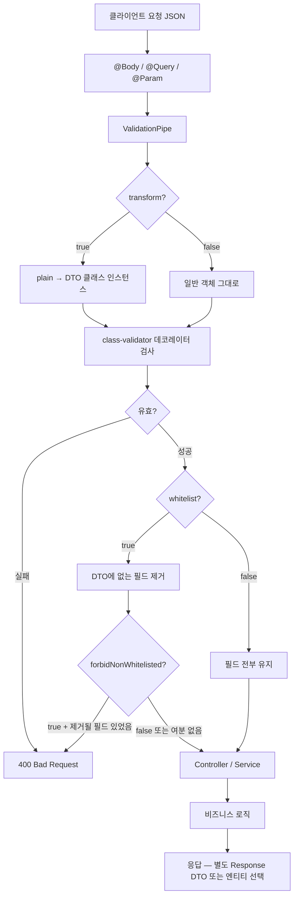

---
aliases:
  - class-validator
  - DTO
  - ValidationPipe
tags:
  - NestJS
related:
  - "[[00_NestJS_Ecosystem_HomePage]]"
  - "[[NestJS_Swagger]]"
  - "[[NextJS_API_Client]]"
  - "[[NextJS_ApiTypes_Mapper]]"
  - "[[TS_PartialUpdate]]"
---
# NestJS_DTO — 데이터 전송 객체 & 유효성 검사

> [!info]  
> DTO = 요청/응답의 데이터 구조를 클래스로 정의하는 것. 
> class-validator로 유효성 검사, class-transformer로 타입 변환을 처리한다. 
> Swagger 문서화는 → [[NestJS_Swagger]] 참고.

---
# 흐름도 



```txt
한 줄:
  요청 → ValidationPipe(변환·검사·화이트리스트) → 통과한 DTO만 핸들러로
  DTO = “이게 들어올 수 있는 모양”을 클래스 + 데코레이터로 적어 둔 계약
```

---

# 설치

```bash
pnpm add class-validator class-transformer
```

---

# ValidationPipe 전역 등록 ⭐️⭐️⭐️⭐️

```typescript
// main.ts
app.useGlobalPipes(
  new ValidationPipe({
    transform:            true,   // 요청 데이터를 DTO 클래스 인스턴스로 변환
    whitelist:            true,   // DTO에 없는 필드 자동 제거
    forbidNonWhitelisted: true,   // 없는 필드 오면 400 에러
  }),
);
```

|옵션|없을 때|있을 때|
|---|---|---|
|`transform`|`@Body()` 값이 순수 객체, 클래스 인스턴스 아님|DTO 클래스 인스턴스로 변환됨|
|`whitelist`|선언 안 된 필드도 그대로 전달|선언 안 된 필드 자동 제거|
|`forbidNonWhitelisted`|선언 안 된 필드 조용히 제거|선언 안 된 필드 오면 400 에러|

```txt
transform: true 가 필요한 이유:
  transform 없이 @Body() body: CreateUserDto 로 받으면
  body는 일반 객체({...}) — class-validator 데코레이터는 동작하지만
  클래스 메서드나 @Type()이 적용된 변환이 일어나지 않음

whitelist + forbidNonWhitelisted 세트:
  선언 안 된 필드를 보내면 → 제거만(whitelist) vs 에러로 막기(+forbidNonWhitelisted)
  보안 관점에서 forbidNonWhitelisted가 더 명시적
```

---

# Request DTO — 요청 Body 정의 ⭐️⭐️⭐️⭐️

```typescript
import {
  IsEmail, IsString, IsOptional,
  MinLength, MaxLength, IsInt, Min, Max,
  IsArray, IsUUID, IsEnum,
} from 'class-validator';

export class CreateUserDto {
  @IsEmail()
  email: string;

  @IsString()
  @MinLength(2)
  @MaxLength(20)
  nickname: string;

  @IsString()
  @MinLength(8)
  password: string;

  @IsOptional()
  @IsString()
  @MaxLength(200)
  bio?: string;
}
```

```txt
데코레이터 순서 관행:
  @IsOptional() → 선택적임을 먼저 선언
  @IsXxx() → 타입/형식 검사
  @MinLength/@MaxLength → 세부 제약

@IsOptional() 이 없으면:
  값이 undefined로 와도 아래 데코레이터들이 실행됨
  → undefined가 @IsString() 검사를 통과하지 못해서 400 에러
  → 선택적 필드는 반드시 @IsOptional() 필요

에러 커스텀:
  @IsEmail({}, { message: '올바른 이메일 형식을 입력해주세요.' })
```

## 자주 쓰는 class-validator 데코레이터

|데코레이터|역할|
|---|---|
|`@IsString()`|문자열|
|`@IsEmail()`|이메일 형식|
|`@IsInt()`|정수|
|`@IsNumber()`|숫자|
|`@IsBoolean()`|불리언|
|`@IsUUID()`|UUID 형식|
|`@IsArray()`|배열|
|`@IsEnum(Enum)`|enum 값 중 하나|
|`@IsOptional()`|undefined/null 허용|
|`@IsNotEmpty()`|빈 문자열 불허|
|`@MinLength(n)` / `@MaxLength(n)`|문자열 길이|
|`@Min(n)` / `@Max(n)`|숫자 범위|
|`@Matches(regex)`|정규식 일치|
|`@ValidateNested()`|중첩 객체 검증|
|`@IsString({ each: true })`|배열 각 요소가 string인지|

----
# @ValidateIf — 조건부 유효성 검사 ⭐️⭐️⭐️⭐️

```typescript
import { ValidateIf } from 'class-validator';

export class CreateRoomMessageDto {
  @IsEnum(RoomMessageType)
  type: RoomMessageType;   // 'text' | 'image' | 'file'

  // type이 'text'일 때만 content를 검사
  @ValidateIf((o: CreateRoomMessageDto) => o.type === RoomMessageType.text)
  @IsString()
  @IsNotEmpty()
  content?: string;

  // type이 'image'일 때만 imageUrl을 검사
  @ValidateIf((o: CreateRoomMessageDto) => o.type === RoomMessageType.image)
  @IsUrl()
  imageUrl?: string;
}
```

```txt
@ValidateIf(condition):
  condition 함수가 true를 반환할 때만 그 아래 데코레이터들이 실행됨
  false를 반환하면 값이 undefined여도 검사를 건너뜀

o 파라미터:
  전체 DTO 객체가 들어옴 (o = object)
  다른 필드 값을 조건으로 참조할 수 있음

왜 필요한가:
  type에 따라 필요한 필드가 다른 "차별 유니온" DTO 상황
  type: 'text' → content 필수 / imageUrl 없어도 됨
  type: 'image' → imageUrl 필수 / content 없어도 됨
  → @IsOptional()로는 이 분기를 표현할 수 없음
    (@IsOptional()은 타입 무관하게 항상 optional)
```

## @ValidateIf vs @IsOptional 차이 ⭐️⭐️⭐️

```typescript
// @IsOptional() — 조건 없이 항상 optional
@IsOptional()
@IsString()
content?: string;
// type이 뭐든 content가 없으면 검사 건너뜀

// @ValidateIf() — 조건부 optional
@ValidateIf((o) => o.type === 'text')
@IsString()
content?: string;
// type이 'text'이면 content는 필수(없으면 에러)
// type이 'image'이면 content 없어도 됨
```

## 실전 — 다양한 조건 표현

```typescript
// 다른 필드가 존재할 때만
@ValidateIf((o) => o.hasDiscount === true)
@IsNumber()
discountRate?: number;

// null이 아닐 때만
@ValidateIf((o) => o.targetId !== null)
@IsUUID()
targetId?: string | null;

// 여러 타입 중 하나일 때
@ValidateIf((o) => [RoomMessageType.image, RoomMessageType.video].includes(o.type))
@IsUrl()
mediaUrl?: string;
```

---

# Query DTO — @Type() 변환 ⭐️⭐️⭐️⭐️

```typescript
import { Type } from 'class-transformer';

export class GetListDto {
  @IsOptional()
  @IsInt()
  @Min(1)
  @Type(() => Number)   // 쿼리스트링 string '1' → number 1
  page?: number = 1;

  @IsOptional()
  @IsInt()
  @Min(1)
  @Max(100)
  @Type(() => Number)
  limit?: number = 20;

  @IsOptional()
  @IsString()
  keyword?: string;
}
```

```typescript
// 컨트롤러
@Get()
getList(@Query() dto: GetListDto) {
  // dto.page는 number (변환됨)
}
```

```txt
@Type()이 필요한 이유:
  쿼리스트링은 URL의 일부 → 항상 string으로 도착
  ?page=1 → dto.page = '1' (string)

  @Type(() => Number) + transform: true 조합:
  '1' → 1(number)로 자동 변환

@Type()이 필요한 상황:
  @Query() — 쿼리스트링
  @Param() — URL 파라미터 (ParseIntPipe로 대체 가능)
  중첩 객체 — @ValidateNested()와 항상 세트
```

## 중첩 객체 검증

```typescript
class AddressDto {
  @IsString() city:   string;
  @IsString() street: string;
}

class CreateOrderDto {
  @ValidateNested()
  @Type(() => AddressDto)   // 어떤 클래스로 변환할지 알려줌
  address: AddressDto;
}
```

---

# DTO 상속 — PartialType / OmitType / PickType ⭐️⭐️⭐️⭐️

```typescript
// @nestjs/swagger를 쓰면 거기서, 아니면 @nestjs/mapped-types에서 import
import { PartialType, OmitType, PickType, IntersectionType } from '@nestjs/swagger';

export class CreateUserDto {
  @IsEmail() email:    string;
  @IsString() nickname: string;
  @IsString() password: string;
}

// 모든 필드 optional — PATCH용
export class UpdateUserDto extends PartialType(CreateUserDto) {}
// → { email?: string; nickname?: string; password?: string }

// 특정 필드 제외
export class PublicUserDto extends OmitType(CreateUserDto, ['password'] as const) {}
// → { email: string; nickname: string }

// 특정 필드만 선택
export class LoginDto extends PickType(CreateUserDto, ['email', 'password'] as const) {}
// → { email: string; password: string }

// 두 DTO 합치기
export class RegisterDto extends IntersectionType(CreateUserDto, ProfileDto) {}
```

```txt
@nestjs/swagger vs @nestjs/mapped-types:
  Swagger 쓰면 @nestjs/swagger에서 import → Swagger 문서에도 상속 반영됨
  둘을 동시에 설치하고 혼용하면 충돌 가능 → 하나만 사용

as const 가 필요한 이유:
  OmitType(Dto, ['password'])라고만 쓰면 타입이 string[] → 정확한 추론 안 됨
  as const 로 ['password'] 를 리터럴 타입으로 고정해야 정확하게 동작
```

---

# Response DTO ⭐️⭐️⭐️

```typescript
// 응답에서 민감 정보 제외 + 반환 형태 정의
export class UserResponseDto {
  id:          string;
  email:       string;
  nickname:    string;
  bio?:        string;
  createdAt:   Date;
  // passwordHash는 선언 안 함 → 응답에 포함되지 않음
}

// Prisma entity → Response DTO 변환
function toUserResponse(user: User): UserResponseDto {
  const { passwordHash, ...rest } = user;
  return rest;
}
```

```txt
Response DTO의 역할:
  DB 모델에는 passwordHash, 내부 상태 등 외부에 노출하면 안 되는 필드가 있음
  Response DTO를 따로 만들어서 반환할 필드를 명시적으로 제한

Prisma User → Response DTO:
  구조분해로 제외할 필드를 빼고 나머지를 반환하는 패턴이 흔함
  또는 class-transformer의 @Exclude() + plainToInstance() 조합도 있음
```

---

# 한눈에

```txt
ValidationPipe 세트:
  transform: true          클래스 인스턴스 변환 (필수)
  whitelist: true          모르는 필드 제거
  forbidNonWhitelisted     모르는 필드 → 400

@IsOptional() 없으면:
  undefined 값도 검증 → 선택 필드에 반드시 추가

@Type() 필요한 경우:
  쿼리스트링, URL 파라미터 (string → number/boolean)
  중첩 객체 @ValidateNested()와 세트

DTO 상속:
  PartialType   모든 optional
  OmitType      필드 제외
  PickType      필드 선택
  → @nestjs/swagger 또는 @nestjs/mapped-types에서 import (혼용 금지)
  → [...] as const 필요

Swagger 문서화 데코레이터 → [[NestJS_Swagger]]
```