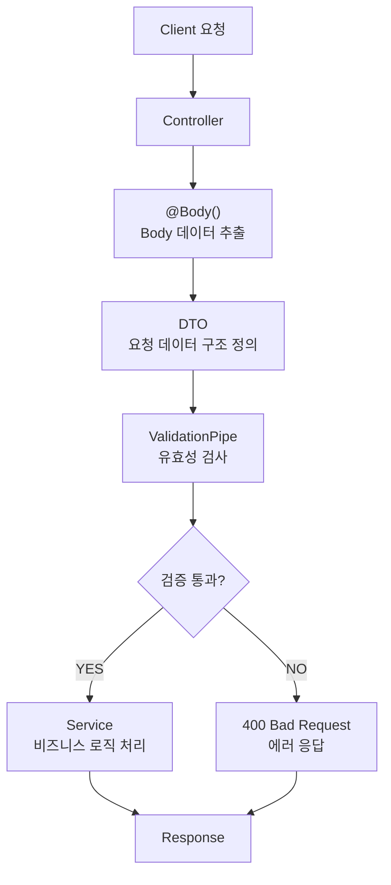

---
aliases:
  - class-validator
  - DTO
  - ValidationPipe
tags:
  - NestJS
related:
  - "[[00_NestJS_Ecosystem_HomePage]]"
  - "[[NestJS_Swagger]]"
  - "[[NextJS_API_Client]]"
  - "[[NextJS_API_Mapper]]"
  - "[[TS_PartialUpdate]]"
---
# NestJS_DTO — DTO & 유효성 검사

> [!info] 
> DTO(Data Transfer Object)는 요청 Body의 구조를 클래스로 정의하고 class-validator로 유효성을 검사하는 것이다. 
> 설치 → ValidationPipe 등록 → 폴더 구조 결정 → DTO 작성 → Controller에서 사용 순서로 진행한다.

---

# 설치 ⭐️

```bash
# 모노레포 — 항상 루트에서 --filter 패키지명
pnpm add class-validator class-transformer --filter api

# 단일 프로젝트(모노레포 아님)라면
pnpm add class-validator class-transformer
```

```txt
모노레포에서 apps/api 안으로 cd 해서 설치하면 안 되는 이유는
[[NestJS_Prisma]] 의 "모노레포라면 순서 자체가 다름" 과 완전히 동일함 (package.json 덮어쓰기 / 중복 lockfile 위험)
```

---

# ValidationPipe 전역 등록 ⭐️

```typescript
// main.ts
app.useGlobalPipes(
  new ValidationPipe({ whitelist: true, forbidNonWhitelisted: true, transform: true }),
);
```

```txt
등록 안 하면 @IsNotEmpty() 같은 데코레이터가 동작 안 함 — main.ts 에 반드시 등록
whitelist/forbidNonWhitelisted/transform 각 옵션의 역할과 보안 시나리오(필드 주입 방지 등)는
[[NestJS_Controller]] 의 "main.ts — ValidationPipe 옵션 (실전 표준 3종)" 에서 이미 다룸 — 여기서는 등록 위치만 재확인
```

---

# DTO 란 ⭐️

```txt
@Body() body: any 로 받으면: 어떤 데이터가 들어오는지 타입 불명확, 필드가 많아지면 복잡해짐
DTO 로 해결: 요청 Body 구조를 클래스로 명확히 정의 + class-validator 데코레이터로 검사 + 타입 안전성
```



---

# DTO 폴더 구조 ⭐️

```txt
모듈별로 자기 dto/ 폴더 안에 둠 (기본):
  src/movie/dto/create-movie.dto.ts
  src/movie/dto/update-movie.dto.ts

여러 모듈에서 똑같이 재사용하는 DTO 는 공통 위치로 (나중에):
  apps/api/src/common/dto/
    pagination.dto.ts   ← 예: 페이지네이션 쿼리(page, take 등)는 거의 모든 모듈에서 씀
```

```txt
판단 기준:
  그 모듈 안에서만 쓰는 DTO        → 그 모듈의 dto/ 폴더
  2개 이상 모듈에서 내용이 동일하게 반복됨 → common/dto/ 로 옮김
  처음부터 모든 DTO 를 common 에 만들 필요는 없음 — 정말 중복되는 게 보이는 시점에 옮기는 게 자연스러움
```

---

# DTO 설계 원칙 — Prisma 모델을 그대로 베끼지 않는다 ⭐️⭐️⭐️

```txt
흔한 오해: "DB 테이블(schema.prisma)에 있는 컬럼이니까 DTO 에도 다 넣어야지"
→ 틀림. Create DTO 는 "이 요청을 할 때 클라이언트가 실제로 보내야 하는 값" 만 담음
  schema.prisma 의 컬럼 수와 Create DTO 의 필드 수가 같아야 할 이유는 없음
```

```typescript
// schema.prisma
model Post {
  id        Int      @id @default(autoincrement())
  title     String
  content   String
  hidden    Boolean  @default(false)
  createdAt DateTime @default(now())
  updatedAt DateTime @updatedAt
}
```

```typescript
// CreatePostDto — title, content 만 받음 (나머지 4개 컬럼은 일부러 안 넣음)
export class CreatePostDto {
  @IsNotEmpty()
  @IsString()
  title: string;

  @IsNotEmpty()
  @IsString()
  content: string;
}
```

## 어떤 필드를 빼는가, 그리고 왜 ⭐️⭐️

|필드|왜 클라이언트가 안 보내는가|실제 값은 어디서 오는가|
|---|---|---|
|`id`|아직 생성되기 전이라 존재하지 않는 값 — DB 가 만들어줌|`@default(autoincrement())`/`uuid()`|
|`hidden`|작성 시점에 사용자가 정할 값이 아니라 서비스 정책으로 정해지는 기본 상태값|`@default(false)` 또는 서버 로직|
|`createdAt`|"작성 시각" 은 서버 시계 기준이어야 정확함|`@default(now())`|
|`updatedAt`|"수정 시각" 도 그 순간에 서버가 직접 기록해야 함|`@updatedAt` (자동 갱신)|

```txt
공통 원칙 — "이 값이 누구의 책임인가" 를 먼저 따짐:
  사용자가 직접 입력하는 내용(제목, 본문 등)        → 사용자 책임 → DTO 에 포함
  시스템이 결정/생성하는 값(id, 생성시각, 기본 상태값) → 서버/DB 책임 → DTO 에서 제외
  → "작성 폼에 그 입력칸이 있는가?" 로 바꿔 생각하면 쉬움
```

```txt
createdAt / updatedAt 을 클라이언트가 보내게 두면 안 되는 이유:
  ① 보낼 이유 자체가 없음 — 서버가 요청을 받는 그 순간이 곧 "생성된 시점"
  ② 조작 방지 — 과거/미래 날짜를 직접 써서 "오래된 글처럼" 또는 "정렬 순서 조작" 이 가능해짐
  ③ Prisma 가 이미 자동으로 처리(@default(now()) / @updatedAt) — 애초에 관여할 이유가 없음

id / hidden 도 같은 논리:
  id     아직 안 생긴 값을 클라이언트가 미리 정해서 보낼 이유가 없음 (DB 가 책임)
  hidden 작성자가 마음대로 정하게 하면 정책을 우회할 수 있음(검수 전 게시물을 hidden:false 로 보내는 등)
```

## DTO 에서 빼는 것만으로 충분한가 — whitelist: true 와의 관계 ⭐️⭐️

```txt
DTO 클래스에 createdAt 을 안 적었다고 해서 "클라이언트가 body 에 createdAt 을 직접 끼워 보내는 것" 자체가
막히는 건 아님 (DTO 에 선언을 안 한 것뿐 — HTTP 요청 자체는 여전히 그 값을 포함해서 올 수 있음)
→ 실제로 그 값을 "걸러내는" 역할은 ValidationPipe 의 whitelist: true 가 함
```

```txt
whitelist: true               → DTO 에 정의 안 된 필드(createdAt 포함)는 응답 처리 전에 자동 제거됨
forbidNonWhitelisted: true     → 한 술 더 떠서, 그런 필드가 있으면 그 자리에서 400 에러로 거부

→ DTO 설계(어떤 필드를 클래스에 넣을지) + ValidationPipe 설정(그 외 필드를 실제로 차단)
  이 둘이 항상 세트로 동작해야 "설계한 대로 안전하게" 막힘
```

## 안 넣은 필드는 주석으로 남기는 관례 ⭐️

```typescript
/**
 * 안 넣음: id · hidden · createdAt
 * → forbidNonWhitelisted 가 켜져 있어 body 에 섞여 와도 400으로 차단됨
 */
export class CreatePostDto {
  @IsNotEmpty() @IsString() title: string;
  @IsNotEmpty() @IsString() content: string;
}
```

```txt
"왜 이 필드가 없는지" 를 코드에 남겨두면, 나중에 다른 사람(또는 미래의 나)이
"이거 빠뜨린 거 아닌가?" 하고 다시 추가하는 실수를 막을 수 있음
→ 단순히 안 적은 것과, "의도적으로 제외했다" 는 걸 명시한 것은 유지보수 관점에서 차이가 큼
```

---

# DTO 작성 ⭐️

```typescript
// src/movie/dto/create-movie.dto.ts
import { IsNotEmpty, IsString, IsEnum } from 'class-validator';

export class CreateMovieDto {
  @IsNotEmpty()
  @IsString()
  title: string;

  @IsNotEmpty()
  @IsEnum(MovieGenre)
  genre: MovieGenre;
}
```

```typescript
// 컨트롤러에서 사용
@Post()
postMovies(@Body() body: CreateMovieDto) {
  return this.movieService.createMovie(body);
}

@Patch(':id')
updateMovie(
  @Param('id', ParseIntPipe) id: number,
  @Body() body: UpdateMovieDto,
) {
  return this.movieService.updateMovie(id, body);
}
```

---

# Mapped Types — UpdateDto 간단하게 ⭐️

```typescript
import { PartialType, OmitType, PickType, IntersectionType } from '@nestjs/mapped-types';

// PartialType — 모든 필드를 optional 로
export class UpdateMovieDto extends PartialType(CreateMovieDto) {}
// → title?: string / genre?: MovieGenre 자동 생성, @IsOptional() 도 자동 적용

// OmitType — 특정 필드 제외
export class UpdateMovieDto extends OmitType(CreateMovieDto, ['genre'] as const) {}

// PickType — 특정 필드만 선택
export class LoginDto extends PickType(CreateMovieDto, ['title'] as const) {}

// IntersectionType — 두 DTO 합치기
export class FullMovieDto extends IntersectionType(CreateMovieDto, AdditionalDto) {}
```

```txt
PartialType 장점: CreateMovieDto 필드 추가 → UpdateMovieDto 자동 반영, @IsOptional() 직접 안 써도 됨
❌ 직접 쓰면: 모든 필드에 @IsOptional() 다시 선언해야 하고, CreateMovieDto 변경 시 수동 수정 필요
```

## ⚠️ PATCH 에서 @IsOptional() 없으면 에러 ⭐️

```txt
문제: title?: string 만 있고 @IsOptional() 없을 때
  PATCH { "genre": "코미디" } ← title 없이 요청
  title 이 undefined 인데 @IsNotEmpty() 검사가 실행됨 → "title should not be empty" 400 에러

원인: title?: string 은 TS 에서만 선택적 — class-validator 는 undefined 필드도 검사함
해결: @IsOptional() 추가 → 값 없으면 검사 자체를 건너뜀, 값 있을 때만 나머지 검사 실행
```

```typescript
// ✅ @IsOptional() 세트로
export class UpdateMovieDto {
  @IsOptional()   // 없으면 아래 검사 건너뜀
  @IsNotEmpty()   // 있으면 빈 값 체크 ('' 방지)
  @IsString()
  title?: string;
}
```

---

# class-validator 데코레이터 상세 ⭐️

## 필수 / 선택

```typescript
@IsNotEmpty()   // 빈 값 불가 (null / undefined / '' 불가)
@IsOptional()   // 없어도 되지만 있으면 검사 적용
@IsDefined()    // undefined 불가 (null 은 허용)
```

## 타입

```typescript
@IsString()
@IsNumber()
@IsInt()        // 정수만 (소수 불가)
@IsBoolean()
@IsArray()
@IsDate()
@IsEnum(MovieGenre)
```

## 숫자 범위

```typescript
@Min(1)         // 1 이상
@Max(100)       // 100 이하
@IsPositive()   // 양수 (0.1 이상)
@IsNegative()   // 음수 (-0.1 이하)
@IsDivisibleBy(5)   // 5의 배수 (5, 10, 15...)
```

## 문자열

```typescript
@MinLength(4)      // 최소 4자
@MaxLength(16)     // 최대 16자
@IsEmail()
@IsUrl()           // 옵션 상세는 바로 아래 참고
@IsUUID()
@Contains('test')  // 'test' 포함
@IsAlphanumeric()  // 영문 + 숫자만
@IsHexColor()      // #fff, #ffffff

// 위치 관련
@IsLatLong()       // "37.5665,126.9780" — 위도,경도 합친 문자열
@IsLatitude()      // 위도만 (-90 ~ 90)
@IsLongitude()     // 경도만 (-180 ~ 180)
```

## @IsUrl — 옵션으로 더 엄격하게 ⭐️⭐️

```typescript
@IsString()
@IsUrl({ require_protocol: true, protocols: ['http', 'https'] })
@IsNotEmpty()
embedUrl: string;
```

|옵션|기본값|역할|
|---|---|---|
|`protocols`|`['http','https','ftp']`|허용할 프로토콜 목록 — `ftp` 등 원치 않는 값 빼고 좁히고 싶을 때 지정|
|`require_protocol`|`false`|`true` 면 `https://` 없이 `example.com` 만 오면 거부 — 임베드 URL 등 "완전한 주소" 가 필요할 때|
|`require_tld`|`true`|최상위 도메인(`.com` 등) 필수 — `http://localhost` 같은 내부 주소를 막는 원인이 되기도 함|
|`require_host`|`true`|호스트 부분 필수|

```txt
옵션 없이 @IsUrl() 만 쓰면: 기본값(require_tld:true 등)이 그대로 적용됨
  → 로컬 개발 중 http://localhost:3000 같은 값을 검증해야 한다면 require_tld: false 도 같이 고려

⚠️ require_protocol: true 인데 위반하면, 에러 메시지가 "어떤 옵션을 어겼는지" 까지는 안 알려주고
   그냥 "올바른 URL 형식이 아닙니다" 식으로만 나옴 — 커스텀 메시지를 직접 넣어두는 걸 권장:
   @IsUrl({ require_protocol: true }, { message: 'http(s):// 를 포함한 전체 주소를 입력해주세요.' })
   @IsUrl(
    { require_protocol: true, require_tld: false, protocols: ['http', 'https'] },
    { message: 'http(s):// 를 포함한 전체 주소를 입력해주세요.' }
  )
```

## @Matches — 정규식 검증 ⭐️

```typescript
import { Matches } from 'class-validator';

// 닉네임: 한글·영문·숫자·밑줄만 허용
@Matches(/^[가-힣a-zA-Z0-9_]+$/, {
  message: '닉네임은 한글·영문·숫자·밑줄만 사용할 수 있습니다.',
})
nickname: string;

// 비밀번호: 영문+숫자+특수문자 포함
@Matches(/^(?=.*[A-Za-z])(?=.*\d)(?=.*[@$!%*#?&])/, {
  message: '비밀번호는 영문, 숫자, 특수문자를 포함해야 합니다.',
})
password: string;

// 전화번호: 000-0000-0000 형식
@Matches(/^\d{3}-\d{3,4}-\d{4}$/, {
  message: '전화번호 형식이 올바르지 않습니다. (예: 010-1234-5678)',
})
phone: string;

// URL 슬러그: 소문자·숫자·하이픈만
@Matches(/^[a-z0-9-]+$/, {
  message: '슬러그는 소문자, 숫자, 하이픈만 사용할 수 있습니다.',
})
slug: string;
```

```txt
@Matches(regex, options): 첫 번째 인자 정규식 / 두 번째 인자 { message: '에러 메시지' }
@IsAlphanumeric() 으로 안 되는 경우(한글 포함, 특정 문자만 허용, 복잡한 패턴) → @Matches 로 직접 작성
@IsEmail() / @IsUrl() 내부도 정규식 기반 — 세밀한 제어가 필요할 때 @Matches 사용
```

## 허용 값을 별도 상수 파일로 분리하기 — 단일 소스 패턴 ⭐️⭐️⭐️

```txt
@IsIn 에 넘기는 배열을 DTO 파일 안에 직접 적으면, 같은 값 목록을 다른 곳(다른 DTO, 서비스 로직 등)에서
또 써야 할 때 매번 다시 타이핑하게 됨 — 허용값 자체를 별도 상수 파일로 분리해서 "한 곳"에서만 관리
```

```typescript
// src/posts/constants/tags.ts
/** 허용 태그 목록 — DTO @IsIn · DB tags[] 와 동일 문자열로 유지(단일 소스) */
export const TAGS = [
  'A', 'B', 'C', 'D', 'E',
] as const;

export type Tag = (typeof TAGS)[number];

export const MIN_TAGS = 1;
export const MAX_TAGS = 3;

/** class-validator @IsIn 용 — readonly string[] 로 명시해서 "검증용 export" 라는 의도를 드러냄 */
export const TAG_VALUES: readonly string[] = TAGS;
```

```typescript
// src/posts/dto/create-post.dto.ts
import { ArrayMaxSize, ArrayMinSize, IsArray, IsIn } from 'class-validator';
import { MAX_TAGS, MIN_TAGS, TAG_VALUES } from '../constants/tags';

export class CreatePostDto {
  /** 태그 1~3개 — TAGS 단일 소스 */
  @IsArray()
  @ArrayMinSize(MIN_TAGS)
  @ArrayMaxSize(MAX_TAGS)
  @IsIn(TAG_VALUES, { each: true })
  tags: string[];
}
```

|조각|역할|
|---|---|
|`as const` 배열|허용값을 한 곳에 모음 — 리터럴 유니온 타입도 같이 추출 가능|
|`(typeof TAGS)[number]`|배열 값으로부터 유니온 타입 자동 생성 (<code>'A'\|'B'\|...</code>) — [[TS_Type_Guards]] 참고|
|`MIN_/MAX_` 상수|개수 제한도 같은 파일에 — `@ArrayMinSize`/`@ArrayMaxSize` 에서 재사용|
|`TAG_VALUES: readonly string[]`|`@IsIn` 전달용으로 명시적으로 분리 — "검증에 쓰는 값" 이라는 의도를 이름으로 드러냄|
|`@IsIn(TAG_VALUES, { each: true })`|배열의 각 요소가 허용 목록 안에 있는지 검사 (`each: true` 없으면 배열 전체를 통째로 검사해서 항상 실패)|

```txt
Prisma 쪽은 그대로 String[] 로 둔다(DB enum 안 만듦):
  model Post { tags String[] }
  → 허용값 제약은 DB 가 아니라 애플리케이션(DTO) 레벨에서만 검증
  → 값 목록이 자주 바뀔 수 있는 경우, DB enum 마이그레이션 없이 상수 파일만 고치면 되는 게 장점
  → 대신 "DB 가 직접 보장하는 제약" 은 아니라서, 이 상수 파일을 거치지 않는 경로(직접 SQL 등)는 못 막음

이 단일 소스 파일이 가리키는 곳이 한 군데 더 있다는 것도 주석으로 남겨두면 좋음:
  /** ... DB tags[] 와 동일 문자열(단일 소스) */ 처럼, "이 목록이 스키마와 맞아야 한다" 는 걸 명시
```

```txt
@IsEnum vs @IsIn:
  @IsEnum(Enum)  TypeScript enum 검증
  @IsIn(arr)     const 배열 검증 → 더 가볍고, 위처럼 별도 상수 파일로 분리하기도 쉬움
```

## 배열

```typescript
@IsArray()
@ArrayNotEmpty()      // 빈 배열 불가
@ArrayMinSize(1)      // 최소 N개
@ArrayMaxSize(10)     // 최대 N개
@ArrayUnique()        // 중복 불가
```

## 배열 요소 각각 검사 — each: true ⭐️

```typescript
@IsArray()
@ArrayNotEmpty()
@IsNumber({}, { each: true })
//             ↑ 배열 요소 각각에 @IsNumber 검사
genreIds: number[];

@IsArray()
@IsString({ each: true })
tags: string[];

@IsArray()
@IsEnum(MovieGenre, { each: true })
genres: MovieGenre[];
```

```txt
each: true 없으면: 배열 자체를 숫자로 검사 → 항상 실패
each: true 있으면: [1, 2, 3] 각 요소가 숫자인지 검사, [1, '2', 3] → '2' 숫자 아님 → 실패
```

## @ValidateNested — 중첩된 DTO/배열도 검증하기 ⭐️⭐️⭐️⭐️

```typescript
class AddressDto {
  @IsNotEmpty()
  @IsString()
  city: string;
}

class CreateUserDto {
  @IsNotEmpty()
  @IsString()
  name: string;

  @ValidateNested()
  @Type(() => AddressDto)
  address: AddressDto;
}
```

```txt
@ValidateNested() 없이 그냥 address: AddressDto 라고만 적으면:
  class-validator는 address 필드가 "있다/없다" 정도만 보고, 그 안의 city가
  실제로 @IsNotEmpty()/@IsString() 규칙을 지키는지는 전혀 검사하지 않음
  (중첩된 객체 내부까지 자동으로 검증이 타고 들어가는 게 기본 동작이 아님)

@ValidateNested()를 붙이면:
  "이 필드도 또 다른 class-validator 검증 대상이다" — AddressDto 자체의 데코레이터들을
  재귀적으로 한 번 더 실행함

@Type(() => AddressDto)가 항상 같이 필요한 이유:
  HTTP 요청은 JSON으로 오므로, address는 처음엔 그냥 "평범한 객체"일 뿐 AddressDto의
  진짜 인스턴스가 아님 — class-validator의 데코레이터들은 실제 클래스 인스턴스에서만
  제대로 동작하므로, @Type()으로 먼저 "이 평범한 객체를 AddressDto 인스턴스로 변환해라"고
  class-transformer에게 알려줘야 함
  → @ValidateNested()와 @Type()은 거의 항상 한 쌍으로 같이 씀(하나만 쓰면 제대로 동작 안 함)
```


```typescript
// 배열 형태의 중첩 DTO — each: true를 여기서도 똑같이 씀
class CreatePostDto {
  @ValidateNested({ each: true })
  @Type(() => TagDto)
  tags: TagDto[];
}
```

```txt
배열 안의 "각 요소"가 또 다른 DTO일 때는 ValidateNested에도 { each: true }를 줌 —
배열 전체가 아니라 tags 배열의 각 TagDto 요소마다 재귀적으로 검증을 적용한다는 뜻
(바로 위 each: true와 같은 발상 — 대상이 단순 값이 아니라 중첩 DTO일 뿐)
```

### 검증 실패 시 에러가 나오는 자리 — error.children ⭐️⭐️⭐️⭐️


```txt
address.city가 비어있는 채로 요청이 오면:
  CreateUserDto 자체의 error.constraints에는 아무것도 안 남음 (name 등 자기 필드는 문제없으니까)
  대신 address 필드에 대한 ValidationError 하나가 생기고, 그 안의 .children 안에
  city에 대한 실제 에러(.constraints.isNotEmpty 등)가 들어있음

→ 이게 바로 위 "exceptionFactory" 섹션에서 error.children을 재귀로 타야 했던 이유의
  실제 메커니즘 — @ValidateNested()를 쓰는 순간부터 에러가 한 단계 더 깊은 곳에 생기기 때문
  (프론트에서 부분 수정 객체를 만들 때의 null/undefined 구분과는 다른 주제지만,
   "값이 어디 들어있는지 정확히 추적해야 한다"는 점은 [[TS_PartialUpdate]]와 결이 비슷함)
```


## @IsDate vs @IsDateString ⭐️

```typescript
// @IsDateString — ISO 8601 문자열 형식
@IsDateString()
dob: string;
// "2000-01-01" → ✅ / "2000-01-01T00:00:00.000Z" → ❌

// @IsDate + @Type — Date 객체로 변환 후 검사 (권장)
@Type(() => Date)   // 문자열 → Date 객체 자동 변환
@IsDate()
dob: Date;
// "2000-01-01T00:00:00.000Z" → Date 변환 → ✅
```

```txt
HTTP 요청은 항상 문자열로 들어옴, @IsDate() 는 Date 객체를 기대함 → @Type(() => Date) 로 먼저 변환 필요
```

## Query Parameter 배열 파싱 문제 ⭐️

```txt
?order=id_ASC          → string (1개)
?order=id_ASC&order=id_DESC → string[] (여러 개)
DTO 에 string[] 로 선언해도 값 1개면 string 으로 옴 → @IsArray() 검사 실패
```

```typescript
// ✅ @Transform 으로 단일 문자열을 배열로 변환
@IsOptional()
@IsArray()
@IsString({ each: true })
@Transform(({ value }) =>
  value === undefined ? ['id_DESC'] : Array.isArray(value) ? value : [value],
)
order: string[] = ['id_DESC'];
```

---

# class-transformer — 응답 직렬화 ⭐️

```bash
pnpm add class-transformer --filter api
```

```typescript
// main.ts — ClassSerializerInterceptor 전역 등록
import { ClassSerializerInterceptor } from '@nestjs/common';
import { Reflector } from '@nestjs/core';

app.useGlobalInterceptors(new ClassSerializerInterceptor(app.get(Reflector)));
```

## @Exclude — 응답에서 필드 제외 ⭐️

```typescript
import { Exclude } from 'class-transformer';

export class UserEntity {
  id:    number;
  email: string;

  @Exclude()
  password: string;   // 응답에서 자동 제거
}
```

## @Expose — 특정 필드만 노출

```typescript
import { Expose } from 'class-transformer';

export class UserEntity {
  @Expose()
  id: number;

  @Expose()
  email: string;

  password: string;   // @Expose 없으면 제거
}
```

## @Transform — 값 변환 ⭐️

```typescript
import { Transform } from 'class-transformer';

export class MovieEntity {
  @Transform(({ value }) => value.toUpperCase())
  title: string;

  @Transform(({ value }) => (value ? '있음' : '없음'))
  hasDetail: boolean;
}
```

### @Transform 상세 — 요청 데이터 가공 ⭐️

```typescript
// 문자열 → 숫자 변환
@Transform(({ value }) => Number(value))
@IsNumber()
price: number;

// 문자열 → 불리언 변환
@Transform(({ value }) => value === 'true' || value === true)
@IsBoolean()
isPublished: boolean;

// 문자열 트림
@Transform(({ value }) => value?.trim())
@IsString()
title: string;

// 기본값 처리
@Transform(({ value }) => value ?? 'unknown')
@IsString()
category: string;
```

```txt
({ value }) 구조: value(현재 필드 값) / key(필드 이름) / obj(DTO 인스턴스 전체) / type(변환 타입)

obj 로 다른 필드 참조:
  @Transform(({ value, obj }) => obj.isAdmin ? value.toUpperCase() : value)
  title: string;

실행 순서: @Transform 이 먼저 실행된 후 @IsString() 등 검증 실행 — 변환 후 검증하는 구조
```

```txt
@Exclude   응답에서 그 필드를 아예 제거 (password 등 민감 정보)
@Expose    excludeExtraneousValues 옵션 시 이 필드만 노출
@Transform 값을 원하는 형태로 가공해서 반환
ClassSerializerInterceptor 가 등록되어 있어야 동작
```

---

# @ValidatorConstraint — 커스텀 Validator ⭐️

```txt
class-validator 기본 데코레이터로 표현 못 하는 복잡한 검증 규칙을 직접 데코레이터로 만들어서 사용
```

## 동기 — 기본 값 검증

```typescript
import {
  ValidatorConstraint,
  ValidatorConstraintInterface,
  registerDecorator,
} from 'class-validator';

@ValidatorConstraint()
class PasswordValidator implements ValidatorConstraintInterface {
  validate(value: any): boolean {
    return value.length > 4 && value.length < 8;
  }
  defaultMessage(): string {
    return '비밀번호는 4자 이상 8자 이하로 입력해주세요.';
  }
}

function IsPasswordValid(validationOptions?: any) {
  return function (object: Object, propertyName: string) {
    registerDecorator({
      target: object.constructor,
      propertyName,
      options: validationOptions,
      validator: PasswordValidator,
    });
  };
}

export class CreateUserDto {
  @IsPasswordValid()
  password: string;
}
```

## 비동기 — DB 조회 등 ⭐️

```typescript
// { async: true } → validate() 에서 Promise 반환 가능
@ValidatorConstraint({ async: true })
class IsEmailUniqueConstraint implements ValidatorConstraintInterface {
  constructor(private readonly userRepository: UserRepository) {}

  async validate(email: string): Promise<boolean> {
    const user = await this.userRepository.findOne({ where: { email } });
    return !user;
  }
  defaultMessage(): string {
    return '이미 사용 중인 이메일입니다.';
  }
}

function IsEmailUnique(validationOptions?: any) {
  return function (object: Object, propertyName: string) {
    registerDecorator({
      target: object.constructor,
      propertyName,
      options: validationOptions,
      validator: IsEmailUniqueConstraint,
    });
  };
}

export class CreateUserDto {
  @IsEmailUnique()
  @IsEmail()
  email: string;
}
```

```txt
@ValidatorConstraint({ async: true }): validate() 에서 async/Promise<boolean> 반환 가능 (DB 조회 등)
  비동기 Validator 를 NestJS DI 와 연결하려면
  main.ts 에 useContainer(app.select(AppModule), { fallbackOnErrors: true }) 추가 필요

name 옵션: @ValidatorConstraint({ name: '...', async: false }) — 에러/디버깅 시 식별용, 생략하면 클래스명 사용

동기 vs 비동기: 동기는 값 자체 검증(길이/형식/범위), 비동기는 외부 데이터 참조 필요(DB 중복 확인 등)
```

### ValidationArguments — 다른 필드 참조 ⭐️

```typescript
@ValidatorConstraint()
class IsPasswordMatchConstraint implements ValidatorConstraintInterface {
  validate(confirmPassword: string, args: ValidationArguments): boolean {
    const [relatedPropertyName] = args.constraints;
    const relatedValue = (args.object as any)[relatedPropertyName];
    return confirmPassword === relatedValue;
  }
  defaultMessage(): string {
    return '비밀번호가 일치하지 않습니다.';
  }
}

function IsPasswordMatch(property: string, validationOptions?: any) {
  return function (object: Object, propertyName: string) {
    registerDecorator({
      target: object.constructor,
      propertyName,
      options: validationOptions,
      constraints: [property],
      validator: IsPasswordMatchConstraint,
    });
  };
}

export class CreateUserDto {
  @IsString()
  password: string;

  @IsPasswordMatch('password')
  confirmPassword: string;
}
```

```txt
ValidationArguments: value(현재 필드 값) / object(DTO 인스턴스 전체) / constraints(registerDecorator 에서 전달한 값) / property(현재 필드명)
언제 쓰나: 두 필드 비교(비밀번호 확인), 다른 필드 값에 따라 검증 규칙이 달라질 때
```

---

# Swagger — DTO 기반 API 문서 자동화 ⭐️

```txt
@nestjs/swagger 는 작성한 DTO 클래스를 그대로 활용해서 API 문서를 자동으로 만들어줌
→ class-validator 데코레이터를 단 같은 DTO 에, Swagger 용 데코레이터를 추가로 얹는 구조
(전체 설정/옵션은 [[NestJS_Swagger]] 참고 — 여기서는 DTO 와 맞물리는 부분만)
```

```txt
⚠️ 새 DTO(또는 새 Controller) 파일을 만든 직후엔 Swagger 문서에 안 보일 수 있음
   SwaggerModule.createDocument(app, config) 는 main.ts 부팅 시점에 "한 번" 스캔해서 문서를 만듦
   → --watch 가 기존 파일의 "수정"은 바로 반영해도, 새로 추가된 파일은 못 잡는 경우가 있음
   → start:dev 를 완전히 재시작하면 부팅이 다시 일어나면서 새 DTO/Controller 까지 다시 스캔됨
```

```bash
# 모노레포일때 다른 설치 방법은 [[NestJS_Swagger]]
pnpm add @nestjs/swagger --filter api 
```

```typescript
// swagger.ts
import { INestApplication } from '@nestjs/common';
import { DocumentBuilder, SwaggerModule } from '@nestjs/swagger';

export function setupSwagger(app: INestApplication) {
  const config = new DocumentBuilder()
    .setTitle('My API')
    .setDescription('My API description')
    .setVersion('0.0.1')
    .addBearerAuth()
    .build();

  const document = SwaggerModule.createDocument(app, config);
  SwaggerModule.setup('api', app, document);
}
```

```typescript
// main.ts
import { setupSwagger } from './swagger';

async function bootstrap() {
  const app = await NestFactory.create(AppModule);
  app.useGlobalPipes(new ValidationPipe({ transform: true, whitelist: true, forbidNonWhitelisted: true }));
  setupSwagger(app);
  await app.listen(process.env.PORT ?? 3000);
}
bootstrap();
```

## @ApiProperty — DTO 필드 문서화

```typescript
import { ApiProperty } from '@nestjs/swagger';

export class CreateMovieDto {
  @ApiProperty({ description: '영화 제목', example: '인터스텔라' })
  @IsNotEmpty()
  @IsString()
  title: string;
}
```

```txt
같은 필드 위에 class-validator(@IsString 등)와 Swagger(@ApiProperty)가 같이 붙는 구조
  class-validator → 실제 검증(런타임에 막아주는 역할) / @ApiProperty → 문서화 — 둘은 역할이 다름
```

## CLI 플러그인으로 자동화

```json
// nest-cli.json
"plugins": [
  {
    "name": "@nestjs/swagger",
    "options": {
      "classValidatorShim": true,
      "introspectComments": true
    }
  }
]
```

```txt
introspectComments: true 면 필드 위 JSDoc 주석(/** ... */, @example)이 description/example 으로 자동 반영
→ 옵션별 전체 설명과 dtoFileNameSuffix 등 나머지 옵션은 [[NestJS_Swagger]] 참고
```

## 프론트엔드 타입 자동 생성과 연결 ⭐️

```txt
Swagger 를 켜두면 OpenAPI 스펙(JSON)을 그대로 받을 수 있음 (예: http://localhost:3000/api-json)
이 JSON 으로 프론트엔드 타입을 자동 생성할 수 있음:
  npx openapi-typescript http://localhost:3000/api-json -o web/lib/types/api.d.ts

→ DTO 가 바뀌면 이 명령을 다시 돌리는 것만으로 프론트 타입도 같이 갱신됨
→ 관련 내용은 [[NextJS_API_Client]] 참고
  (소규모에서는 직접 타입을 작성해도 충분 — DTO 가 많아지고 자주 바뀌는 시점부터 자동화가 유리)
```

---

# 커스텀 에러 메시지 ⭐️

```typescript
@IsNotEmpty({ message: '이름을 입력해주세요!' })
name: string;

@IsEmail({}, { message: '정확한 이메일 주소를 입력해주세요!' })
email: string;

@Min(1, { message: '1 이상이어야 합니다' })
age: number;
```

```txt
message 를 안 주면 class-validator 의 기본 메시지가 그대로 나가는데, 이건 영어임
  (예: "email must be an email", "title should not be empty")
→ 한국어 서비스라면 사실상 항상 message 를 같이 적어야 함 — 안 그러면 사용자에게 영어 에러가 노출됨
```

## 데코레이터마다 매번 적지 않고 전역으로 통일하기 — exceptionFactory ⭐️⭐️⭐️⭐️

```txt
문제: 필드가 많아질수록 데코레이터마다 { message: '...' } 를 일일이 적는 게 반복이 심해짐
      (게다가 하나라도 빠뜨리면 그 필드만 영어 메시지가 섞여 나가는 비일관성도 생김)

해결: 메시지를 데코레이터 단계가 아니라, ValidationPipe 가 최종 에러를 만드는 "한 곳"에서 가공
      → ValidationPipe 의 exceptionFactory 옵션
```

```typescript
// main.ts
app.useGlobalPipes(
  new ValidationPipe({
    whitelist: true,
    forbidNonWhitelisted: true,
    transform: true,
    exceptionFactory: (errors) => {
      const messages = errors.flatMap((error) =>
        Object.values(error.constraints ?? {}),
      );
      return new BadRequestException(messages);
    },
  }),
);
```

```txt
exceptionFactory 가 받는 errors: ValidationError[] — class-validator 가 만든 원본 에러 배열
  각 항목의 모양: { property: 'email', value: '...', constraints: { isEmail: 'email must be an email' } }
  constraints 는 "어떤 검사를 어겼는지(키) → 그 검사의 기본 메시지(값)" 객체

→ 이 함수가 반환하는 값이 그대로 최종 에러 응답이 됨 — 형태를 통째로 새로 만들 수 있음
```

## 실전 — 영어 기본 메시지를 한국어로 일괄 치환 ⭐️⭐️⭐️

```typescript
// common/validation-messages.ts
/** class-validator 의 제약 이름(키) → 한국어 메시지. 데코레이터에 message 를 안 적어도 이 표로 대체됨 */
const KO_MESSAGES: Record<string, string> = {
  isNotEmpty: '필수 입력값입니다.',
  isEmail: '올바른 이메일 형식이 아닙니다.',
  isString: '문자열만 입력 가능합니다.',
  minLength: '글자 수가 너무 적습니다.',
  isInt: '정수만 입력 가능합니다.',
};

export function toKoMessage(constraintKey: string, fallback: string): string {
  return KO_MESSAGES[constraintKey] ?? fallback; // 표에 없는 키는 원래 메시지 그대로 둠
}
```

```typescript
// main.ts
exceptionFactory: (errors) => {
  const messages = errors.flatMap((error) =>
    Object.entries(error.constraints ?? {}).map(([key, msg]) => toKoMessage(key, msg)),
  );
  return new BadRequestException(messages);
},
```

```txt
이렇게 하면 @IsEmail({ message: '...' }) 처럼 데코레이터마다 직접 message 를 안 적어도
"isEmail" 이라는 제약 키 하나만 표에 등록해두면 그 데코레이터를 쓰는 모든 DTO 필드에 자동 적용됨

데코레이터별 message 가 여전히 우선됨:
  @IsEmail({}, { message: '직접 적은 메시지' }) 처럼 명시적으로 적어둔 게 있으면
  그게 이미 error.constraints.isEmail 자리에 들어가 있어서, 위 표는 "명시 안 한 경우의 기본값" 역할만 함
  → 평소엔 표에만 의존하고, 특별히 다르게 보여줘야 하는 필드만 데코레이터에서 직접 override
```

## 다음 단계 — 필드별로 더 세밀하게 + 중첩 DTO까지 ⭐️⭐️⭐️⭐️

```txt
위 1단계(제약 키 하나로만 매핑)의 한계 두 가지:
  ① 같은 제약(isNotEmpty)이라도 필드마다 다른 문구를 주고 싶을 때 대응 못 함
     (title 비었을 때 "제목을 입력해주세요"와 nickname 비었을 때 "닉네임을 입력해주세요"를 구분 못 함)
  ② @ValidateNested() 로 검증하는 중첩 DTO(객체/배열)의 에러는 error.constraints가 아니라
     error.children 안에 들어있음 — 재귀로 안 타면 중첩 필드의 에러를 그냥 통째로 놓침

→ 필드별 우선 매핑(가장 구체적) + 제약별 공통 fallback(차선) + children 재귀, 3단을 갖추면 해결됨
```

```typescript
// common/validation-messages.ts
import type { ValidationError } from 'class-validator';

/** property + constraint 조합 (가장 구체적) */
const FIELD_MESSAGES: Record<string, Partial<Record<string, string>>> = {
  email: { isEmail: '올바른 이메일을 입력해주세요.' },
  password: { minLength: '비밀번호는 8자 이상이어야 합니다.' },
  nickname: { isNotEmpty: '닉네임을 입력해주세요.' },
  title: { isNotEmpty: '제목을 입력해주세요.' },
  content: { isNotEmpty: '내용을 입력해주세요.' },
  tags: {
    arrayMinSize: '태그를 1개 이상 선택해주세요.',
    arrayMaxSize: '태그는 최대 3개까지 선택할 수 있어요.',
    isIn: '허용되지 않은 태그입니다.',
  },
};

/** 필드 공통 fallback — 위 표에 없는 (필드, 제약) 조합은 여기서 한 번 더 시도 */
const CONSTRAINT_MESSAGES: Record<string, string> = {
  isEmail: '올바른 이메일을 입력해주세요.',
  isNotEmpty: '필수 항목입니다.',
  isString: '문자열로 입력해주세요.',
  minLength: '입력 길이가 부족합니다.',
  isArray: '배열 형식이 올바르지 않습니다.',
  arrayMinSize: '선택 개수가 부족합니다.',
  arrayMaxSize: '선택 개수가 초과되었습니다.',
  isIn: '허용되지 않은 값입니다.',
};

function getValidationMessage(property: string, constraint: string): string {
  return (
    FIELD_MESSAGES[property]?.[constraint] ??   // ① 가장 구체적
    CONSTRAINT_MESSAGES[constraint] ??           // ② 제약 단위 차선
    '입력값을 확인해주세요.'                       // ③ 끝까지 없으면 최종 기본 문구
  );
}

function collectValidationMessages(errors: ValidationError[]): string[] {
  const messages: string[] = [];
  for (const error of errors) {
    if (error.constraints) {
      for (const key of Object.keys(error.constraints)) {
        messages.push(getValidationMessage(error.property, key));
      }
    }
    if (error.children?.length) {
      messages.push(...collectValidationMessages(error.children)); // 중첩 DTO 재귀
    }
  }
  return messages;
}

/** ValidationPipe exceptionFactory 에 넘길 message[] */
export function formatValidationErrors(errors: ValidationError[]): string[] {
  return collectValidationMessages(errors);
}
```

```typescript
// main.ts
app.useGlobalPipes(
  new ValidationPipe({
    transform: true,
    whitelist: true,
    forbidNonWhitelisted: true,
    exceptionFactory: (errors) => new BadRequestException(formatValidationErrors(errors)),
  }),
);
```

```txt
조회 우선순위가 3단인 이유:
  ① FIELD_MESSAGES[property][constraint] — "이 필드의 이 에러"에 정확히 맞춘 문구
  ② CONSTRAINT_MESSAGES[constraint]      — ①에 없으면, 어떤 필드든 이 제약이면 쓰는 공통 문구
  ③ 최종 기본 문구                        — 둘 다 없으면(새 데코레이터를 막 추가해서 등록 전인 경우 등) 깨지지 않게

collectValidationMessages가 재귀인 이유:
  error.children은 또 ValidationError[] 모양이라(중첩 DTO 안에 더 깊은 중첩이 있을 수도 있음)
  같은 함수를 그대로 다시 호출해서 몇 단계든 끝까지 타고 들어가게 함

언제 1단계로 충분하고, 언제 이 2단계가 필요한가:
  필드가 적고 중첩 DTO가 없다면        → 1단계(제약 키만)로 충분, 코드도 짧음
  필드가 많아지거나 같은 제약을 필드별로 다르게 보여줘야 하면 → 이 2단계로 넘어가는 게 자연스러움
  @ValidateNested()를 쓰는 DTO가 하나라도 있다면 → children 재귀는 거의 필수(안 그러면 에러가 누락됨)
```

## 진짜 다국어(i18n)가 필요해지면 — 더 큰 작업 ⭐️

```txt
위 방법은 "항상 한국어 하나로만 고정"일 때 충분함
사용자 locale(Accept-Language 헤더 등)에 따라 한국어/영어/일본어를 동적으로 바꿔야 한다면
이건 별도의 i18n 라이브러리(예: nestjs-i18n)와 통합하는 더 큰 작업이 됨
  — 메시지를 키(예: 'validation.IS_EMAIL')로 등록해두고, 요청마다 locale 에 맞는 번역을 찾아 끼워 넣는 구조

지금처럼 "서비스가 한국어 하나만 지원"하는 단계라면 위 exceptionFactory + 매핑 표 정도로 충분 —
실제로 여러 언어를 동시에 지원해야 하는 시점이 오면 그때 i18n 라이브러리 도입을 검토
```

---

# 에러 응답 구조

```json
{
  "statusCode": 400,
  "message": ["title should not be empty", "genre must be a valid enum value"],
  "error": "Bad Request"
}
```

---

# 전체 흐름

```txt
pnpm add class-validator class-transformer --filter api
  ↓
main.ts — ValidationPipe(whitelist 포함) + ClassSerializerInterceptor 전역 등록
  ↓
DTO 폴더 구조 결정 (모듈별 dto/ 또는 common/dto/)
  ↓
DTO 작성 — Prisma 모델 전체가 아니라 "클라이언트가 실제로 보낼 값" 만
  ↓
UpdateDto — PartialType(CreateMovieDto)
  ↓
Controller — @Body() body: CreateMovieDto
  ↓
유효성 검사 실패 → 400 에러 자동 반환 / 통과 → Service 로 전달
```

---

# 한눈에

|목적|도구|
|---|---|
|유효성 검사|`class-validator` 데코레이터|
|DTO 에 안 넣은 필드 실제로 차단|`whitelist: true`(`ValidationPipe`) ⭐️|
|PATCH DTO|`PartialType(CreateDto)`|
|응답에서 password 제거|`@Exclude()`|
|값 변환|`@Transform()`|
|string → Date|`@Type(() => Date)`|
|정규식 패턴 검증|`@Matches(/regex/, { message })` ⭐️|
|URL 형식을 더 엄격하게|`@IsUrl({ require_protocol, protocols })` ⭐️|
|허용 값 목록 검증 (+ 단일 소스 파일)|`@IsIn(VALUES, { each: true })` + `as const` ⭐️|
|배열 요소 각각 검사|`{ each: true }`|
|query 배열 파싱|`@Transform` 단일값 → 배열|
|DB 중복 확인|`@ValidatorConstraint({ async: true })`|
|메시지를 데코레이터마다 안 적고 전역으로 한국어 통일|`ValidationPipe`의 `exceptionFactory` + 제약키→메시지 매핑 (1단계) ⭐️⭐️⭐️|
|필드별로 더 세밀한 메시지 + 중첩 DTO 에러까지 처리|필드+제약 2단 매핑 + `error.children` 재귀 (2단계) ⭐️⭐️⭐️⭐️|
|진짜 다국어(locale별 동적 전환)|별도 i18n 라이브러리(nestjs-i18n 등) — 더 큰 작업|

```txt
DTO 설계 시 가장 먼저 떠올릴 질문 — "이 필드, 누구의 책임인가?"
  사용자 입력 → DTO 에 포함
  서버/DB 가 결정(id, 생성·수정 시각, 기본 상태값) → DTO 에서 제외 + whitelist:true 로 차단 + 주석으로 이유 남기기

허용값이 여러 곳(DTO, 다른 DTO, 서비스 로직)에서 반복되면 → 상수 파일로 분리해서 단일 소스로 관리

에러 메시지: 데코레이터마다 message 적는 건 필드 몇 개일 때만 — 늘어나면 exceptionFactory로 전역 통일
  중첩 DTO(@ValidateNested())가 하나라도 있다면 error.children 재귀 처리는 거의 필수
```