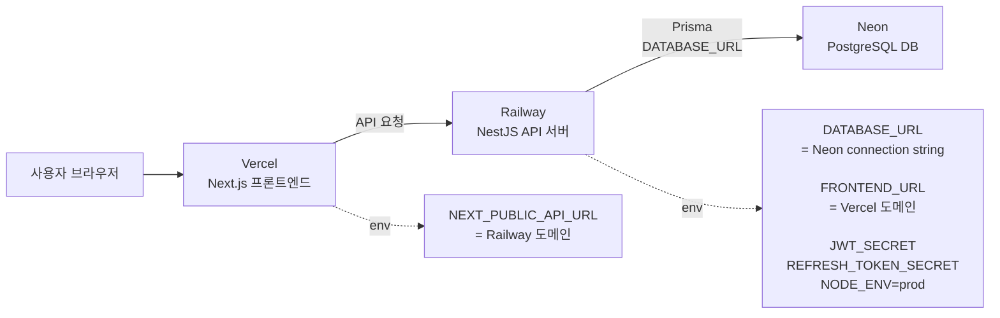
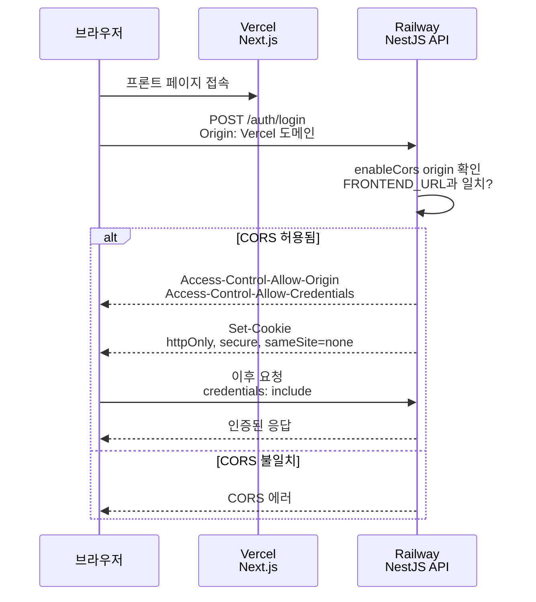

---
aliases:
  - 배포
  - Railway
  - Neon
  - Vercel
  - 서버 배포
tags:
  - NestJS
related:
  - "[[00_NestJS_Ecosystem_HomePage]]"
  - "[[NestJS_Env_Config]]"
  - "[[NestJS_Concept]]"
  - "[[Next_Troubleshooting]]"
---
# NestJS_Deploy — 배포 (Vercel + Railway + Neon)

# 한 줄 요약

|서비스|역할|
|---|---|
|**Vercel**|Next.js 프론트엔드 배포|
|**Railway**|NestJS API 서버 배포|
|**Neon**|PostgreSQL DB (서버리스)|

```
연결 흐름:
  클라이언트 → Vercel(Next.js) → Railway(NestJS) → Neon(PostgreSQL)

  Vercel  의 NEXT_PUBLIC_API_URL  = Railway 도메인
  Railway 의 DATABASE_URL         = Neon connection string
  Railway 의 FRONTEND_URL         = Vercel 도메인 (CORS 허용용)
```

## 전체 배포 구조 




---

---

#  Neon — 서버리스 PostgreSQL ⭐️

```
서버 직접 관리 불필요 / DB URL 하나로 연결 / 무료 플랜 가능 / Prisma 와 잘 맞음
```

```bash
# Neon 대시보드 → Project → Connection string → "Prisma" 용 선택
DATABASE_URL="postgresql://user:pw@ep-xxx.aws.neon.tech/dbname?sslmode=require"
#                                                          ↑ 이미 포함되어 있음
```

```
PrismaService 코드 변경 불필요:
  ?sslmode=require 가 connection string 에 이미 포함되어 있어서
  ssl 옵션을 코드에 따로 추가할 필요 없음 → URL 만 교체하면 끝

환경별로 URL 만 다르게:
  로컬       → .env 의 로컬 PostgreSQL URL
  Railway   → Variables 탭에 Neon URL 등록
  마이그레이션/seed → 터미널에서 그때만 Neon URL 임시 지정 (.env 안 건드림)
```

```bash
# Neon 에 마이그레이션 / seed 만 한 번 실행하고 싶을 때
DATABASE_URL="postgresql://...neon.tech/dbname?sslmode=require" npx prisma migrate deploy
DATABASE_URL="postgresql://...neon.tech/dbname?sslmode=require" npx prisma db seed
```

---

---

# Railway — NestJS API 배포 ⭐️

```
저장소 구조 (모노레포):
  /                  ← 저장소 루트 (railway.toml 위치)
  ├── src/           ← NestJS
  ├── web/           ← Next.js (Railway 대상 아님, Vercel 이 따로 배포)
  └── railway.toml
```

## railway.toml

```toml
[build]
buildCommand = "pnpm build"

[deploy]
startCommand = "pnpm start:prod"
restartPolicyType = "ON_FAILURE"   # 비정상 종료 시만 재시작
```

## package.json 스크립트 ⭐️

```json
{
  "scripts": {
    "build":      "prisma generate && nest build",
    "start:prod": "node dist/src/main"
  }
}
```

|스크립트|왜 이렇게 쓰나|
|---|---|
|`prisma generate && nest build`|Prisma Client 가 Git 에 없으므로(`generated/`) 컴파일 전에 먼저 생성해야 함. 순서 바뀌면 import 에러|
|`node dist/src/main`|`dist/main` 이 아니라 `dist/src/main`인 이유: tsconfig 의 `rootDir`/`outDir` 설정에 따라 `src/` 구조가 `dist/` 안에도 유지되기 때문. `Cannot find module` 에러로 실제 경로를 확인하고 맞추면 됨|

## Railway 대시보드 설정

```
New Project → Deploy from GitHub repo
  → Settings → Root Directory = /        (저장소 루트, NestJS 가 여기 있어서)
  → Variables 탭 → 아래 표의 변수 전부 등록
  → Settings → Domains → Generate Domain (예: artinerary-api.railway.app)
```

## 환경변수

|변수|값 / 주의사항|
|---|---|
|`DATABASE_URL`|Neon connection string|
|`JWT_SECRET` / `REFRESH_TOKEN_SECRET`|시크릿 키|
|`NODE_ENV`|`prod` (프로젝트 `EnvKeys` 기준 — `production` 아님 ⚠️)|
|`FRONTEND_URL`|Vercel 도메인. **끝에 `/` 없이** (`...vercel.app` ✅ / `...vercel.app/` ❌ — 있으면 CORS 불일치)|

```
⚠️ 변수 저장만으로는 반영 안 됨 → Save 후 Deployments → Redeploy 필수
```

---

---

# Vercel — Next.js 배포

```
Settings → General:
  Root Directory   = web        (모노레포에서 Next.js 위치)
  Install Command  = pnpm install

Settings → Environment Variables:
  NEXT_PUBLIC_API_URL = https://artinerary-production.up.railway.app
  (Railway Settings → Domains 에서 발급받은 주소)
```

```
Root Directory 를 web 으로 안 하면:
  NestJS 코드까지 같이 빌드 시도해서 에러 발생

NEXT_PUBLIC_ 접두사:
  브라우저(클라이언트)에서도 접근 가능한 환경변수
  접두사 없으면 서버에서만 접근됨

배포 후 확인:
  Deployments 탭 → Ready(성공) / Building(진행중) / Failed(에러, 로그 확인)
  ⚠️ 반드시 Ready 상태인 배포의 Visit 버튼으로 접속 (Failed 배포 URL 은 옛 버전)
```

---

---

# CORS & 쿠키 — cross-origin 설정 ⭐️

```
Vercel(프론트) 과 Railway(API) 는 서로 다른 도메인 → cross-origin
→ 둘 다 맞춰야 로그인/쿠키가 정상 동작함: ① CORS 허용 ② 쿠키 옵션
```

## ① CORS — main.ts

```typescript
// ❌ 하드코딩 — Git 에 노출 / 환경마다 코드 수정 필요
app.enableCors({
  origin: ['https://artinerary-web.vercel.app'],
  credentials: true,
});

// ✅ 환경변수로 분리
app.enableCors({
  origin: [
    'http://localhost:3000',
    'http://localhost:3001',
    process.env.FRONTEND_URL,
  ].filter(Boolean),   // FRONTEND_URL 없을 때 undefined 제거
  credentials: true,
});
```

## ② 쿠키 옵션 — cross-origin 전송 허용

```typescript
const isProd = process.env[EnvKeys.NODE_ENV] === 'prod';

res.cookie(cookieName, token, {
  httpOnly: true,
  secure:   isProd,                  // HTTPS 일 때만 전송
  sameSite: isProd ? 'none' : 'lax', // 배포(다른 도메인)=none / 로컬(같은 도메인)=lax
  maxAge:   7 * 24 * 60 * 60 * 1000,
  path:     '/',
});
```

```
⚠️ sameSite: 'none' 은 secure: true 가 반드시 같이 있어야 함
  'none' + secure:false  → 브라우저가 쿠키 거부
  'none' + secure:true   → HTTPS 에서 cross-origin 쿠키 정상 전송
```

## CORS 가 실제로 동작하는지 curl 로 먼저 확인 ⭐️

```bash
# 브라우저 열기 전에 터미널에서 Preflight(OPTIONS) 응답부터 확인
curl -X OPTIONS "https://artinerary-production.up.railway.app/auth/login" \
  -H "Origin: https://artinerary-web.vercel.app" \
  -H "Access-Control-Request-Method: POST" \
  -D - -o /dev/null
```

```bash
# ✅ 정상이면 이런 헤더가 보여야 함
access-control-allow-origin: https://artinerary-web.vercel.app
access-control-allow-credentials: true

# ❌ 이 헤더가 안 보이면
#   → main.ts enableCors 확인 / Railway FRONTEND_URL 확인 후 Redeploy
```

## 흐름도 



---

---

#  모바일 Safari — same-site 프록시 패턴 ⭐️

```
CORS 도 맞고 sameSite:'none'+secure:true 까지 다 해도 안 풀리는 경우:
  iOS Safari 의 ITP(서드파티 쿠키 차단) 정책 때문
  → PC 는 정상인데 iPhone Safari 에서만 로그인이 유지 안 되는 패턴

해결 방향:
  브라우저가 Railway 로 "직접" 요청하는 걸 그만두고
  Vercel 의 같은 도메인 안에서만 요청하게 만들기
  → Next.js Route Handler 를 프록시로 세움
```

```
[브라우저] → fetch('/api/nest/...')  (항상 같은 사이트 = Vercel)
    ↓
[Next.js Route Handler — /api/nest/[...path]/route.ts]
    ↓ 진짜 목적지로 대신 요청 전달
[Railway NestJS API]
```

|환경변수|용도|
|---|---|
|`NEXT_PUBLIC_API_URL=/api/nest`|브라우저가 fetch 할 상대경로 (same-site 유지)|
|`API_INTERNAL_URL`|Route Handler·RSC 가 Railway 로 직접 붙는 실제 주소 (비공개)|
|`COOKIE_NAME`|Railway 와 동일하게|

```typescript
// web/app/api/nest/[...path]/route.ts — 구조 요약
export const runtime  = 'nodejs';
export const dynamic  = 'force-dynamic';   // 캐시되면 사용자별 응답이 꼬임

const proxy = async (req: NextRequest, { params }: { params: Promise<{ path: string[] }> }) => {
  const { path } = await params;
  const url = `${UPSTREAM}/${path.join('/')}${req.nextUrl.search}`;

  const upstream = await fetch(url, {
    method:   req.method,
    headers:  /* hop-by-hop 헤더 제거 후 전달 */,
    body:     req.method !== 'GET' ? await req.arrayBuffer() : undefined,
    redirect: 'manual',
    cache:    'no-store',
  });

  return new NextResponse(await upstream.arrayBuffer(), {
    status:  upstream.status,
    headers: /* 응답 헤더 정리 (압축 헤더 제거 필수 ⚠️) */,
  });
};

export const GET = proxy;
export const POST = proxy;   // PUT / PATCH / DELETE 동일
```

```
⚠️ 압축(gzip) 관련 헤더를 그대로 복사 전달하면 iOS Safari 에서 응답 파싱 실패함
   (Node fetch 가 이미 압축을 풀어버렸는데 헤더만 압축됐다고 남아있어서 생기는 불일치)
   → 실제로 겪은 증상·원인 상세: [[Next_Troubleshooting#버그 2 — 마이페이지 목록만 Load failed]]
```

---

---

# 배포 체크리스트 ⭐️

```
☐ Neon      connection string 발급 (sslmode=require 포함 확인)
☐ Railway   GitHub 연결 → Root Directory=/ → 환경변수 4개 등록 → 도메인 발급
☐ Vercel    GitHub 연결 → Root Directory=web → NEXT_PUBLIC_API_URL 등록
☐ CORS      FRONTEND_URL 환경변수 사용(하드코딩 금지) + .filter(Boolean)
☐ 쿠키      sameSite/secure 를 isProd 로 분기
☐ 확인      curl 로 Preflight 응답 헤더 확인 → 그 다음 브라우저 테스트
☐ 모바일    iPhone Safari 실기기로 로그인 유지 확인 (PC 만으론 부족)
```

---

---

# 자주 만나는 에러

|에러|원인|해결|
|---|---|---|
|CORS 차단 (`blocked by CORS`)|Vercel 도메인이 허용 목록에 없음|`FRONTEND_URL` 등록 확인 후 Redeploy|
|쿠키가 요청에 안 실림|`sameSite`/`secure` 미설정|`sameSite:'none' + secure:true` (배포 기준) + 클라이언트 `credentials:'include'`|
|`self signed certificate` (Neon)|SSL 옵션 누락|`DATABASE_URL` 에 `?sslmode=require` 확인|
|`Cannot find module 'dist/main'`|빌드 스크립트 경로 불일치|실제 생성된 경로(`dist/main` vs `dist/src/main`) 확인 후 `start:prod` 수정|

---

---

# 한눈에

```bash
배포 순서:  Neon(DB) → Railway(API) → Vercel(프론트)

Railway 환경변수:  DATABASE_URL / JWT_SECRET / NODE_ENV=prod / FRONTEND_URL(슬래시 없이)
Vercel  환경변수:  NEXT_PUBLIC_API_URL = Railway 도메인

CORS + 쿠키 세트로 항상 같이 맞추기:
  enableCors({ origin: [...].filter(Boolean), credentials: true })
  res.cookie(..., { sameSite: isProd?'none':'lax', secure: isProd })

PC 는 되는데 모바일만 안 되면 → same-site 프록시(/api/nest) 검토
 # → [[Next_Troubleshooting]] 에서 실제 겪은 증상 확인
```