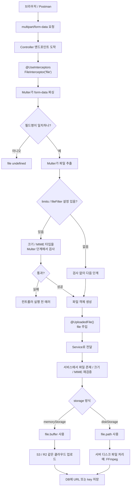

# NestJS_FileUpload — Multer & FileInterceptor

# 한 줄 요약

```bash
브라우저가 파일을 보내는 형식(multipart/form-data) 을
NestJS 컨트롤러가 다룰 수 있는 file 객체로 바꿔주는 것 = Multer

업로드된 파일을 클라우드에 "저장"하는 부분은
# → [[NestJS_FileStorage]] 참고
```

## 흐름도 



---

---

# multipart/form-data 가 뭔가 ⭐️

```txt
일반 JSON 요청:
  Content-Type: application/json
  { "title": "전시" }
  → 텍스트 데이터만 담을 수 있음, 파일은 못 담음

파일 업로드 요청:
  Content-Type: multipart/form-data
  여러 "부분(part)" 으로 나눠서 텍스트 + 파일을 함께 전송 가능
  브라우저의 <input type="file"> 이 자동으로 이 형식으로 전송

NestJS 가 multipart/form-data 를 직접 파싱하지 않음:
  → Multer (Node.js 라이브러리) 가 그 역할을 대신함
  → NestJS 는 Multer 를 데코레이터로 감싸서 쉽게 쓰게 해줌
```

---

---

# FileInterceptor — 핵심 데코레이터 ⭐️

```typescript
import { FileInterceptor } from '@nestjs/platform-express';

@Post('upload')
@UseInterceptors(FileInterceptor('file'))
//                              ↑ form-data 의 필드 이름과 일치해야 함
uploadFile(@UploadedFile() file: Express.Multer.File) {
  console.log(file);
}
```

```txt
FileInterceptor('file') 의 'file' 의미:
  클라이언트가 보낸 form-data 에서 어떤 필드명을 파일로 읽을지 지정

  클라이언트 코드:
    const formData = new FormData();
    formData.append('file', selectedFile);
    //              ↑ 이 이름과 FileInterceptor('file') 이 일치해야 함

  이름이 다르면:
    file 객체가 undefined 로 들어옴 (에러 없이 조용히 실패하기도 함)
    → 업로드가 안 되는데 원인 파악이 안 될 때 가장 먼저 확인할 부분
```

## Express.Multer.File 구조 ⭐️

```typescript
{
  fieldname:    'file',           // FileInterceptor 에 지정한 이름
  originalname: 'cat.jpg',        // 클라이언트가 보낸 원본 파일명
  encoding:     '7bit',
  mimetype:     'image/jpeg',     // 파일 형식 (검증에 사용)
  size:         204800,           // 바이트 단위 크기
  buffer:       <Buffer ...>,     // 메모리에 저장된 실제 파일 데이터
  // destination, filename, path 는 diskStorage 사용 시에만 존재
}
```

---

---

# storage 옵션 — memoryStorage vs diskStorage ⭐️

```typescript
import { memoryStorage } from 'multer';

@UseInterceptors(
  FileInterceptor('file', {
    storage: memoryStorage(),
  }),
)
```

```bash
memoryStorage():
  파일을 서버 디스크에 안 쓰고 메모리(RAM) 의 buffer 로 가지고 있음
  file.buffer 로 즉시 접근 가능
  → S3/R2 에 곧바로 업로드할 때 적합 (디스크 거칠 필요 없음)
#  → [[NestJS_FileStorage]] 의 PutObjectCommand 에 file.buffer 그대로 전달

diskStorage():
  파일을 서버 디스크의 특정 경로에 저장
  file.path / file.filename 으로 접근
  → 로컬 환경에서 파일을 계속 갖고 있어야 할 때 (영상 처리 등)
#  → [[NestJS_FFmpeg]] 처럼 ffmpeg 가 파일 경로를 필요로 하는 작업에 적합

언제 무엇을 쓰나:
  바로 클라우드에 업로드만 하면 끝   → memoryStorage
  서버에서 추가 처리(변환 등) 필요   → diskStorage
```

```typescript
// diskStorage 예시
import { diskStorage } from 'multer';

@UseInterceptors(
  FileInterceptor('file', {
    storage: diskStorage({
      destination: './uploads',
      filename: (req, file, callback) => {
        callback(null, `${Date.now()}-${file.originalname}`);
      },
    }),
  }),
)
```

---

---

# limits — 업로드 제한 ⭐️

```typescript
@UseInterceptors(
  FileInterceptor('file', {
    storage: memoryStorage(),
    limits: {
      fileSize: 5 * 1024 * 1024,   // 5MB
      files:    1,                  // 한 번에 1개 파일만
    },
  }),
)
```

```bash
limits.fileSize 가 초과되면:
  Multer 단계에서 즉시 에러 발생 (컨트롤러 코드 실행되기 전)
  → 큰 파일이 통째로 메모리에 올라온 후에 거부되는 게 아니라
    업로드 도중에 빠르게 차단됨 (서버 자원 절약)

서비스 코드에서 한 번 더 size 체크하는 이유:
  limits 에서 걸렸을 때 NestJS 기본 에러 메시지가 사용자 친화적이지 않을 수 있음
  → 서비스 안에서 직접 체크하면 원하는 메시지로 BadRequestException 던질 수 있음
 # → [[NestJS_FileStorage#업로드 메서드]] 의 이중 검증과 같은 이유
```

---

---

# MIME 타입 검증 — 어디서 할까 ⭐️

```typescript
// 방법 1: FileInterceptor 의 fileFilter 옵션
@UseInterceptors(
  FileInterceptor('file', {
    fileFilter: (req, file, callback) => {
      const allowed = ['image/jpeg', 'image/png', 'image/webp'];
      if (!allowed.includes(file.mimetype)) {
        return callback(new BadRequestException('지원하지 않는 형식입니다.'), false);
      }
      callback(null, true);
    },
  }),
)

// 방법 2: 서비스 코드 안에서 직접 체크 (더 많이 사용 ⭐️)
const ALLOWED_MIME = ['image/jpeg', 'image/png', 'image/webp'];
if (!ALLOWED_MIME.includes(file.mimetype)) {
  throw new BadRequestException('지원하지 않는 형식입니다.');
}
```

```txt
방법 1 (fileFilter):
  Multer 단계에서 차단 → 컨트롤러까지 안 옴
  콜백 기반이라 NestJS 스타일과 살짝 다름 (callback(error, accept))

방법 2 (서비스 코드):
  일반 if/throw 문이라 가독성 좋고 디버깅 쉬움
  파일 존재 / 크기 / MIME 검증을 한곳에서 순서대로 처리 가능
  → 실무에서 더 많이 쓰는 방식
```

---

---

# 한눈에

```bash
FileInterceptor('필드명')
  ↑ 클라이언트의 formData.append('필드명', file) 과 일치해야 함

storage:
  memoryStorage()  파일을 메모리(buffer)로 → 클라우드 업로드용
  diskStorage()    파일을 디스크에 저장    → 서버에서 추가 처리 필요할 때

limits:
  fileSize  최대 크기 (바이트)
  files     최대 개수

file 객체 핵심 속성:
  file.buffer     (memoryStorage 일 때)
  file.mimetype   MIME 검증용
  file.size       크기 검증용
  file.originalname  신뢰하지 말고 서버에서 새 이름 생성 권장

MIME / 크기 검증:
  fileFilter 옵션보다 서비스 코드 안에서 직접 체크가 더 흔한 패턴

다음 단계:
#  받은 file → 클라우드에 저장하는 방법 → [[NestJS_FileStorage]]
```