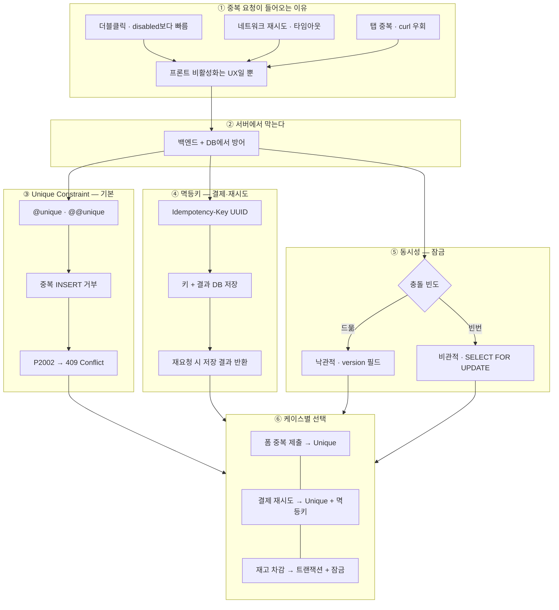

---
aliases:
  - 멱등성
  - Idempotency
  - Transaction
  - API
tags:
  - NestJS
related:
  - "[[00_NestJS_Ecosystem_HomePage]]"
  - "[[NestJS_Controller]]"
  - "[[NestJS_Prisma]]"
  - "[[PG_DDL]]"
  - "[[DB_MigrationPattern]]"
  - "[[NestJS_Transaction]]"
---
# NestJS_Idempotency — 중복 요청 방어

> [!info] 
> 멱등성(Idempotency) = 같은 요청을 여러 번 보내도 결과가 한 번과 같음
> 버튼 두 번 클릭, 네트워크 재시도, 탭 중복 제출 등 "중복 요청"은 반드시 서버에서 방어해야 한다.

---
# 흐름도



```txt
중복 방어는 서버 책임 — Unique는 항상 기본 · 결제는 멱등키 추가 · 동시 수정은 version 또는 FOR UPDATE
뽑기·포인트·주문은 트랜잭션으로 한 묶음 처리 → [[NestJS_Transaction]]
```

---

# 왜 프론트 비활성화만으로 부족한가 ⭐️⭐️⭐️⭐️

```txt
프론트에서 버튼을 클릭 직후 disabled 처리해도 여전히 중복 요청이 들어오는 경우:

  ① 더블클릭이 disabled보다 빠른 경우
     버튼 click 이벤트가 두 번 발생 → 두 번째 클릭이 disabled 반영 전에 이미 요청 전송

  ② 네트워크 재시도
     첫 번째 요청이 타임아웃 → 클라이언트가 자동 재시도 → 서버엔 두 번 도착
     (첫 번째가 실제로는 처리됐지만 응답이 늦었을 수도 있음)

  ③ 탭 중복 제출
     같은 폼을 여러 탭에서 열고 동시에 제출

  ④ JS 코드 우회
     개발자 도구 / Postman / curl로 직접 API 호출

→ 프론트 비활성화는 UX 개선일 뿐, 보안/데이터 정합성 보장이 아님
   중복 방어는 반드시 서버(백엔드 + DB)에서 해야 함
```

---

# 해결책 3단계 — 언제 어느 것을 쓰는가 ⭐️⭐️⭐️

|방법|적용 위치|언제 쓰는가|
|---|---|---|
|DB Unique Constraint|데이터베이스|"이 데이터는 한 번만 존재해야 한다" (가장 강력, 항상 기본)|
|멱등키 (Idempotency Key)|백엔드 + 클라이언트|클라이언트가 재시도를 명시적으로 다루는 경우 (결제, 중요 트랜잭션)|
|낙관적 잠금 (Optimistic Lock)|백엔드 + DB|"동시 수정 충돌"을 마지막 저장 시점에 감지|
|비관적 잠금 (Pessimistic Lock)|DB|"동시 접근 자체"를 막아야 하는 경우 (재고 차감 등)|

```txt
대부분의 API는 Unique Constraint만으로 충분
결제·주문처럼 돈이 오가는 흐름은 멱등키 + Unique Constraint 조합
동시 수정 가능성이 있는 데이터는 낙관적/비관적 잠금 고려
```

---

# DB Unique Constraint ⭐️⭐️⭐️⭐️

```txt
가장 강력하고 기본적인 방어 — DB가 물리적으로 중복을 거부

원리:
  UNIQUE 제약이 걸린 컬럼에 같은 값이 두 번 INSERT되면
  DB가 두 번째를 에러로 거부 (어떤 레이어에서 실패하든 무조건)
```

```typescript
// Prisma schema
model Order {
  id            Int    @id @default(autoincrement())
  userId        Int
  productId     Int
  paymentTxId   String @unique  // 결제 트랜잭션 ID — 같은 결제는 한 번만
  createdAt     DateTime @default(now())
}

// 또는 복합 unique
model UserCoupon {
  userId   Int
  couponId Int
  @@unique([userId, couponId])  // 한 사람이 같은 쿠폰을 두 번 사용 불가
}
```

```typescript
// NestJS Service에서 처리
async createOrder(dto: CreateOrderDto) {
  try {
    return await this.prisma.order.create({
      data: {
        userId:      dto.userId,
        productId:   dto.productId,
        paymentTxId: dto.paymentTxId,  // 결제 SDK가 발급한 고유 ID
      },
    });
  } catch (e) {
    // Prisma unique constraint 위반 에러
    if (e.code === 'P2002') {
      throw new ConflictException('이미 처리된 요청입니다.');
    }
    throw e;
  }
}
```

```txt
Prisma 에러 코드:
  P2002 = Unique constraint failed
  e.meta.target = 어떤 필드에서 충돌했는지 ['paymentTxId'] 형태로 반환 [[NestJS_Prisma]] 참고 
```

---

# 멱등키 (Idempotency Key) ⭐️⭐️⭐️⭐️

```txt
개념:
  클라이언트가 요청마다 고유한 키(UUID 등)를 헤더에 담아 보냄
  서버는 이 키를 보고 "이미 처리한 요청인지" 판단
  이미 처리했으면 → 실제 로직 재실행 없이 저장된 결과를 그대로 반환

언제 쓰는가:
  결제, 송금처럼 "같은 요청이 두 번 실행되면 금전적 손해"가 나는 경우
  클라이언트가 명시적으로 재시도를 구현하는 경우 (모바일 앱의 retry 로직)

흐름:
  클라이언트: UUID 생성 → 요청 헤더에 Idempotency-Key: {uuid}
  서버: 이 키를 DB에 저장 + 실행 결과도 같이 저장
  재시도 요청: 같은 키가 이미 있음 → 저장된 결과 반환 (로직 재실행 안 함)
```

```typescript
// 멱등키 저장 테이블 (Prisma schema)
model IdempotencyRecord {
  key        String   @id          // 클라이언트가 보낸 UUID
  response   Json                  // 처음 처리한 결과를 직렬화해서 저장
  statusCode Int
  createdAt  DateTime @default(now())
  expiresAt  DateTime              // TTL — 일정 기간 후 삭제
}
```

```typescript
// NestJS — 멱등키 미들웨어/가드 패턴
@Injectable()
export class IdempotencyGuard implements CanActivate {
  constructor(private readonly prisma: PrismaService) {}

  async canActivate(context: ExecutionContext): Promise<boolean> {
    const req = context.switchToHttp().getRequest();
    const key = req.headers['idempotency-key'];

    if (!key) return true;  // 키 없으면 그냥 통과 (선택적 적용)

    const existing = await this.prisma.idempotencyRecord.findUnique({
      where: { key },
    });

    if (existing) {
      // 이미 처리된 요청 — 저장된 결과 그대로 반환
      const res = context.switchToHttp().getResponse();
      res.status(existing.statusCode).json(existing.response);
      return false;  // 컨트롤러 실행 안 함
    }

    return true;  // 처음 요청 — 컨트롤러 실행
  }
}
```

```typescript
// 컨트롤러에서 응답 후 결과 저장
@UseGuards(IdempotencyGuard)
@Post('orders')
async createOrder(
  @Body() dto: CreateOrderDto,
  @Headers('idempotency-key') idempotencyKey?: string,
) {
  const result = await this.orderService.create(dto);

  // 멱등키가 있으면 결과 저장
  if (idempotencyKey) {
    await this.prisma.idempotencyRecord.create({
      data: {
        key:        idempotencyKey,
        response:   result,
        statusCode: 201,
        expiresAt:  new Date(Date.now() + 24 * 60 * 60 * 1000),  // 24시간
      },
    });
  }

  return result;
}
```

```txt
실제 결제 서비스들(Stripe, Toss Payments 등)이 이 패턴을 표준으로 사용함
Stripe: POST 요청 헤더에 Idempotency-Key를 넣으면 24시간 동안 동일 결과 보장
```

---

# 낙관적 잠금 (Optimistic Lock) ⭐️⭐️⭐️

```txt
개념:
  "충돌이 잘 없을 것"이라고 가정하고 일단 읽은 다음, 저장할 때 버전을 확인
  내가 읽은 이후 다른 사람이 먼저 수정했으면 → 충돌 감지 → 클라이언트에게 재시도 요청

언제 쓰는가:
  동시 수정 충돌이 드물지만 발생 시 감지가 필요한 경우
  재고 수량, 좌석 예매 등 "마지막으로 저장한 사람의 기준이 맞아야" 하는 데이터
```

```typescript
// Prisma schema — version 필드 추가
model Product {
  id       Int    @id
  name     String
  stock    Int
  version  Int    @default(0)  // 수정될 때마다 +1
}
```

```typescript
// Service — version을 where 조건에 포함
async decreaseStock(productId: number, currentVersion: number) {
  const updated = await this.prisma.product.updateMany({
    where: {
      id:      productId,
      version: currentVersion,        // 내가 읽었을 때의 버전과 같아야만 업데이트
      stock:   { gt: 0 },
    },
    data: {
      stock:   { decrement: 1 },
      version: { increment: 1 },      // 버전 올림
    },
  });

  if (updated.count === 0) {
    // 다른 요청이 먼저 수정했거나 재고 없음
    throw new ConflictException('재고 상태가 변경되었습니다. 다시 시도해주세요.');
  }
}
```

```txt
낙관적 잠금 흐름:
  ① 현재 stock=10, version=5 읽음
  ② 다른 요청이 먼저 stock=9, version=6으로 업데이트
  ③ 내 업데이트: WHERE id=1 AND version=5 → 해당 행 없음 (이미 version=6)
  → count=0 → 충돌 감지 → 409 Conflict 반환
  → 클라이언트가 다시 읽고 재시도

잠금 없이도 동작하므로 DB 부하가 낮음
충돌 시 클라이언트 재시도가 필요 → 충돌이 잦은 상황에서는 비효율
```

---

# 비관적 잠금 (Pessimistic Lock) ⭐️⭐️⭐️

```txt
개념:
  "충돌이 생길 것"이라고 가정하고 처음부터 행에 잠금을 걸어 다른 요청을 대기시킴
  SELECT FOR UPDATE로 행을 읽는 순간 잠금 → 내 트랜잭션이 끝날 때까지 다른 요청 대기

언제 쓰는가:
  충돌이 빈번하게 일어나는 경우
  재고가 1개 남은 상황에서 두 명이 동시에 구매 시도하는 경우
  "읽고 → 계산하고 → 쓰기"를 원자적으로 보장해야 할 때
```

```typescript
// Prisma — $transaction + queryRaw로 FOR UPDATE 사용
async decreaseStockWithLock(productId: number) {
  return this.prisma.$transaction(async (tx) => {
    // FOR UPDATE: 이 행을 잠금 — 다른 트랜잭션은 대기
    const [product] = await tx.$queryRaw<Product[]>`
      SELECT * FROM "Product"
      WHERE id = ${productId}
      FOR UPDATE
    `;

    if (product.stock <= 0) {
      throw new BadRequestException('재고가 없습니다.');
    }

    return tx.product.update({
      where: { id: productId },
      data:  { stock: { decrement: 1 } },
    });
  });
}
```

```txt
비관적 잠금 흐름:
  요청 A: SELECT FOR UPDATE → 잠금 획득, stock=1 확인, stock=0으로 업데이트, 커밋
  요청 B: SELECT FOR UPDATE → A가 커밋할 때까지 대기 → stock=0 확인 → 재고 없음 반환
  → 두 요청이 동시에 왔어도 한 번만 성공

단점: 잠금 대기로 응답이 느려짐, 잠금이 오래 걸리면 데드락 위험
Prisma ORM이 직접 지원 안 해서 $queryRaw가 필요함
```

---

# 방법 선택 기준 ⭐️⭐️⭐️⭐️

```txt
케이스별 추천:

버튼 두 번 클릭 (단순 중복 제출)
  → DB Unique Constraint로 충분
  → 결제 ID, 주문 번호처럼 자연스러운 unique 키가 있으면 그냥 @unique 붙이면 끝

네트워크 재시도가 있는 결제/중요 트랜잭션
  → Unique Constraint + 멱등키 조합
  → 클라이언트가 같은 멱등키로 재시도 → 서버가 저장된 결과 그대로 반환

동시 수정 충돌 (여러 명이 같은 데이터 수정)
  → 충돌이 드물면: 낙관적 잠금 (version 필드)
  → 충돌이 빈번하면: 비관적 잠금 (SELECT FOR UPDATE)

재고 1개인데 동시에 100명이 구매 시도
  → 비관적 잠금 (SELECT FOR UPDATE in transaction)
```

|상황|추천 방법|이유|
|---|---|---|
|일반 폼 중복 제출|Unique Constraint|가장 단순, 항상 필요|
|결제 재시도|Unique Constraint + 멱등키|재시도 시 같은 결과 보장|
|낮은 충돌 빈도 동시 수정|낙관적 잠금|DB 부하 낮음, 충돌 시 재시도|
|높은 충돌 빈도 / 재고 차감|비관적 잠금|확실한 순서 보장|

---

# 한눈에

```txt
프론트 비활성화 → UX일 뿐, 서버 중복 방어가 아님
  JS 우회, 네트워크 재시도, 탭 중복 등으로 항상 우회 가능

서버에서의 3가지 방어:

  ① DB Unique Constraint (항상 기본으로)
     @unique 또는 @@unique([field1, field2])
     위반 시 Prisma 에러 코드 P2002 → 409 ConflictException

  ② 멱등키 (결제·중요 트랜잭션)
     클라이언트: 헤더에 Idempotency-Key: {UUID}
     서버: 키를 DB에 저장 + 결과 캐시 → 재시도 시 저장된 결과 반환

  ③ 낙관적 잠금 (동시 수정 감지)
     version 필드 추가 → WHERE id=? AND version=? 조건으로 업데이트
     count=0이면 충돌 → 409 반환 → 클라이언트 재시도

  ④ 비관적 잠금 (재고 차감 등 동시 접근 완전 차단)
     $transaction + SELECT ... FOR UPDATE
     잠금 → 처리 → 커밋 순서 보장, 다른 요청은 대기
```