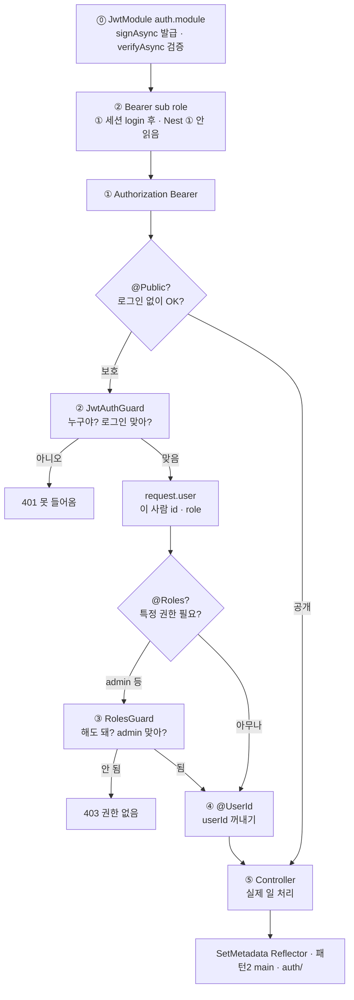
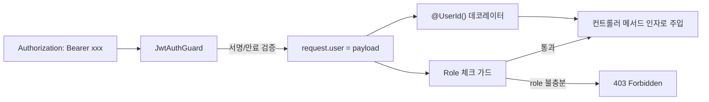

---
aliases:
  - JwtAuthGuard
  - RolesGuard
  - request.user
  - Auth
  - Guard
  - JWT
tags:
  - NestJS
related:
  - "[[00_NestJS_Ecosystem_HomePage]]"
  - "[[Auth_Concept]]"
  - "[[NodeJS_Passport]]"
  - "[[NodeJS_HTTP_Request]]"
  - "[[NestJS_Bcrypt]]"
---
# NestJS_JwtGuard — JWT 검증부터 Role 체크까지

> [!info] 
> Bearer 토큰 한 줄이 컨트롤러에 도착하기까지 `JwtAuthGuard`(서명/만료 검증, Passport를 쓰거나 `JwtService.verifyAsync()`로 직접 구현) → `request.user`(디코딩된 payload) → `@UserId()` 같은 커스텀 데코레이터(원하는 값만 꺼내기) → role 체크 가드(권한 제한) 순서로 거쳐간다. 이 흐름은 특정 프로젝트만의 방식이 아니라 NestJS에서 가장 흔히 쓰는 표준 패턴이다.

```txt
이 노트 하나가 "JWT 인증 전체 파이프라인"을 끝까지 담음 — 따로 노트를 안 쪼갬
Guard가 뭔지, JWT를 어떻게 검증하는지, role을 어떻게 체크하는지가 다 같이 붙어 있어야
실제로 한 흐름으로 이해가 되기 때문에, 여기서부터 끝까지 한 페이지로 유지함
```



---

# JwtModule 설치 및 등록 ⭐️

```bash
# 모노레포 — 특정 워크스페이스에만 설치
pnpm add @nestjs/jwt --filter api

# 단일 프로젝트
pnpm add @nestjs/jwt
```

```typescript
// auth.module.ts — 범용 형태
@Module({
  imports: [
    JwtModule.register({
      secret: process.env.JWT_SECRET,
      signOptions: { expiresIn: '15m' }, // 토큰 기본 만료 시간
    }),
  ],
  providers: [AuthService, JwtAuthGuard],
})
export class AuthModule {}
```

```txt
JwtModule.register(...) 가 하는 일:
  이 옵션(secret, signOptions)을 가진 JwtService를 DI 컨테이너에 등록해줌
  → 이후 어디서든 constructor(private jwtService: JwtService) 로 주입받아
    signAsync(발급)/verifyAsync(검증)를 쓸 수 있게 됨

환경변수마다 다른 값을 써야 하면 register 대신 registerAsync(ConfigService 주입) 사용
```

---

# 토큰 종류 — Access Token vs Refresh Token ⭐️

|토큰|수명|역할|
|---|---|---|
|Access Token|짧음 (보통 15분~1시간)|API 호출마다 Bearer로 들고 다니는, 실제 인가에 쓰는 토큰|
|Refresh Token|길음 (보통 며칠~몇 주)|Access Token이 만료됐을 때, 재로그인 없이 새 Access Token을 받기 위한 토큰|

```txt
왜 굳이 둘로 나누나:
  Access Token 수명을 짧게 잡아야 탈취당해도 피해 기간이 짧음
  근데 수명을 짧게 잡으면 사용자가 너무 자주 로그인해야 해서 불편함
  → "짧고 자주 쓰는 토큰" + "길고 가끔만 쓰는 토큰"으로 나눠서 둘 다 해결

Refresh Token은 보통 DB에 해시로 저장해두고(탈취 대비), 매번 새로 발급할 때마다 교체(rotate)함
→ 이 부분은 "토큰을 어떻게 발급하는가"에 가까운 주제라 깊이는 다루지 않고,
  이 노트는 "이미 가진 Access Token을 어떻게 검증하는가"에 집중함
```

---

# JwtService 핵심 메서드 — signAsync / verifyAsync ⭐️⭐️

| 메서드                            | 역할                                        | 쓰는 위치                     |
| ------------------------------ | ----------------------------------------- | ------------------------- |
| `signAsync(payload, options?)` | payload를 서명해서 JWT 문자열을 만듦 (발급)            | 로그인 성공 처리하는 AuthService 안 |
| `verifyAsync(token, options?)` | 서명과 만료(exp)를 검증하고, 유효하면 payload를 돌려줌 (검증) | 요청을 막아서는 Guard 안          |

```typescript
// auth.service.ts — 발급 쪽 (참고용, 이 노트의 메인 주제는 아님)
async login(user: { id: string; role: 'user' | 'admin' }) {
  const payload: JwtPayload = { sub: user.id, role: user.role };
  return { accessToken: await this.jwtService.signAsync(payload) };
}
```

```txt
signAsync는 "발급"이라 이 노트의 핵심 주제(검증)는 아니지만,
바로 아래 verifyAsync와 짝을 이루는 메서드라 같이 적어둠 — 같은 JwtService가 양쪽을 다 가짐
```

---

# 전체 흐름 — Bearer 토큰이 컨트롤러에 도착하기까지 ⭐️⭐️⭐️



```txt
이 흐름이 흔한 이유:
  검증(인증, Authentication)과 권한(인가, Authorization)을 분리해서
  각자 다른 Guard가 맡게 하면, 둘 중 하나만 바꿔야 할 때 다른 하나를 안 건드려도 됨
  → JwtAuthGuard는 "이 토큰이 유효한가"만 보고, role 체크 가드는 "이 사람이 이 권한이 있는가"만 봄
```

| 말                     | 쉬운 뜻                 | Guard                   | 비유          |
| --------------------- | -------------------- | ----------------------- | ----------- |
| **인증** Authentication | **누구야?** · 로그인 맞아?   | `JwtAuthGuard`          | 출입증 진짜인지 확인 |
| **인가** Authorization  | **해도 돼?** · 이 권한 있어? | `RolesGuard` + `@Roles` | 관리자만 들어가는 문 |

---

# JWT payload란 무엇인가 ⭐️⭐️

```txt
JWT는 header.payload.signature 세 부분을 점(.)으로 이어붙인 문자열임
  header     어떤 알고리즘으로 서명했는지 등 메타정보
  payload    실제로 담고 싶은 데이터 (디코딩하면 보이는 JSON)
  signature  payload+header가 위변조되지 않았다는 증명

→ "payload"라는 단어 자체는 JWT만의 용어가 아니라,
  HTTP 요청 본문, 메시지 큐 메시지 등에서도 "메타정보 말고 진짜 실어 나르는 데이터"를
  가리킬 때 범용적으로 쓰는 말임. JWT에서는 그 디코딩된 JSON 부분을 가리킴
```

## 표준 클레임 vs 커스텀 클레임 ⭐️⭐️

```txt
JWT 표준(RFC 7519)은 payload 안에 들어갈 수 있는 "표준 클레임" 몇 개를 미리 정해둠
이 중 어떤 걸 실제로 넣을지는 발급하는 쪽(로그인 처리하는 서버) 마음임
```

|클레임|표준 의미|
|---|---|
|`sub`|subject — 이 토큰이 누구에 대한 것인지 (보통 유저 ID를 넣음)|
|`iss`|issuer — 누가 발급했는지|
|`aud`|audience — 누구를 위한 토큰인지|
|`exp`|expiration — 만료 시각 (UNIX timestamp)|
|`iat`|issued at — 발급 시각|
|`nbf`|not before — 이 시각 전에는 무효|
|`jti`|JWT ID — 토큰 고유 식별자|

```typescript
// 범용 형태 — sub는 표준, role은 커스텀
export type JwtPayload = {
  sub: string;            // 표준 클레임 — 보통 userId
  role: 'user' | 'admin'; // 커스텀 클레임 — 이 서비스가 직접 정의
};
```

```txt
JwtPayload의 role은 이 표준 클레임 목록에 없음
→ role은 100% 이 프로젝트가 직접 추가한 "커스텀 클레임"임
   JWT는 표준 클레임 몇 개 + 원하는 만큼의 커스텀 필드를 자유롭게 섞어 넣을 수 있는 구조라서
   "내가 로그인 처리 시 뭘 넣기로 정했나"가 그대로 결과 타입(JwtPayload)이 되는 것
```

---
---

# Guard 기초 — CanActivate / ExecutionContext ⭐️⭐️

```txt
모든 Guard는 CanActivate 인터페이스를 구현함 — 메서드 하나(canActivate)만 있으면 됨
canActivate가 true(또는 true로 resolve되는 Promise/Observable)를 반환하면 요청이 통과,
false를 반환하면(또는 직접 예외를 throw하면) 그 자리에서 막힘
```

```ts
interface CanActivate {
  canActivate(context: ExecutionContext): boolean | Promise<boolean> | Observable<boolean>;
}
```

|ExecutionContext 메서드|반환하는 것|언제 쓰나|
|---|---|---|
|`context.switchToHttp().getRequest()`|지금 들어온 Express Request 객체|토큰 꺼내기, request.user 채우기/읽기|
|`context.getHandler()`|지금 실행되려는 라우트 핸들러(메서드) 자체|`@Roles()`처럼 메서드에 붙인 메타데이터를 Reflector로 읽을 때|
|`context.getClass()`|지금 실행되려는 컨트롤러 클래스 자체|메서드가 아니라 클래스 전체에 붙인 메타데이터를 읽을 때|

```txt
getHandler()/getClass() 둘 다 넘기는 이유 (RolesGuard에서 본 reflector.getAllAndOverride 패턴):
  데코레이터를 메서드에 붙일 수도, 클래스 전체에 붙일 수도 있어서
  둘 다 확인해서 "더 구체적인(메서드) 쪽이 있으면 그걸 우선"하는 식으로 합쳐서 읽음
```

---

# JwtAuthGuard — Bearer 토큰을 검증해서 request.user에 넣기 ⭐️⭐️⭐️

```txt
이 토큰을 검증하는 방법은 크게 두 가지임 — 둘 다 실무에서 흔하게 쓰임
  방법 1   Passport(passport-jwt)를 NestJS Guard로 감싸는 방식
  방법 2   Passport 없이, @nestjs/jwt의 JwtService.verifyAsync()를 직접 쓰는 방식
            (NestJS 공식 인증 가이드가 보여주는 기본 예제이기도 함)
```

## 방법 1 — Passport 사용

```typescript
// jwt.strategy.ts
@Injectable()
export class JwtStrategy extends PassportStrategy(Strategy) {
  constructor() {
    super({
      jwtFromRequest: ExtractJwt.fromAuthHeaderAsBearerToken(), // "Bearer xxx"에서 xxx만 추출
      secretOrKey: process.env.JWT_SECRET,
    });
  }

  validate(payload: JwtPayload): JwtPayload {
    return payload; // 여기서 반환한 값이 그대로 request.user가 됨
  }
}

// jwt-auth.guard.ts
@Injectable()
export class JwtAuthGuard extends AuthGuard('jwt') {}
```

## 방법 2 — Passport 없이 직접 구현 ⭐️

```typescript
// jwt-auth.guard.ts
@Injectable()
export class JwtAuthGuard implements CanActivate {
  constructor(
    private jwtService: JwtService,
    private configService: ConfigService, // secret을 환경변수에서 읽어올 때 — 실무에서 흔한 조합
  ) {}

  async canActivate(context: ExecutionContext): Promise<boolean> {
    const request = context.switchToHttp().getRequest();
    const token = this.extractToken(request);
    if (!token) throw new UnauthorizedException();

    try {
      const payload = await this.jwtService.verifyAsync<JwtPayload>(token, {
        secret: this.configService.getOrThrow('API_JWT_SECRET'), // 없으면 즉시 에러 (get()은 조용히 undefined)
      });
      request.user = payload; // ← 내가 직접 한 줄 써서 채우는 부분
    } catch {
      throw new UnauthorizedException();
    }
    return true;
  }

  private extractToken(request: Request): string | undefined {
    const [type, token] = request.headers.authorization?.split(' ') ?? [];
    return type === 'Bearer' && token ? token : undefined;
  }
}
```

```txt
secret을 JwtModule.register()에 등록해둔 것과 또 verifyAsync에 넘기는 이유:
  보통은 모듈 등록 시 넣은 secret이 기본값으로 쓰이지만, 명시적으로 다시 넘겨주는 코드가 많음
  (Access/Refresh처럼 secret을 여러 개 쓰는 경우 대비, 혹은 단순히 코드 읽을 때 명확하게 보이도록)

request.headers.authorization / switchToHttp() / const [type, token] 이 정확히 뭔지는
[[NodeJS_HTTP_Request]] 참고 — 이 노트는 JWT 파이프라인에만 집중
```

## request.user라는 이름은 어디서 오는가 — Passport 관례 vs 직접 구현 ⭐️⭐️⭐️

```txt
request.user는 Express의 Request 타입에 원래 있던 속성이 아님
Node.js 인증 생태계에서 가장 널리 쓰이는 Passport.js가
"인증 성공 시 결과를 req.user에 담아둔다"는 관례를 만들었고
이후 거의 모든 인증 라이브러리·예제·강의가 같은 이름을 그대로 따라 씀
→ Passport 자체의 더 자세한 동작은 [[NodeJS_Passport]] 참고
```

```txt
이 관례를 "누가, 어떻게" 지키느냐가 방법 1과 방법 2에서 다름 —
이 차이를 모르면 "Passport가 자동으로 해준다"는 설명과
"내가 직접 한 줄 써야 한다"는 방법 2의 코드가 서로 다른 얘기처럼 느껴짐
```

|기준|방법 1 (Passport)|방법 2 (직접 구현)|
|---|---|---|
|request.user를 누가 채우나|Passport 내부 코드가 validate()의 반환값을 자동으로 대입|내가 `request.user = payload` 한 줄을 직접 씀|
|"Passport의 약속"이라는 설명이 정확한가|예 — 정확히 그 약속을 따르는 경우|아니요 — 이름만 관례를 흉내낸 것, Passport는 관여 안 함|
|의존성|`@nestjs/passport`, `passport`, `passport-jwt` 등 필요|`@nestjs/jwt`만 있으면 됨|
|장점|전략(strategy) 교체로 다른 인증 방식 추가가 쉬움|코드가 한눈에 보이고 의존성이 가벼움|

```txt
→ "request.user는 Passport가 정해둔 약속"이라는 설명은
  Passport를 실제로 쓸 때(방법 1)만 정확함
  방법 2에서는 그냥 "다들 그렇게 부르니까 나도 그 이름을 따라 쓴 것"일 뿐,
  express.d.ts에서 타입을 user로 선언한 것도 이 관례를 따른 선택임 (강제 사항 아님)
```

---

# request.user를 타입으로 인식시키기 — express.d.ts ⭐️⭐️

```txt
TypeScript 기본 Express Request 타입에는 user 속성이 없음
(Passport가 런타임에 request.user = payload 로 직접 채워주는 것일 뿐, 타입 선언이 따라오는 게 아님)
→ request.user를 쓸 때마다 타입 에러가 나거나 any로 새는 걸 막으려면
  "Declaration Merging"으로 Express의 Request 타입 자체를 확장해야 함
```

```typescript
// src/types/express.d.ts — 범용 형태
import type { JwtPayload } from '../auth/jwt-payload';

declare global {
  namespace Express {
    interface Request {
      user?: JwtPayload;
    }
  }
}

export {};
```

|체크포인트|이유|
|---|---|
|파일 위치는 `src` 안 어디든 가능, 보통 `types/` 폴더|tsconfig가 그 폴더를 인식하기만 하면 됨|
|`declare global { namespace Express { ... } }` 형태 유지|Express 패키지 자체의 `Request` 인터페이스에 병합되는 공식적인 방법|
|이 파일은 import만 있고 별도 export 없어도 됨|import가 하나라도 있으면 TS가 "모듈"로 인식해서 `declare global`이 정상 동작함|
|tsconfig의 `include`(또는 `typeRoots`)에 이 파일 경로가 포함돼야 함|안 그러면 컴파일러가 이 파일 자체를 안 읽어서 병합이 적용 안 됨|

```txt
이 파일은 "타입만 알려주는 것" — 실제로 request.user에 값을 넣는 건
JwtStrategy의 validate() (Passport 컨벤션)이 하는 일임, 둘은 별개
```

---

# @UserId() — request.user에서 원하는 값만 꺼내는 데코레이터 ⭐️

```txt
컨트롤러마다 @Req() req 받아서 req.user.sub 꺼내는 걸 반복하지 않으려고
자주 쓰는 값(userId)만 바로 뽑아주는 짧은 손잡이를 만들어두는 패턴
```

```typescript
// user-id.decorator.ts — 범용 형태
export const UserId = createParamDecorator(
  (_data: unknown, ctx: ExecutionContext): string => {
    const request = ctx.switchToHttp().getRequest<Request>();
    return request.user.sub;
  },
);

// 예시 형태 
export const UserId = createParamDecorator(
  (_data: unknown, ctx: ExecutionContext): string => {
    const request = ctx.switchToHttp().getRequest<Request>();
    const userId = request.user?.sub;
    if (!userId) {
      throw new UnauthorizedException('로그인이 필요합니다.');
    }
    return userId;
  },
);
```

```typescript
// 사용
@Get('me')
getMe(@UserId() userId: string) {
  return this.usersService.findOne(userId);
}
```

---
# 메타데이터(Metadata)란 무엇인가 — SetMetadata + Reflector ⭐️⭐️⭐️

```txt
메타데이터 = "데이터에 대한 데이터" — 여기서는 "이 라우트/클래스에 붙은 추가 정보" 정도로 이해하면 됨
실행 흐름(로직)과는 별개로, 데코레이터를 통해 클래스나 메서드에 "라벨"을 붙여두는 것

NestJS는 이 라벨을 두 단계로 다룸:
  1. SetMetadata(key, value)   라벨을 붙이는 쪽 (커스텀 데코레이터를 만들 때 씀)
  2. Reflector                라벨을 다시 읽어오는 쪽 (Guard 안에서 씀)

→ "라벨을 붙인다"고 해서 실행 중에 뭔가 바뀌는 게 아님 — 그냥 어딘가에 저장해두고,
  나중에 Guard가 Reflector로 "이 라우트에 무슨 라벨이 붙어있나?"를 조회해서 분기하는 것
```

```typescript
export const Roles = (...roles: Role[]) => SetMetadata(ROLES_KEY, roles);
```

```txt
SetMetadata('roles', ['admin'])가 하는 일:
  "이 핸들러(또는 클래스)에는 roles라는 키에 ['admin']이라는 값이 붙어있다"는 정보를
  reflect-metadata(TypeScript 데코레이터 메타데이터 표준)를 통해 저장해둠
  → @Roles('admin')을 라우트에 붙이면, 그 라우트 메서드에 이 라벨이 박히는 것
```

## Reflector의 조회 방법 — get / getAllAndOverride / getAllAndMerge

|메서드|동작|
|---|---|
|`reflector.get(key, target)`|target(메서드 또는 클래스) 딱 하나에서만 메타데이터를 읽음|
|`reflector.getAllAndOverride(key, [target1, target2, ...])`|여러 target을 순서대로 확인하고, 값이 있는 "첫 번째" target의 값만 사용함 (나머지는 버림) — 더 구체적인 쪽이 이김|
|`reflector.getAllAndMerge(key, [target1, target2, ...])`|여러 target의 값들을 합쳐서(배열이면 이어붙여서) 반환|


```typescript
this.reflector.getAllAndOverride<Role[]>(ROLES_KEY, [
  context.getHandler(), // 1. 먼저 메서드 자체에 @Roles()가 있는지 확인
  context.getClass(),   // 2. 메서드에 없으면 그제서야 클래스 전체에 붙은 값을 확인
]);
```

```txt
헷갈리기 쉬운 점: getAllAndOverride라는 이름 때문에 "여러 개를 다 모아서 합친다(All)"로
오해하기 쉬운데, 실제로는 "여러 target을 다 확인은 하지만(All), 그중 우선순위가 가장 높은
하나만 쓰고 나머지는 버린다(Override)"는 뜻임
→ "메서드에 개별적으로 @Roles()를 붙이면 클래스 레벨 설정을 덮어쓴다"가 정확한 의미
  여러 값을 합치고 싶으면(예: 클래스 role + 메서드 role을 둘 다 허용) getAllAndMerge를 써야 함
```

---

# Role 기반 접근 제어 — 두 가지 패턴 ⭐️⭐️⭐️

```txt
role이 user/admin 둘뿐이고 라우트별로 조합이 안 늘어날 거라면 → 패턴 1로 충분
나중에 role 종류가 늘거나, 라우트마다 "이 role들 중 하나면 통과" 식 조합이 필요해지면 → 패턴 2로 일반화
```

## 패턴 1 — 단순 전용 가드 (AdminGuard)

```typescript
@Injectable()
export class AdminGuard implements CanActivate {
  canActivate(context: ExecutionContext): boolean {
    const { user } = context.switchToHttp().getRequest<Request>();
    return user?.role === 'admin';
  }
}
```

```typescript
@UseGuards(JwtAuthGuard, AdminGuard) // JwtAuthGuard가 먼저 실행돼서 request.user를 채워둬야 함
@Get('admin-only')
adminOnly() { /* ... */ }
```

```txt
장점: 코드가 짧고 즉시 이해됨 — role이 단순 binary일 때 과설계를 피할 수 있음
한계: role이 늘어나거나, 라우트마다 다른 role 조합이 필요해지면 가드를 계속 새로 만들어야 함
```

## 패턴 2 — @Roles() + RolesGuard + Reflector (NestJS 공식 문서 권장)

```typescript
// roles.decorator.ts
export const ROLES_KEY = 'roles';
export type Role = 'user' | 'admin'; // JwtPayload의 role과 같은 타입을 쓰는 게 좋음 (중복 정의 방지)
export const Roles = (...roles: Role[]) => SetMetadata(ROLES_KEY, roles);

// roles.guard.ts
@Injectable()
export class RolesGuard implements CanActivate {
  constructor(private readonly reflector: Reflector) {}

  canActivate(context: ExecutionContext): boolean {
    const requiredRoles = this.reflector.getAllAndOverride<Role[]>(ROLES_KEY, [
      context.getHandler(),
      context.getClass(),
    ]);
    if (!requiredRoles?.length) return true; // 데코레이터가 없는 라우트는 role 제한 없음

    const request = context.switchToHttp().getRequest<Request>();
    const userRole = request.user?.role;

    if (!userRole || !requiredRoles.includes(userRole)) {
      throw new ForbiddenException('권한이 없습니다.'); // false 반환 대신 명확한 메시지로 throw
    }
    return true;
  }
}
```

```txt
⚠️ 실수하기 쉬운 지점: ROLES_KEY 문자열을 import할 때 오타(예: ROLLES_KEY)가 나면
   Reflector가 메타데이터를 절대 못 찾아서 requiredRoles가 항상 undefined가 됨
   → !requiredRoles?.length 가 항상 true → 이 가드가 항상 통과시켜버림
   → role 체크가 "에러도 안 나면서 조용히 무력화"되는 가장 위험한 실수 패턴
   (export하는 쪽과 import하는 쪽 둘 다 같은 상수를 보고 있는지 꼭 확인할 것)
```

```typescript
// 사용
@UseGuards(JwtAuthGuard, RolesGuard)
@Roles('admin')
@Get('admin-only')
adminOnly() { /* ... */ }
```

```txt
Reflector가 하는 일:
  @Roles('admin') 데코레이터가 라우트에 "metadata"로 붙여둔 값을
  RolesGuard가 실행 시점에 다시 꺼내 읽을 수 있게 해주는 헬퍼
  → "이 라우트는 어떤 role이 필요한가"를 코드(데코레이터)만 보고 바로 알 수 있다는 게 핵심 이점
```

## 둘 중 어떤 걸 쓸지 비교

|기준|패턴 1 (AdminGuard)|패턴 2 (Roles + Reflector)|
|---|---|---|
|role이 user/admin 둘뿐|충분함|과설계일 수 있음|
|role이 3개 이상 / 라우트별 조합 다양|가드가 계속 늘어남|데코레이터만 바꿔서 대응 가능|
|코드 읽는 사람이 바로 이해하기|쉬움|Reflector 개념을 먼저 알아야 함|

---

# 전역 적용 — APP_GUARD ⭐️⭐️

```txt
매 컨트롤러마다 @UseGuards(JwtAuthGuard)를 붙이는 게 반복되면,
"기본적으로 전부 막아두고, 공개할 라우트만 예외 처리"하는 쪽이 더 안전하고 편함
```

```typescript
// auth.module.ts
@Module({
  providers: [
    { provide: APP_GUARD, useClass: JwtAuthGuard }, // 모든 라우트에 자동 적용
  ],
})
export class AuthModule {}
```

```txt
APP_GUARD 토큰으로 등록하면 NestJS가 이 Guard를 모든 컨트롤러/라우트에 자동으로 끼워 넣음
→ 이제부터는 @UseGuards(JwtAuthGuard)를 일일이 안 붙여도 기본적으로 다 막혀 있음
```

## 공개 라우트는 @Public()으로 예외 처리

```typescript
// public.decorator.ts
export const IS_PUBLIC_KEY = 'isPublic';
export const Public = () => SetMetadata(IS_PUBLIC_KEY, true);
```

```typescript
// jwt-auth.guard.ts — Reflector로 isPublic 먼저 확인하도록 확장
@Injectable()
export class JwtAuthGuard implements CanActivate {
  constructor(private jwtService: JwtService, private reflector: Reflector) {}

  async canActivate(context: ExecutionContext): Promise<boolean> {
    const isPublic = this.reflector.getAllAndOverride<boolean>(IS_PUBLIC_KEY, [
      context.getHandler(),
      context.getClass(),
    ]);
    if (isPublic) return true; // 로그인/회원가입처럼 토큰이 없어도 되는 라우트

    // ... 이후 검증 로직은 위 "방법 2"와 동일
  }
}
```

```typescript
// 사용
@Public()
@Post('login')
login(@Body() dto: LoginDto) { /* ... */ }
```

```txt
이 패턴이 Role 체크(@Roles + Reflector)와 구조가 똑같은 이유:
  둘 다 "라우트에 메타데이터를 데코레이터로 붙이고, Guard가 Reflector로 그 메타데이터를
  실행 시점에 다시 꺼내 읽는다"는 같은 메커니즘을 쓰는 것 — @Public()은 그 메커니즘을
  "role 검사"가 아니라 "인증 자체를 건너뛸지"에 적용한 것뿐임
```

## @Public() vs @Roles() — 같은 메커니즘, 다른 목적 ⭐️⭐️

```txt
헷갈리기 쉬운 이유: 둘 다 SetMetadata + Reflector.getAllAndOverride + getHandler()/getClass()를
똑같이 씀 — 그래서 코드 모양이 거의 같아 보이는데, "그 라벨이 뭘 의미하는지"와
"누가 그 라벨을 읽는지"가 다름
```

|비교|`@Public()`|`@Roles()`|
|---|---|---|
|붙이는 메타데이터 값|`true` (boolean)|`['admin']` 같은 배열|
|읽는 Guard|`JwtAuthGuard`|`RolesGuard`|
|이 Guard가 하는 일|인증(로그인 여부) 자체를 검사할지 말지 결정|이미 인증된 사람의 role이 충분한지 결정|
|실행 순서|먼저 — "검증 자체를 건너뛸지" 부터 판단|그다음 — JwtAuthGuard를 통과한 사람에게만 적용|
|값이 없는 라우트의 기본 동작|`false`로 간주 → 인증 검사를 정상 진행|`undefined`로 간주 → role 제한 없음(누구나 통과)|

```txt
→ 정리하면 "같은 도구(SetMetadata+Reflector)로 만든 서로 다른 두 개의 라벨"임
  @Public 라벨은 JwtAuthGuard가 읽고, @Roles 라벨은 RolesGuard가 읽음
  둘이 충돌하거나 겹치는 게 아니라, 인증→인가 순서로 나란히 적용되는 별개의 체크임
```

---

# 전체 파이프라인 합쳐보기

```typescript
@UseGuards(JwtAuthGuard, RolesGuard) // 인증(JwtAuthGuard) → 인가(RolesGuard) 순서
export class UsersController {
  @Get('me')
  getMe(@UserId() userId: string) {
    return this.usersService.findOne(userId); // role 제한 없음 — 로그인만 하면 누구나
  }

  @Roles('admin')
  @Delete(':id')
  remove(@Param('id') id: string) {
    return this.usersService.remove(id); // admin만 통과
  }
}
```

---

# Auth.js 쿠키 ≠ Nest Bearer — 별개의 토큰 ⭐️

```txt
이 노트의 Bearer 토큰(JwtPayload)은 NestJS API가 직접 서명/검증하는 토큰임
Auth.js가 Next.js 쪽에 심는 세션 쿠키와는 완전히 다른 시스템 — 같은 "로그인 상태"를
표현하더라도 서로의 내부를 몰라도 되고, 한쪽 토큰만 봐서는 다른 쪽 토큰을 검증할 수 없음
```

```txt
왜 둘로 나누는가 — 백엔드(NestJS)가 인증·User·DB를 전부 소유하고,
프론트(Next.js)는 그냥 API 클라이언트로만 움직이는 아키텍처를 쓰는 경우:

  Auth.js 세션 쿠키   "이 브라우저가 로그인된 화면을 봐도 되는가" 정도의 UI용 신호
  Nest Bearer 토큰    실제 API 호출 권한을 검증하는 진짜 인증 수단

→ 이렇게 나누면 Auth.js의 User/Account 표준 스키마를 NestJS DB에 그대로 복사할 필요가 없어짐
  나중에 OAuth 연동이 필요해지면 provider/providerAccountId 정도의 얇은 연결 테이블만
  NestJS 쪽에 직접 설계하면 충분함 — Auth.js Adapter 전체를 가져올 필요는 없음
```

---

# 한눈에

| 키워드                           | 한 줄 정리                                                                                                    |
| ----------------------------- | --------------------------------------------------------------------------------------------------------- |
| payload                       | JWT의 header.payload.signature 중 실제 데이터가 담긴 부분 (디코딩하면 JSON)                                                |
| `sub`                         | 표준 클레임 — 보통 userId를 담음                                                                                    |
| `role`                        | 표준 클레임 아님 — 이 서비스가 직접 추가한 커스텀 클레임                                                                         |
| Access Token / Refresh Token  | 짧고 자주 쓰는 토큰 / 길고 가끔 쓰는 재발급용 토큰                                                                            |
| `signAsync` / `verifyAsync`   | JwtService의 발급 / 검증 메서드                                                                                   |
| CanActivate                   | 모든 Guard가 구현하는 인터페이스 — canActivate가 true/false 반환                                                         |
| `getHandler()` / `getClass()` | Reflector로 메타데이터 읽을 때 메서드/클래스 단위로 구분하기 위한 ExecutionContext 메서드                                            |
| `SetMetadata(key, value)`     | 클래스/메서드에 "라벨"을 붙이는 것 — 실행을 안 바꾸고 나중에 Reflector로 조회만 가능                                                    |
| `getAllAndOverride`           | 여러 target 중 더 구체적인(메서드) 쪽이 있으면 그것만 쓰고 나머지는 버림 — 병합 아님                                                     |
| `getAllAndMerge`              | 여러 target의 값을 합쳐서 반환 — `getAllAndOverride`와 정확히 반대 성격                                                     |
| JwtAuthGuard                  | Bearer 토큰을 검증하고 통과하면 request.user를 채움 — Passport 방식 / 직접 구현 방식 둘 다 가능                                     |
| request.user 출처               | Passport 방식은 자동 대입, 직접 구현 방식은 내가 `request.user = payload` 한 줄을 직접 씀                                       |
| express.d.ts                  | `declare global { namespace Express { interface Request { user?: JwtPayload } } }` 로 타입만 확장 — 값을 채우는 건 별개 |
| @UserId()                     | request.user에서 자주 쓰는 값만 꺼내는 커스텀 파라미터 데코레이터                                                                |
| AdminGuard vs RolesGuard      | role이 단순하면 전용 가드, role이 늘어나거나 조합이 다양하면 @Roles()+Reflector                                                 |
| APP_GUARD                     | 모든 라우트에 Guard를 자동 적용 — `@Public()`으로 예외 라우트만 빼줌                                                           |
| `@Public()` vs `@Roles()`     | 같은 메커니즘(SetMetadata+Reflector)을 인증 건너뛰기 vs role 검사라는 다른 목적에 쓴 것                                           |
| Auth.js 쿠키 ≠ Nest Bearer      | 서로 독립된 별개의 토큰 — 백엔드가 인증을 전부 소유하면 Auth.js Adapter 전체를 따라갈 필요 없음                                            |

