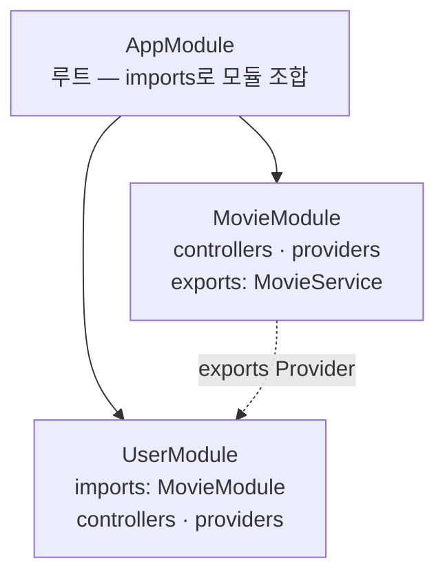

---
aliases:
  - "@Module"
  - 모듈
  - Dynamic Module
  - forRootAsync
  - Module
tags:
  - NestJS
related:
  - "[[00_NestJS_Ecosystem_HomePage]]"
  - "[[NestJS_Env_Config]]"
  - "[[NestJS_Prisma]]"
  - "[[NestJS_Service_Provider]]"
  - "[[NestJS_Controller]]"
---
# NestJS_Module — 모듈

> [!info] 
> 모듈 = 관련된 Controller/Service를 하나로 묶는 단위
> 기능별로 모듈을 분리해서 코드를 구조화하고, imports/exports로 모듈 간 의존성을 명시한다.

---
# 흐름도



```txt
각 @Module: controllers · providers 등록 → IoC Container
다른 모듈 Provider 쓰려면: exports(공개) → imports(가져오기) → constructor 주입
```

---
# @Module 데코레이터 ⭐️

```typescript
@Module({
  imports:     [],  // 다른 모듈 불러오기
  exports:     [],  // 이 모듈의 Provider를 외부에 공개
  controllers: [],  // 이 모듈의 컨트롤러
  providers:   [],  // 이 모듈의 서비스 / 프로바이더
})
```

|필드|역할|
|---|---|
|`imports`|다른 모듈을 불러옴 — 그 모듈이 `exports`한 Provider를 사용할 수 있게 됨|
|`exports`|이 모듈의 Provider를 다른 모듈에서도 쓸 수 있게 공개 (없으면 이 모듈 안에서만 사용 가능)|
|`controllers`|이 모듈에서 사용할 컨트롤러 등록|
|`providers`|이 모듈에서 사용할 서비스/프로바이더 등록 — `@Injectable()` 클래스를 IoC Container에 등록|

---

# AppModule — 루트 모듈 ⭐️

```typescript
// app.module.ts
@Module({
  imports: [MovieModule, UserModule],  // 기능 모듈 조합
})
export class AppModule {}
```

```txt
AppModule의 역할: 앱 전체의 중앙 모듈(루트) — 기능별 모듈을 imports에 등록해서 조합
main.ts에서 AppModule 기반으로 앱 시작

실무 관행: app.controller.ts / app.service.ts는 삭제하고,
           AppModule은 중앙 조립 역할만 담당
```

---

# 기능별 모듈 분리 ⭐️

```txt
movie/
  movie.module.ts      모듈
  movie.controller.ts  컨트롤러
  movie.service.ts     서비스
  dto/                 DTO (Data Transfer Object)
  entities/            엔티티 / 인터페이스
```

```typescript
// movie.module.ts
@Module({
  controllers: [MovieController],
  providers:   [MovieService],
  exports:     [MovieService],  // 외부 모듈에서도 사용 가능하게
})
export class MovieModule {}
```

---

# imports / exports 헷갈릴 때 ⭐️⭐️

```txt
"UserService에서 MovieService를 쓰고 싶다" — 3단계
```

```typescript
// ① MovieModule에서 exports에 추가 — "이 서비스 외부에 공개할게"
@Module({ providers: [MovieService], exports: [MovieService] })
export class MovieModule {}

// ② UserModule에서 imports에 MovieModule 추가 — "MovieModule 꺼 가져다 쓸게"
@Module({ imports: [MovieModule], providers: [UserService] })
export class UserModule {}

// ③ UserService에서 주입받아 사용
constructor(private movieService: MovieService) {}
```

```txt
⚠️ 가장 흔한 실수: exports 빠뜨리면 → "Nest can't resolve dependencies of UserService"
   → MovieModule에 exports: [MovieService] 반드시 추가
```

---

# @Global() — 모듈을 전역으로 ⭐️⭐️⭐️

```txt
imports/exports 방식은 "쓰려는 모듈마다" 매번 명시적으로 import 해야 함
같은 Provider를 거의 모든 모듈이 공통으로 써야 한다면(DB 연결, 공통 설정 등)
→ @Global()을 붙이면 한 번만 import해도 그 이후 모든 모듈에서 바로 주입 가능
```

```typescript
@Global()
@Module({
  providers: [DatabaseService],
  exports:   [DatabaseService],
})
export class DatabaseModule {}
```

```txt
⚠️ @Global()을 붙여도 그 모듈 자체는 어딘가에 한 번은 import해야 함 (보통 AppModule)
   "import가 전혀 필요 없다"가 아니라 "한 번만 하면, 이후엔 전역 적용"이라는 뜻

ConfigModule.forRoot({ isGlobal: true })의 isGlobal 옵션도 내부적으로 똑같이 @Global()을 사용함
→ isGlobal 옵션이 있는 모듈들은 "옵션으로 @Global()을 켜고 끌 수 있게" 미리 만들어둔 것일 뿐
```

|구분|장점|단점|
|---|---|---|
|매번 명시적으로 import|"이 모듈이 무엇에 의존하는지"가 import문에 드러남|기능 모듈이 늘수록 반복되는 보일러플레이트|
|`@Global()`|반복 제거, 거의 모든 모듈이 쓰는 것에 적합|어떤 모듈이 실제로 그 Provider를 쓰는지 import문만 봐선 알 수 없음|

```txt
판단 기준:
  거의 모든 모듈이 필요로 하는가 (DB 연결, 전역 설정 등) → @Global() 후보
  일부 모듈만 쓰는 거라면 → 명시적 import로 의존 관계를 드러내는 게 더 명확함
```

---

# Dynamic Module — forRoot / forRootAsync 패턴 ⭐️⭐️⭐️

```txt
ConfigModule.forRoot({...}), TypeOrmModule.forRootAsync({...})처럼
"모듈이름.forRoot(옵션)" 형태로 쓰는 것들 — 일반 모듈과 뭐가 다른가
```

|구분|정적 모듈|Dynamic Module|
|---|---|---|
|등록 방법|`imports: [MovieModule]` — 모듈 그 자체|`imports: [ConfigModule.forRoot({...})]` — 옵션을 넘겨 호출한 결과|
|설정값 전달|불가능|가능 — 호출 시점에 원하는 설정을 인자로 전달|
|내부 구현|`@Module({...})` 클래스 그대로|모듈 클래스 안에 `static forRoot(options)` 메서드가 있고 `@Module` 설정을 반환|

```typescript
// 라이브러리 내부 구현 개념 예시
@Module({})
export class ConfigModule {
  static forRoot(options: ConfigOptions): DynamicModule {
    return {
      module:    ConfigModule,
      providers: [{ provide: 'CONFIG_OPTIONS', useValue: options }, ConfigService],
      exports:   [ConfigService],
      global:    options.isGlobal,  // 위 @Global()과 같은 효과를 옵션으로 켜고 끔
    };
  }
}
```

## 흔히 보이는 이름들

|이름|의미|
|---|---|
|`forRoot(options)`|앱 전체에서 한 번만 설정 (보통 AppModule에서 1번) — 동기적으로 옵션 확정|
|`forRootAsync(options)`|`forRoot`와 같지만, 다른 Provider(ConfigService 등)에 의존해서 비동기로 옵션을 만들 때|
|`register(options)`|특정 모듈 범위에서만 다르게 설정하고 싶을 때 (여러 번 호출 가능)|
|`registerAsync(options)`|`register`의 비동기 버전|

```typescript
// forRootAsync — 다른 Provider(ConfigService)의 값을 받아와야 할 때
TypeOrmModule.forRootAsync({
  imports:    [ConfigModule],
  useFactory: (configService: ConfigService) => ({
    type: 'postgres',
    host: configService.get('DB_HOST'),
  }),
  inject: [ConfigService],
})
```

```txt
forRoot: 고정된 객체를 바로 넘길 수 있음
forRootAsync: useFactory + inject로 ConfigService 같은 값을 받아 옵션을 "계산"해서 반환
→ "어떤 값이 들어올지 런타임에 결정되는" 설정이 필요할 때 forRootAsync 사용
```

---

# dto / entities 폴더 역할

|폴더|역할|
|---|---|
|`dto/`|요청 Body 구조 정의 + 유효성 검사|
|`entities/`|DB 테이블 구조 또는 타입 정의|

---

# nest g resource — 한번에 생성 ⭐️

```bash
nest g resource movie
```

```txt
transport layer 선택 → REST API
CRUD entry points 생성? → Y(findAll/findOne/create/update/remove 자동) / N(빈 컨트롤러·서비스만)

생성 파일: movie.module.ts / movie.controller.ts / movie.service.ts / dto/ / entities/
→ app.module.ts에 imports: [MovieModule] 자동 추가됨
```

---

# 커스텀 공통 모듈 ⭐️

```txt
여러 모듈에서 공통으로 쓰는 로직을 CommonModule로 분리 (페이지네이션, 파일 처리, 유틸리티 등)
```

```typescript
// common.module.ts
@Module({
  providers: [CommonService],
  exports:   [CommonService],  // 반드시 exports에 추가
})
export class CommonModule {}

// movie.module.ts — 사용할 모듈에서 import
@Module({
  imports:     [CommonModule],
  controllers: [MovieController],
  providers:   [MovieService],
})
export class MovieModule {}

// movie.service.ts — 주입받아 사용
@Injectable()
export class MovieService {
  constructor(private readonly commonService: CommonService) {}
}
```

---

# ConditionalModule — 조건부 모듈 등록 ⭐️

```txt
환경변수에 따라 특정 모듈을 켜거나 끄는 기능
사용 사례: Worker 서버 / API 서버를 같은 코드베이스에서 분리 실행
```

```typescript
import { ConditionalModule } from '@nestjs/config';

@Module({
  imports: [
    ConditionalModule.registerWhen(
      WorkerModule,
      (env: NodeJS.ProcessEnv) => env['TYPE'] === 'worker',  // true면 등록, false면 스킵
    ),
  ],
})
export class AppModule {}
```

```bash
TYPE=worker node dist/main.js  # WorkerModule 등록됨
node dist/main.js              # WorkerModule 스킵
```

---

# 전체 구조 예시

```txt
src/
├── app.module.ts            루트 모듈 (중앙 조립)
├── common/
│   ├── common.module.ts
│   └── common.service.ts
├── movie/
│   ├── movie.module.ts
│   ├── movie.controller.ts
│   ├── movie.service.ts
│   ├── dto/
│   └── entities/
└── user/
    ├── user.module.ts
    └── ...
```

---

# 한눈에

```txt
@Module 4 필드: imports(가져오기) / exports(공개) / controllers / providers
exports 빠뜨림 = 가장 흔한 DI 에러 ("can't resolve dependencies")

@Global() = 한 번만 import하면 이후 모든 모듈에서 imports 없이 주입 가능
  (isGlobal 옵션이 있는 모듈들은 내부적으로 이걸 옵션화해둔 것)

forRoot(동기) / forRootAsync(다른 Provider에 의존해 비동기로 옵션 계산) / register(부분 적용) 구분
  → forRootAsync의 핵심은 useFactory + inject로 ConfigService 같은 값을 받아 옵션을 동적으로 생성

ConditionalModule로 환경변수 기반 모듈 on/off 가능 (Worker/API 서버 분리 등)

Provider 자체 (DI, 등록 방식, Scope) → [[NestJS_Service_Provider]]
```