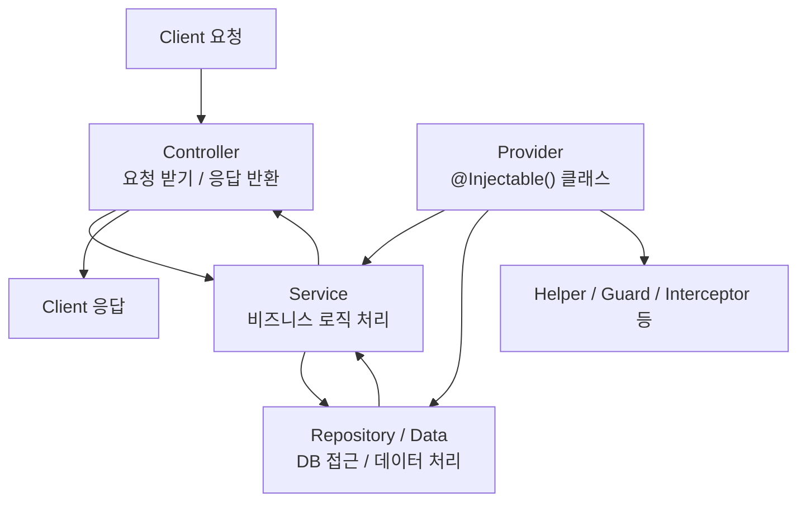

---
aliases:
  - Provider
  - Service
  - DI
  - IoC
  - Dependency Injection
tags:
  - NestJS
related:
  - "[[00_NestJS_Ecosystem_HomePage]]"
  - "[[NestJS_Module]]"
  - "[[TS_Class]]"
  - "[[TS_Decorator]]"
  - "[[NestJS_Controller]]"
---
# NestJS_Service_Provider — 서비스 & 프로바이더

# 한 줄 요약

```
Service  = 비즈니스 로직 담당 (Controller 에서 분리)
Provider = @Injectable() 이 붙은 클래스 + NestJS 가 관리하는 모든 주입 가능한 대상
모든 Service 는 Provider 다 — 하지만 모든 Provider 가 Service 는 아니다
```

---

---

# 흐름도



---

---

# Controller vs Service — 역할 분리 ⭐️

|구분|역할|
|---|---|
|Controller|URL 매핑 / 요청 받기 / 응답 반환|
|Service|실제 비즈니스 로직 / DB 접근 / 데이터 처리|

```
Controller 가 직접 로직을 처리하면: 코드 복잡 / 테스트 어려움 / 재사용 불가
→ Controller 는 요청을 받아 Service 에 넘기기만, 실제 일은 Service 가 처리
```

```typescript
// Controller — 요청 받아서 Service 에 넘김
@Get()
getMovies(@Query('title') title: string) {
  return this.appService.getManyMovies(title);
}

// Service — 실제 비즈니스 로직
getManyMovies(title?: string) {
  if (!title) return this.movies;
  return this.movies.filter(m => m.title.startsWith(title));
}
```

---

---

# @Injectable() — Provider 등록 ⭐️

```typescript
import { Injectable } from '@nestjs/common';

@Injectable()
export class AppService {}
```

```
@Injectable() 의 의미: "이 클래스를 NestJS IoC Container 에 등록해줘"
→ NestJS 가 이 클래스를 자동으로 생성 + 관리, 필요한 곳에 자동으로 주입
@Injectable() 없으면: Container 가 인식 못 함 → 주입 시도 시 에러
```

---

---

# DI / IoC — 왜 필요한가 ⭐️⭐️

|방식|코드|문제/효과|
|---|---|---|
|직접 생성 (DI 없음)|`class A { b = new B(); }`|A 가 B 에 강하게 결합 — B 를 바꾸면 A 코드도 바꿔야 함, 테스트 시 가짜로 교체 어려움|
|Dependency Injection|`class A { constructor(b: B) {} }`|B 를 외부에서 받음 — A 가 B 를 직접 안 만들어서 결합이 느슨해짐|
|Inversion of Control|NestJS IoC Container 가 처리|`new B()` 를 누가 호출하는지의 "제어권" 자체가 개발자에서 프레임워크로 넘어감|

```typescript
// IoC Container 가 자동으로 처리하는 것
class B {}
class A { constructor(instance: B) {} }
class C { constructor(instance: B) {} }

// Container: new B() 로 인스턴스 1개 생성 → A 에도, C 에도 같은 인스턴스를 자동 주입
```

```
IoC Container 의 동작: @Injectable() 클래스를 등록하면 자동 생성 + 자동 주입 + 싱글톤 관리
→ 같은 클래스를 여러 곳에서 주입받아도 기본적으로 인스턴스는 1개만 생성됨 (아래 Scope 참고)
```

## NestJS 에서 실제 사용 — 생성자 주입

```typescript
// app.service.ts
@Injectable()
export class AppService {
  private movies: Movie[] = [];
  getManyMovies(title?: string) { /* ... */ }
}

// app.controller.ts
@Controller('movie')
export class AppController {
  constructor(private readonly appService: AppService) {}
  //          ↑ private readonly = 클래스 속성 자동 생성 + 타입으로 선언하면 자동 주입

  @Get()
  getMovies(@Query('title') title: string) {
    return this.appService.getManyMovies(title);
  }
}
```

```
동작 순서: ① AppService 에 @Injectable() 등록 → ② IoC Container 가 인스턴스 생성
→ ③ AppController 생성자가 AppService 타입을 요청 → ④ Container 가 자동 주입 → ⑤ this.appService 로 사용
```

---

---
# interface 를 export 해야 하는 이유 ⭐️

```typescript
// ❌ interface 를 export 안 하면 에러
// "반환 형식이 외부 모듈의 'Movie' 이름을 사용 중이지만 명명할 수 없습니다"
interface Movie { id: number; title: string; }

@Injectable()
export class AppService {
  getManyMovies(): Movie[] { /* ... */ }   // Movie 가 외부에서 안 보임 → 에러
}
```

```typescript
// ✅ interface 도 같이 export
export interface Movie { id: number; title: string; }
```

```
AppService 를 export 하면 외부(Controller)에서 사용 가능해지는데,
그 반환 타입(Movie)이 외부로 같이 노출됨 — Movie 가 export 안 돼 있으면
TypeScript 가 그 타입을 외부에서 추적할 길이 없어서 에러를 냄 → 같이 export 해야 함
```

## ⚠️ Prisma(또는 TypeORM)를 쓰면 이 문제 자체가 안 생김 ⭐️⭐️⭐️

```
위 문제는 "데이터를 직접 interface 로 정의하고 배열로 관리" 할 때만 생기는 문제
(이 노트의 movies: Movie[] 예시처럼, DB 없이 메모리에 데이터를 들고 있는 경우)

Prisma 를 쓰면 모델의 타입 자체를 내가 만들 필요가 없음 — schema.prisma 에서 이미 정의했고,
그 타입은 Prisma Client 가 generate 할 때 이미 만들어서 export 까지 해둔 상태이기 때문
```

```typescript
import { Injectable } from '@nestjs/common';
import { PrismaService } from '../prisma/prisma.service';

@Injectable()
export class RecommendationsService {
  constructor(private readonly prisma: PrismaService) {}

  findAll() {
    return this.prisma.recommendation.findMany({
      where: { hidden: false },
      orderBy: { createdAt: 'desc' },
      include: { reactions: true },
    });
  }
}
```

```
이 코드에 interface 가 안 보이는 이유:
  findAll() 의 반환 타입을 직접 선언하지 않았는데도 에러가 안 남
  → this.prisma.recommendation.findMany(...) 의 반환 타입이 Prisma Client 안에서 이미 결정되고,
    그 타입(Recommendation, 그리고 include 로 인해 reactions 까지 합쳐진 타입)도 Prisma Client 가 같이 export 함
  → "내가 따로 interface 를 만들고 export 하는 단계" 가 통째로 필요 없어짐 (Prisma 가 대신 해준 것)

직접 타입을 참조해야 할 일이 생긴다면(예: 함수 매개변수 타입으로 쓰고 싶을 때):
  import type { Recommendation } from '../generated/prisma/client';
  → 이미 export 돼 있는 걸 가져다 쓰는 것 — 직접 정의/export 하는 게 아님

→ 정리: "interface 직접 정의 + export" 는 데이터를 직접 관리할 때의 문제 해결법이고,
  ORM 을 쓰면 그 단계 자체가 생략됨 — "내가 안 한 적 있는데?" 라고 느꼈다면 정상,
  애초에 ORM 쓰는 프로젝트에서는 할 일이 아니었던 것
```

---

---

# Provider 의 종류 — 클래스뿐만이 아님 ⭐️⭐️⭐️

```
지금까지 본 건 "클래스 + @Injectable()" 형태의 Provider 뿐
NestJS 의 Provider 는 그보다 넓은 개념 — provide/useXxx 형태로 등록하는 4가지 방식이 더 있음
```

|등록 방식|용도|
|---|---|
|클래스 (`@Injectable()`)|지금까지 본 기본형 — Service/Repository/Guard 등|
|`useValue`|클래스가 아닌 값(객체, 상수, 외부 라이브러리 인스턴스)을 그대로 등록|
|`useClass`|상황에 따라 실제로 주입할 클래스를 다르게 선택|
|`useFactory`|다른 Provider 값을 받아서 동적으로 생성 (비동기 가능)|
|`useExisting`|이미 등록된 Provider 에 별명(alias)을 하나 더 붙임|

```typescript
@Module({
  providers: [
    { provide: 'API_KEY', useValue: process.env.API_KEY },          // 값 그대로
    { provide: 'PaymentService', useClass: process.env.NODE_ENV === 'prod' ? RealPayment : MockPayment },
    {
      provide: 'CONNECTION',
      useFactory: (config: ConfigService) => createConnection(config.get('DB_URL')),
      inject: [ConfigService],                                       // 팩토리 함수의 인자로 주입할 것들
    },
  ],
})
export class AppModule {}
```

## 문자열/심볼 토큰과 @Inject() ⭐️⭐️

```
클래스를 그대로 주입할 때는 타입 선언만으로 충분(constructor(b: B))
하지만 위처럼 provide 에 문자열('API_KEY')을 썼다면, 타입이 아니라 "이름" 으로 찾아야 해서
주입받는 쪽에서 @Inject() 로 그 토큰을 명시해야 함
```

```typescript
@Injectable()
export class PaymentController {
  constructor(@Inject('API_KEY') private readonly apiKey: string) {}
}
```

```
토큰이 클래스면 → 타입 선언만으로 자동 인식
토큰이 문자열/심볼이면 → @Inject('토큰이름') 으로 직접 알려줘야 함
```

---

---

# Scope — Provider 의 생명주기 ⭐️

|Scope|생성 시점|특징|
|---|---|---|
|`DEFAULT` (기본값)|앱 시작 시 1번|싱글톤 — 모든 요청이 같은 인스턴스 공유, 가장 빠름|
|`REQUEST`|요청마다|요청별로 다른 인스턴스 — 요청 단위 상태가 필요할 때만|
|`TRANSIENT`|주입될 때마다|주입받는 Provider 마다 매번 새 인스턴스|

```typescript
import { Injectable, Scope } from '@nestjs/common';

@Injectable({ scope: Scope.REQUEST })
export class RequestScopedService {}
```

```
⚠️ REQUEST/TRANSIENT 는 매번 새로 생성되는 비용이 있음 — 특별한 이유 없으면 기본값(싱글톤)을 그대로 사용
   대부분의 Service/Repository 는 DEFAULT 로 충분 — 요청별 상태를 어쩔 수 없이 들고 있어야 할 때만 REQUEST 고려
```

---

---

# Provider vs Service — 정리 ⭐️

|범주|예시|
|---|---|
|Service|비즈니스 로직|
|Repository|DB 접근 (TypeORM Repository 등)|
|Factory/Helper|특정 조건에 따라 인스턴스 생성 / 유틸리티 함수 모음|
|Guard|인증 (`CanActivate` 구현)|
|Interceptor|요청/응답 변환|

```
@Injectable() 만 붙으면(또는 provide/useXxx 로 등록되면) 전부 Provider
그중 "비즈니스 로직을 담당하는" 것을 관례적으로 Service 라고 부름
```

---
---
# 전체 구조 예시

```
지금까지 나온 두 가지 스타일을 나란히 — 어느 게 "정답" 이 아니라, 데이터를 어떻게 들고 있느냐의 차이
```

## A. 수동 관리 (메모리 배열) — interface 직접 정의 + export 필요

```typescript
// app.service.ts
export interface Movie { id: number; title: string; }

@Injectable()
export class AppService {
  private movies: Movie[] = [
    { id: 1, title: '마이클' },
    { id: 2, title: '악마는 프라다를 입는다' },
  ];

  getManyMovies(title?: string): Movie[] {
    if (!title) return this.movies;
    return this.movies.filter(m => m.title.startsWith(title));
  }
}

// app.controller.ts
@Controller('movie')
export class AppController {
  constructor(private readonly appService: AppService) {}

  @Get()
  getMovies(@Query('title') title: string) {
    return this.appService.getManyMovies(title);
  }
}
```

## B. ORM(Prisma) 사용 — interface 불필요, 타입은 Prisma 가 이미 제공

```typescript
// recommendations.service.ts
@Injectable()
export class RecommendationsService {
  constructor(private readonly prisma: PrismaService) {}

  findAll() {
    return this.prisma.recommendation.findMany({
      where: { hidden: false },
      orderBy: { createdAt: 'desc' },
    });
  }
}

// recommendations.controller.ts
@Controller('recommendations')
export class RecommendationsController {
  constructor(private readonly recommendationsService: RecommendationsService) {}

  @Get()
  findAll() {
    return this.recommendationsService.findAll();
  }
}
```

|구분|A. 수동 관리|B. ORM(Prisma)|
|---|---|---|
|데이터 위치|서비스 안 메모리 배열|DB (Prisma Client 로 접근)|
|타입 정의|직접 `interface` 작성 + `export`|`schema.prisma` 가 정의, Prisma Client 가 생성+export|
|실무에서|토이 예제/학습용|실제 프로젝트의 표준 패턴|

```
A 는 DI/Provider 개념을 익힐 때 데이터베이스 없이도 바로 따라 할 수 있게 만든 예시
실제 프로젝트는 거의 항상 B — Controller/Service/DI 구조는 동일하고, "데이터를 어디서 가져오는지" 만 다름
```
---
---

# 한눈에

```
Controller = 요청/응답 / Service = 비즈니스 로직 — Controller 는 Service 에 위임만

@Injectable() = IoC Container 에 등록 → 자동 생성 + 자동 주입 + 기본적으로 싱글톤

Provider 는 클래스뿐 아니라 useValue/useClass/useFactory/useExisting 으로도 등록 가능
  → 토큰이 문자열/심볼이면 주입받는 쪽에서 @Inject('토큰') 명시 필요

Scope: 기본은 싱글톤(DEFAULT) — REQUEST/TRANSIENT 는 필요할 때만, 비용이 있음

interface 도 반환 타입으로 쓰인다면 클래스와 함께 export 해야 TS 가 추적 가능
  → 단, Prisma/TypeORM 같은 ORM 을 쓰면 타입을 ORM 이 이미 만들어서 export 해주므로 이 단계 자체가 생략됨

모듈 간에 Provider 를 공유/전역화하는 방법(exports, @Global()) → [[NestJS_Module]]
```