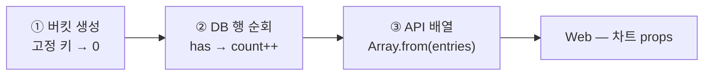
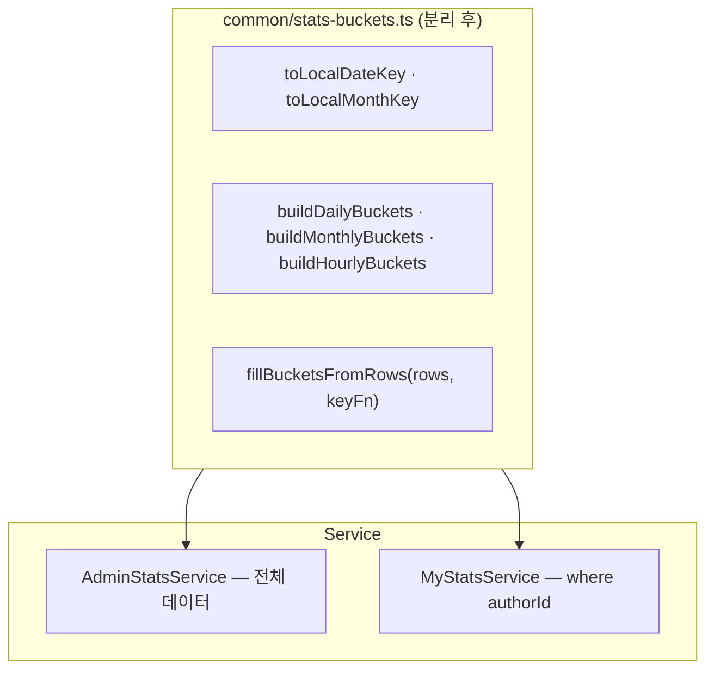

---
aliases:
  - stats bucket
  - time bucket
  - aggregation
  - buildDailyBuckets
tags:
  - NestJS
related:
  - "[[00_NestJS_Ecosystem_HomePage]]"
  - "[[JS_Map_Set]]"
  - "[[JS_Array_Methods]]"
  - "[[JS_Promise]]"
  - "[[NestJS_Prisma]]"
  - "[[React_Charts]]"
  - "[[JS_Date]]"
---
# NestJS_StatsBucket — 기간 버킷 집계 패턴

> [!info] 
> 시간축의 "고정 칸"을 먼저 0으로 채우고 → DB 행을 돌며 키별로 count를 올리고 → 그 결과를 API 배열로 내려주는 패턴이다. 막대/선 차트에서 데이터가 없는 날짜도 0으로 표시해야 할 때(통계 대시보드, GA 스타일 차트) 거의 표준처럼 쓰인다.

---

# 왜 이 패턴이 필요한가 — SQL GROUP BY만으로는 안 되는 것 ⭐️⭐️⭐️⭐️

```txt
SQL GROUP BY로 날짜별 count를 가져오면, 결과에는 데이터가 "있는 날"만 나옴
데이터가 없는 날은 그 행 자체가 결과에 없음(0건이 아니라 행이 통째로 빠짐)

근데 막대/선 차트는 "빈 날도 0으로" 보여줘야 의미 있는 추이가 됨 —
데이터 없는 날이 그래프에서 그냥 빠지면 x축 칸 수가 날마다 달라지고, 빈 기간이 시각적으로 안 드러남

→ "쿼리 결과"를 그대로 쓰는 게 아니라, 내가 먼저 정의한 "고정 칸"을 기준으로 시작해야 함
```

|상황|이 패턴|대안|
|---|---|---|
|막대·선 차트에 빈 날/달도 0으로 보여줘야 함|✅|SQL `GROUP BY`만 쓰면 빈 칸 누락|
|x축 순서가 과거→현재로 고정돼야 함|✅ (Map 삽입 순서)|매번 `sort` 필요|
|창 밖 데이터는 집계에서 제외해야 함|✅ (`buckets.has(key)`)|`WHERE`만으로는 경계가 밀릴 위험|
|단순 total 한 개만 필요|❌|`count()` 한 번이면 충분, 이 패턴 불필요|

---

# 3단계 흐름 ⭐️⭐️⭐️⭐️



|단계|하는 일|
|---|---|
|① 버킷|기간의 키를 미리 다 만들고 `count: 0`으로 채움|
|② 집계|`findMany`로 그 기간의 row를 가져와서, 각 row를 해당 키의 버킷에 +1|
|③ 응답|`Map` → `{ date, count }[]` 같은 배열로 변환|

---

# ① 버킷 생성 — 빈 칸을 먼저 만들기 ⭐️⭐️⭐️⭐️

```typescript
private toLocalDateKey(date: Date): string {
  const y = date.getFullYear();
  const m = String(date.getMonth() + 1).padStart(2, '0');
  const d = String(date.getDate()).padStart(2, '0');
  return `${y}-${m}-${d}`;
}

private buildDailyBuckets(days: number): Map<string, number> {
  const buckets = new Map<string, number>();
  const start = new Date();
  start.setHours(0, 0, 0, 0);
  start.setDate(start.getDate() - (days - 1));

  for (let i = 0; i < days; i++) {
    const day = new Date(start);
    day.setDate(start.getDate() + i);
    buckets.set(this.toLocalDateKey(day), 0);
  }

  return buckets;
}
```

```txt
앵커 시각(오늘 00:00 등)을 먼저 정하고, 거기서부터 연속된 N개의 키를 만들어 0으로 채움
→ 이 시점에는 DB를 한 번도 안 봤음 — "차트에 몇 칸이 있어야 하는가"만 먼저 결정하는 단계

Map에 넣는 순서가 곧 시간 순서(과거 → 현재)가 됨 — for 루프를 i=0부터 돌면서 그대로 set하기 때문
→ 나중에 배열로 꺼낼 때 따로 sort할 필요가 없는 이유가 여기서 이미 정해짐

toLocalDateKey/startOfDay/addDays 같은 날짜 계산 함수들 자체(왜 복사부터 해야 하는지,
getMonth()+1이 왜 필요한지 등)는 [[JS_Date]]에 스니펫으로 모아둠 — 여기서는 그 함수들을
"버킷 집계"라는 더 큰 패턴 안에서 어떻게 조합해 쓰는지에 집중
```

---

# ② DB 집계 — has()로 창 밖 데이터 거르기 ⭐️⭐️⭐️⭐️

```typescript
const recentDaily = await this.prisma.post.findMany({
  where: { createdAt: { gte: startOfDaily } },
  select: { createdAt: true },
});

for (const row of recentDaily) {
  const key = this.toLocalDateKey(row.createdAt);
  if (dailyBuckets.has(key)) {
    dailyBuckets.set(key, (dailyBuckets.get(key) ?? 0) + 1);
  }
}
```

```txt
findMany는 createdAt 컬럼만 select — 집계에 필요한 최소한의 데이터만 가져옴(불필요한 필드 전송 방지)

if (dailyBuckets.has(key)) 가 하는 일:
  ①에서 미리 만든 버킷 키 목록에 그 날짜가 있을 때만 count를 올림
  → WHERE 조건의 경계와 버킷의 경계가 정확히 안 맞는 경우(시간대 차이, 경계값 어긋남 등)에도
    버킷에 없는 키는 그냥 무시되므로 안전하게 창 밖 데이터를 걸러내는 안전망 역할을 함

get(key) ?? 0 — 이미 버킷이 0으로 초기화돼있지만, 혹시 모를 undefined에 대한 방어적 표기
(?? 의 동작 자체는 [[JS_OptionalChaining]] 참고)
```

---

# ③ API 배열로 변환 ⭐️⭐️⭐️

```typescript
const daily = Array.from(dailyBuckets.entries()).map(([date, count]) => ({
  date,
  count,
}));
```

```txt
Map은 그대로 JSON으로 응답할 수 없으므로(Map은 일반 객체/배열이 아님), 배열로 변환해야 함
Array.from(map.entries())로 [키, 값] 쌍의 배열을 만들고, map()으로 원하는 필드 이름(date/count)을 붙임
(Array.from과 Map.entries()의 관계 자체는 [[JS_Map_Set]] · [[JS_Array_Methods]] 참고)
```

---

# 왜 Map인가 — Record<string, number>와 비교 ⭐️⭐️⭐️

```txt
Record<string, number>로도 같은 걸 만들 수 있지만, Map이 이 패턴에 더 맞는 이유:
  has() / get() / set()으로 "있는지 확인 + 꺼내기 + 갱신"이 메서드로 명확히 드러남
  숫자 키(hour: 0~23)도 자연스럽게 키로 쓸 수 있음
  삽입 순서를 그대로 보장 — 객체도 보통은 순서를 지키지만 명세상 핵심 보장은 아님

(Map 자체의 기본 사용법과 Object 대비 언제 유리한지는 [[JS_Map_Set]] 참고 —
 이 노트에서 다루는 "카운팅 패턴"이 정확히 여기 버킷 집계의 토대가 되는 것)
```

---

# 전체 예시 — getStats() ⭐️⭐️⭐️⭐️

```typescript
const DAILY_STATS_DAYS = 7;
const MONTHLY_STATS_MONTHS = 12;

@Injectable()
export class StatsService {
  constructor(private readonly prisma: PrismaService) {}

  // ... toLocalDateKey, toLocalMonthKey, buildDailyBuckets, buildMonthlyBuckets, buildHourlyBuckets ...

  async getStats() {
    const startOfToday = new Date();
    startOfToday.setHours(0, 0, 0, 0);

    const startOfDaily = new Date(startOfToday);
    startOfDaily.setDate(startOfDaily.getDate() - (DAILY_STATS_DAYS - 1));

    const startOfMonthly = this.startOfMonth(new Date());
    startOfMonthly.setMonth(startOfMonthly.getMonth() - (MONTHLY_STATS_MONTHS - 1));

    // 서로 의존 관계 없는 조회들을 한꺼번에 — Promise.all 자체는 [[JS_Promise]] 참고
    const [total, hidden, today, recentDaily, recentMonthly] = await Promise.all([
      this.prisma.post.count(),
      this.prisma.post.count({ where: { hidden: true } }),
      this.prisma.post.count({ where: { createdAt: { gte: startOfToday } } }),
      this.prisma.post.findMany({
        where: { createdAt: { gte: startOfDaily } },
        select: { createdAt: true },
      }),
      this.prisma.post.findMany({
        where: { createdAt: { gte: startOfMonthly } },
        select: { createdAt: true },
      }),
    ]);

    const dailyBuckets = this.buildDailyBuckets(DAILY_STATS_DAYS);
    for (const row of recentDaily) {
      const key = this.toLocalDateKey(row.createdAt);
      if (dailyBuckets.has(key)) {
        dailyBuckets.set(key, (dailyBuckets.get(key) ?? 0) + 1);
      }
    }

    const daily = Array.from(dailyBuckets.entries()).map(([date, count]) => ({ date, count }));

    return { total, hidden, visible: total - hidden, today, daily /* , monthly, hourly */ };
  }
}
```

```txt
같은 함수 안에서 daily/monthly/hourly 세 버킷을 동시에 채울 수도 있음 — recentMonthly의 각 row에서
월 키(toLocalMonthKey)와 시간 키(getHours())를 동시에 뽑아서 monthlyBuckets/hourlyBuckets에
각각 반영하면, 한 번의 findMany 결과로 두 종류의 버킷을 동시에 집계할 수 있음(쿼리 한 번 절약)
```

---

# 데이터가 많아지면 — SQL이 직접 버킷을 만들게 전환 ⭐️⭐️⭐️

```txt
findMany + Map 방식은 "해당 기간의 모든 row를 메모리로 가져온 뒤 JS에서 직접 집계"하는 방식 —
데이터 건수가 작을 때는 충분히 빠르고 코드도 단순함

데이터가 커지면(수십만 건 이상) 전체 row를 매번 메모리로 끌어오는 비용이 부담스러워짐
→ 이때는 DB가 직접 집계(SQL GROUP BY)하고, 빈 기간은 generate_series 같은 SQL 함수로
  만들어서 LEFT JOIN하는 방식으로 옮기는 게 일반적인 다음 단계

바뀌는 것: "누가 버킷(고정 칸)을 만드는가" — JS의 Map(이 노트의 방식) vs DB의 generate_series
바뀌지 않는 것: 패턴의 개념 자체(고정 버킷 → 집계 → API 배열) — Map이 SQL로 옮겨갈 뿐, 흐름은 동일
→ 그래서 처음부터 SQL로 최적화하기보다, 데이터가 작을 때는 이 노트의 방식으로 시작하고
  실제로 느려지는 시점에 SQL 버전으로 교체하는 것이 합리적인 순서
```

---

# 공통 모듈로 분리하기 — 두 번째 통계 API가 생기면 ⭐️⭐️⭐️

```txt
처음엔 toLocalDateKey/buildDailyBuckets 같은 메서드들을 한 Service 안에 private으로 둬도 충분함
근데 비슷한 통계 API가 두 번째로 생기면(예: 전체 통계 + "내 글만" 통계) 그대로 복붙하기보다
공통 유틸로 분리하는 게 자연스러움
```



```txt
판단 기준: "이 로직을 두 번째로 복사해서 붙이고 있다"는 게 느껴지는 순간이 분리할 타이밍 —
처음부터 공통 모듈로 시작할 필요는 없음(아직 한 곳에서만 쓰는데 미리 추상화하면 과설계가 될 수 있음)
```

---

# 한눈에

```txt
패턴: 고정 시간 버킷(Map, count:0) → DB row로 집계(has로 창 밖 필터) → 배열로 변환해서 응답

이 패턴이 필요한 이유: SQL GROUP BY만 쓰면 데이터 없는 기간이 결과에서 통째로 빠짐
Map을 쓰는 이유: has/get/set이 명확하고, 숫자 키도 자연스럽고, 삽입 순서가 그대로 보장됨
배열 변환: Array.from(map.entries()).map(...) — Map은 그대로 JSON 응답에 못 씀

데이터가 작을 때: findMany + Map(이 노트)이 충분히 빠르고 단순함
데이터가 커지면: SQL GROUP BY + generate_series로 전환 — 개념은 그대로, 버킷을 만드는 주체만 바뀜

비슷한 통계 API가 두 번째로 생기는 시점에 공통 유틸로 분리(처음부터 미리 분리할 필요는 없음)

Web 쪽은 이 배열을 그대로 차트 data prop에 연결 — Nivo 등 차트 라이브러리 쪽 패턴은 [[React_Charts]] 참고
```