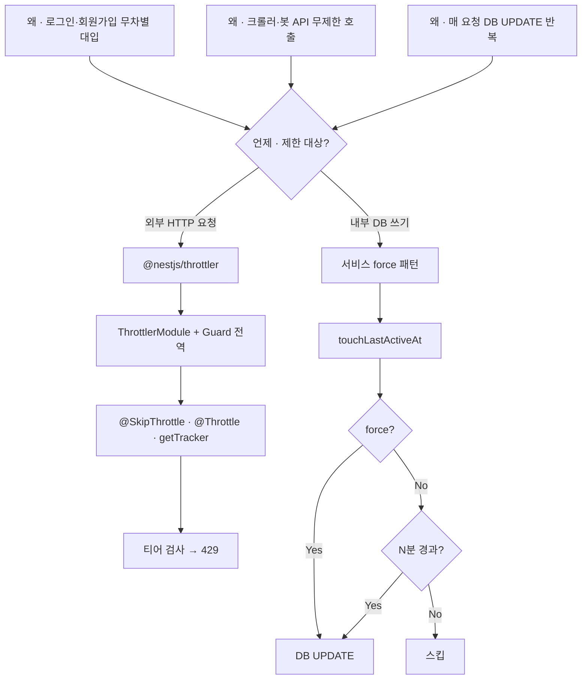

---
aliases:
  - fire-and-forget
  - rate limiting
  - throttling
tags:
  - NestJS
related:
  - "[[00_NestJS_Ecosystem_HomePage]]"
  - "[[JS_Date]]"
  - "[[JS_Map_Set]]"
  - "[[JS_Promise]]"
  - "[[NestJS_Prisma]]"
  - "[[React_useMemo_useCallback_useEffect]]"
  - "[[JS_Operators]]"
---
# NestJS_Throttle — Rate Limiting (요청 속도 제한)

> [!info] 
> Throttle = "일정 시간 안에 너무 많은 요청을 보내면 막는 것." 
> 브루트포스 공격, 로그인 무차별 대입, API 남용을 방어하는 기본 보안 수단이다.

---
# 흐름도



> `force: Yes` — 로그인 직후 · OAuth 콜백 · 관리자 강제  
> 다중 인스턴스 — Redis storage

---

# 왜 필요한가 ⭐️⭐️⭐️

```txt
Rate Limiting이 없으면:
  로그인 엔드포인트에 초당 수천 번 비밀번호 대입 시도 가능
  API를 크롤러가 무제한으로 긁어갈 수 있음
  서버 리소스가 고갈돼서 정상 사용자도 느려지거나 다운

Rate Limiting이 있으면:
  같은 IP에서 N번 초과 요청 → 429 Too Many Requests 자동 차단
  TTL(time window)이 지나면 카운트 리셋 → 정상 사용 가능
```

---

# 설치

```bash
pnpm add @nestjs/throttler
```

---

# 기본 설정 ⭐️⭐️⭐️⭐️

```typescript
// app.module.ts
import { ThrottlerModule, ThrottlerGuard } from '@nestjs/throttler';
import { APP_GUARD } from '@nestjs/core';

@Module({
  imports: [
    ThrottlerModule.forRoot([
      {
        name:  'default',
        ttl:   60_000,  // ms 단위 — 60초 창
        limit: 10,      // 60초 안에 최대 10번
      },
    ]),
  ],
  providers: [
    {
      provide:  APP_GUARD,
      useClass: ThrottlerGuard,  // 모든 라우트에 전역 적용
    },
  ],
})
export class AppModule {}
```

```txt
ThrottlerModule.forRoot([...]):
  배열로 여러 티어(short / medium / long)를 동시에 적용할 수 있음

APP_GUARD로 전역 등록:
  앱의 모든 라우트에 자동으로 ThrottlerGuard가 적용됨
  개별 컨트롤러에 @UseGuards(ThrottlerGuard)를 반복할 필요 없음

기본 동작:
  같은 IP에서 60초 안에 10번을 초과하면 → 429 Too Many Requests
  60초가 지나면 카운트 리셋
```

---

# 여러 티어 — short / medium / long ⭐️⭐️⭐️

```typescript
ThrottlerModule.forRoot([
  { name: 'short',  ttl: 1_000,   limit: 3   },  // 1초에 3번
  { name: 'medium', ttl: 10_000,  limit: 20  },  // 10초에 20번
  { name: 'long',   ttl: 60_000,  limit: 100 },  // 60초에 100번
]),
```

```txt
모든 티어가 동시에 적용됨 — 하나라도 초과하면 429
예: 1초에 3번 미만이어도 60초에 100번을 채우면 차단

용도:
  short  → 순간 버스트(짧은 시간에 집중) 공격 차단
  medium → 자동화 스크립트 탐지
  long   → 하루 사용량 제한 같은 쿼터 관리
```

---

# @Throttle() — 라우트별 개별 설정 ⭐️⭐️⭐️

```typescript
// 기본값보다 엄격하게 — 로그인처럼 민감한 엔드포인트
@Throttle({ default: { ttl: 60_000, limit: 5 } })
@Post('login')
login() { }

// 기본값보다 느슨하게 — 자주 호출되는 읽기 전용 엔드포인트
@Throttle({ default: { ttl: 60_000, limit: 100 } })
@Get('feed')
getFeed() { }
```

```txt
@Throttle(config)의 키('default'):
  ThrottlerModule.forRoot에서 지정한 name과 일치해야 함
  여러 티어를 쓸 때는 { short: {...}, long: {...} } 처럼 여러 개 지정 가능

클래스에 붙이면 그 컨트롤러의 모든 라우트에 적용:
  @Throttle({ default: { ttl: 60_000, limit: 5 } })
  @Controller('auth')
  export class AuthController { ... }
```

---

# @SkipThrottle() — 특정 라우트 제외 ⭐️⭐️

```typescript
// 이 라우트는 Rate Limiting 적용 안 함
@SkipThrottle()
@Get('health')
healthCheck() { return 'ok'; }

// 컨트롤러 전체 제외 + 특정 라우트만 다시 적용
@SkipThrottle()
@Controller('internal')
export class InternalController {
  @SkipThrottle({ default: false })  // 이 라우트는 다시 적용
  @Post('sync')
  sync() { }
}
```

```txt
사용 사례:
  헬스체크(/health, /ping)  → 모니터링 도구가 자주 호출하므로 제외
  내부 서버간 통신          → IP가 고정돼 있어서 제한 불필요
  정적 리소스               → 이미지, 파일 서빙
```

---

# 응답 — 429 Too Many Requests ⭐️⭐️

```txt
제한 초과 시 자동으로 반환되는 응답:

HTTP/1.1 429 Too Many Requests
Retry-After: 60                    ← 몇 초 후 다시 시도 가능한지
X-RateLimit-Limit: 10              ← 허용된 최대 요청 수
X-RateLimit-Remaining: 0           ← 남은 요청 수
X-RateLimit-Reset: 1720000000      ← 리셋 시간 (Unix timestamp)

{
  "statusCode": 429,
  "message": "ThrottlerException: Too Many Requests"
}
```

---

# 커스텀 key — IP 대신 userId ⭐️⭐️⭐️

```txt
기본값은 IP 기반 제한
IP를 공유하는 회사망, 학교 등에서는 한 IP에 여러 사용자가 있어서 문제가 될 수 있음
→ 로그인한 사용자라면 userId 기반으로 전환 가능
```

```typescript
// throttler.guard.ts — 커스텀 Guard
@Injectable()
export class UserThrottlerGuard extends ThrottlerGuard {
  protected async getTracker(req: Request): Promise<string> {
    // 로그인 사용자: userId 기반
    // 비로그인: IP 기반 (폴백)
    return req.user?.id?.toString() ?? req.ip ?? 'unknown';
  }
}
```

```typescript
// app.module.ts에서 교체
providers: [
  {
    provide:  APP_GUARD,
    useClass: UserThrottlerGuard,  // 기본 ThrottlerGuard 대신
  },
],
```

---

# Storage — Redis 연동 (선택) ⭐️⭐️

```typescript
// 기본: 메모리 저장 — 서버 재시작 시 리셋, 단일 인스턴스에서만 동작
// Redis: 서버 여러 대에서 카운트 공유 가능

pnpm add @nestjs/throttler ioredis

// throttler-redis.module.ts
import { ThrottlerStorageRedisService } from '@nestjs-modules/ioredis-throttler';

ThrottlerModule.forRoot({
  throttlers: [{ ttl: 60_000, limit: 10 }],
  storage: new ThrottlerStorageRedisService(redisClient),
}),
```

```txt
메모리 저장 사용 시 문제:
  서버 인스턴스가 2개 있으면 각자 카운트를 별도로 유지
  → 인스턴스 A에서 5번, 인스턴스 B에서 5번 → 합계 10번인데 아무도 차단 못 함

Railway/Vercel처럼 인스턴스가 하나라면 메모리 저장으로 충분
스케일아웃 환경이라면 Redis 저장 필요
```

---
# 서비스 레벨 쓰로틀 — `force` 플래그 패턴 ⭐️⭐️⭐️⭐️

```txt
지금까지 다룬 @nestjs/throttler는 HTTP 요청 단위 Rate Limiting (외부 공격 방어)
여기서 다루는 건 서비스 내부에서 "너무 자주 실행하지 않도록 스스로 제한하는" 패턴

예: lastActiveAt 업데이트
  매 요청마다 DB를 업데이트하면 불필요한 DB 쓰기가 너무 많음
  → "마지막 업데이트로부터 N분 이내면 스킵"하는 내부 쓰로틀 로직
  → 단, 로그인 직후 같은 경우엔 반드시 갱신해야 함 → force로 우회
```

## 기본 구현

```typescript
interface TouchOptions {
  force?: boolean;  // true면 내부 쓰로틀 건너뜀
}

@Injectable()
export class AuthService {
  private readonly THROTTLE_MS = 5 * 60 * 1000; // 5분

  async touchLastActiveAt(
    userId: number,
    role:   string,
    { force = false }: TouchOptions = {},
  ): Promise<void> {
    if (!force) {
      // 마지막 업데이트로부터 5분 이내면 스킵
      const user = await this.prisma.user.findUnique({
        where:  { id: userId },
        select: { lastActiveAt: true },
      });
      const elapsed = Date.now() - (user?.lastActiveAt?.getTime() ?? 0);
      if (elapsed < this.THROTTLE_MS) return;
    }

    // force: true거나 5분이 지났으면 업데이트
    await this.prisma.user.update({
      where: { id: userId },
      data:  { lastActiveAt: new Date() },
    });
  }
}
```

## 호출 — force를 언제 쓰는가

```typescript
// 일반 요청 — 쓰로틀 적용 (5분 이내면 스킵)
await this.touchLastActiveAt(userId, role);

// 로그인 직후 — 반드시 갱신 (쓰로틀 건너뜀)
await this.touchLastActiveAt(existingAccount.user.id, existingAccount.user.role, { force: true });

// 관리자 강제 갱신
await this.touchLastActiveAt(targetUserId, role, { force: true });
```

```txt
force: true가 필요한 상황:
  로그인 성공 직후  → 로그인 시점이 lastActiveAt 기준이라 반드시 갱신
  소셜 로그인 콜백  → OAuth 완료 = 활동 이벤트
  관리자 수동 갱신  → 일반 규칙과 무관하게 강제 실행

force 없이 그냥 호출하면:
  로그인 직전에 다른 요청으로 lastActiveAt이 갱신됐을 수 있음
  → 5분 이내라 스킵 → 로그인 시간이 정확히 기록 안 됨

옵션 객체 패턴({ force = false }) 자체 → [[JS_Operators]] 참고
```

---

# 실전 설정 예시 — 인증 서버 ⭐️⭐️⭐️

```typescript
ThrottlerModule.forRoot([
  { name: 'short', ttl: 1_000,  limit: 3  },  // 1초에 3번 — 버스트 방어
  { name: 'long',  ttl: 60_000, limit: 20 },  // 60초에 20번 — 전체 제한
]),
```

```typescript
@Controller('auth')
export class AuthController {

  // 로그인 — 가장 엄격하게
  @Throttle({ short: { limit: 1 }, long: { limit: 5 } })
  @Post('login')
  login() { }

  // 회원가입 — 엄격하게
  @Throttle({ short: { limit: 1 }, long: { limit: 3 } })
  @Post('register')
  register() { }

  // OAuth 시작 — 브라우저가 리다이렉트를 여러 번 할 수 있어서 느슨하게
  @Throttle({ short: { limit: 3 }, long: { limit: 10 } })
  @Get('google')
  googleLogin() { }

  // 헬스체크 — 제외
  @SkipThrottle()
  @Get('health')
  health() { return 'ok'; }
}
```

---

# 한눈에

```txt
설치: pnpm add @nestjs/throttler

전역 적용:
  ThrottlerModule.forRoot([{ name, ttl(ms), limit }])
  APP_GUARD + ThrottlerGuard → 모든 라우트 자동 적용

티어:
  배열로 short / medium / long 동시 적용 가능
  하나라도 초과하면 429

라우트별 조정:
  @Throttle({ tiername: { ttl, limit } }) → 개별 설정
  @SkipThrottle()                          → 제외

기본: IP 기반 카운트
커스텀: ThrottlerGuard 상속 → getTracker()에서 userId 등으로 변경

429 Too Many Requests — 헤더에 Retry-After, X-RateLimit-* 포함

메모리 저장(기본) vs Redis(다중 인스턴스):
  단일 서버 → 메모리로 충분
  스케일아웃 → Redis 필요
```
