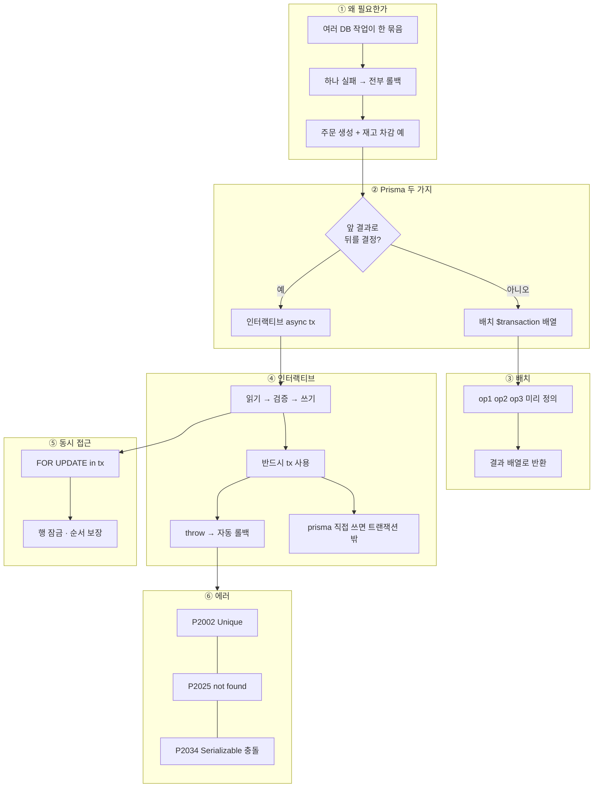

---
aliases:
  - Transaction
  - 트랜잭션
tags:
  - NestJS
related:
  - "[[00_NestJS_Ecosystem_HomePage]]"
  - "[[DB_Transaction]]"
  - "[[NestJS_Idempotency]]"
  - "[[NestJS_Prisma]]"
---
# NestJS_Transaction — Prisma 트랜잭션

> [!info] 
> Prisma에서 트랜잭션을 쓰는 방법은 두 가지 — 배치 방식(`$transaction([...])`)과 인터랙티브 방식(`$transaction(async (tx) => {})`)
> DB 트랜잭션 개념(ACID, 격리 수준) → [[DB_Transaction]]

---
# 흐름도



```txt
배치 = 독립 작업 묶음 · 인터랙티브 = 읽고 분기 후 쓰기 · 콜백 안은 tx만
동시 재고 차감은 tx + FOR UPDATE · 중복 방어는 [[NestJS_Idempotency]] · ACID는 [[DB_Transaction]]
```

---

# 왜 트랜잭션이 필요한가 ⭐️⭐️⭐️

```typescript
// ❌ 트랜잭션 없음 — 주문 생성 후 재고 차감 실패하면 데이터 불일치
await prisma.order.create({ data: { userId, productId } });
await prisma.product.update({
  where: { id: productId },
  data:  { stock: { decrement: 1 } },
});
// 첫 번째는 성공, 두 번째에서 에러 → 주문은 있는데 재고는 안 줄어든 상태

// ✅ 트랜잭션 — 둘 다 성공 or 둘 다 롤백
await prisma.$transaction(async (tx) => {
  await tx.order.create({ data: { userId, productId } });
  await tx.product.update({
    where: { id: productId },
    data:  { stock: { decrement: 1 } },
  });
});
```

---

# 방식 1 — 배치 트랜잭션 `$transaction([...])` ⭐️⭐️⭐️

```typescript
// 미리 정의한 Prisma 작업들을 배열로 넘김 → 한 트랜잭션으로 실행
const [order, updatedProduct] = await prisma.$transaction([
  prisma.order.create({ data: { userId, productId } }),
  prisma.product.update({
    where: { id: productId },
    data:  { stock: { decrement: 1 } },
  }),
]);
```

```txt
특징:
  반환값은 배열 — 넘긴 순서대로 결과를 구조분해로 받음
  작업 간에 데이터 의존성이 없을 때 적합 (앞 작업의 결과를 다음 작업에 못 씀)
  작업들이 모두 미리 정의되어 있어야 함 (런타임 분기 불가)

언제 쓰는가:
  독립적인 여러 INSERT/UPDATE를 한 번에 묶을 때
  작업 순서나 조건이 고정돼 있을 때
```

---

# 방식 2 — 인터랙티브 트랜잭션 `$transaction(async tx => {})` ⭐️⭐️⭐️⭐️

```typescript
await prisma.$transaction(async (tx) => {
  // tx = 트랜잭션용 Prisma 클라이언트 (prisma 대신 이걸 써야 같은 트랜잭션)

  // 먼저 읽고
  const product = await tx.product.findUnique({ where: { id: productId } });
  if (!product || product.stock <= 0) {
    throw new Error('재고 없음');  // throw하면 자동 롤백
  }

  // 읽은 결과로 조건 분기 후 쓰기
  await tx.order.create({ data: { userId, productId } });
  await tx.product.update({
    where: { id: productId },
    data:  { stock: { decrement: 1 } },
  });
});
```

```txt
특징:
  콜백 안에서 자유롭게 조건 분기, 읽기 → 계산 → 쓰기 가능
  throw하면 자동 롤백 (try/catch 없이도)
  tx를 통해 실행한 쿼리들이 모두 같은 트랜잭션 연결을 공유

⚠️ 반드시 tx를 사용해야 함
  콜백 안에서 prisma를 쓰면 → 트랜잭션 밖에서 실행됨 → 트랜잭션 보장 없음

  ❌ 콜백 안에서 prisma 사용 (트랜잭션 외부)
  await prisma.$transaction(async (tx) => {
    await prisma.order.create(...)   // ← prisma (❌ 트랜잭션 밖)
    await tx.product.update(...)     // ← tx (✅ 트랜잭션 안)
  });
```

## NestJS Service에서 사용 패턴

```typescript
@Injectable()
export class OrderService {
  constructor(private readonly prisma: PrismaService) {}

  async createOrder(userId: number, productId: number) {
    return this.prisma.$transaction(async (tx) => {
      // 재고 확인
      const product = await tx.product.findUnique({
        where: { id: productId },
        select: { id: true, stock: true, price: true },
      });

      if (!product) throw new NotFoundException('상품을 찾을 수 없습니다.');
      if (product.stock <= 0) throw new BadRequestException('재고가 없습니다.');

      // 주문 생성
      const order = await tx.order.create({
        data: { userId, productId, amount: product.price },
      });

      // 재고 차감
      await tx.product.update({
        where: { id: productId },
        data:  { stock: { decrement: 1 } },
      });

      return order;
    });
  }
}
```

---

# 격리 수준 / 타임아웃 옵션 ⭐️⭐️

```typescript
// 격리 수준 변경 (기본: READ COMMITTED)
await prisma.$transaction(async (tx) => {
  // ...
}, {
  isolationLevel: Prisma.TransactionIsolationLevel.Serializable,
  timeout:        5000,   // ms — 트랜잭션 최대 실행 시간 (초과 시 롤백)
  maxWait:        2000,   // ms — 트랜잭션 연결 풀에서 기다리는 최대 시간
});
```

```txt
Prisma.TransactionIsolationLevel:
  ReadUncommitted  / ReadCommitted (기본) / RepeatableRead / Serializable

언제 격리 수준을 올리는가:
  RepeatableRead  같은 데이터를 트랜잭션 안에서 두 번 읽는데 일관성이 필요할 때
  Serializable    완벽한 직렬화가 필요한 금융 계산 등 (성능 트레이드오프 있음)

격리 수준 개념 → [[DB_Transaction]]
```

---

# 비관적 잠금 — FOR UPDATE ⭐️⭐️⭐️

```typescript
// Prisma ORM으로 직접 지원 안 함 → $queryRaw 사용
await prisma.$transaction(async (tx) => {
  // 행 잠금 — 다른 트랜잭션의 수정 차단
  const [product] = await tx.$queryRaw<{ id: number; stock: number }[]>`
    SELECT id, stock FROM "Product"
    WHERE id = ${productId}
    FOR UPDATE
  `;

  if (product.stock <= 0) throw new BadRequestException('재고 없음');

  await tx.product.update({
    where: { id: productId },
    data:  { stock: { decrement: 1 } },
  });
});
```

```txt
FOR UPDATE가 필요한 경우:
  "읽고 → 검증하고 → 쓰기"를 원자적으로 보장해야 할 때
  (인터랙티브 트랜잭션만으로는 동시에 여러 요청이 같은 값을 읽고 통과할 수 있음)

비관적 잠금 vs 낙관적 잠금 선택 기준:
  충돌이 드물다  → 낙관적 잠금 (version 필드, 충돌 시 재시도)
  충돌이 빈번하다 → 비관적 잠금 (FOR UPDATE, 순서 보장)
  → [[NestJS_Idempotency]] 참고
```

---

# 에러 처리 ⭐️⭐️⭐️

```typescript
async createOrder(userId: number, productId: number) {
  try {
    return await this.prisma.$transaction(async (tx) => {
      const product = await tx.product.findUnique({ where: { id: productId } });
      if (!product) throw new NotFoundException('상품 없음');

      // ... 나머지 로직
    });
  } catch (e) {
    // Prisma 에러 분류
    if (e instanceof Prisma.PrismaClientKnownRequestError) {
      if (e.code === 'P2002') throw new ConflictException('중복 요청입니다.');
      if (e.code === 'P2025') throw new NotFoundException('데이터를 찾을 수 없습니다.');
    }

    // 직접 throw한 NestJS HTTP 예외는 그대로 올려보냄
    if (e instanceof HttpException) throw e;

    // 예상 못 한 에러
    throw new InternalServerErrorException('주문 처리 중 오류가 발생했습니다.');
  }
}
```

```txt
$transaction 안에서 throw하면:
  → 자동으로 ROLLBACK → 예외가 $transaction 밖으로 전파

Prisma 에러 코드:
  P2002  Unique constraint 위반
  P2025  Record not found (update/delete 대상 없음)
  P2034  트랜잭션 충돌 (Serializable에서 발생 → 재시도 필요)

P2034 재시도 패턴:
  Serializable 격리 수준에서는 충돌 감지 후 에러를 던짐
  → catch에서 P2034 확인 후 재시도 로직 구현
```

---

# 배치 vs 인터랙티브 — 언제 뭘 쓰는가

| |배치 `$transaction([...])`|인터랙티브 `$transaction(async tx => {})`|
|---|---|---|
|작업 간 의존성|없음|있음 (앞 결과로 뒤를 결정)|
|조건 분기|불가|가능|
|코드 복잡도|낮음|높음|
|사용 예|여러 테이블 동시 INSERT|읽고 검증하고 쓰기|

---

# 한눈에

```txt
두 가지 방식:
  배치   $transaction([op1, op2, op3])
         → 독립적인 작업 묶음, 결과는 배열로 반환
  인터랙티브  $transaction(async (tx) => { ... })
         → 콜백 안에서 자유롭게 읽기·분기·쓰기
         → throw하면 자동 롤백
         → 반드시 tx 사용 (prisma 직접 쓰면 트랜잭션 밖)

격리 수준 변경:
  $transaction(fn, { isolationLevel: Prisma.TransactionIsolationLevel.Serializable })

비관적 잠금 (FOR UPDATE):
  $queryRaw`SELECT ... FOR UPDATE` → Prisma ORM이 직접 지원 안 해서 raw 필요
  충돌이 빈번할 때 사용 ([[NestJS_Idempotency]] 참고)

에러:
  P2002 Unique 위반 → ConflictException
  P2025 대상 없음   → NotFoundException
  P2034 트랜잭션 충돌 (Serializable) → 재시도

DB 트랜잭션 개념 (ACID · 격리 수준 · 데드락) → [[DB_Transaction]]
```