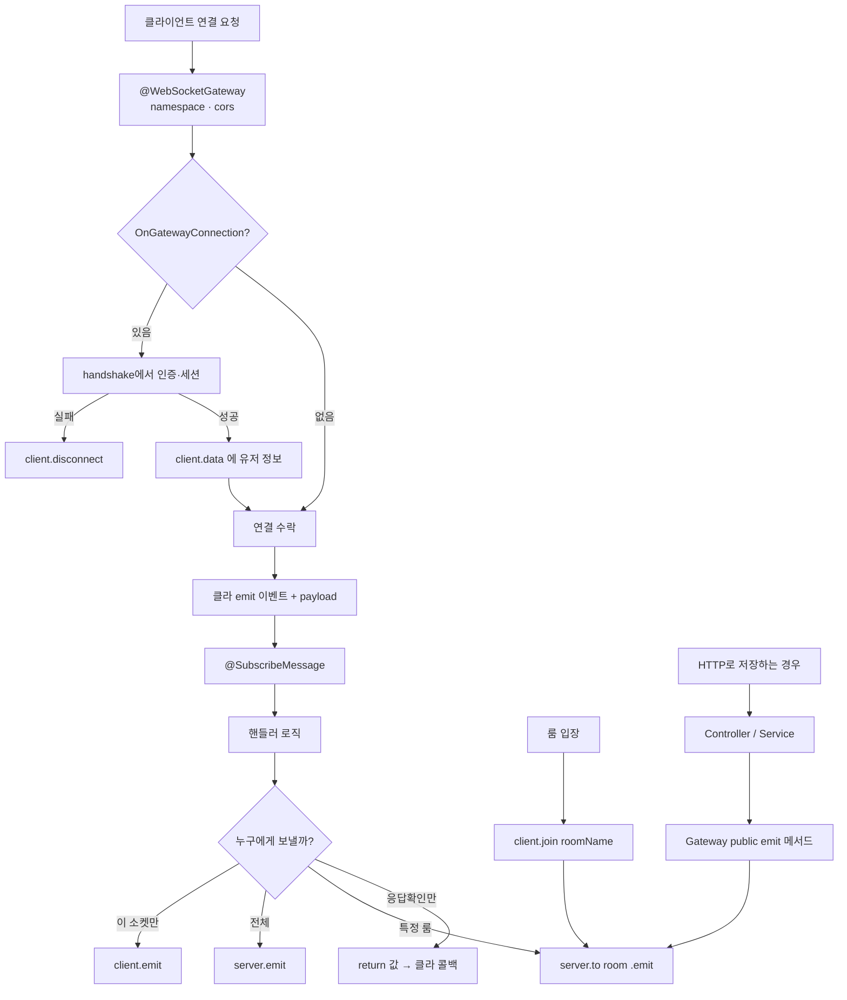

---
aliases:
  - WebSocket
  - SocketIO
  - Gateway
  - Realtime
tags:
  - NestJS
related:
  - "[[00_NestJS_Ecosystem_HomePage]]"
  - "[[NestJS_Module]]"
  - "[[NestJS_JwtGuard]]"
  - "[[NestJS_Auth]]"
  - "[[NextJS_WebSocket]]"
---
# NestJS_WebSocket — 실시간 통신 & Socket.IO Gateway

> [!info] 
> WebSocket = 연결을 유지하며 서버↔클라이언트가 양방향으로 메시지를 주고받는 프로토콜. 
> NestJS에서는 `@WebSocketGateway` 데코레이터로 Socket.IO 서버를 선언하고, `Socket` 객체가 각 클라이언트 연결 하나를 대표한다.

---
# 흐름도



```txt
한 줄:
  연결(인증) → 이벤트 구독 → emit 범위(나 / 전체 / 룸) 선택
  DB가 필요하면 REST(또는 서비스)로 저장 후 Gateway가 브로드캐스트
```

---

# HTTP vs WebSocket ⭐️⭐️⭐️

```txt
HTTP (요청-응답):
  클라이언트가 요청해야 서버가 응답 — 연결이 매번 끊김
  서버가 먼저 클라이언트에게 데이터를 보낼 수 없음

WebSocket (양방향 연결 유지):
  한 번 연결되면 연결이 계속 살아있음
  서버 → 클라이언트 방향으로도 언제든 전송 가능
  채팅, 실시간 알림, 라이브 피드, 게임에 적합

Socket.IO:
  WebSocket 위에 자동 재연결 · 룸(Room) · 폴백(polling) 등을 추가한 라이브러리
  WebSocket이 안 되는 환경에서 자동으로 HTTP 폴링으로 대체
```

---

# 설치

```bash
pnpm add @nestjs/websockets @nestjs/platform-socket.io socket.io
pnpm add socket.io-client  # 클라이언트(Next.js 등)
```

---

# Socket 객체 — 클라이언트 연결 하나 ⭐️⭐️⭐️⭐️

```typescript
import { Socket } from 'socket.io';
```

```txt
Socket = 서버에 연결된 클라이언트 하나를 나타내는 객체
  HTTP Request 객체와 비슷한 역할 — 이 연결의 정보에 접근하고, 이 연결로 메시지를 보냄
  @ConnectedSocket() client: Socket 으로 핸들러 파라미터에서 받음
```

## Socket의 주요 속성

```typescript
client.id           // 이 연결의 고유 ID (서버가 자동 부여, 재연결 시 바뀜)
client.handshake    // 연결 시점의 정보 (토큰, 쿼리, 헤더 등)
client.data         // 이 소켓에 자유롭게 저장할 수 있는 공간 (userId 등)
client.rooms        // 이 소켓이 현재 입장한 룸 Set
client.connected    // 현재 연결 상태 (boolean)
```

## handshake — 연결 시 클라이언트가 보낸 정보

```typescript
client.handshake.auth     // 연결 시 auth 옵션으로 보낸 객체  { token: '...' }
client.handshake.query    // 연결 URL 쿼리스트링              ?token=...
client.handshake.headers  // HTTP 헤더
client.handshake.address  // 클라이언트 IP 주소
client.handshake.time     // 연결 시각

// 토큰 추출 — auth 우선, 없으면 query에서
const token =
  (client.handshake.auth?.token as string | undefined) ??
  (client.handshake.query?.token as string | undefined);
```

```txt
왜 auth와 query 둘 다 체크하는가:
  브라우저 WebSocket은 일반 HTTP Authorization 헤더를 못 보냄
  Socket.IO 클라이언트에서 io(url, { auth: { token } }) 로 연결 시 → handshake.auth
  일부 환경(WebView 등)에서 쿼리스트링으로 보낼 때 → handshake.query
  → 두 곳 모두 확인해서 어느 방식이든 지원
```

## client.data — 소켓별 데이터 저장소

```typescript
// handleConnection에서 검증 후 저장
client.data.userId = payload.sub;

// 이후 모든 핸들러에서 꺼내 씀
const userId = client.data.userId;
```

```txt
client.data의 특징:
  이 소켓 연결이 살아있는 동안 유지
  소켓별로 독립적 (다른 클라이언트의 data에 영향 없음)
  타입 안전성을 위해 확장 필요 (아래 AuthedSocket 참고)
```

---

# AuthedSocket — Socket 타입 확장 ⭐️⭐️⭐️⭐️

```typescript
import { Socket } from 'socket.io';

// Socket의 data 필드는 기본적으로 any 타입
// → 교차 타입(intersection type)으로 data에 타입을 추가
type AuthedSocket = Socket & { data: { userId?: string } };
```

```txt
Socket & { data: { userId?: string } } 읽는 방법:
  Socket의 모든 기능을 가지면서
  추가로 data.userId?: string 타입이 붙어있는 객체

왜 필요한가:
  Socket 기본 타입에서 client.data.userId는 타입이 any
  AuthedSocket을 쓰면 client.data.userId가 string | undefined로 명확해짐
  → 핸들러 안에서 타입 자동완성 + null 체크 강제

userId?  (optional):
  handleConnection에서 검증 실패 시 disconnect하지만
  혹시 모를 경우를 위해 optional로 두어 핸들러에서 방어 코드 작성
```

---

# REST API + WebSocket 브로드캐스트 연결 ⭐️⭐️⭐️⭐️

```txt
가장 흔한 패턴:
  POST /rooms/:id/messages (REST)
  → DB에 메시지 저장
  → 같은 방의 WebSocket 클라이언트들에게 새 메시지 브로드캐스트

문제 — Service↔Gateway 순환 참조:
  RoomsGateway → RoomsService (join 시 권한 확인)
  RoomsService → RoomsGateway (저장 후 emit)
  → 서로를 주입하면 순환 참조(Circular Dependency) 에러

해결 — Controller가 중계:
  RoomsGateway  →  RoomsService  (Gateway가 Service에 의존 — 단방향 유지)
  RoomsController →  RoomsService  (REST 처리)
                  →  RoomsGateway  (emit 호출)
  Controller에서 Service 저장 → Gateway emit 순서로 호출
  → 순환 없이 단방향 의존
```

## Gateway에 public emit 메서드 추가 ⭐️⭐️⭐️⭐️

```typescript
@WebSocketGateway({ ... })
export class RoomsGateway implements OnGatewayConnection {
  @WebSocketServer()
  server: Server;

  // ... handleConnection, @SubscribeMessage ...

  /** REST로 저장된 메시지를 방 소켓에 전파 */
  emitMessage(roomId: string, message: unknown) {
    this.server.to(`room:${roomId}`).emit('message', message);
  }

  /** 삭제된 메시지 알림 */
  emitMessageDeleted(roomId: string, messageId: string) {
    this.server.to(`room:${roomId}`).emit('message:deleted', { messageId });
  }
}
```

```txt
Gateway의 emit 메서드:
  server.to(...).emit(...)을 직접 노출하는 게 아니라
  의미 있는 메서드 이름(emitMessage, emitMessageDeleted)으로 감쌈
  → 호출하는 쪽(Controller)이 이벤트 이름을 몰라도 됨
  → 이벤트 이름이 바뀌어도 Gateway 안에서만 수정
```

## Controller — REST 저장 후 브로드캐스트 ⭐️⭐️⭐️⭐️

```typescript
@Controller('rooms')
export class RoomsController {
  constructor(
    private readonly roomsService: RoomsService,
    private readonly roomsGateway: RoomsGateway,  // Gateway를 Controller에 주입
  ) {}

  @ApiOperation({ summary: '방 메시지 전송' })
  @Post(':id/messages')
  async sendMessage(
    @UserId() userId: string,
    @Param('id', ParseUUIDPipe) roomId: string,
    @Body() dto: CreateRoomMessageDto,
  ) {
    // ① REST: DB에 저장
    const message = await this.roomsService.createMessage(roomId, userId, dto);

    // ② WS: 방 멤버들에게 브로드캐스트
    this.roomsGateway.emitMessage(roomId, message);

    // ③ HTTP 응답 반환
    return message;
  }

  @Delete(':id/messages/:messageId')
  async deleteMessage(
    @UserId() userId: string,
    @Param('id', ParseUUIDPipe) roomId: string,
    @Param('messageId', ParseUUIDPipe) messageId: string,
  ) {
    await this.roomsService.deleteMessage(messageId, userId);
    this.roomsGateway.emitMessageDeleted(roomId, messageId);
    return { ok: true };
  }
}
```

```txt
흐름:
  클라이언트 → POST /rooms/:id/messages
  → DB 저장 (roomsService.createMessage)
  → WebSocket 브로드캐스트 (roomsGateway.emitMessage)
  → HTTP 응답

  브로드캐스트가 실패해도 HTTP 응답은 이미 저장된 메시지 반환
  → void로 처리하거나 try-catch 추가 가능 (요구사항에 따라)
```

## 모듈 설정 — 같은 모듈에 Controller + Gateway ⭐️⭐️⭐️

```typescript
@Module({
  providers:   [RoomsGateway, RoomsService],  // Gateway는 providers에
  controllers: [RoomsController],
})
export class RoomsModule {}
```

```txt
같은 모듈 안에 있으면:
  RoomsController가 RoomsGateway를 주입받을 수 있음
  별도 exports 필요 없음 (같은 모듈 내부)

다른 모듈에서 Gateway를 쓴다면:
  exports: [RoomsGateway] 추가 필요
```

---

# CORS 설정 상세 ⭐️⭐️⭐️

```typescript
@WebSocketGateway({
  namespace: '/chat',
  cors: {
    origin: [
      'http://localhost:3031',
      'http://127.0.0.1:3031',
      // 환경변수가 있으면 파싱해서 origin만 추출
      process.env.FRONTEND_URL
        ? new URL(process.env.FRONTEND_URL).origin
        : undefined,
    ].filter(Boolean),  // undefined 제거
    credentials: true,
  },
})
```

```txt
origin: true  vs  origin: [배열]:
  true    → 어떤 출처에서든 연결 허용 (개발 시 편하지만 운영에서는 위험)
  [배열]  → 허용할 출처를 명시적으로 나열 (운영 권장)

new URL(process.env.FRONTEND_URL).origin:
  'https://my-app.vercel.app/some/path' → 'https://my-app.vercel.app'
  URL 전체가 아니라 origin(프로토콜+도메인+포트)만 추출
  환경변수에 경로가 포함돼도 정확한 origin을 얻을 수 있음

.filter(Boolean):
  FRONTEND_URL 환경변수가 없으면 ternary가 undefined 반환
  배열에 undefined가 있으면 에러 → filter(Boolean)으로 제거

credentials: true:
  쿠키/인증 헤더를 포함한 요청 허용
  클라이언트 socket.io에서 withCredentials: true 와 세트로 필요
```

---

# Gateway 전체 구현 ⭐️⭐️⭐️⭐️

```typescript
import {
  ConnectedSocket, MessageBody, OnGatewayConnection,
  SubscribeMessage, WebSocketGateway, WebSocketServer,
} from '@nestjs/websockets';
import { ConfigService } from '@nestjs/config';
import { JwtService } from '@nestjs/jwt';
import { Server, Socket } from 'socket.io';
import type { JwtPayload } from 'src/auth/jwt-payload';
import { EnvKeys } from 'src/config/env.keys';
import { RoomsService } from './rooms.service';

// Socket에 data 타입 추가 — data.userId가 string | undefined임을 명시
type AuthedSocket = Socket & { data: { userId?: string } };

@WebSocketGateway({
  namespace: '/chat',                         // ws://host/chat 로 연결
  cors:      { origin: true, credentials: true },
})
export class RoomsGateway implements OnGatewayConnection {

  @WebSocketServer()
  server: Server;

  constructor(
    private readonly jwtService:    JwtService,
    private readonly configService: ConfigService,
    private readonly roomsService:  RoomsService,
  ) {}

  // 클라이언트가 연결될 때 자동 실행 — 여기서 인증 처리
  async handleConnection(client: AuthedSocket) {
    try {
      // auth 우선, 없으면 query에서 토큰 추출
      const token =
        (client.handshake.auth?.token as string | undefined) ??
        (client.handshake.query?.token as string | undefined);

      if (!token) { client.disconnect(); return; }

      // verifyAsync — 비동기 JWT 검증 (verify의 async 버전)
      const payload = await this.jwtService.verifyAsync<JwtPayload>(token, {
        secret: this.configService.getOrThrow(EnvKeys.API_JWT_SECRET),
      });

      client.data.userId = payload.sub;   // 이후 핸들러에서 꺼내 씀
    } catch {
      client.disconnect();  // 검증 실패 → 연결 강제 해제
    }
  }

  // 룸 입장
  @SubscribeMessage('join')
  async onJoin(
    @ConnectedSocket() client: AuthedSocket,
    @MessageBody() body: { roomId: string },
  ) {
    const userId = client.data.userId;
    if (!userId || !body?.roomId) return { ok: false };

    // 멤버인지 확인 (권한 없으면 throw → 자동으로 에러 응답)
    await this.roomsService.listMessages(body.roomId, userId);
    await client.join(`room:${body.roomId}`);  // 룸 이름에 prefix 붙이는 관행
    return { ok: true, roomId: body.roomId };  // acknowledgement
  }

  // 룸 퇴장
  @SubscribeMessage('leave')
  async onLeave(
    @ConnectedSocket() client: AuthedSocket,
    @MessageBody() body: { roomId: string },
  ) {
    if (!body?.roomId) return { ok: false };
    await client.leave(`room:${body.roomId}`);
    return { ok: true, roomId: body.roomId };
  }

  // 메시지 전송
  @SubscribeMessage('send-message')
  async onMessage(
    @ConnectedSocket() client: AuthedSocket,
    @MessageBody() body: { roomId: string; content: string },
  ) {
    const userId = client.data.userId;
    if (!userId || !body?.roomId || !body?.content) return { ok: false };

    const message = await this.roomsService.createMessage(
      body.roomId, userId, body.content
    );

    // 룸의 모든 클라이언트에게 브로드캐스트
    this.server.to(`room:${body.roomId}`).emit('new-message', message);
    return { ok: true };
  }
}
```

---

# acknowledgement — return 값의 의미 ⭐️⭐️⭐️

```typescript
// @SubscribeMessage 핸들러가 값을 return하면
// 클라이언트에게 "응답"으로 전달됨 (acknowledgement)
@SubscribeMessage('join')
async onJoin(...): Promise<{ ok: boolean; roomId?: string }> {
  if (에러) return { ok: false };          // 실패 응답
  return { ok: true, roomId: body.roomId }; // 성공 응답
}
```

```typescript
// 클라이언트(socket.io-client)에서 받는 방법
socket.emit('join', { roomId: 'abc' }, (response) => {
  if (response.ok) {
    console.log('입장 성공', response.roomId);
  } else {
    console.log('입장 실패');
  }
});
```

```txt
acknowledgement:
  HTTP로 치면 응답(Response)에 해당
  클라이언트가 emit() 마지막 인자로 콜백을 넘기면 서버의 return 값을 받음
  에러 상황을 클라이언트에 알려줄 때 사용

return 없으면:
  클라이언트 콜백이 호출되지 않음
  → 에러 확인이 불가하므로 중요한 이벤트는 return { ok } 패턴 권장
```

---

# 룸 네이밍 관행 — prefix ⭐️⭐️⭐️

```typescript
// ❌ roomId만으로 룸 이름 사용 — 충돌 위험
client.join('123');

// ✅ prefix로 용도 구분
client.join(`room:${roomId}`);      // 채팅방
client.join(`user:${userId}`);      // 개인 알림
client.join(`admin:dashboard`);     // 관리자 채널
```

```txt
prefix를 붙이는 이유:
  roomId '123'과 userId '123'이 같을 수 있음 → 다른 룸인데 같은 이름
  prefix로 용도를 구분하면 충돌 없고, 로그에서도 바로 알 수 있음
```

---

# 이벤트 발신 패턴 ⭐️⭐️⭐️

```typescript
// 이 클라이언트에게만
client.emit('event', data);

// 같은 룸, 발신자 제외
client.to(`room:${roomId}`).emit('event', data);

// 같은 룸 전체 (발신자 포함)
this.server.to(`room:${roomId}`).emit('event', data);

// 특정 소켓 ID에게 (개인 알림)
this.server.to(socketId).emit('event', data);

// 모든 클라이언트에게 (전체 브로드캐스트)
this.server.emit('event', data);
```

---
# 특정 유저의 소켓 찾기 — sockets.values() ⭐️⭐️⭐️⭐️

```typescript
/** 강퇴 — 대상 유저 소켓만 (방 전체에 뿌리지 않음) */
emitMemberKicked(roomId: string, targetUserId: string) {
  for (const socket of this.server.sockets.sockets.values()) {
    const client = socket as AuthedSocket;
    if (client.data.userId === targetUserId) {
      void client.leave(`room:${roomId}`);       // 룸에서 내보냄
      client.emit('member:kicked', { roomId });  // 본인에게만 알림
    }
  }
}
```

```txt
this.server.sockets.sockets:
  서버에 현재 연결된 모든 소켓의 Map<socketId, Socket>
  .values() → 모든 소켓 인스턴스 이터레이터

  this.server                    Server 인스턴스
  this.server.sockets            네임스페이스(Namespace) 객체
  this.server.sockets.sockets    Map<string, Socket>

  Gateway가 namespace: '/chat' 를 쓰면
  this.server는 이미 '/chat' 네임스페이스 기준 → 그 안의 소켓만 포함

왜 server.to(userId)로 안 되는가:
  socket.id = 서버가 부여한 랜덤값 — userId와 다름
  → server.to(userId)는 userId로 된 roomId를 찾는 것 → 동작 안 함
  → 순회해서 client.data.userId가 일치하는 소켓을 골라야 함

한 유저가 여러 탭/기기로 접속하면:
  같은 userId를 가진 소켓이 여러 개 존재
  → for...of 순회로 전부 처리됨
```

## 대안 — user 룸 패턴 ⭐️⭐️⭐️

```typescript
// handleConnection에서 유저 개인 룸 입장
async handleConnection(client: AuthedSocket) {
  // ...JWT 검증...
  client.data.userId = payload.sub;
  await client.join(`user:${payload.sub}`);  // 개인 룸 입장
}

// 이후 순회 없이 바로 전송
emitMemberKicked(roomId: string, targetUserId: string) {
  this.server.to(`user:${targetUserId}`).emit('room:kicked', { roomId });
}
```

```txt
순회 vs 유저 룸:
  sockets.values() 순회  추가 설정 없이 바로 사용 가능, 접속자 많으면 느림
  user:userId 룸         handleConnection에 join 한 줄 추가 필요,
                         이후 server.to() 한 줄로 끝 → 성능 유리

  알림이 자주 발생하거나 동시 접속자가 많다면 유저 룸 패턴 권장
```
---

# verifyAsync vs verify ⭐️⭐️

```typescript
// verify — 동기 (블로킹)
const payload = this.jwtService.verify<JwtPayload>(token);

// verifyAsync — 비동기 (권장)
const payload = await this.jwtService.verifyAsync<JwtPayload>(token, {
  secret: this.configService.getOrThrow(EnvKeys.API_JWT_SECRET),
});
```

```txt
WebSocket Gateway의 handleConnection은 async 함수
→ verifyAsync를 사용하는 게 자연스럽고, 비동기 흐름에서 블로킹 없음

<JwtPayload> 제네릭:
  verifyAsync의 반환 타입을 JwtPayload로 좁힘
  → payload.sub, payload.email 등에 타입 자동완성
```

---

# 모듈 등록 ⭐️⭐️⭐️

```typescript
@Module({
  // ⚠️ Gateway는 controllers가 아닌 providers에 등록
  providers: [RoomsGateway, RoomsService],
})
export class RoomsModule {}
```

---

# 클라이언트 연결 (Next.js) ⭐️⭐️⭐️

```txt
싱글턴 소켓 유틸, Promise 래핑, on/off 클린업 함수 패턴
→ [[NextJS_WebSocket]] 참고
```


---

# 한눈에

```txt
Socket 객체:
  서버에 연결된 클라이언트 하나를 대표
  client.id          연결 고유 ID
  client.handshake   연결 시 정보 (auth, query, headers)
  client.data        소켓별 저장 공간 (userId 등)
  client.rooms       입장한 룸 Set

AuthedSocket = Socket & { data: { userId?: string } }:
  Socket 기본 타입에 data.userId 타입을 교차 타입으로 추가
  핸들러에서 client.data.userId 자동완성 + 타입 체크

인증 흐름:
  handshake.auth.token ?? handshake.query.token 추출
  verifyAsync<JwtPayload>(token, { secret }) 검증
  성공 → client.data.userId = payload.sub
  실패 → client.disconnect()

@SubscribeMessage return 값:
  acknowledgement — 클라이언트의 emit 콜백으로 전달
  { ok: true/false } 패턴으로 성공/실패 알림

룸 네이밍:
  room:${roomId} / user:${userId} prefix로 용도 구분

이벤트 발신:
  client.emit()              이 클라이언트만
  client.to(room).emit()     같은 룸, 발신자 제외
  server.to(room).emit()     같은 룸 전체

REST + WS 브로드캐스트:
  Gateway에 emitXxx() 메서드 추가
  Controller에서 Service(저장) → Gateway.emitXxx(브로드캐스트) 순서로 호출
  Service↔Gateway 순환 참조 방지 — Controller가 중계 역할

순환 참조 해결:
  Gateway → Service (단방향 허용)
  Controller → Service + Gateway (두 쪽 모두 호출, 순환 없음)

모듈:
  Gateway는 providers에 등록 (controllers 아님)
  같은 모듈이면 별도 exports 없이 Controller에서 주입 가능
```
