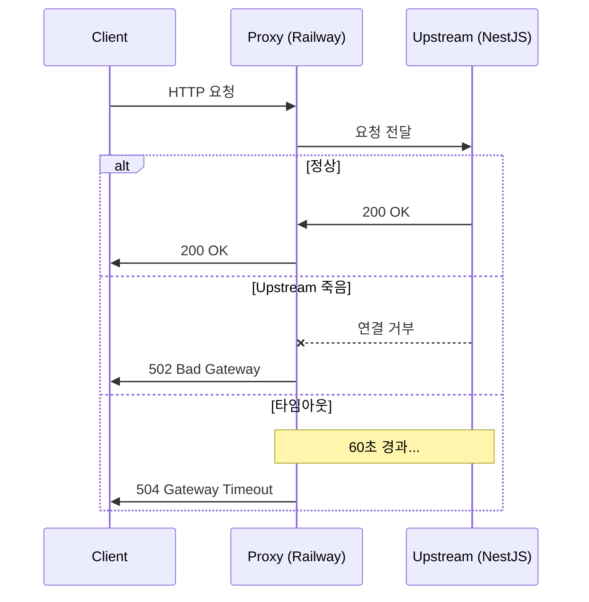
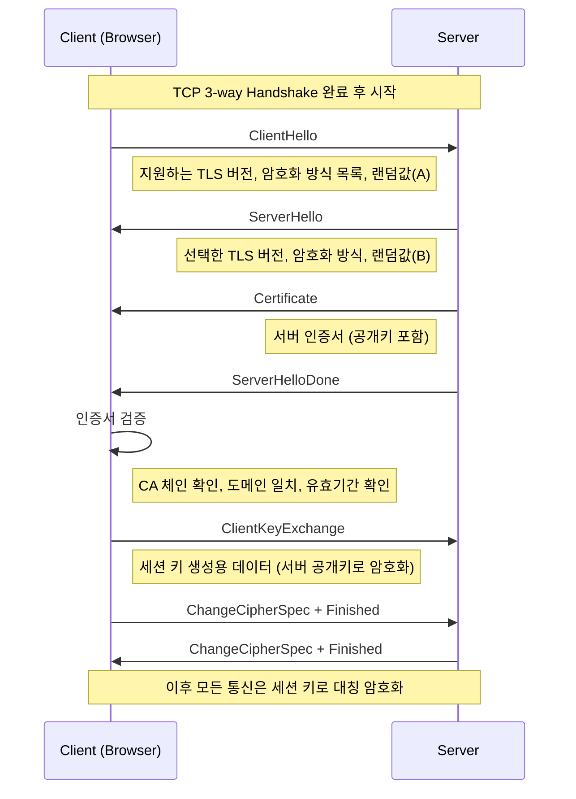

# Network_Proxy — 프록시 · 업스트림 완전 정리

>[!info]
> Proxy = 클라이언트와 서버 사이의 중간 서버
> Upstream = 프록시가 요청을 전달하는 목적지 (백엔드 서버)
> 502/504 에러 → 프록시가 Upstream 서버 응답을 못 받은 것 → [[HTTP_Concept]] / [[NestJS_AsyncJob]]

---

# Proxy란 ⭐️⭐️⭐️⭐️⭐️

```txt
Proxy = "대리인"
  = 클라이언트와 서버 사이에서 요청/응답을 중계하는 중간 서버

왜 쓰는가:
  보안:    클라이언트나 서버의 실제 주소를 숨김
  성능:    캐시, 압축, 로드 밸런싱
  제어:    접근 제한, 인증, 로깅
  SSL 종료: HTTPS 처리를 프록시에서만 함 → 내부는 HTTP

Upstream / Downstream:
  Upstream   = 프록시 기준으로 요청이 향하는 방향 (서버 쪽)
  Downstream = 프록시 기준으로 응답이 향하는 방향 (클라이언트 쪽)
```

```
Client ──────────────→ Proxy ──────────────→ Upstream Server
       (Downstream ←)         (→ Upstream)
```

---

# Forward Proxy vs Reverse Proxy ⭐️⭐️⭐️⭐️⭐️

## Forward Proxy — 클라이언트 앞

```
Client → [Forward Proxy] → Internet → Server
```

```txt
= 클라이언트를 대신해서 요청을 보내는 프록시
  서버 입장에서는 클라이언트의 실제 IP를 모름 → 프록시 IP만 보임

용도:
  VPN:         사용자 IP 숨기기, 지역 우회
  기업 내부망:  직원 인터넷 사용 제어·모니터링
  익명화:       클라이언트 신원 숨기기

예시:
  회사 방화벽 → 외부 사이트 접근 시 Forward Proxy 경유
  VPN → 내 요청이 VPN 서버를 통해 나감
```

## Reverse Proxy — 서버 앞

```
Client → Internet → [Reverse Proxy] → Backend Server(s)
```

```txt
= 서버를 대신해서 요청을 받는 프록시
  클라이언트 입장에서는 실제 백엔드 서버가 보이지 않음

용도:
  로드 밸런싱:  여러 백엔드 서버로 요청 분산
  SSL 종료:    HTTPS 처리를 여기서 → 내부는 HTTP 통신
  캐싱:        정적 파일 캐시 → 백엔드 부담 감소
  보안:        백엔드 서버 IP 숨기기
  압축:        gzip 압축 후 클라이언트에 전달

대표적인 Reverse Proxy:
  Nginx
  Railway Edge Proxy
  Vercel Edge Network
  AWS ALB (Application Load Balancer)
  Cloudflare
```

## 한눈에 비교

| | Forward Proxy | Reverse Proxy |
|--|:-------------:|:-------------:|
| 위치 | 클라이언트 앞 | 서버 앞 |
| 숨기는 대상 | 클라이언트 | 서버 |
| 설정 주체 | 클라이언트(사용자) | 서버 운영자 |
| 대표 사용처 | VPN, 사내 방화벽 | Nginx, CDN, 클라우드 |

---

# 실전 배포 구조 ⭐️⭐️⭐️⭐️⭐️

## Railway 배포 구조

```
사용자 브라우저
     │ HTTPS
     ▼
Railway Edge Proxy  ← Reverse Proxy (SSL 종료, 라우팅)
     │ HTTP (내부)
     ▼
NestJS 서버 (Upstream)
     │
     ▼
PostgreSQL DB
```

```txt
Railway Edge Proxy가 하는 일:
  - HTTPS 요청을 받아 SSL 처리
  - 내부적으로 HTTP로 NestJS에 전달
  - NestJS 응답을 클라이언트에 반환
  - 타임아웃 내에 응답 없으면 → 502/504 반환

NestJS 입장:
  - 자신은 HTTP로 요청을 받음
  - 클라이언트 실제 IP는 X-Forwarded-For 헤더로 확인
  - 직접 HTTPS 처리 안 해도 됨 (Edge Proxy가 처리)
```

## Nginx Reverse Proxy 설정 예시

```nginx
server {
    listen 80;
    server_name api.example.com;

    location / {
        # Upstream = 실제 NestJS 서버
        proxy_pass http://localhost:3000;

        # 클라이언트 실제 IP 전달
        proxy_set_header X-Real-IP $remote_addr;
        proxy_set_header X-Forwarded-For $proxy_add_x_forwarded_for;

        # 원래 호스트명 전달
        proxy_set_header Host $host;

        # 타임아웃 설정 (기본 60초)
        proxy_connect_timeout 10s;
        proxy_read_timeout    60s;
        proxy_send_timeout    60s;
    }
}
```

```txt
proxy_pass:
  Nginx가 요청을 전달할 Upstream 서버 주소
  여기서 localhost:3000 = NestJS 서버

X-Forwarded-For:
  프록시를 거치면 클라이언트 IP가 바뀜
  원래 IP를 헤더로 전달하는 관례
  NestJS에서 req.ip 대신 이 헤더를 읽어야 진짜 클라이언트 IP 확인 가능
```

---

# 502 / 504 에러와 Upstream ⭐️⭐️⭐️⭐️⭐️

```txt
502 Bad Gateway:
  프록시가 Upstream 서버로부터 유효한 응답을 못 받음
  원인:
    - Upstream 서버가 죽어있음 (프로세스 다운)
    - Upstream 서버가 응답을 반환하기 전에 프록시가 포기
    - Upstream 서버와의 연결 자체가 실패

504 Gateway Timeout:
  프록시가 Upstream으로부터 정해진 시간 내에 응답을 못 받음
  원인:
    - 요청 처리가 너무 오래 걸림 (DB 쿼리, 외부 API 호출 등)
    - 프록시의 타임아웃 설정보다 처리 시간이 김
```



```txt
실전 해결책:
  오래 걸리는 작업 → 즉시 202 Accepted 반환 + 백그라운드 처리
  → [[NestJS_AsyncJob]] 패턴

  Railway 기본 타임아웃 = 약 60-120초
  → 그 이상 걸리면 무조건 502/504
```

---

# Load Balancer ⭐️⭐️⭐️⭐️

```txt
Load Balancer = 여러 Upstream 서버로 요청을 분산하는 Reverse Proxy
  트래픽 급증 시 서버 한 대에 몰리지 않도록 분산
  한 서버가 죽어도 다른 서버로 요청 → 고가용성(HA)

분산 알고리즘:
  Round Robin:   순서대로 순환 (기본)
  Least Conn:    현재 연결 수가 적은 서버 우선
  IP Hash:       같은 클라이언트 → 항상 같은 서버 (세션 유지)
  Weighted:      서버 성능에 따라 가중치 설정
```

```
                    ┌─→ NestJS Server 1
Client → [LB] ──┤──→ NestJS Server 2
                    └─→ NestJS Server 3
```

```nginx
# Nginx Load Balancer 설정
upstream nestjs_servers {
    server 10.0.0.1:3000;
    server 10.0.0.2:3000;
    server 10.0.0.3:3000;
}

server {
    location / {
        proxy_pass http://nestjs_servers;
    }
}
```

---

# CDN — Content Delivery Network ⭐️⭐️⭐️⭐️

```txt
CDN = 전 세계 Edge 서버에 콘텐츠를 분산 캐시하는 네트워크
  = Reverse Proxy + 캐시 + 지리적 분산

Origin Server: 실제 원본 데이터가 있는 서버 (백엔드)
Edge Server:   사용자와 가까운 CDN 노드 (캐시 서버)

동작 방식:
  첫 요청 → Edge에 캐시 없음 → Origin에서 가져와 Edge에 저장
  이후 요청 → Edge에서 직접 응답 (Origin 부담 없음)
```

```
한국 사용자 → [서울 Edge] → Origin (미국 서버)
                 ↑
           캐시된 응답

일본 사용자 → [도쿄 Edge] → Origin (미국 서버)
```

```txt
CDN이 캐시하는 것:
  정적 파일: JS, CSS, 이미지, 폰트
  응답 헤더 Cache-Control로 CDN 캐시 시간 제어

CDN이 캐시하면 안 되는 것:
  사용자별 다른 응답 (인증 정보 포함 API)
  실시간 데이터

대표 CDN:
  Cloudflare, AWS CloudFront, Vercel Edge Network, Fastly
```


---

# SSL / TLS — 암호화 통신 ⭐️⭐️⭐️⭐️⭐️

## SSL vs TLS

```txt
SSL (Secure Sockets Layer) = 1990년대 Netscape가 만든 암호화 프로토콜
TLS (Transport Layer Security) = SSL의 후속 표준 (IETF가 관리)

역사:
  SSL 2.0 (1995) → SSL 3.0 (1996) → TLS 1.0 (1999) → TLS 1.2 (2008) → TLS 1.3 (2018)

현재:
  SSL 2.0, SSL 3.0, TLS 1.0, TLS 1.1 = 모두 폐기 (취약점)
  TLS 1.2 = 아직 사용 중
  TLS 1.3 = 현재 권장 표준

용어:
  현실에서는 "SSL 인증서", "SSL 적용"이라고 부르지만
  실제로는 TLS 1.2 / TLS 1.3 동작
  → SSL = TLS의 옛날 이름이라고 이해하면 됨
```

## TLS가 보장하는 3가지

```txt
1. 기밀성 (Confidentiality)
   데이터를 암호화 → 제3자가 패킷 캡처해도 내용 못 읽음

2. 무결성 (Integrity)
   MAC(Message Authentication Code)로 전송 중 변조 감지
   "이 데이터가 중간에 바뀌지 않았다"를 보장

3. 인증 (Authentication)
   인증서로 "내가 실제로 api.example.com 서버다"를 증명
   → 피싱 사이트(가짜 서버)를 막는 역할
```

## 인증서(Certificate) 구조

```txt
TLS 인증서 = 서버의 신원을 증명하는 디지털 문서

포함 내용:
  - 도메인 (example.com, *.example.com)
  - 공개키 (Public Key)
  - 발급 기관 (CA — Certificate Authority)
  - 유효 기간 (시작일 ~ 만료일)
  - 서명 (CA의 개인키로 서명)

인증서 종류:
  DV (Domain Validation):   도메인 소유권만 확인, 자동 발급 (Let's Encrypt)
  OV (Organization Validation): 기업 정보 확인, 며칠 소요
  EV (Extended Validation): 엄격한 기업 심사, 브라우저 주소창에 회사명 표시
```

## CA — 인증서 신뢰 체계

```txt
CA (Certificate Authority) = 인증서를 발급하고 서명하는 공인 기관
  DigiCert, Let's Encrypt, Comodo, GlobalSign 등

신뢰 체계 (Chain of Trust):
  브라우저/OS → Root CA 목록을 내장
  Root CA → Intermediate CA 서명
  Intermediate CA → 서버 인증서 서명
  → 브라우저가 인증서를 받으면 이 체인을 역으로 검증

자가 서명 인증서 (Self-Signed):
  CA 서명 없이 직접 만든 인증서
  로컬 개발 환경에서 사용
  브라우저에서 "신뢰할 수 없는 인증서" 경고 → 운영에서 절대 사용 불가
```

## TLS Handshake 상세 흐름



```txt
핵심 흐름 요약:
  1. 서로 지원하는 암호화 방식 협상
  2. 서버가 인증서(공개키) 전달
  3. 클라이언트가 인증서 검증
  4. 세션 키(대칭키) 교환
  5. 이후 대칭키로 빠르게 암호화 통신

비대칭키(공개키/개인키):
  핸드셰이크 단계에서 세션 키 교환에 사용 → 느리지만 안전
  세션 키 교환 후 버림

대칭키(세션 키):
  실제 데이터 암호화에 사용 → 빠름
  연결마다 새로운 세션 키 생성

TLS 1.3 개선점:
  핸드셰이크 1 RTT로 단축 (기존 TLS 1.2 = 2 RTT)
  0-RTT 재연결 지원 (이전 연결 정보 재사용)
  취약한 암호화 방식 제거
```

## SSL 종료 (SSL Termination) ⭐️⭐️⭐️⭐️

```txt
SSL 종료 = Reverse Proxy에서 TLS 처리, 내부 서버로는 HTTP 전달

구조:
  Client ──HTTPS──→ [Nginx / Railway] ──HTTP──→ NestJS
                       SSL 종료 여기서           평문 통신

장점:
  NestJS는 TLS 처리 부담 없음 (CPU 절약)
  인증서 관리를 프록시 한 곳에서만
  내부망은 이미 신뢰할 수 있는 환경 → HTTP로도 충분

주의:
  내부망이 완전히 격리되지 않은 경우
  → 내부도 TLS 적용 필요 (mTLS)
```

```nginx
# Nginx SSL 종료 설정 예시
server {
    listen 443 ssl;
    server_name api.example.com;

    # 인증서 경로 (Let's Encrypt 기준)
    ssl_certificate     /etc/letsencrypt/live/api.example.com/fullchain.pem;
    ssl_certificate_key /etc/letsencrypt/live/api.example.com/privkey.pem;

    # 권장 TLS 버전
    ssl_protocols TLSv1.2 TLSv1.3;

    # HTTP → NestJS로 전달 (내부는 HTTP)
    location / {
        proxy_pass http://localhost:3000;
        proxy_set_header X-Forwarded-Proto https; # 원래 scheme 전달
    }
}

# HTTP → HTTPS 리다이렉트
server {
    listen 80;
    server_name api.example.com;
    return 301 https://$host$request_uri;
}
```

## Let's Encrypt — 무료 인증서 ⭐️⭐️⭐️

```txt
Let's Encrypt = 비영리 CA, 무료 DV 인증서 자동 발급
  - 도메인 소유권만 확인 (DNS 또는 HTTP 방식)
  - 유효기간 90일 → certbot으로 자동 갱신
  - Vercel, Railway 등 클라우드 플랫폼은 내장

certbot 주요 명령:
  발급:  sudo certbot --nginx -d example.com
  갱신:  sudo certbot renew
  자동갱신: cron 또는 systemd timer로 주기적 실행

클라우드 환경 (Railway, Vercel):
  인증서 발급·갱신 자동 → 신경 쓸 필요 없음
```

## HSTS — HTTP → HTTPS 강제 ⭐️⭐️⭐️

```txt
HSTS (HTTP Strict Transport Security):
  브라우저에 "이 도메인은 항상 HTTPS로만 접속해라" 지시하는 응답 헤더
  설정 후 브라우저가 HTTP 요청을 서버에 보내기도 전에 HTTPS로 변환

응답 헤더:
  Strict-Transport-Security: max-age=31536000; includeSubDomains; preload

  max-age:          HSTS 유효기간 (초), 31536000 = 1년
  includeSubDomains: 서브도메인에도 적용
  preload:          브라우저 내장 HSTS 목록에 등록

주의:
  한번 설정하면 max-age 동안 HTTP 접속 불가
  HTTPS가 확실히 작동하는지 확인 후 적용
```

## 인증서 관련 에러

| 에러 | 원인 |
|------|------|
| `ERR_CERT_AUTHORITY_INVALID` | 자가 서명 인증서 또는 알 수 없는 CA |
| `ERR_CERT_DATE_INVALID` | 인증서 만료 또는 유효기간 전 |
| `ERR_CERT_COMMON_NAME_INVALID` | 인증서 도메인과 실제 도메인 불일치 |
| `ERR_SSL_PROTOCOL_ERROR` | TLS 버전 또는 암호화 방식 불일치 |
| `NET::ERR_CERT_REVOKED` | 인증서가 CA에 의해 취소됨 |

```txt
로컬 개발에서 HTTPS 필요할 때:
  mkcert: 로컬 CA를 OS에 등록 → 자가 서명이지만 브라우저 신뢰
  설치:   brew install mkcert && mkcert -install
  발급:   mkcert localhost 127.0.0.1
```


---

# X-Forwarded-For — 실제 클라이언트 IP ⭐️⭐️⭐️

```txt
프록시를 거치면 req.ip = 프록시 IP → 클라이언트 실제 IP 아님
X-Forwarded-For 헤더에 실제 IP 체인이 기록됨

X-Forwarded-For: 클라이언트IP, 프록시1IP, 프록시2IP
→ 맨 앞이 원래 클라이언트 IP
```

```typescript
// NestJS에서 실제 클라이언트 IP 추출
@Get()
getClientIp(@Req() req: Request): string {
  const forwarded = req.headers['x-forwarded-for'];
  const ip = Array.isArray(forwarded)
    ? forwarded[0]
    : forwarded?.split(',')[0] ?? req.ip;
  return ip;
}
```

```txt
주의:
  X-Forwarded-For는 클라이언트가 조작 가능 (신뢰 불가)
  신뢰할 수 있는 프록시(Railway, Nginx 등)가 설정한 값만 사용해야 함
  NestJS에서 신뢰할 프록시 설정:
    app.set('trust proxy', 1); // 한 홉의 프록시 신뢰
```

---

# 개념 정리 — 한눈에 ⭐️⭐️⭐️⭐️

| 용어 | 정의 |
|------|------|
| **Proxy** | 요청/응답을 중계하는 중간 서버 |
| **Forward Proxy** | 클라이언트 앞 (클라이언트 IP 숨김) |
| **Reverse Proxy** | 서버 앞 (서버 IP 숨김, Nginx·Railway·Vercel) |
| **Upstream** | 프록시 기준 요청이 향하는 서버 (백엔드) |
| **Downstream** | 프록시 기준 클라이언트 방향 |
| **Origin Server** | 실제 원본 데이터가 있는 서버 |
| **Edge Server** | 사용자와 가까운 CDN 캐시 노드 |
| **Load Balancer** | 여러 Upstream으로 트래픽 분산 |
| **SSL 종료** | 프록시에서 HTTPS 처리, 내부는 HTTP |
| **502 Bad Gateway** | 프록시가 Upstream 응답 못 받음 |
| **504 Gateway Timeout** | Upstream 응답 시간 초과 |
