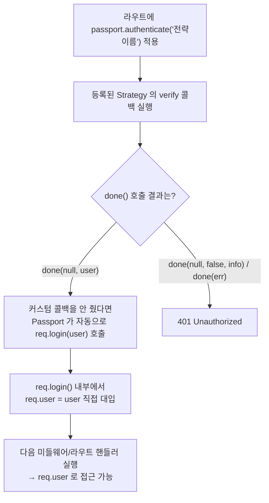

---
aliases:
  - Passport
  - req.user
  - Strategy 패턴
  - verify 콜백
tags:
  - NodeJS
related:
  - "[[00_NestJS_Ecosystem_HomePage]]"
  - "[[NestJS_JwtGuard]]"
---
# NodeJS_Passport — Passport.js 인증 미들웨어

> [!info] 
>  Passport는 Express 인증 방식을 "Strategy" 단위로 표준화하는 미들웨어 라이브러리다. 
>  인증 방식이 뭐든(아이디/비번, JWT, OAuth ...) 성공하면 항상 같은 자리, `req.user`에 결과를 담는다.
>  NestJS에서 쓰는 `@nestjs/passport`는 이 인터페이스를 `validate()` 메서드 하나로 감싸놓은 것일 뿐, 내부적으로 일어나는 일은 동일하다.

---

# 핵심 아이디어 — Strategy 패턴 ⭐️⭐️

```txt
인증 방식(아이디/비번 확인, JWT 검증, Google/Kakao OAuth ...)마다
"이 사용자가 누구인지 확인하는 방법"만 책임지는 별도의 Strategy 객체로 분리

passport.use(new XxxStrategy(options, verify))
  → 등록해두면, 라우트에서는 passport.authenticate('전략이름') 한 줄로 그 인증 방식을 사용

핵심 장점: 인증 방식이 바뀌거나 늘어나도(예: 로그인 방식 추가)
"req.user 를 어떻게 쓸지" 를 다루는 나머지 코드는 전혀 바뀌지 않음
→ 모든 Strategy 가 동일한 인터페이스(verify 콜백 + done())를 따르기 때문
```

## 자주 쓰는 Strategy 종류

|Strategy|패키지|인증 방식|
|---|---|---|
|`LocalStrategy`|`passport-local`|username/password (직접 입력한 자격증명)|
|`JwtStrategy`|`passport-jwt`|`Authorization: Bearer` 토큰 검증|
|`GoogleStrategy` 등|`passport-google-oauth20` 등|OAuth (Google, GitHub, Kakao ...)|

---

# verify 콜백과 done() — 모든 Strategy 의 공통 패턴 ⭐️⭐️⭐️

```txt
Strategy 종류가 달라도 "검증 로직을 어떻게 Passport 에 알려주는가" 는 항상 동일한 모양:

verify(자격증명..., done) {
  // 사용자를 찾고 검증하는 로직 — DB 조회, 비밀번호 비교, JWT payload 확인 등
  done(err, user, info)
}
```

|`done()` 호출 형태|의미|
|---|---|
|`done(null, user)`|인증 성공 — 이 `user` 가 이후 `req.user` 가 됨|
|`done(null, false, info)`|인증 실패 (자격증명이 틀림) — 에러는 아님, `info` 에 이유를 담을 수 있음|
|`done(err)`|애플리케이션 에러 (DB 연결 실패 등 검증 자체를 못한 경우)|

## LocalStrategy 예시 — 아이디/비밀번호

```javascript
const LocalStrategy = require('passport-local').Strategy;

passport.use(new LocalStrategy(
  { usernameField: 'email' },           // req.body 의 어떤 필드를 쓸지
  async (email, password, done) => {
    const user = await User.findOne({ email });
    if (!user) return done(null, false, { message: '존재하지 않는 사용자' });

    const isValid = await bcrypt.compare(password, user.hash);
    if (!isValid) return done(null, false, { message: '비밀번호 불일치' });

    return done(null, user);            // ← 성공: user 전달
  },
));
```

## JwtStrategy 예시 — Bearer 토큰

```javascript
const JwtStrategy = require('passport-jwt').Strategy;
const { ExtractJwt } = require('passport-jwt');

passport.use(new JwtStrategy(
  {
    jwtFromRequest: ExtractJwt.fromAuthHeaderAsBearerToken(),  // Bearer 헤더에서 추출
    secretOrKey: process.env.JWT_SECRET,
  },
  async (payload, done) => {
    const user = await User.findById(payload.sub);             // payload.sub = 토큰 발급 시 넣은 식별자
    if (!user) return done(null, false);
    return done(null, user);
  },
));
```

```txt
두 Strategy 의 verify 콜백 모양은 다르지만(첫 인자가 email/password 쌍 vs payload 하나)
"검증 후 done() 으로 결과를 알려준다" 는 인터페이스는 완전히 동일
→ 라우트 쪼개서 인증 방식만 바꿔 끼울 수 있는 이유
```

---

# req.user 는 실제로 언제·어떻게 채워지는가 ⭐️⭐️⭐️

```txt
"request.user 는 Passport 가 정해둔 약속" 이라는 설명에서 한 단계 더 들어가면:
정확히 어느 코드가, 언제 req.user = ... 를 실행하는지가 핵심
```



```txt
정리:
  1. passport.authenticate('전략이름') 미들웨어가 해당 Strategy 의 verify 콜백을 실행시킴
  2. verify 가 done(null, user) 를 호출하면
  3. (커스텀 콜백을 따로 안 줬다면) Passport 가 내부적으로 req.login(user, cb) 를 자동 호출
  4. req.login() 이 바로 req.user = user 를 실행하는 지점 — "삽입"의 실체는 이게 전부

→ 결국 Passport 도 평범한 객체 속성 할당(request.user = ...)을 하는 것과 동일함
  다만 그 할당을 "누가 코드로 직접 쓰는가" 가 다름:
  직접 구현한 미들웨어/Guard 라면 개발자가 그 한 줄을 직접 쓰고
  Passport 라면 req.login() 이 대신 그 한 줄을 실행해줌
```

```javascript
// 커스텀 콜백을 직접 쓰는 경우 — req.login() 도 직접 호출해야 함 (자동 호출 안 됨)
app.post('/login', (req, res, next) => {
  passport.authenticate('local', { session: false }, (err, user, info) => {
    if (err || !user) return res.status(401).json({ message: info?.message });

    req.login(user, { session: false }, (err) => {  // ← 여기서 req.user = user 실행됨
      if (err) return next(err);
      const token = jwt.sign({ sub: user.id }, process.env.JWT_SECRET, { expiresIn: '1h' });
      res.json({ user, token });
    });
  })(req, res, next);
});
```

---

# NestJS에서는 어떻게 보이는가 — @nestjs/passport 매핑 ⭐️⭐️⭐️

```txt
NestJS_JwtGuard의 "방법 1"에서 본 코드를 다시 보면, done()이나 req.login() 같은 건
어디에도 안 보임 — PassportStrategy를 상속받고 validate()만 구현했을 뿐임

→ 이건 새로운 메커니즘이 아니라, 위에서 설명한 raw Passport.js 인터페이스를
  NestJS가 한 단계 감싸놓은 것뿐 — 내부적으로는 정확히 같은 일이 일어남
```

|raw Passport.js|@nestjs/passport (NestJS)|
|---|---|
|`new XxxStrategy(options, verify)`|`class XxxStrategy extends PassportStrategy(Strategy) { ... }`|
|`verify(자격증명, done)` 콜백|`validate(자격증명)` 메서드 — `done` 인자가 없음|
|`done(null, user)` 호출|`validate()`가 user를 그냥 `return`|
|`done(null, false, info)` 호출|`validate()`에서 `false` 대신 예외(예: `UnauthorizedException`)를 `throw`|
|`done(err)` 호출|`validate()` 안에서 안 잡은 에러가 그대로 위로 던져짐|
|`passport.authenticate('이름')` 미들웨어|`@UseGuards(AuthGuard('이름'))`|
|`req.login()`이 자동으로 하던 `req.user = user`|`@nestjs/passport` 내부에서 똑같이 자동으로 처리 — 코드에 안 보일 뿐|

```txt
즉, "validate()가 return한 값이 request.user가 된다"는 설명은 풀어보면:

  @nestjs/passport가 내부적으로 done(null, 그 반환값)을 호출하고
  → 그 done()이 다시 req.login()을 트리거해서
  → req.login() 안에서 req.user = 그 반환값이 실행되는 것

raw Passport와 똑같은 일이 일어나지만, NestJS는 그 중간 단계(done, req.login)를
전부 숨기고 "return하면 성공 / throw하면 실패"라는 더 익숙한 인터페이스로 바꿔놓은 것뿐임
→ 이 매핑을 모르면 이 노트의 설명(done, req.login)과 NestJS_JwtGuard의 코드(return, throw)가
  서로 다른 얘기처럼 느껴짐 — 사실은 같은 메커니즘의 두 가지 얼굴
```

---

# session 기반이면 한 단계 더 — serializeUser / deserializeUser ⭐️⭐️

```txt
session 을 쓰면(express-session 과 함께) req.login() 이 자동으로 한 가지 일을 더 함:
  serializeUser 를 호출해서 user 객체에서 "최소한의 식별자(보통 id)" 만 추려 세션에 저장

다음 요청부터는 verify 콜백이 다시 실행되지 않음 — 대신
  passport.session() 미들웨어가 세션에 저장된 식별자를 deserializeUser 에 넘겨
  DB 에서 user 전체를 복원한 뒤 req.user 에 넣어줌
```

```javascript
passport.serializeUser((user, done) => {
  done(null, user.id);            // 세션에는 id 하나만 저장
});

passport.deserializeUser(async (id, done) => {
  const user = await User.findById(id);   // 매 요청마다 id 로 전체 user 복원
  done(null, user);
});
```

```txt
⚠️ JWT(stateless) Strategy 를 쓸 때는 serializeUser/deserializeUser 가 필요 없음
   { session: false } 옵션으로 끔 — 매 요청마다 토큰 자체를 다시 검증하므로
   "세션에 저장해뒀다가 복원" 할 필요 자체가 없음 (verify 콜백이 매번 새로 실행됨)
```

---

# session 기반 vs JWT(stateless) 기반 비교 ⭐️⭐️

|구분|Session 기반|JWT(stateless) 기반|
|---|---|---|
|클라이언트가 들고 있는 것|세션 ID 만 담긴 쿠키|토큰 전체|
|서버가 들고 있는 것|세션 스토어(메모리/Redis 등)에 user 식별자|아무것도 없음 (무상태)|
|`serializeUser`/`deserializeUser`|필요|불필요 (`{ session: false }`)|
|`req.user` 가 채워지는 시점|로그인 시 1회 verify, 이후엔 매 요청마다 `deserializeUser` 가 복원|매 요청마다 verify 콜백이 토큰을 새로 검증|
|서버를 여러 대로 확장|세션 스토어를 서버끼리 공유해야 함|무상태라 별도 공유 없이 확장 쉬움|

---

# 직접 구현한 인증 vs Passport — 언제 뭘 쓰나 ⭐️⭐️

|구분|직접 구현한 미들웨어/Guard (예: [[NestJS_JwtGuard]]의 "방법 2")|Passport|
|---|---|---|
|인증 로직 위치|직접 짠 Guard/미들웨어 함수 안|Strategy 객체 (라이브러리 표준 인터페이스)|
|`req.user` 를 채우는 코드|개발자가 직접 `request.user = payload` 작성|`req.login()` 이 대신 실행 (커스텀 콜백 안 쓰면 자동), NestJS에서는 `validate()`의 return이 대신함|
|인증 방식을 추가/교체|매번 새 미들웨어/Guard를 직접 작성|Strategy 추가 후 `passport.authenticate('이름')` (NestJS: `AuthGuard('이름')`) 만 바꿈|
|알아야 할 개념|JWT/bcrypt 정도면 충분|위에 더해 Strategy / `done()` / serialize 개념까지|
|적합한 경우|인증 방식이 1~2개로 단순할 때|여러 로그인 방식을 병행하거나, 표준화된 패턴이 필요할 때|

---

# 한눈에

```txt
Strategy = "이 사용자가 누구인지 확인하는 법" 을 캡슐화한 객체
verify(자격증명, done) → done(err, user, info) 가 모든 Strategy 의 공통 언어

req.user 가 실제로 채워지는 지점 = req.login() 내부의 req.user = user 한 줄
  (passport.authenticate() 가 커스텀 콜백 없이 쓰이면 이 호출을 자동으로 해줌)
  NestJS(@nestjs/passport)에서는 validate()의 return/throw가 done()을 대신 호출해줌

session 쓰면 serializeUser/deserializeUser 까지 필요
JWT(stateless) 면 { session: false } 로 그 둘 다 생략

"Passport 가 자동으로 해준다" 는 설명은 req.login() 이 대신 실행해주는 경우에만 맞는 말
직접 구현한 Guard/미들웨어는 그 한 줄(request.user = payload)을 개발자가 직접 씀
```

| 기억할 것                  | 핵심                                                                                  |
| ---------------------- | ----------------------------------------------------------------------------------- |
| 모든 Strategy 의 공통 인터페이스 | `verify(..., done)` → `done(err, user, info)`                                       |
| `req.user` 의 실체        | `req.login()` 안의 `req.user = user`                                                  |
| NestJS에서의 매핑           | `validate()` return → `done(null, user)` / `validate()` throw → `done(null, false)` |
| Session 전용             | `serializeUser` / `deserializeUser`                                                 |
| Stateless(JWT) 전용 설정   | `{ session: false }`                                                                |