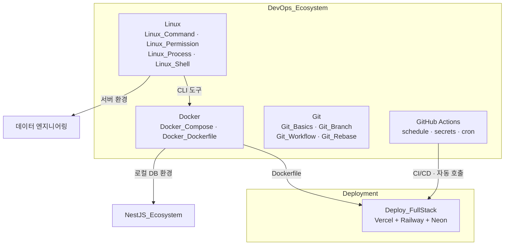

---
aliases:
  - Git
  - Docker
  - Linux
  - GitHub Actions
  - Vercel
  - Railway
  - Neon
  - 배포
  - openssl
  - CLI
tags:
  - HomePage
  - Deploy
related:
  - "[[00_NestJS_Ecosystem_HomePage]]"
  - "[[00_DB_HomePage]]"
cssclasses:
  - max
  - table-max
  - table-wrap
---
# 00_DevOps_Ecosystem_HomePage — Docker · Git · Linux · GitHub Actions · 배포

> [!info]
>  인프라·툴링 레이어와 배포 플랫폼을 모아두는 홈페이지.
>   Docker(컨테이너), Git(버전 관리), Linux(서버 환경), GitHub Actions(자동화) — 어느 스택이든 공통으로 쓰인다.
>   Deployment — Vercel · Railway · Neon으로 코드를 실제로 돌리는 환경.

```txt
폴더 위치: 25_Infra_DevOps/DevOps_Ecosystem/
  Docker_ / Git_ / Linux_ / GitHub_ / Deploy_ 파일명 prefix로 주제 구분

DB 환경(PostgreSQL Docker Compose) → NestJS_PostgreSQL에 이미 정리됨
Linux가 많아지면 → Linux_Ecosystem/ 분리 검토 (특히 데이터 엔지니어링용)
```



---

# Deployment ⭐️⭐️⭐️⭐️

```txt
코드를 실제로 돌리는 환경 — 배포 플랫폼·패턴 노트
```

|노트|내용|
|---|---|
|[[Deploy_FullStack]]|Vercel + Railway + Neon — pnpm 모노레포 MVP 배포 패턴|

```txt
앞으로 추가될 수 있는 것들:
  Deploy_AWS         — AWS 배포 패턴
  Deploy_Monitoring  — 로그/모니터링 설정
```

---

# Docker ⭐️⭐️⭐️⭐️

```txt
이미 다른 노트에 분산된 Docker 내용:
  NestJS_PostgreSQL → Docker Compose로 로컬 PostgreSQL 띄우기
  Deploy_FullStack   → Dockerfile 작성 (NestJS API 빌드/실행)
  → 이 노트들과 역링크로 연결, 중복 작성 없이 개념만 정리
```

## 환경 설정 / 컨테이너 기초

| 노트                    | 핵심 내용                                                                               |
| --------------------- | ----------------------------------------------------------------------------------- |
| [[Docker_Compose]]    | `docker compose up/down` · services · volumes · networks · healthcheck · `$$` 이스케이프 |
| [[Docker_Dockerfile]] | `FROM/COPY/RUN/CMD/ENTRYPOINT` · 멀티스테이지 빌드 · `.dockerignore`                        |

```txt
[[Docker_Compose]]는 [[NestJS_PostgreSQL]]의 Docker Compose 섹션과 역링크로 연결
[[Docker_Dockerfile]]은 [[Deploy_FullStack]]의 Dockerfile 섹션과 역링크로 연결

빠르게 참고할 때:
  로컬 DB 띄우기    → [[NestJS_PostgreSQL]] "Docker Compose" 섹션
  배포용 빌드       → [[Deploy_FullStack]] "Dockerfile" 섹션
  개념/명령어 정리  → 이 폴더의 Docker_xxx 노트
```

---

# OpenSSL ⭐️⭐️⭐️

| 노트 | 핵심 내용 |
|---|---|
|[[OpenSSL]]|`rand` 난수 생성 · `-base64` vs `-hex` · `dgst` 해시 · 자체 서명 인증서|

```txt
주 용도:
  시크릿 키 생성 (JWT_SECRET · NEXTAUTH_SECRET · SESSION_SECRET)
  파일 무결성 체크 (SHA-256 해시)
  로컬 HTTPS 개발용 자체 서명 인증서
```

---

# GitHub Actions ⭐️⭐️⭐️⭐️

| 노트                      | 핵심 내용                                                              |
| ----------------------- | ------------------------------------------------------------------ |
| [[GitHub_Actions]]      | workflow · on(schedule/dispatch) · secrets · curl · cron secret 검증 |

```txt
용도:
  스케줄 작업 (매일 특정 시간에 API 자동 호출)
  수동 트리거 (workflow_dispatch)
  CI/CD 파이프라인 (push → 테스트 → 배포)

이 폴더에 있는 이유:
  GitHub Actions는 도구(툴링) 레이어
  어떤 서비스든 붙일 수 있는 범용 자동화 도구
  특정 배포 플랫폼이 아님
```

---


# CLI ⭐️⭐️⭐️

| 노트 | 핵심 내용 |
|---|---|
|[[CLI_Concept]]|터미널·쉘·CLI 도구 구분 · stdin/stdout/stderr · 종료 코드 · Node.js 스크립트 패턴|

```txt
CLI = 텍스트 인터페이스로 프로그램을 조작하는 방식
  터미널(에뮬레이터) → 쉘(bash/zsh) → CLI 도구(git/docker/node)
  stdin(0) · stdout(1) · stderr(2) · 종료 코드(0=성공, 비0=실패)
```

---

# 폴더 구성 이유

```txt
왜 Docker · Git · Linux · GitHub Actions · Deployment를 한 홈페이지에:
  Deployment 노트가 Deploy_FullStack 하나뿐이라 별도 홈페이지 오버헤드
  → 인프라 레이어 전체를 한 곳에서 탐색하는 게 실용적

파일명 prefix로 구분됨:
  Docker_ / Git_ / Linux_ / Deploy_ / GitHub_Actions

나중에 분리할 조건:
  Deployment 노트가 5개+ 늘어나면 → 00_Deployment_HomePage 별도 부활
  Linux 노트가 10개+ 쌓이고 데이터 엔지니어링 비중이 높아질 때 → Linux_Ecosystem/ 분리 검토
```