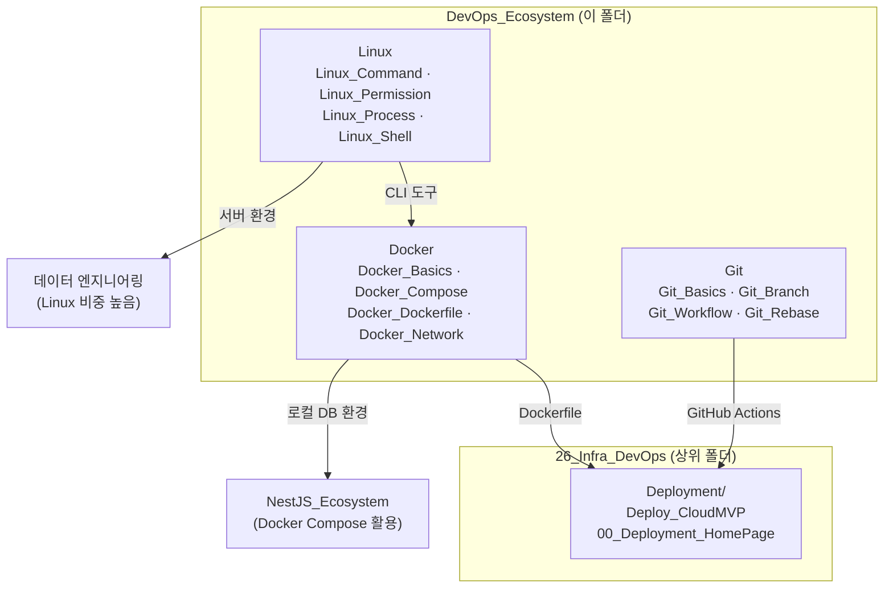

---
aliases:
  - Git
  - Docker
  - Linux
tags:
  - HomePage
related:
  - "[[00_Deployment_HomePage]]"
  - "[[00_NestJS_Ecosystem_HomePage]]"
  - "[[00_DB_HomePage]]"
---
# 00_DevOps_HomePage — Docker · Git · Linux

> [!info]
>  언어/프레임워크가 아닌 인프라·툴링 레이어를 모아두는 홈페이지
>   Docker(컨테이너), Git(버전 관리), Linux(서버 환경) — 셋 다 어느 스택이든 공통으로 쓰인다.
>   배포 자체(Vercel · Railway · Neon)는 [[00_Deployment_HomePage]] 참고.

```txt
폴더 위치: 26_Infra_DevOps/DevOps_Ecosystem/
형제 폴더: 26_Infra_DevOps/Deployment/ ← 배포 플랫폼 노트

이 폴더에 없는 것:
  배포 플랫폼(Vercel/Railway/Neon) → Deployment 폴더
  DB 환경(PostgreSQL Docker Compose) → NestJS_PostgreSQL에 이미 정리됨
  Linux가 많아지면 → Linux_Ecosystem/ 분리 검토 (특히 데이터 엔지니어링용)
```



---

# Docker ⭐️⭐️⭐️⭐️

```txt
이미 다른 노트에 분산된 Docker 내용:
  NestJS_PostgreSQL → Docker Compose로 로컬 PostgreSQL 띄우기
  Deploy_CloudMVP   → Dockerfile 작성 (NestJS API 빌드/실행)
  → 이 노트들과 역링크로 연결, 중복 작성 없이 개념만 정리
```

## 환경 설정 / 컨테이너 기초

| 노트                    | 핵심 내용                                                                               |
| --------------------- | ----------------------------------------------------------------------------------- |
| [[Docker_Basics]]     | 이미지 vs 컨테이너 · `docker run/ps/stop/rm` · 레이어 구조                                      |
| [[Docker_Compose]]    | `docker compose up/down` · services · volumes · networks · healthcheck · `$$` 이스케이프 |
| [[Docker_Dockerfile]] | `FROM/COPY/RUN/CMD/ENTRYPOINT` · 멀티스테이지 빌드 · `.dockerignore`                        |
| [[Docker_Network]]    | bridge · host · 컨테이너 간 통신 · 포트 매핑(호스트:컨테이너)                                         |

```txt
[[Docker_Compose]]는 [[NestJS_PostgreSQL]]의 Docker Compose 섹션과 역링크로 연결
[[Docker_Dockerfile]]은 [[Deploy_CloudMVP]]의 Dockerfile 섹션과 역링크로 연결

빠르게 참고할 때:
  로컬 DB 띄우기    → [[NestJS_PostgreSQL]] "Docker Compose" 섹션
  배포용 빌드       → [[Deploy_CloudMVP]] "Dockerfile" 섹션
  개념/명령어 정리  → 이 폴더의 Docker_xxx 노트
```

---

# Git ⭐️⭐️⭐️⭐️

| 노트               | 핵심 내용                                                    |
| ---------------- | -------------------------------------------------------- |
| [[Git_Basics]]   | init · add · commit · push · pull · clone · status · log |
| [[Git_Branch]]   | branch · checkout · merge · conflict 해결                  |
| [[Git_Rebase]]   | rebase vs merge · interactive rebase · squash            |
| [[Git_Workflow]] | PR 흐름 · feature branch 전략 · commit 메시지 규칙                |
| [[Git_Undo]]     | reset(soft/mixed/hard) · revert · stash · restore        |

```txt
GitHub Actions(CI/CD)는 배포와 직결 → [[00_Deployment_HomePage]] 쪽에서 다룰 예정
Git 명령어 자체는 이 폴더 / 배포 파이프라인은 Deployment 폴더
```

---

# Linux ⭐️⭐️⭐️

```txt
백엔드 서버 환경 + 데이터 엔지니어링(Kafka · Airflow · Spark) 모두 Linux 위에서 돌아감
→ 데이터 엔지니어링 쪽 비중이 커지면 Linux_Ecosystem/ 분리 검토
```

|노트|핵심 내용|
|---|---|
|[[Linux_Command]]|파일/디렉토리(`ls/cd/cp/mv/rm`) · 검색(`grep/find`) · 텍스트(`cat/head/tail/wc`)|
|[[Linux_Permission]]|`chmod/chown` · `rwx` 비트 · `sudo` · 소유자/그룹|
|[[Linux_Process]]|`ps/top/kill` · 백그라운드(`&/nohup`) · `cron` · `systemctl`|
|[[Linux_Shell]]|변수 · 조건문 · 반복문 · 함수 · 파이프(`\|`) · 리다이렉션(`>/>>`)|
|[[Linux_Network]]|`curl/wget` · `netstat/ss` · `ssh` · 포트 확인|

---

# 폴더 구성 이유

```txt
왜 Docker · Git · Linux를 한 폴더에:
  셋 다 언어/프레임워크가 아닌 "인프라·툴링 레이어"
  JS_Ecosystem은 JS끼리, NestJS는 NestJS끼리 묶듯이
  도구 계열은 도구끼리 묶는 게 자연스러움
  지금 노트 수가 적어서 폴더 3개로 쪼개면 빈 폴더만 생김
  파일명 prefix(Docker_ / Git_ / Linux_)로 이미 구분됨

나중에 분리할 조건:
  Linux 노트가 10개+ 쌓이고 데이터 엔지니어링 비중이 높아질 때
  → Linux_Ecosystem/ 별도 폴더 검토

26_Infra_DevOps 상위 폴더 구조:
  Deployment/       배포 플랫폼 (Vercel · Railway · Neon · GitHub Actions)
  DevOps_Ecosystem/ 도구 (Docker · Git · Linux)
  → "무엇을 배포하는가"와 "어떤 도구를 쓰는가"로 자연스럽게 나뉨
```