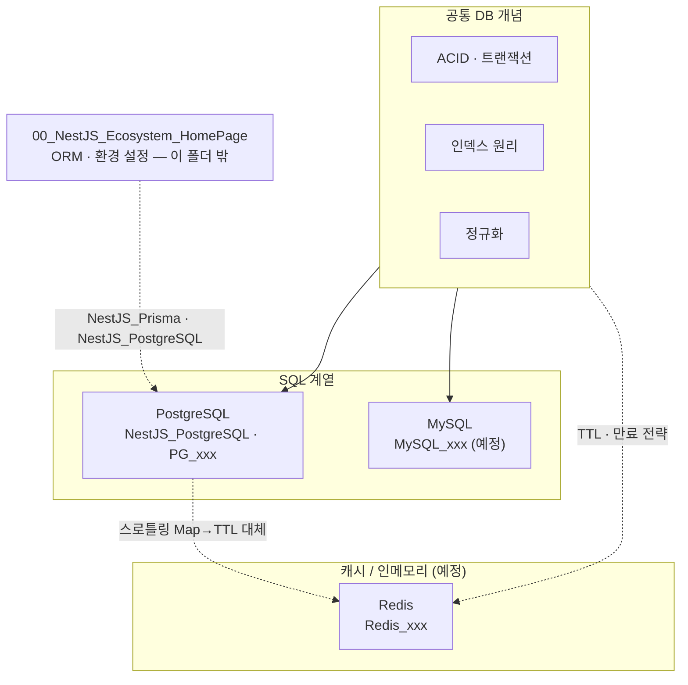

---
aliases:
  - Database
  - PostgreSQL
  - MySQL
  - Redis
  - SQL
tags:
  - HomePage
related:
  - "[[00_NestJS_Ecosystem_HomePage]]"
  - "[[NestJS_PostgreSQL]]"
  - "[[00_DevOps_HomePage]]"
cssclasses:
  - max
  - table-max
  - table-wrap
---
# 00_DB_HomePage — 데이터베이스

> [!info] 
> PostgreSQL · MySQL 실무 SQL과 공통 DB 개념을 모아두는 홈페이지
>  NestJS와 연결된 ORM/환경 설정은 [[00_NestJS_Ecosystem_HomePage]]의 데이터베이스 클러스터에, 순수 SQL 개념과 DB 내부 원리는 여기에 모이고 ,  Redis(캐시/인메모리) 계열은 같은 폴더에서 확장 예정.

```txt
왜 SQL_HomePage가 아니라 DB_HomePage인가:
  Redis는 SQL이 아니지만 "데이터를 어디에 어떻게 저장하는가"를 다루는 건 같음
  SQL(PostgreSQL · MySQL) → 영속 저장, 정형 데이터, 복잡한 쿼리
  Redis                   → 인메모리, TTL, 캐시 · 세션 · rate-limiting
  → 지금은 하나로 모아 관리하고, Redis가 많아지면 00_Redis_HomePage로 분리
```



---

# 공통 DB 개념 클러스터 ⭐️⭐️⭐️

```txt
PostgreSQL이든 MySQL이든 Redis든 공통으로 알아야 하는 개념들
특정 DB에 종속되지 않는 원리 — 먼저 개념을 잡고, 각 DB 노트에서 구체적인 문법을 봄
```

|개념|노트|핵심|
|---|---|---|
|ACID · 트랜잭션|[[DB_Transaction]]|BEGIN · COMMIT · ROLLBACK · Isolation Level 4단계|
|인덱스 원리|[[DB_Index]]|B-Tree 구조 · 복합 인덱스 컬럼 순서 · 언제 안 타는가|
|정규화|[[DB_Normalization]]|1NF · 2NF · 3NF · 반정규화 트레이드오프|
|N+1 문제|[[DB_N_Plus_1]]|ORM include 전략 → [[NestJS_Prisma]] 연결|

---

# PostgreSQL ⭐️⭐️⭐️⭐️

## NestJS 연동 / 환경 설정 — NestJS_Ecosystem 폴더

```txt
아래 노트들은 NestJS_Ecosystem 폴더에 있지만 PostgreSQL과 직접 연결됨
"NestJS에서 PostgreSQL을 어떻게 쓰는가"에 초점 — 순수 SQL 원리는 아래 PG_xxx 노트에 분리
```

|노트|핵심 내용|
|---|---|
|[[NestJS_PostgreSQL]]|Docker Compose · DataGrip 연결 · timestamp vs timestamptz · KST 집계|
|[[NestJS_Prisma]]|Prisma ORM · migrate dev/deploy · select/include/omit · as const|
|[[NestJS_StatsBucket]]|GROUP BY 빈 구간 누락 문제 · 버킷 생성 → DB 집계 → 배열 변환|
|[[NestJS_Prisma_Monorepo]]|pnpm 모노레포 환경에서 prisma 명령 위치 · generate 경로|

## 순수 PostgreSQL 개념 — 이 폴더 (DB_Ecosystem)

| 노트                 | 핵심 내용                                                    |
| ------------------ | -------------------------------------------------------- |
| [[PG_DDL]]         | CREATE TABLE · ALTER · UNIQUE · CHECK · FK 제약            |
| [[PG_DML]]         | SELECT · JOIN(INNER/LEFT/FULL) · 서브쿼리 · CTE(WITH)        |
| [[PG_Aggregate]]   | GROUP BY · HAVING · 빈 구간 채우기(generate_series)            |
| [[PG_Window]]      | ROW_NUMBER · RANK · DENSE_RANK · LAG/LEAD · PARTITION BY |
| [[PG_Index]]       | B-Tree · GIN(JSONB) · EXPLAIN ANALYZE 읽는 법 · 복합 인덱스      |
| [[PG_Transaction]] | BEGIN · SAVEPOINT · Isolation Level · DEADLOCK           |
| [[PG_Types]]       | timestamp vs timestamptz · JSONB · uuid · ARRAY · ENUM   |
| [[PG_Performance]] | EXPLAIN ANALYZE · seq scan vs index scan · 쿼리 튜닝         |

```txt
[[PG_Types]]의 timestamp vs timestamptz 원리는 [[NestJS_PostgreSQL]]에 이미 정리됨
→ [[PG_Types]] 만들 때 역링크 추가하면 됨, 중복 작성 필요 없음
```

---

# MySQL ⭐️⭐️

## NestJS 연동 / 환경 설정

|노트|핵심 내용|
|---|---|
|[[MySQL_Setup]]|Docker Compose · DataGrip · charset(utf8mb4) · Prisma 연동|

## 순수 MySQL 개념

|노트|핵심 내용|
|---|---|
|[[MySQL_vs_PG]]|PostgreSQL과 차이 — AUTO_INCREMENT · ENGINE · 대소문자 민감도 · JSON|
|[[MySQL_DML]]|MySQL 특유 문법 · LIMIT · ON DUPLICATE KEY UPDATE · GROUP_CONCAT|
|[[MySQL_Index]]|InnoDB B-Tree · EXPLAIN · 복합 인덱스 · covering index|
|[[MySQL_Transaction]]|InnoDB 락 · MVCC · Isolation Level(MySQL 기본: REPEATABLE READ)|

```txt
PostgreSQL을 먼저 깊게 파고, MySQL은 "PG와 어디가 다른가" 관점으로 보는 게 효율적임
[[MySQL_vs_PG]]를 먼저 만들고, 차이가 있는 부분만 별도 노트로 분리
```

---

# Redis / 캐시 · 인메모리 — 예정 ⭐️

```txt
현재 노트 없음 — 아래 주제가 생기면 여기에 추가
지금도 NestJS에서 Redis 패턴이 언급되는 부분은 각 노트에 cross-reference로 연결됨
```

|노트|핵심 내용|
|---|---|
|[[Redis_Basics]]|데이터 구조 — String · List · Set · Hash · Sorted Set · TTL|
|[[Redis_Pattern]]|캐시 · 세션 · rate-limiting · Pub/Sub · 캐시 무효화 전략|
|[[Redis_NestJS]]|ioredis · @nestjs/cache-manager · NestJS에서 연동|

```txt
Redis와 이미 연결된 NestJS 노트:
  스로틀링 Map → Redis TTL 대체 시점    → [[NestJS_Throttle]] "스케일아웃 한계" 섹션
  세션/토큰 블랙리스트                   → [[Auth_Concept]] (예정)
```

---
