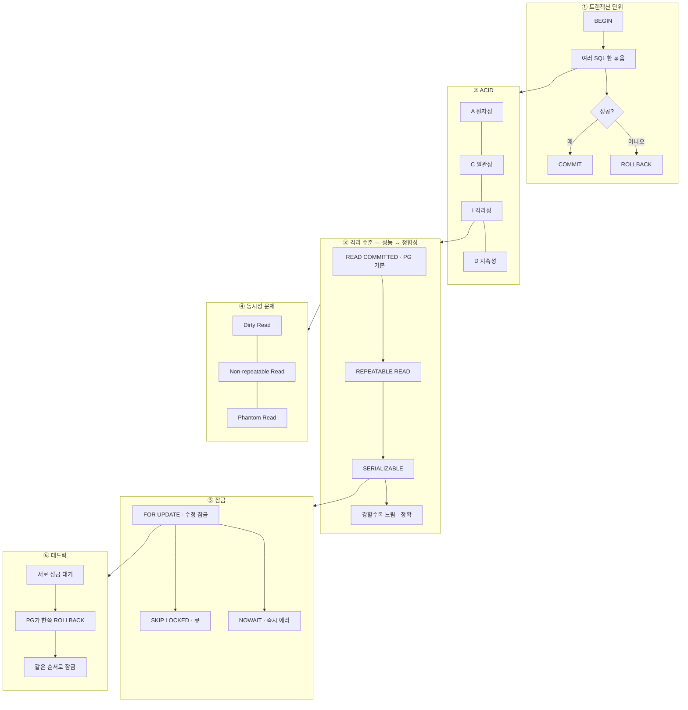

---
aliases:
  - DB
  - 트랜잭션
  - ACID
  - Isolation
tags:
  - SQL
  - PostgreSQL
related:
  - "[[00_DB_HomePage]]"
  - "[[NestJS_Transaction]]"
  - "[[PG_DDL]]"
  - "[[DB_MigrationPattern]]"
  - "[[NestJS_Idempotency]]"
---
# DB_Transaction — 트랜잭션

> [!info] 
> 트랜잭션 = "여러 작업을 하나의 논리적 단위로 묶어, 전부 성공하거나 전부 실패하게 만드는 것"
>  ACID 4가지 속성이 이를 보장하며, 격리 수준(Isolation Level)으로 동시성과 정합성의 균형을 잡는다.

---
# 흐름도



```txt
전부 성공 or 전부 롤백 · 격리 수준으로 동시성·정합성 조절 · MVCC로 읽기·쓰기 병행
FOR UPDATE = 비관적 잠금 · Prisma 구현 → [[NestJS_Transaction]] · 멱등·잠금 선택 → [[NestJS_Idempotency]]
```

---

# ACID ⭐️⭐️⭐️⭐️

|속성|의미|예시|
|---|---|---|
|**A**tomicity (원자성)|트랜잭션 안의 작업은 전부 성공하거나 전부 실패|계좌 이체: 출금 성공 + 입금 실패 → 둘 다 롤백|
|**C**onsistency (일관성)|트랜잭션 전후로 DB가 정의된 규칙(제약)을 항상 만족|NOT NULL, UNIQUE, FK 제약이 항상 유지됨|
|**I**solation (격리성)|동시에 실행 중인 트랜잭션이 서로 간섭하지 않음|격리 수준으로 정도를 조절 (아래 참고)|
|**D**urability (지속성)|커밋된 트랜잭션은 장애가 나도 영구 보존|WAL(Write-Ahead Log)로 보장|

---

# PostgreSQL 트랜잭션 기본 문법

```sql
BEGIN;                          -- 트랜잭션 시작

UPDATE accounts SET balance = balance - 10000 WHERE id = 1;  -- 출금
UPDATE accounts SET balance = balance + 10000 WHERE id = 2;  -- 입금

COMMIT;                         -- 성공 시 확정
-- 또는
ROLLBACK;                       -- 실패 시 취소 (BEGIN 이전 상태로 되돌림)
```

```sql
-- SAVEPOINT — 트랜잭션 안에서 부분 롤백
BEGIN;

INSERT INTO orders (user_id, product_id) VALUES (1, 100);
SAVEPOINT before_payment;       -- 여기까지는 유지하고 싶다는 표시

INSERT INTO payments (order_id, amount) VALUES (1, 50000);
-- 결제 실패
ROLLBACK TO before_payment;     -- SAVEPOINT까지만 롤백 (orders INSERT는 유지)

-- 다른 결제 수단으로 재시도
INSERT INTO payments (order_id, amount) VALUES (1, 50000);

COMMIT;
```

```txt
자동 커밋(Auto-commit):
  PostgreSQL은 기본적으로 각 SQL 문을 자동으로 트랜잭션으로 감싸고 커밋함
  명시적 BEGIN 없이 실행한 SQL → 즉시 커밋 → ROLLBACK 불가
  여러 SQL을 묶어서 원자적으로 처리하려면 반드시 BEGIN ... COMMIT/ROLLBACK 필요
```

---

# 격리 수준 (Isolation Level) ⭐️⭐️⭐️⭐️

```txt
격리성을 어느 정도로 보장할지 — 격리가 강할수록 정합성은 높고 성능은 낮아짐
동시성(성능) ↔ 정합성(정확도) 의 트레이드오프
```

## 동시성 문제 3가지

|문제|설명|예시|
|---|---|---|
|**Dirty Read**|아직 커밋 안 된 다른 트랜잭션의 데이터를 읽음|A가 수정 중인 데이터를 B가 읽음 → A가 롤백하면 B는 존재하지 않는 값을 쓴 것|
|**Non-repeatable Read**|같은 트랜잭션에서 같은 행을 두 번 읽었는데 값이 다름|B가 읽는 사이 A가 수정·커밋|
|**Phantom Read**|같은 트랜잭션에서 같은 조건으로 조회했는데 행 수가 다름|B가 조회하는 사이 A가 INSERT·커밋|

## 격리 수준별 허용/차단

|격리 수준|Dirty Read|Non-repeatable Read|Phantom Read|성능|
|---|---|---|---|---|
|`READ UNCOMMITTED`|허용|허용|허용|가장 빠름|
|`READ COMMITTED`|**차단**|허용|허용|빠름|
|`REPEATABLE READ`|**차단**|**차단**|허용|중간|
|`SERIALIZABLE`|**차단**|**차단**|**차단**|가장 느림|

```txt
PostgreSQL 기본값: READ COMMITTED
  → 커밋된 데이터만 읽음 (Dirty Read 없음)
  → 하지만 같은 트랜잭션에서 두 번 읽으면 값이 달라질 수 있음 (Non-repeatable Read 허용)

MySQL(InnoDB) 기본값: REPEATABLE READ
  → PostgreSQL보다 한 단계 높은 격리

PostgreSQL의 REPEATABLE READ:
  실제로는 MVCC로 구현 — Phantom Read도 차단 (표준 SQL보다 강함)
```

```sql
-- 격리 수준 설정
SET TRANSACTION ISOLATION LEVEL REPEATABLE READ;
BEGIN;
-- ...
COMMIT;

-- 또는 세션 전체 설정
SET default_transaction_isolation TO 'repeatable read';
```

---

# MVCC — PostgreSQL의 동시성 구현 원리 ⭐️⭐️⭐️

```txt
MVCC(Multi-Version Concurrency Control) = 버전을 여러 개 유지해서 잠금 없이 동시성을 처리

원리:
  UPDATE/DELETE 시 기존 행을 실제로 수정하지 않고
  새로운 버전의 행을 추가 (xmin, xmax 트랜잭션 ID로 관리)
  각 트랜잭션은 "자신이 시작한 시점에 커밋된 버전"만 볼 수 있음

장점:
  읽기와 쓰기가 서로 차단하지 않음 (Reader가 Writer를 기다리지 않음)
  높은 동시성 처리 가능

단점:
  오래된 버전이 쌓임 → VACUUM으로 정리 필요
  (VACUUM: 더 이상 필요 없는 구버전 행을 정리하는 PostgreSQL 내부 프로세스)
```

---

# 잠금 (Lock) ⭐️⭐️⭐️

## 행 수준 잠금

```sql
-- SELECT FOR UPDATE — 읽은 행에 잠금 (다른 트랜잭션의 수정 대기)
BEGIN;
SELECT * FROM products WHERE id = 1 FOR UPDATE;
-- 이 행은 현재 트랜잭션이 COMMIT/ROLLBACK할 때까지 다른 트랜잭션이 수정 불가
UPDATE products SET stock = stock - 1 WHERE id = 1;
COMMIT;

-- SELECT FOR SHARE — 읽기 잠금 (다른 읽기는 허용, 수정만 차단)
SELECT * FROM products WHERE id = 1 FOR SHARE;

-- NOWAIT — 잠금 대기 없이 즉시 에러
SELECT * FROM products WHERE id = 1 FOR UPDATE NOWAIT;

-- SKIP LOCKED — 잠긴 행은 건너뜀 (큐 패턴에 유용)
SELECT * FROM jobs WHERE status = 'pending' FOR UPDATE SKIP LOCKED LIMIT 1;
```

## SKIP LOCKED — 작업 큐 패턴

```sql
-- 여러 워커가 동시에 작업을 가져갈 때
-- 이미 처리 중인 행(잠긴 행)은 건너뛰고 다음 대기 작업 가져옴
SELECT * FROM jobs
WHERE status = 'pending'
ORDER BY created_at
FOR UPDATE SKIP LOCKED
LIMIT 1;
```

```txt
SKIP LOCKED 없이 FOR UPDATE만 쓰면:
  워커 A가 job_id=1 처리 중 → 잠금
  워커 B가 같은 쿼리 실행 → job_id=1의 잠금 해제를 기다림 → 비효율

SKIP LOCKED를 쓰면:
  워커 B가 job_id=1은 건너뛰고 → job_id=2를 바로 가져감 → 병렬 처리
```

---

# 데드락 (Deadlock) ⭐️⭐️⭐️

```txt
데드락 = 두 트랜잭션이 서로 상대방이 가진 잠금을 기다리며 영원히 대기

발생 예시:
  트랜잭션 A: accounts 행 1 잠금 → accounts 행 2 잠금 시도
  트랜잭션 B: accounts 행 2 잠금 → accounts 행 1 잠금 시도
  → A는 B를, B는 A를 기다림 → 영원히 대기

PostgreSQL의 데드락 해결:
  DB가 자동으로 감지 → 한 쪽을 ROLLBACK (희생양)
  에러: "ERROR: deadlock detected"
  → 롤백된 쪽이 재시도해야 함
```

```sql
-- 데드락 방지 — 항상 같은 순서로 잠금
-- ❌ 순서가 다르면 데드락 위험
-- 트랜잭션 A: WHERE id = 1 → WHERE id = 2
-- 트랜잭션 B: WHERE id = 2 → WHERE id = 1

-- ✅ 항상 id 오름차순으로 잠금
BEGIN;
SELECT * FROM accounts WHERE id IN (1, 2) ORDER BY id FOR UPDATE;
-- id=1 먼저, id=2 다음 → 모든 트랜잭션이 같은 순서로 접근 → 데드락 없음
COMMIT;
```

```txt
데드락 방지 원칙:
  여러 행을 잠글 때 항상 같은 순서로 (PK 오름차순 등)
  트랜잭션을 짧게 유지 (잠금 보유 시간 최소화)
  lock_timeout 설정으로 오래 기다리면 에러로 처리
```

---

# 한눈에

```txt
ACID:
  A(원자성)  전부 성공 or 전부 실패
  C(일관성)  제약조건 항상 만족
  I(격리성)  동시 트랜잭션 간섭 없음 (격리 수준으로 조절)
  D(지속성)  커밋 후 장애가 나도 유지 (WAL)

격리 수준 (PostgreSQL 기본: READ COMMITTED):
  READ UNCOMMITTED  → Dirty Read 허용
  READ COMMITTED    → Dirty Read 차단 ← PostgreSQL 기본
  REPEATABLE READ   → Non-repeatable Read도 차단
  SERIALIZABLE      → 완전 직렬화 (가장 안전, 가장 느림)

잠금:
  FOR UPDATE       행 수정 잠금 (비관적 잠금 패턴에 사용)
  FOR SHARE        읽기 공유 잠금
  NOWAIT           잠금 대기 없이 즉시 에러
  SKIP LOCKED      잠긴 행 건너뜀 (작업 큐 패턴)

데드락:
  두 트랜잭션이 서로 상대 잠금을 기다림 → PostgreSQL이 자동 감지 후 한 쪽 롤백
  방지: 항상 같은 순서로 잠금, 트랜잭션 짧게

Prisma/NestJS에서 구현 → [[NestJS_Transaction]]
비관적 잠금 실전 패턴 → [[NestJS_Idempotency]]
```