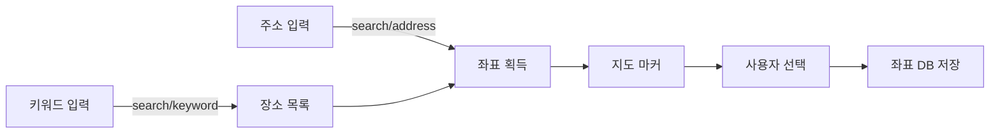

---
aliases:
  - 00_External_APIs_Ecosystem_HomePage — 지도 · 인증 · 결제 · 외부 서비스
  - External APIs Ecosystem HomePage
tags:
  - HomePage
related:
  - "[[00_JS_Ecosystem_HomePage]]"
  - "[[00_NestJS_Ecosystem_HomePage]]"
cssclasses:
  - max
  - table-max
  - table-wrap
---
# 00_External_APIs_Ecosystem_HomePage — 외부 서비스 API

>[!info]
>카카오·네이버·구글·애플 등 서드파티 외부 REST API 통합 레퍼런스.
>지도/위치, 소셜 로그인(OAuth), 결제, 알림 등 공급자별 인증·엔드포인트·응답 구조 정리.
>서버사이드(NestJS)에서 호출하는 패턴 기준으로 정리 — API 키는 클라이언트에 노출 금지.

---

# 빠른 찾기

| 찾을 때 | 섹션 |
|---|---|
| 주소↔좌표 변환 · 장소 검색 | [[#🗺️ 지도 · 위치]] |
| 소셜 로그인 (카카오·네이버·구글) | [[#🔑 소셜 로그인 · OAuth]] |
| 결제 (토스·카카오페이) | [[#💳 결제]] |
| 알림 · SMS | [[#📨 알림 · SMS]] |
| 공급자별 인증 방식 비교 | [[#🔐 공통 — 인증 방식]] |

---

# 외부 API 호출 흐름

```txt
클라이언트 (Next.js)
  → NestJS 서버         (API 키 보관 · 비즈니스 로직)
  → 외부 서비스 API      (카카오·네이버·구글 등)
  ← 응답 파싱·가공
  ← 클라이언트로 반환
```

> [!warning] API 키(REST API 키·Client Secret 등)는 반드시 서버사이드에서만 사용  
> `NEXT_PUBLIC_*` 환경변수에 넣으면 브라우저에 노출됨 — NestJS 서비스에서 호출할 것

---

## 🗺️ 지도 · 위치

| 노트 | 내용 |
|------|------|
| [[Map_Kakao_Local]] | 주소→좌표 · 좌표→주소 · 키워드/카테고리 검색 · 행정구역 코드 · 좌표계 변환 |
| Map_Naver | (추후) |
| Map_Google | (추후) |
| Map_Apple | (추후) |

```txt
Map_Kakao_Local   REST API 키 인증(헤더) · 주소→좌표(search/address) · 좌표→주소/행정구역
                  키워드 장소검색(query+radius+sort) · 카테고리 코드표(CE7·FD6·MT1 등)
                  페이지네이션(is_end 루프) · 에러 처리 · 좌표계(WGS84·WCONGNAMUL·TM)
```

### 공급자 비교

| 항목 | 카카오 | 네이버 | 구글 | 애플 |
|------|--------|--------|------|------|
| 인증 방식 | `KakaoAK {키}` 헤더 | Client ID + Secret 헤더 | API Key 쿼리 | JWT 헤더 |
| 주소→좌표 | ✅ | ✅ | ✅ | ✅ |
| 좌표→주소 | ✅ | ✅ | ✅ | ✅ |
| 키워드 검색 | ✅ | ✅ | ✅ | ✅ |
| 카테고리 검색 | ✅ | ❌ | ✅ | ❌ |
| 좌표계 변환 | ✅ | ❌ | ❌ | ❌ |
| 국내 정확도 | ⭐⭐⭐⭐⭐ | ⭐⭐⭐⭐⭐ | ⭐⭐⭐ | ⭐⭐ |
| 무료 한도 | 300,000 QPS/월 | 25,000 req/일 | $200 크레딧/월 | 250,000 req/일 |

### 🧭 좌표계

| 좌표계 | 설명 | 사용처 |
|--------|------|--------|
| `WGS84` | GPS 표준. 경도(x)·위도(y) | 카카오·구글·애플 기본값 |
| `WCONGNAMUL` | 카카오맵 내부 미터 단위 | 구 다음맵 연동 |
| `CONGNAMUL` | 구 다음맵 좌표계 | 레거시 |
| `WTM` | 평면직각좌표 (WGS84 기반) | 공공 GIS 데이터 |
| `TM` | 평면직각좌표 (Bessel 기반) | 구형 공공 데이터 |

> [!warning] 카카오 응답에서 `x` = 경도(longitude), `y` = 위도(latitude)  
> 지도 SDK는 보통 `(lat, lng)` 순서 → 파싱 시 `lat: parseFloat(doc.y)` 확인

### 지도 구현 흐름




---

## 🔑 소셜 로그인 · OAuth

| 노트 | 내용 |
|------|------|
| OAuth_Kakao | (추후) |
| OAuth_Naver | (추후) |
| OAuth_Google | (추후) |
| OAuth_Apple | (추후) |

```txt
OAuth_Kakao   인가 코드 발급 → 토큰 교환 → 사용자 정보 조회 · 카카오 로그인 버튼
OAuth_Naver   (추후)
OAuth_Google  (추후)
OAuth_Apple   Sign in with Apple · JWT 검증
```

### OAuth 공통 흐름

```txt
1. 인가 코드 요청   클라이언트 → 공급자 로그인 페이지 redirect
2. 콜백 수신        공급자 → 서버 callback URL (code 파라미터)
3. 토큰 교환        서버 → 공급자 token API (code → access_token)
4. 사용자 정보 조회  서버 → 공급자 userinfo API (access_token → id·email·nickname)
5. 내부 JWT 발급    서버가 자체 JWT 생성 → 클라이언트 쿠키/헤더 전달
```

---

## 💳 결제

| 노트 | 내용 |
|------|------|
| Payment_Toss | (추후) |
| Payment_Kakao | (추후) |

```txt
Payment_Toss    결제 요청 → 승인 → 취소 · 위젯 연동 · 웹훅
Payment_Kakao   카카오페이 단건결제 · 정기결제
```

---

## 📨 알림 · SMS

| 노트 | 내용 |
|------|------|
| SMS_Coolsms | (추후) |

---

## 🔐 공통 — 인증 방식

| 방식 | 공급자 예시 | 헤더/파라미터 |
|------|-----------|--------------|
| API Key (헤더) | 카카오 로컬 | `Authorization: KakaoAK {key}` |
| Client ID + Secret (헤더) | 네이버 | `X-Naver-Client-Id` + `X-Naver-Client-Secret` |
| API Key (쿼리) | 구글 Maps | `?key={API_KEY}` |
| Bearer JWT | 애플 MapKit | `Authorization: Bearer {JWT}` |
| OAuth2 Bearer | 소셜 로그인 공통 | `Authorization: Bearer {access_token}` |

> [!tip] 모든 키는 `.env` → NestJS `ConfigService`로 주입. 하드코딩·`NEXT_PUBLIC_*` 절대 금지
