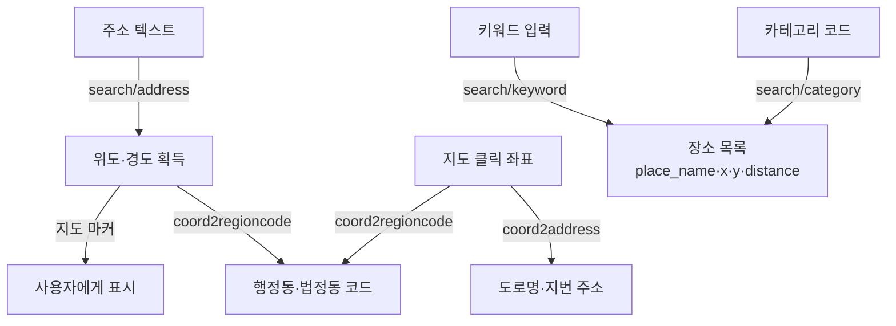

# 카카오 로컬 API

> [!note] 공식 문서: https://developers.kakao.com/docs/ko/local/dev-guide

카카오 로컬 API — 주소·좌표 변환, 장소 검색, 행정구역 조회 등 위치 데이터를 REST API로 제공.

---

## 인증

모든 요청에 REST API 키를 헤더에 포함.

```http
Authorization: KakaoAK {REST_API_KEY}
```

```txt
REST API 키 발급: 카카오 개발자 콘솔 → 내 애플리케이션 → 앱 키 → REST API 키

서버사이드 전용 — 클라이언트에 키 노출 금지
  → NEXT_PUBLIC_* 환경변수 사용 불가
  → NestJS ConfigService로 주입해서 Service에서만 호출
```

```typescript
// NestJS Service 패턴
const apiKey = this.configService.get<string>(EnvKeys.KAKAO_REST_API_KEY);
if (!apiKey) throw new ServiceUnavailableException('API 키가 설정되지 않았습니다.');
```

---

## 쿼터 (사용량 제한)

```txt
집계 기준: API 요청 수 (토큰·글자 수 아님)
  — fetch() 한 번 = 요청 1건
  — 응답 크기(documents 수)와 무관

무료 기본 쿼터
  일별 쿼터: 300,000건 / 일 (앱 기준)
  QPS: 초당 10~30건 (API 종류별 차이)
  → 429 Too Many Requests 발생 시 쿼터 초과

쿼터 절약 원칙
  ① 짧은 검색어 차단 — keyword.length < 2 이면 요청 안 함
  ② 디바운스 — 검색창 입력마다 바로 요청하지 말고 300~500ms 후 요청
  ③ 필요할 때만 요청 — 전체 페이지를 미리 긁지 말 것
```

---

## API 목록

| API | 엔드포인트 | 설명 |
|-----|-----------|------|
| 주소→좌표 | `GET /v2/local/search/address.json` | 주소 문자열로 좌표 획득 |
| 좌표→주소 | `GET /v2/local/geo/coord2address.json` | 좌표로 주소 텍스트 획득 |
| 좌표→행정구역 | `GET /v2/local/geo/coord2regioncode.json` | 좌표로 행정동/법정동 코드 획득 |
| 좌표계 변환 | `GET /v2/local/geo/transcoord.json` | WGS84 ↔ CONGNAMUL 등 변환 |
| 키워드 장소검색 | `GET /v2/local/search/keyword.json` | "스타벅스 강남" 등 자유 검색 |
| 카테고리 장소검색 | `GET /v2/local/search/category.json` | 음식점·카페 등 코드 기반 검색 |

Base URL: `https://dapi.kakao.com`

---

## 전체 흐름



---

## 응답 공통 구조 — meta + documents

모든 검색 API는 동일한 최상위 구조를 반환.

```typescript
{
  meta: {
    total_count: number;      // 전체 결과 수
    pageable_count: number;   // 실제로 페이지 접근 가능한 수 (최대 45 * size)
    is_end: boolean;          // true면 마지막 페이지 — 다음 페이지 없음
  },
  documents: [ ... ]          // 실제 결과 배열 — API마다 필드 다름
}
```

```txt
documents
  — 요청 결과를 담은 배열. 길이는 size 파라미터로 제어 (기본 10~15)
  — 결과가 없으면 빈 배열 [] 반환 (null 아님)
  — 첫 번째 결과만 필요하면 documents[0] 으로 꺼냄
  — 여러 결과를 보여줄 때는 documents.map()으로 파싱

meta.is_end
  — false: 다음 페이지 있음 → page + 1 로 재요청 가능
  — true:  마지막 페이지 → 더 이상 요청 불필요
  — 최대 45페이지까지 접근 가능 (page 파라미터 1~45)
```

---

## 주소 → 좌표 변환

```
GET https://dapi.kakao.com/v2/local/search/address.json
```

### 요청 파라미터

| 파라미터 | 필수 | 타입 | 설명 |
|---------|------|------|------|
| `query` | ✅ | string | 검색할 주소 문자열 |
| `analyze_type` | ❌ | string | `similar`(기본) · `exact` |
| `page` | ❌ | int | 1~45 (기본: 1) |
| `size` | ❌ | int | 1~30 (기본: 10) |

```txt
size          한 번 응답에서 받을 results 수 (documents 배열 길이)
              주소→좌표 최대 30 / 키워드 검색 최대 15
              → 자동완성 드롭다운이면 size='5' 정도로 줄여 응답 속도 개선

analyze_type  주소 매칭 방식
  similar(기본) — 오타·불완전 입력도 유사 주소 포함 (사용자 입력에 유리)
  exact         — 완전 일치만 반환 (정확도 우선, documents가 적거나 빌 수 있음)
```

### documents 필드

```typescript
documents: {
  address_name: string;       // "서울 강남구 역삼동 858"
  address_type: 'REGION' | 'ROAD' | 'REGION_ADDR' | 'ROAD_ADDR';
  x: string;                  // 경도 (longitude)
  y: string;                  // 위도 (latitude)
  address: {                  // 지번 주소 상세 (null 가능)
    address_name: string;
    region_1depth_name: string;   // "서울"
    region_2depth_name: string;   // "강남구"
    region_3depth_name: string;   // "역삼동"
    main_address_no: string;
    sub_address_no: string;
  } | null;
  road_address: {             // 도로명 주소 상세 (null 가능)
    address_name: string;
    road_name: string;            // "테헤란로"
    building_name: string;
    zone_no: string;              // 우편번호
  } | null;
}[]
```

### 실전 패턴

```typescript
async function addressToCoord(address: string) {
  const url = new URL('https://dapi.kakao.com/v2/local/search/address.json');
  url.searchParams.set('query', address);
  url.searchParams.set('size', '5');

  const res = await fetch(url, {
    headers: { Authorization: `KakaoAK ${process.env.KAKAO_REST_API_KEY}` },
    signal: AbortSignal.timeout(5000),
  });
  if (!res.ok) throw new ServiceUnavailableException(`카카오 API 실패 (${res.status})`);

  const data = await res.json();
  const doc = data.documents[0];   // 첫 번째 결과만 사용
  if (!doc) return null;

  return {
    lat: parseFloat(doc.y),   // y = 위도
    lng: parseFloat(doc.x),   // x = 경도
    address: doc.address_name,
  };
}
```

> [!warning] `x`가 경도(longitude), `y`가 위도(latitude)  
> 지도 라이브러리는 보통 `(lat, lng)` 순서 → `lat: parseFloat(doc.y)` 확인

---

## 좌표 → 주소 변환

```
GET https://dapi.kakao.com/v2/local/geo/coord2address.json
```

### 요청 파라미터

| 파라미터 | 필수 | 설명 |
|---------|------|------|
| `x` | ✅ | 경도(longitude) |
| `y` | ✅ | 위도(latitude) |
| `input_coord` | ❌ | 좌표계 (기본: `WGS84`) |

### documents 필드

```typescript
documents: {
  road_address: {
    address_name: string;      // "서울 강남구 테헤란로 212"
    building_name: string;
    zone_no: string;           // 우편번호
  } | null;
  address: {
    address_name: string;      // "서울 강남구 역삼동 858"
    region_1depth_name: string;
    region_2depth_name: string;
    region_3depth_name: string;
  } | null;
}[]
```

---

## 좌표 → 행정구역 코드

```
GET https://dapi.kakao.com/v2/local/geo/coord2regioncode.json
```

```txt
documents에 두 종류가 함께 담김:
  region_type "H" — 행정동: 실제 주민 생활 기준 (주민센터 관할)
  region_type "B" — 법정동: 공식 행정 기준 (등기·주소 표기)
  → 필요한 타입으로 .find() 또는 .filter()
```

### documents 필드

```typescript
documents: {
  region_type: 'H' | 'B';
  address_name: string;          // "서울특별시 강남구 역삼1동"
  region_1depth_name: string;    // "서울특별시"
  region_2depth_name: string;    // "강남구"
  region_3depth_name: string;    // "역삼1동"
  region_4depth_name: string;    // 행정동(H)만 존재
  code: string;                  // 행정구역 코드 10자리
  x: number;
  y: number;
}[]
```

---

## 키워드 장소 검색

```
GET https://dapi.kakao.com/v2/local/search/keyword.json
GET https://dapi.kakao.com/v2/local/search/category.json  (카테고리 코드 기반)
```

### 요청 파라미터

| 파라미터 | 필수 | 타입 | 설명 |
|---------|------|------|------|
| `query` | ✅ | string | "스타벅스 강남역" |
| `category_group_code` | ❌ | string | 아래 카테고리 코드 참조 |
| `x` | ❌ | string | 중심 경도 (반경 검색 시 필요) |
| `y` | ❌ | string | 중심 위도 |
| `radius` | ❌ | int | 0~20,000m |
| `rect` | ❌ | string | `"x1,y1,x2,y2"` 사각형 범위 |
| `page` | ❌ | int | 1~45 |
| `size` | ❌ | int | 1~15 (기본: 15) |
| `sort` | ❌ | string | `accuracy`(기본) · `distance` |

```txt
sort
  accuracy(기본) — 키워드 일치도 순 (정확한 검색어일 때 유리)
  distance       — 가까운 순, x·y 파라미터 필수

size
  API 스펙 하드 리밋: 1~15 (15 초과 요청 시 카카오가 15개까지만 반환)
  전체 페이지 접근 가능 수 최대 45개 (page 1~45, 각 size개)

radius vs rect
  radius — 원형 범위 (중심 x·y + 반경 m)
  rect   — 사각형 범위 (지도 뷰포트 내 검색에 적합)
```

### 카테고리 코드

| 코드 | 분류 | 코드 | 분류 |
|------|------|------|------|
| `MT1` | 대형마트 | `BK9` | 은행 |
| `CS2` | 편의점 | `CT1` | 문화시설 |
| `PK6` | 주차장 | `AT4` | 관광명소 |
| `OL7` | 주유소·충전소 | `AD5` | 숙박 |
| `SW8` | 지하철역 | `FD6` | 음식점 |
| `SC4` | 학교 | `CE7` | 카페 |
| `AC5` | 학원 | `HP8` | 병원 |
| `PO3` | 공공기관 | `PM9` | 약국 |

### documents 필드

```typescript
type KakaoPlaceDocument = {
  id: string;
  place_name: string;           // "스타벅스 강남역점"
  category_name: string;        // "음식점 > 카페 > 스타벅스"
  category_group_code: string;
  category_group_name: string;
  phone: string;
  address_name: string;         // 지번 주소
  road_address_name: string;    // 도로명 주소
  x: string;                    // 경도
  y: string;                    // 위도
  place_url: string;            // 카카오맵 상세 URL
  distance: string;             // 중심 좌표 기준 거리(m) — x·y 지정 시만 반환
};

type KakaoKeywordResponse = {
  meta: {
    total_count: number;
    pageable_count: number;
    is_end: boolean;
  };
  documents: KakaoPlaceDocument[];
};
```

### 실전 패턴 — NestJS Service

```typescript
@Injectable()
export class PlacesService {
  constructor(private readonly configService: ConfigService) {}

  async search(query: string): Promise<PlaceSearchResult[]> {
    const keyword = query.trim();
    if (keyword.length < 2) return [];

    const apiKey = this.configService.get<string>(EnvKeys.KAKAO_REST_API_KEY);
    if (!apiKey) throw new ServiceUnavailableException('장소 검색 API 키가 설정되지 않았습니다.');

    const url = new URL('https://dapi.kakao.com/v2/local/search/keyword.json');
    url.searchParams.set('query', keyword);
    url.searchParams.set('size', '15');  // API 스펙 하드 리밋 최대값

    const normalize = (value: string) => value.replace(/\s+/g, '').toLowerCase();
    const normalizedKeyword = normalize(keyword);
    const keywordTokens = keyword.split(/\s+/).filter(Boolean).map(normalize);

    const getMatchScore = (place: KakaoPlaceDocument) => {
      const normalizedName = normalize(place.place_name);
      const normalizedAddress = normalize(`${place.address_name} ${place.road_address_name}`);
      if (normalizedName === normalizedKeyword) return 0;               // 이름 완전 일치
      if (normalizedName.startsWith(normalizedKeyword)) return 1;      // 이름 전방 일치
      if (keywordTokens.every((token) => normalizedName.includes(token))) return 2;    // 이름 AND
      if (keywordTokens.every((token) => normalizedAddress.includes(token))) return 3; // 주소 AND
      return 4;                                                         // 약한 매칭
    };

    const response = await fetch(url, {
      headers: { Accept: 'application/json', Authorization: `KakaoAK ${apiKey}` },
      signal: AbortSignal.timeout(5000),
    });

    if (!response.ok) {
      const errorBody = await response.text();
      console.error('[Kakao Places Error]', { status: response.status, body: errorBody });
      throw new ServiceUnavailableException(`카카오 장소 검색 실패 (${response.status})`);
    }

    const data = (await response.json()) as KakaoKeywordResponse;

    return [...data.documents]
      .sort((a, b) => {
        const scoreDiff = getMatchScore(a) - getMatchScore(b);
        if (scoreDiff !== 0) return scoreDiff;
        return a.place_name.length - b.place_name.length;  // tiebreaker: 짧은 이름 앞
      })
      .map((place) => ({
        id: place.id,
        name: place.place_name,
        category: place.category_name,
        address: place.address_name,
        roadAddress: place.road_address_name,
        placeUrl: place.place_url,
        longitude: Number(place.x),   // x = 경도(longitude)
        latitude: Number(place.y),    // y = 위도(latitude)
      }));
  }
}
```

```txt
패턴 포인트:
  ① API 키 없으면 503 먼저 throw — null로 요청 보내는 것 방지
  ② new URL() + searchParams — 문자열 직접 이어붙이기보다 안전, 인코딩 자동 처리
  ③ size='15' — API 스펙 하드 리밋 최대값. 16으로 요청해도 15개만 반환됨
  ④ AbortSignal.timeout() — 외부 API 타임아웃은 항상 설정 (기본값 없음)
  ⑤ response.ok 체크 — fetch는 4xx/5xx에도 throw 안 함, 직접 확인 필수
  ⑥ response.text() — JSON 파싱 실패 없이 어떤 형식이든 에러 원인 출력 가능
  ⑦ getMatchScore + sort — 카카오 accuracy 정렬을 키워드 매칭 품질로 재정렬
  ⑧ tiebreaker: 이름 길이 — 점수 같을 때 짧은 이름(수식어 없는 핵심 결과) 우선
```

---

## 관련도 스코어링 정렬 ⭐️⭐️⭐️⭐️

카카오가 accuracy 순으로 반환해도, 사용자 키워드와의 매칭 품질로 재정렬이 필요할 때 사용.

### getMatchScore — 매칭 품질 수치화

```typescript
const normalize = (value: string) =>
  value.replace(/\s+/g, '').toLowerCase();

const normalizedKeyword = normalize(keyword);
const keywordTokens = keyword.split(/\s+/).filter(Boolean).map(normalize);

const getMatchScore = (place: KakaoPlaceDocument): number => {
  const normalizedName    = normalize(place.place_name);
  const normalizedAddress = normalize(
    `${place.address_name} ${place.road_address_name}`,
  );

  if (normalizedName === normalizedKeyword)                       return 0; // 이름 완전 일치
  if (normalizedName.startsWith(normalizedKeyword))              return 1; // 이름이 키워드로 시작
  if (keywordTokens.every((t) => normalizedName.includes(t)))    return 2; // 이름에 토큰 전부 포함
  if (keywordTokens.every((t) => normalizedAddress.includes(t))) return 3; // 주소에 토큰 전부 포함
  return 4; // 위 조건 미해당 (약한 매칭)
};
```

```txt
점수가 낮을수록 더 정확한 매칭
  0 — 완전 일치 ("스타벅스 강남역점" 검색 → "스타벅스 강남역점" 이름 그대로 일치)
  1 — 전방 일치 (startsWith — 체인 브랜드명 앞에 붙는 패턴)
  2 — 이름 AND 매칭 (토큰 전부 place_name 안에 있음)
  3 — 주소 AND 매칭 (이름엔 없지만 address에 있음)
  4 — 약한 매칭 (카카오가 반환했지만 키워드와 직접 관련 없음)
```

### sort — 점수 오름차순 + 이름 길이 tiebreaker

```typescript
return [...data.documents]
  .sort((a, b) => {
    const scoreDiff = getMatchScore(a) - getMatchScore(b);
    if (scoreDiff !== 0) return scoreDiff;               // 점수 다르면 점수 순
    return a.place_name.length - b.place_name.length;   // 점수 같으면 이름 짧은 것 앞
  })
  .map((place) => ({
    id: place.id,
    name: place.place_name,
    category: place.category_name,
    address: place.address_name,
    roadAddress: place.road_address_name,
    placeUrl: place.place_url,
    longitude: Number(place.x),  // x = 경도
    latitude: Number(place.y),   // y = 위도
  }));
```

```txt
tiebreaker로 이름 길이를 쓰는 이유:
  "스타벅스 강남역점" 보다 "강남역"이 더 직접적인 매칭일 가능성이 높음
  이름이 짧다 = 수식어(지점명 등)가 없다 = 더 핵심에 가까운 결과
  점수가 같을 때 이름이 짧은 것을 먼저 보냄
```

---

## Next.js 프론트엔드 통합 패턴

최근 장소 (localStorage) + 카카오 검색 + 직접 입력을 하나의 드롭다운으로 통합.

```txt
왜 3가지를 조합해야 했는가

카카오 단독은 UX 공백이 생김:
  — 2글자 미만 입력 중엔 API 요청 자체를 안 함 → 드롭다운이 비어 있음
  — 디바운스 300ms + API 응답 시간 → 타이핑 중 항상 "아무것도 안 보이는" 구간 존재
  — 처음 방문 사용자도 결과가 오기 전까지 아무것도 선택 못 함

최근 장소로 공백 구간 해소:
  — 2글자 미만이거나 카카오 응답 대기 중엔 최근 장소를 먼저 표시
  — 자주 쓰는 장소는 API 호출 없이 즉시 표시 → 쿼터 절약 + 응답 빠름

직접 입력으로 카카오 인덱스 밖의 장소 처리:
  — 해외·신규 오픈·좁은 지역명 등 카카오에 없는 경우
  — 사용자가 원하는 이름 그대로 저장하고 싶을 때

최종 UX 흐름:
  입력 < 2글자       → 최근 장소만 표시 (API 호출 없음)
  입력 ≥ 2글자       → 최근 장소 유지 + 백그라운드에서 카카오 요청 시작
  카카오 응답 도착    → 최근 + 카카오 merge 표시 (중복 제거, recent 우선)
  원하는 결과 없음    → 직접 입력한 텍스트 그대로 저장
```

### normalizeLocationValue — 검색 비교용 정규화

```typescript
function normalizeLocationValue(value: string) {
  return value.replace(/\s+/g, '').toLowerCase();
}
// "스타벅스 강남역" → "스타벅스강남역"
// 공백 제거 + 소문자 → 비교 시 공백·대소문자 차이 무시
```

### 최근 장소 — localStorage 타입 & 상수

```typescript
type RecentLocation = Pick<PlaceSearchResult, 'id' | 'name' | 'address' | 'roadAddress'>;
const RECENT_LOCATIONS_STORAGE_KEY = 'cinemo.recent-viewing-locations';
const MAX_RECENT_LOCATIONS = 8;
```

```txt
최근 장소 특징
  — localStorage에 저장, 앱 재실행 후에도 유지
  — 최대 8개 유지 (MAX_RECENT_LOCATIONS)
  — 동일 이름(normalize 기준) 선택 시 upsert: 기존 항목 제거 후 맨 앞에 삽입
  — 카카오 검색 결과와 merge 시 중복 제거 (recent 우선)
```

### rememberLocation — upsert (최근 순 정렬)

```typescript
function rememberLocation(location: PlaceSearchResult | string) {
  const locationName = typeof location === 'string' ? location.trim() : location.name.trim();
  if (!locationName) return;

  const recentLocation: RecentLocation =
    typeof location === 'string'
      ? { id: `recent:${normalizeLocationValue(locationName)}`, name: locationName, address: '', roadAddress: '' }
      : { id: `recent:${normalizeLocationValue(locationName)}`, name: locationName, address: location.address, roadAddress: location.roadAddress };

  setRecentLocations((currentLocations) =>
    [
      recentLocation,
      ...currentLocations.filter(
        (currentLocation) =>
          normalizeLocationValue(currentLocation.name) !== normalizeLocationValue(locationName),
      ),
    ].slice(0, MAX_RECENT_LOCATIONS),
  );
}
```

```txt
upsert 패턴:
  1. filter로 동일 이름(normalize 기준) 기존 항목 제거
  2. 새 항목을 맨 앞에 추가
  3. slice(0, 8)로 최대 개수 제한
  → 동일 장소 재선택 시 가장 최근 선택이 맨 위로 올라옴
```

### getRecentLocationMatches — 최근 장소 필터링

```typescript
function getRecentLocationMatches(locations: RecentLocation[], query: string) {
  const normalizedQuery = normalizeLocationValue(query);
  return locations.filter((location) => {
    if (!normalizedQuery) return true;  // query 없으면 전체 반환
    return normalizeLocationValue(
      [location.name, location.address, location.roadAddress].join(' '),
    ).includes(normalizedQuery);
  });
}
```

### mergeLocationSuggestions — 최근 + 카카오 중복 제거 병합

```typescript
function mergeLocationSuggestions(
  recentLocations: RecentLocation[],
  kakaoLocations: PlaceSearchResult[],
) {
  return [
    ...recentLocations,
    ...kakaoLocations.filter(
      (location) =>
        !recentLocations.some(
          (recentLocation) =>
            normalizeLocationValue(recentLocation.name) === normalizeLocationValue(location.name),
        ),
    ),
  ];
}
```

```txt
병합 전략:
  최근 장소 먼저 → 카카오 결과 중 최근에 없는 것만 append
  id 기준이 아닌 normalize(name) 기준으로 중복 판정
  → 카카오 id가 달라도 같은 상호명이면 최근 장소 버전 유지
```

### visibleLocationSuggestions — 조건부 표시 로직

```typescript
const visibleLocationSuggestions = (
  isLocationFocused
    ? viewingLocation.trim().length < 2 || locationSuggestionsQuery !== viewingLocation.trim()
      ? recentLocationMatches          // ← 입력 2글자 미만, 또는 카카오 응답 대기 중
      : mergeLocationSuggestions(recentLocationMatches, locationSuggestions)  // ← 카카오 응답 완료
    : []
) as PlaceSearchResult[];
```

```txt
조건 흐름:
  포커스 없음                               → [] (드롭다운 숨김)
  포커스 + 입력 2글자 미만                   → 최근 장소만 표시
  포커스 + 입력 2글자 이상 + 카카오 대기 중   → 최근 장소만 표시
  포커스 + 입력 2글자 이상 + 카카오 응답 완료  → 최근 + 카카오 merge 표시

locationSuggestionsQuery:
  "어떤 검색어의 카카오 응답이 현재 dropdown에 보이는가"를 추적하는 state
  useEffect에서 results 수신 완료 후 setLocationSuggestionsQuery(query) 로 갱신
  → 입력값과 다르면 "아직 이 검색어의 응답이 없음" → 최근 장소만 표시

searchingPlacesQuery:
  "현재 로딩 중인 검색어"를 추적 — 로딩 인디케이터 표시에 활용
  요청 시작: setSearchingPlacesQuery(query)
  완료 시 현재 값과 같으면 '' 로 리셋 (다른 검색어 로딩 중이면 건드리지 않음)
```

### onBlur race condition — 드롭다운 클릭 무시 방지

```typescript
// ❌ 안티 패턴 — onBlur가 onClick보다 먼저 실행됨
<input onBlur={() => setIsLocationFocused(false)} />
// → input에서 포커스 빠지는 순간 드롭다운 사라짐 → 클릭 이벤트 도달 못함

// ✅ 해결 — onPointerDown + preventDefault로 포커스 이동 차단
<div onPointerDown={(e) => { e.preventDefault(); handleLocationSelect(location); }}>
  {location.name}
</div>
```

```txt
브라우저 이벤트 순서: pointerdown → blur → click
  → blur에서 드롭다운을 숨기면 click이 도달할 요소가 없어짐
  → e.preventDefault()로 포커스 이동(blur) 자체를 차단
  → pointerDown에서 바로 선택 처리 → blur 발생 안 함
```

### useEffect — 디바운스 + 취소 플래그

```typescript
useEffect(() => {
  const query = viewingLocation.trim();
  if (!isLocationFocused || !accessToken || isSubmitting || query.length < 2) return;

  const token = accessToken;
  let cancelled = false;

  const timer = window.setTimeout(() => {
    async function loadLocations() {
      setSearchingPlacesQuery(query);
      try {
        const results = await searchPlacesRequest(token, query);
        if (!cancelled) {
          setLocationSuggestions(results);
          setLocationSuggestionsQuery(query);
        }
      } catch {
        if (!cancelled) setLocationSuggestions([]);
      } finally {
        if (!cancelled) {
          setSearchingPlacesQuery((currentQuery) =>
            currentQuery === query ? '' : currentQuery,
          );
        }
      }
    }
    void loadLocations();
  }, 300);

  return () => {
    cancelled = true;
    window.clearTimeout(timer);
  };
}, [accessToken, isLocationFocused, isSubmitting, recentLocations, viewingLocation]);
```

```txt
디바운스 + 취소 플래그 패턴:
  300ms 디바운스 — 타이핑 중 매 키입력마다 요청 방지
  cancelled 플래그 — cleanup 실행(다음 effect 또는 unmount) 시 true
    → 이전 요청 응답이 늦게 와도 state 업데이트 차단 (race condition 방지)
  recentLocations 의존성 — 장소 선택 후 최근 장소 변경 시 effect 재실행 없이 렌더
```

### handleLocationSelect — 장소 선택 처리

```typescript
function handleLocationSelect(location: PlaceSearchResult) {
  setValue('viewingLocation', location.name, { shouldDirty: true, shouldValidate: true });
  rememberLocation(location);
  setIsLocationFocused(false);
  setLocationSuggestions([]);
}
```

```txt
선택 시 처리 순서:
  1. react-hook-form setValue — 입력창에 선택한 장소명 반영 (dirty + validate 트리거)
  2. rememberLocation — localStorage에 최근 장소로 저장 (upsert)
  3. setIsLocationFocused(false) — 드롭다운 닫기
  4. setLocationSuggestions([]) — 카카오 suggestion 초기화
```

---

## 에러 처리

| HTTP 상태 | 원인 |
|----------|------|
| `400` | 필수 파라미터 누락 or 잘못된 값 |
| `401` | REST API 키 없음 / 대소문자 오타 (`KakaoAK` ← K·a·k·a·o·A·K) / 플랫폼 미등록 |
| `403` | 도메인/앱 권한 없음 |
| `429` | 초당 쿼리 수(QPS) 초과 |

```txt
response.ok가 false일 때 throw ServiceUnavailableException (503)
  — 내 서버 문제가 아닌 "외부 API가 안 됨"을 표현
  — NestJS HTTP Exception 클래스 전체: [[NestJS_Controller]]

AbortSignal.timeout(5000) 초과 시 → TimeoutError (err.name === 'TimeoutError')
  — 자세한 패턴: [[JS_Fetch_API]]
```

### ⭐️ 실전 에러 핸들링 패턴 — response.text()로 원인 확인

```typescript
if (!response.ok) {
  const errorBody = await response.text(); // ← JSON이든 문자열이든 그대로 읽음
  console.error('[Kakao Places Error]', {
    status: response.status,
    body: errorBody,
  });
  throw new ServiceUnavailableException(
    `카카오 장소 검색 실패 (${response.status})`,
  );
}
```

```txt
왜 response.text()인가
  — response.json()은 응답이 JSON이 아니면 parse 에러 발생
  — 카카오 에러 응답은 JSON이지만, 외부 API 일반적으로 보장 안 됨
  — text()로 받으면 어떤 형식이든 콘솔에 그대로 출력 → 원인 즉시 파악

실제 출력 예시 (401)
  [Kakao Places Error] {
    status: 401,
    body: '{"errorType":"AccessDeniedError","message":"cannot find Authorization : KakaoAK header"}'
  }
  → 메시지만 보면 원인이 바로 보임 (헤더 이름 오타, 키 누락 등)

console.error vs throw 역할 분리
  — console.error: 서버 로그에 원인 기록 (개발자용)
  — throw ServiceUnavailableException: 클라이언트에게는 503만 노출 (보안)
```

---

## 좌표계 정리

| 좌표계 | 설명 | 사용처 |
|--------|------|--------|
| `WGS84` | GPS 표준 (기본값) | 카카오·구글·애플 공통 |
| `WCONGNAMUL` | 카카오맵 내부 단위 (미터) | 구 다음맵 연동 |
| `CONGNAMUL` | 구 다음맵 좌표계 | 레거시 |
| `WTM` | 평면직각좌표 (WGS84 기반) | 공공 GIS 데이터 |
| `TM` | 평면직각좌표 (Bessel 기반) | 구형 공공 데이터 |

> [!tip] 일반 웹 서비스에서는 WGS84만 사용. 공공 API 연동 시 TM·WTM 변환 필요할 수 있음.
